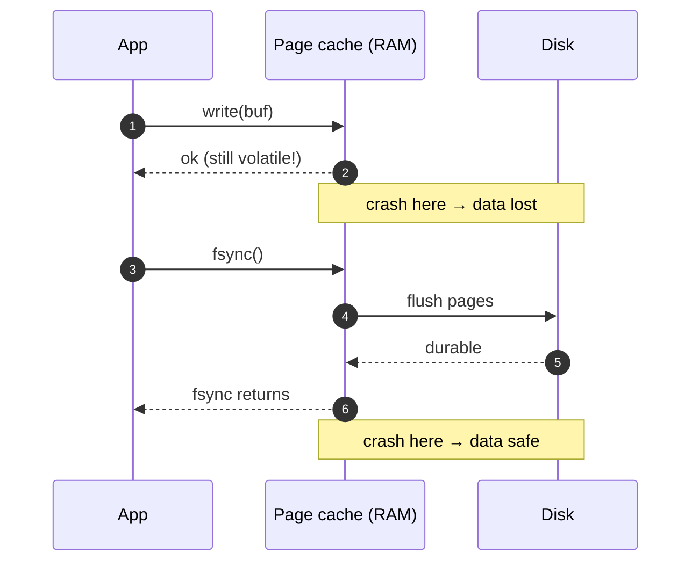

# 07 — Storage Fundamentals: Disk vs SSD, Page Cache, fsync

> Phase 1 • Foundations • Topic 7/74

## Definition (interview-ready)

**HDD** (hard disk) stores data on rotating platters — slow random access (~10 ms seek), fast sequential. **SSD** (solid-state drive) stores data in flash cells — fast random access (~150 μs), faster sequential, finite write endurance. The **page cache** is the kernel's in-memory copy of disk pages, transparently caching reads and buffering writes. **fsync** forces buffered writes from page cache to durable storage.

## Why it matters

Every database, message queue, and log system is designed around storage hierarchy: how it lays out data on disk, when it flushes, how it leverages OS caches. Choices like "B+ tree vs LSM tree" trace back to whether you optimize for HDD sequential, SSD random, or random/sequential mix. Knowing the page cache and fsync lets you reason about durability, performance, and crash recovery — the difference between "data lost" and "data safe."




## Core concepts

### HDD vs SSD vs NVMe

| | HDD | SATA SSD | NVMe SSD |
|---|---|---|---|
| Seek time | ~10 ms | ~150 μs | ~50 μs |
| Sequential read | 100-200 MB/s | 500 MB/s | 3-7 GB/s |
| Random IOPS | ~100 | ~50K | ~500K+ |
| $/GB | very low | low | moderate |
| Endurance | high (mechanical) | finite (DWPD) | finite (DWPD) |

- **HDD** still wins on $/GB for cold storage. Random access is brutally slow.
- **SSD** loves random reads; writes more complex (program/erase cycles, wear leveling).
- **NVMe** is SSD over PCIe — eliminates SATA bottleneck, parallelism via deep queues.

### Why disk layout still matters on SSD

- SSDs erase in **erase blocks** (often 256KB+) but write in **pages** (4KB).
- Updating a page requires read-erase-write of the whole erase block — **write amplification**.
- The drive's controller does garbage collection and wear leveling to manage this.
- **Sequential writes** are far cheaper than random for the same total bytes — same lesson as HDD, smaller magnitude.

### Block layer, file system, page cache

```
Application
   ↓ read/write
File System (ext4, xfs, zfs, apfs)
   ↓
Page Cache (kernel RAM, 4KB pages keyed by file+offset)
   ↓ flush
Block Layer (I/O scheduler, request queue)
   ↓
Device (SSD/HDD)
```

- **Page cache**: kernel uses free RAM to cache file data. Reads check the cache first; writes go to cache and return immediately (buffered).
- **Writeback**: a background flusher (`pdflush`/`bdi`) periodically writes dirty pages to disk.
- **Buffer cache** (historically separate; now unified with page cache on Linux).

### Read paths

- **Cold read**: cache miss → block layer → device → kernel copies into page cache → user buffer.
- **Warm read**: page cache hit → memcpy into user buffer (microseconds).
- **`mmap`**: maps a file into virtual memory; page faults pull pages on demand. Useful for read-mostly large datasets.

### Write paths and durability

- **Default write**: data lands in page cache; `write()` returns immediately. If the machine crashes before the kernel flushes, data is **lost**.
- **`fsync(fd)`**: blocks until all dirty pages for that file (data + metadata) hit durable storage.
- **`fdatasync(fd)`**: data only, skips metadata if not strictly required.
- **O_DIRECT**: bypasses the page cache. Application does its own caching. Used by databases (Postgres, MySQL) and log systems.
- **O_SYNC**: every `write` implies an `fsync`. Slow.

### Why fsync is slow

It traverses the entire storage stack down to the device — and waits for the device to confirm. On a consumer SSD, that's ~1–10 ms. On HDD, ~30 ms. This is **the durability tax** — and the reason all serious databases batch commits.

### Write-Ahead Log (WAL)

To make durability cheap and crash recovery sane:
1. Append the change to a **log file**, fsync it.
2. Apply the change to in-memory structures.
3. Periodically flush in-memory structures (checkpoint).
4. On crash: replay log from last checkpoint.

Used by: Postgres (WAL), MySQL InnoDB (redo log), Kafka (commit log), SQLite (WAL mode), every modern database and most message queues.

### Sequential vs random — why log-structured storage wins

- Random writes on HDD: seek + spin = ~30 ms each.
- Sequential writes: limited by media bandwidth.
- LSM trees (Cassandra, RocksDB, Scylla) only append + later compact. Cheap to write, slower to read (compaction merges + bloom filters help).

### B+ tree vs LSM tree at a glance

- **B+ tree** (Postgres, MySQL InnoDB): in-place updates. Good read locality, predictable read cost. Slower writes (random I/O).
- **LSM tree**: writes go to in-memory memtable → sorted runs on disk → background compaction. Fast writes, more read amplification (multiple sorted runs to check) — mitigated by bloom filters.

## How it works (a durable write end-to-end)

```
1. App calls write(fd, data) → returns instantly. Data in page cache, dirty.
2. App calls fsync(fd).
3. Kernel writes dirty pages from page cache to block layer.
4. Block layer queues them, possibly merging and reordering.
5. Device firmware acknowledges write (and may itself have a volatile cache —
   look for "write barrier" support).
6. fsync returns.
7. If you skip step 2, a crash before step 4 = lost data.
```

## Real-world examples

- **Postgres**: uses page cache aggressively (recommends `shared_buffers` ~25% RAM, leaves rest for page cache). Forces WAL flush on commit unless `synchronous_commit=off`.
- **Kafka**: appends to a per-partition log file. Doesn't fsync every write — relies on replication + page cache + periodic flush. Fast precisely because it leans on the OS.
- **Redis**: in-memory; **AOF** (append-only file) for durability with configurable fsync policy (every command, every second, OS).
- **SQLite WAL mode**: readers don't block writers; writers append to WAL, periodic checkpoints fold WAL back into the main DB.
- **RocksDB / Cassandra**: LSM with memtable + SSTables + compaction.

## Common pitfalls

- **Assuming write returned = data durable**: it didn't. Always `fsync` if durability matters.
- **fsync over network filesystems**: NFS, EFS — fsync may not mean what you think. Test.
- **Drive's volatile cache**: enterprise drives have battery-backed cache or honor SCSI flush properly; consumer drives may lie. Check.
- **`O_DIRECT` without alignment**: requires page-aligned buffers and lengths. Common segfault.
- **fsync after every write**: kills throughput. Batch commits.
- **Filling the page cache with cold data**: kicks out hot data. Use `posix_fadvise(POSIX_FADV_DONTNEED)` for streamed scans.
- **Forgetting metadata sync**: `fsync` on the file syncs the file's data; you may also need to fsync the **directory** to persist a new filename.

## Interview questions

### Q1 — Easy: What is the page cache?
A kernel-managed in-memory cache of disk pages. Reads check it first; writes are buffered there before being flushed to the device. Uses free RAM transparently.

### Q2 — Easy: Why is fsync slow?
Because it forces dirty pages all the way to the physical device and waits for confirmation, including the device's own flush. On an SSD that's ~1–10 ms; on HDD ~30 ms.

### Q3 — Medium: How does a write-ahead log improve durability and performance?
Durability: the log is fsynced on commit, so on crash you can replay from last checkpoint. Performance: the log is **sequential** (cheap), and in-memory updates can be lazy. Without a WAL, every commit would need to fsync potentially scattered data pages — much more expensive.

### Q4 — Medium: Postgres recommends giving 25% of RAM to `shared_buffers`. Where does the rest go?
To the OS page cache. Postgres double-caches some pages but relies heavily on the page cache for blocks not in `shared_buffers`. Setting `shared_buffers` too high starves the page cache and hurts performance.

### Q5 — Medium: Why do databases use `O_DIRECT`?
To bypass the OS page cache. They want to manage caching themselves (their cache understands transactions, MVCC, query patterns) and avoid double-caching. Postgres famously **doesn't** use O_DIRECT; MySQL/InnoDB optionally does (`innodb_flush_method=O_DIRECT`).

### Q6 — Hard: Compare B+ tree and LSM tree storage on SSD.
B+ tree: in-place updates → random writes → write amplification (especially with small updates). Predictable reads (log N levels). LSM: sequential writes → cheap. Reads must merge across multiple sorted levels (read amplification) — bloom filters cut this. Compaction does background heavy I/O. SSD-friendly: LSM minimizes random writes; B+ tree benefits from SSD's fast random reads. Choice depends on read/write ratio: write-heavy (telemetry, time-series, KV) → LSM; balanced OLTP → B+ tree.

### Q7 — Hard: A service writes 100K small records/sec, each 200 bytes, with strict durability. How do you avoid fsync bottleneck?
- **Batch**: group writes in a buffer, fsync once per group (a few ms or 1MB).
- **Group commit**: the database/queue coalesces fsyncs across concurrent writers — one fsync covers many transactions.
- **Replicate**: if you have N=3 replicas, you can ack on majority write (in-memory) and rely on the cluster's redundancy instead of per-node fsync.
- **Use a queue**: front the database with Kafka or similar; durability provided by replication.
- Realistic answer: combine batching + group commit + replication; raw fsync per record will cap you around 1K writes/sec.

### Q8 — Hard: After a power loss, your DB file shows corruption even though you fsynced. What could have happened?
- Drive lied about fsync (volatile cache without battery backup).
- Power loss midway through a multi-page update (torn write). Solution: **WAL + checksums** so you detect and discard partial pages.
- Filesystem journal mode misconfigured (e.g., ext4 `data=writeback` doesn't journal file *data*).
- `fsync` on the file but not on the parent directory for new files — the file metadata pointing to the data may be lost.

## TL;DR cheat sheet

- HDD: 10 ms seek, sequential strongly preferred. SSD: 150 μs random, still prefers sequential. NVMe: GB/s sequential, 500K+ IOPS.
- Page cache = kernel's RAM-based disk cache. Reads return from RAM if warm.
- `write()` returns when in page cache — **not durable**. Call `fsync()` (or use O_SYNC / WAL).
- fsync costs ~1–30 ms; batch and use WAL to amortize.
- WAL = sequential log + checkpoints. Backbone of every serious DB and message queue.
- B+ tree: balanced reads/writes, in-place. LSM tree: write-optimized, append+compact.
- O_DIRECT bypasses page cache — databases use it to manage their own buffers.

## Go deeper

- **Book**: DDIA (Kleppmann), Chapter 3 ("Storage and Retrieval") — the canonical chapter.
- **Hussein Nasser**: [Database Engineering playlist](https://www.youtube.com/playlist?list=PLQnljOFTspQXjD0HOzN7P2tgzu7scWpl2) — fsync, WAL, page cache deep dives.
- **OSTEP** (free book), Chapters 36–44 on persistence — file systems, journaling, crash consistency.
- **Postgres docs**: [Reliability and the Write-Ahead Log](https://www.postgresql.org/docs/current/wal-intro.html).
- **Linux Kernel doc**: [Page Cache and Page Writeback](https://www.kernel.org/doc/Documentation/filesystems/proc.rst).
- **Paper**: ["Files are hard"](https://danluu.com/file-consistency/) by Dan Luu — a humbling read on what fsync does and doesn't promise across filesystems.
- **RocksDB wiki**: best practical write-up of LSM internals.
