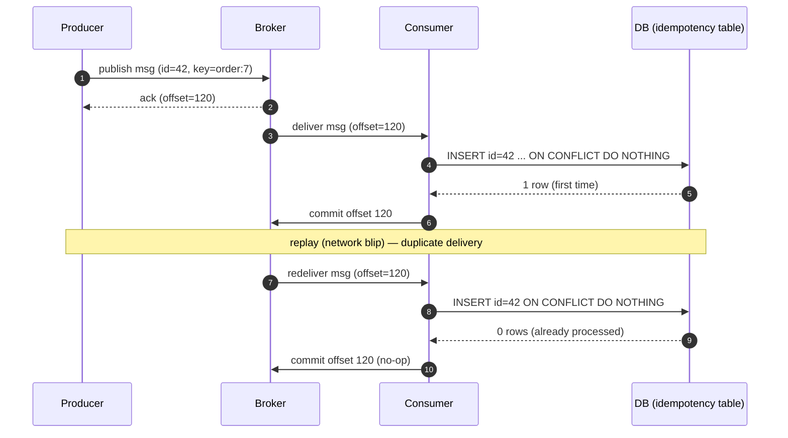

# 19 — Delivery Semantics: At-Least, At-Most, Exactly-Once, Idempotency, DLQ

> Phase 4 • Messaging (Kafka) • Topic 19/74

## Definition (interview-ready)

**Delivery semantics** describe what guarantees a messaging system gives between producer, broker, and consumer:
- **At-most-once**: message may be lost, never duplicated.
- **At-least-once**: message never lost, may be duplicated.
- **Exactly-once**: message delivered exactly once (only possible under specific constraints).

**Idempotency** is the property that processing the same message multiple times yields the same result — the practical fix that makes at-least-once delivery safe. A **dead-letter queue (DLQ)** holds messages that can't be processed after retries.

## Why it matters

Distributed systems lose, duplicate, or reorder messages. Pretending otherwise is the #1 source of duplicate charges, double-shipped orders, lost notifications. The right answer in 95% of production designs: **at-least-once delivery + idempotent consumers + DLQs for poison messages.**



## Core concepts

### The three semantics

| Semantic | Loss | Duplicate | When to use |
|---|---|---|---|
| At-most-once | possible | never | telemetry, metrics, fire-and-forget |
| At-least-once | never | possible | almost everything (with idempotency) |
| Exactly-once | never | never | financial systems within a closed boundary |

### Why exactly-once is hard

The classic two-generals problem: any protocol between two unreliable parties has a finite chance of one party not knowing whether the other received the message. Without help from the application, you can't have both "no loss" and "no duplicates" through arbitrary failures.

**Exactly-once is achievable only when**:
- All side effects are within a transactional boundary (e.g., Kafka transactions writing to Kafka).
- Or the consumer is **idempotent** end-to-end (which is functionally equivalent to exactly-once from the user's perspective).

### Kafka exactly-once (EOS)

Since Kafka 0.11+:
- **Idempotent producer**: producer ID + sequence number per partition; broker dedupes retries.
- **Transactions**: atomic write to multiple partitions/topics + atomic commit of consumer offsets. Either all writes + offset commit succeed, or none. Within Kafka, this is "exactly-once."
- **Outside Kafka** (writes to a DB, calling an external API): you still need application-level idempotency.

### Idempotency in practice

A handler is idempotent if `handle(msg)` produces the same outcome whether called once or 100 times.

Patterns:
- **Idempotency key**: the message has a unique ID; consumer tracks seen IDs in a store (`Redis SET NX EX` or DB unique index).
- **Conditional updates**: `UPDATE ... WHERE version = X` — second call no-ops.
- **CRDT / commutative operations**: counter increments, set adds — order and duplication don't matter.
- **Upsert with natural key**: `INSERT ... ON CONFLICT DO NOTHING`.

### Consumer offset commit timing

- **Commit before processing** = at-most-once (loss on crash before processing).
- **Commit after processing** = at-least-once (duplicate on crash after processing, before commit).
- **Auto-commit** is usually "after every N records or every X seconds" — easy to misconfigure. Prefer **manual commit after processing**.

### Producer reliability

- `acks=0`: at-most-once. Producer doesn't wait. Fast, lossy.
- `acks=1`: leader-only. Loss possible on leader failure before replication.
- `acks=all` + `enable.idempotence=true`: at-least-once with broker-side dedupe (effectively exactly-once into the broker).

### Dead-letter queue (DLQ)

A separate topic/queue for messages the consumer couldn't process after retries. Lets the main pipeline keep moving while you investigate poison messages.

Patterns:
- **Retry topic** with backoff: failed message → `topic.retry.1` (1min delay) → `topic.retry.5` → `topic.dlq`.
- **DLQ as halt**: critical processes stop on DLQ entry; alert and human review.
- **DLQ as triage**: non-critical, investigate later.

### Out-of-order messages

Even within a partition, application-level "reorder" can happen if you reset offsets or replay. Cross-partition order is never guaranteed. Design handlers to be **commutative** where possible, or use sequence numbers to detect skew.

## How it works (a sample at-least-once + idempotency design)

```
Producer side:
  acks=all, enable.idempotence=true, retries=max
  Send (orderId="o123", event="created", ...)

Broker:
  Stores message, replicates, dedupes by (producerId, seq)

Consumer side:
  Receive message
  Begin DB transaction:
    INSERT INTO processed_events (order_id, type) VALUES ('o123','created')
       ON CONFLICT DO NOTHING       -- idempotency check
    Apply business effect
  Commit DB
  Commit Kafka offset
  Loop
```

On duplicate delivery: the `INSERT` fails on conflict; business effect not applied; offset committed normally.

## Real-world examples

- **Stripe**: idempotency keys on every API mutation. Payments would otherwise duplicate-charge cards. Their public doc on idempotency is a classic.
- **Square**: similar — every write API requires a client-generated idempotency key.
- **Shopify Cart**: cart updates are idempotent; clients retry freely.
- **Uber dispatch**: event-driven; consumers idempotent on `tripId` + state machine.
- **Kafka Streams**: built on Kafka transactions; provides exactly-once processing semantics inside the Kafka world.

## Common pitfalls

- **Assuming exactly-once exists for free**: no, it requires application work or strict boundary (Kafka-to-Kafka transactional).
- **Idempotency only at the API layer, not internally**: a retry deep in the system bypasses the API layer's dedupe. Pass the idempotency key through.
- **Idempotency store with TTL too short**: client retries after TTL → duplicate processed. TTLs should exceed all retry windows.
- **Side effects in non-idempotent external systems** (emails, webhooks, payment providers): keep a sent-flag in the same transaction as the state update.
- **DLQ as black hole**: nobody reviews. Set up alerting and a runbook.
- **Auto-commit + processing in worker thread**: race condition — offset committed before work done, work fails, message lost.
- **Mistaken "kafka exactly-once = no app work"**: only Kafka-to-Kafka. If you write to a DB or call an external service, you still need idempotency.

## Interview questions

### Q1 — Easy: What does at-least-once delivery mean?
The system guarantees no message is lost, but the same message may be delivered (and processed) more than once. The consumer must be idempotent for this to be safe.

### Q2 — Easy: Why is exactly-once hard?
Any acknowledgment between sender and receiver can be lost. The sender doesn't know whether to retry; if it retries, the receiver may get a duplicate; if it doesn't, the message may be lost. Solving this without help from the application requires a transactional boundary.

### Q3 — Medium: How would you make a payment-charging consumer idempotent?
Use the payment intent ID (or a client-provided idempotency key) as a unique key. In the same DB transaction: (1) try to insert the key into a `processed` table with unique constraint, (2) if conflict → message already processed, no-op, (3) else perform the charge and commit. If the charge calls an external API, pass the same idempotency key to the provider.

### Q4 — Medium: When should you commit Kafka offsets — before or after processing?
**After** processing. Committing before means a crash mid-processing loses the message. Committing after means a crash before commit may re-deliver — but that's safe with an idempotent consumer.

### Q5 — Medium: What is a DLQ and when do you send a message there?
A dead-letter queue holds messages the consumer couldn't process after some number of retries. Send a message to DLQ when: it can't be deserialized (poison pill), it fails validation persistently, or it has exceeded retry budget. The main pipeline keeps moving; DLQ items are reviewed manually or by a separate process.

### Q6 — Hard: Kafka claims exactly-once. Why isn't that enough for your application?
Kafka's exactly-once is **end-of-line within Kafka**: an atomic produce + offset commit within the broker, with idempotent producers. If your consumer writes to an external system (Postgres, an HTTP API), the external write isn't part of the Kafka transaction. So you still need application-level idempotency on the external side.

### Q7 — Hard: Design retry + DLQ topology for a payment-event consumer.
- Main topic: `payment.events`.
- On transient failure (DB timeout, 5xx from provider): publish to `payment.events.retry.1` (delay 30s).
- After max retries on a tier: escalate to `payment.events.retry.5` (delay 5min), then `.retry.15`.
- After all retries fail: publish to `payment.events.dlq` and alert.
- Each retry topic has its own consumer (or one consumer using delay-aware logic).
- DLQ is monitored; entries require human review with a runbook.
- Idempotency on the main topic so retries are safe.

### Q8 — Hard: A bug causes the producer to publish duplicates and the consumer is not idempotent. How do you recover?
Short term: stop the duplicate-producing service. Audit damage — query the downstream system for duplicate records (e.g., orders with same external ID). Manually correct affected rows. Pause replays.
Long term: fix the producer (likely missing idempotency config or a retry bug); add idempotency to the consumer using a natural unique key (order ID + event type); add a `processed_events` table with unique index; alert on DLQ.

## TL;DR cheat sheet

- **At-most-once**: lose. **At-least-once**: duplicate. **Exactly-once**: hard, needs transactional boundary.
- Default: **at-least-once + idempotent consumer**.
- Kafka producer: `acks=all`, `enable.idempotence=true`, max retries.
- Consumer: manual offset commit **after** processing.
- Idempotency = unique key + dedupe store (DB unique index or Redis NX) + same transaction as business effect.
- Pass idempotency key through all layers, including downstream APIs.
- DLQ for poison messages; alert and have a runbook.
- Kafka EOS is within Kafka only — external writes still need idempotency.

## Go deeper

- **Confluent**: ["Exactly-Once Semantics Are Possible: Here's How Kafka Does It"](https://www.confluent.io/blog/exactly-once-semantics-are-possible-heres-how-apache-kafka-does-it/).
- **Stripe**: ["Designing robust and predictable APIs with idempotency"](https://stripe.com/blog/idempotency) — the canonical post.
- **Martin Kleppmann**: ["Online Event Processing"](https://queue.acm.org/detail.cfm?id=3321612) — exactly-once realities.
- **DDIA Chapter 11** — Stream Processing.
- **Confluent docs**: [Kafka transactions](https://docs.confluent.io/platform/current/streams/concepts.html#streams-developer-guide-processing-guarantees).
- **AWS**: [SQS retry/DLQ patterns](https://docs.aws.amazon.com/AWSSimpleQueueService/latest/SQSDeveloperGuide/sqs-dead-letter-queues.html).
