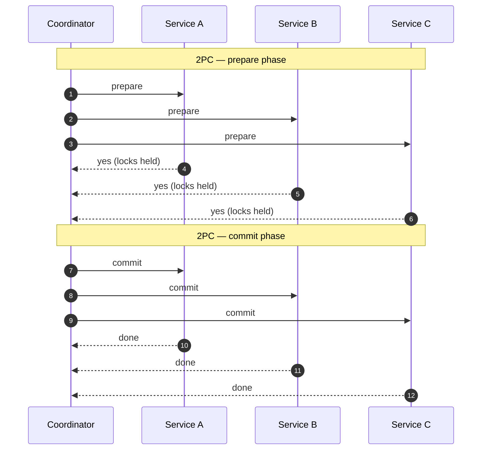

# 24 — Distributed Transactions: 2PC, Sagas, Outbox

> Phase 5 • Distributed Systems • Topic 24/74

## Definition (interview-ready)

A **distributed transaction** is a unit of work spanning multiple services or data stores that must commit or roll back as a whole. **Two-phase commit (2PC)** is the classic protocol: a coordinator asks all participants to prepare, then to commit. **Sagas** decompose the transaction into local steps with **compensating actions** for failure. The **outbox pattern** atomically writes a business change + an event to the same DB so downstream sees what actually committed.

## Why it matters

In microservices, every meaningful operation tends to cross service boundaries. ACID across services is expensive or impossible. The choice between 2PC, sagas, and outbox shapes failure modes, latency, and observability of every cross-service flow.

<div class="sde-anim" data-anim="saga"></div>



## Core concepts

### Why traditional ACID doesn't extend across services

- Different databases (Postgres + Redis + Kafka + external API) — no shared transaction manager.
- Two-phase commit requires every participant to support it (XA / JTA) — rarely true for modern stacks.
- Even if supported: blocking, fragile under coordinator failure.
- Network failures expand the window of "we don't know if it committed."

### Two-phase commit (2PC)

Coordinator + N participants.

**Phase 1 (Prepare)**:
- Coordinator: "can you commit?" → all participants.
- Each participant does its work (locks held), writes "prepared" to log, replies YES or NO.

**Phase 2 (Commit/Abort)**:
- If all YES: coordinator writes "commit" to log, tells all participants "commit."
- If any NO: coordinator tells all participants "abort."
- Participants commit/abort locally and release locks.

**Pros**: atomic across participants when it works.

**Cons**:
- **Blocking**: if coordinator crashes between phases, participants hold locks indefinitely.
- **Slow**: at least 2 round-trips + fsyncs at each participant.
- **Coupling**: every participant must support 2PC; coordinator is a single point of pain.
- **Cross-system XA support is rare and rotted** in modern microservice stacks.

In practice: 2PC is used inside tightly coupled enterprise systems (e.g., across multiple relational DBs in the same trust boundary); it's not the answer for general microservice flows.

### Saga pattern

Break a transaction into a sequence of **local** transactions. Each step's success advances the saga; failure triggers **compensating actions** to undo earlier steps.

Example: place an order.
1. Reserve inventory (`reserve(items)`). Compensation: `release(items)`.
2. Charge payment (`charge(amount)`). Compensation: `refund(amount)`.
3. Create shipment (`createShipment(orderId)`). Compensation: `cancelShipment(orderId)`.

If step 3 fails, the saga runs compensations in reverse: refund the payment, release the inventory. End state is consistent.

**Two saga flavors**:

#### Choreography

Each service listens for events and decides what to do. No central coordinator.
- Pros: loosely coupled, simple to start.
- Cons: hard to trace and reason about; cycles and order easy to get wrong; "who runs the compensation" gets murky.

#### Orchestration

A central orchestrator (saga manager) drives the steps. It tracks state, issues commands, handles failures.
- Pros: clear control flow, easy to observe and debug.
- Cons: orchestrator becomes a focal point (but usually worth it).

Tools: AWS Step Functions, Temporal, Cadence, Camunda — all built for this.

### Compensating actions

Must be **idempotent** and **commutative-friendly**. "Undo" is not always possible (you can't unsend an email) — design carefully:
- **Soft compensations**: send a "sorry" follow-up email rather than retract.
- **Reservation-based**: hold resources tentatively (3-step protocol — reserve, then commit or release).
- **Avoid where possible**: order steps so the irreversible step is **last**.

### Outbox pattern (for emitting events reliably)

The naive "dual write" antipattern:
```
db.update(...);
kafka.publish(...);
```
Either can fail → divergence.

**Outbox**:
```
BEGIN;
  db.update(business_table, ...);
  db.insert(outbox, event_payload);
COMMIT;
```
A separate **relay** process tails the `outbox` table (or via CDC) and publishes to Kafka. The DB commit is the atomic boundary. Events are emitted **iff** the business change committed.

### Inbox pattern (deduping consumed events)

The consumer's mirror: on receiving an event, atomically:
```
BEGIN;
  if exists(inbox, event_id): return; -- already processed
  insert into inbox(event_id);
  apply effect;
COMMIT;
```
Combined with at-least-once delivery, gives effectively-exactly-once processing per consumer.

### TCC (Try-Confirm-Cancel)

A pattern for distributed transactions with explicit reservation phases:
- **Try**: reserve resources tentatively (e.g., debit a balance to "pending").
- **Confirm**: finalize.
- **Cancel**: release reservation.

Common in financial systems. Like 2PC but with longer reservation windows and application-level state.

## How it works (a saga orchestration)

```
PlaceOrder saga:
  state: STARTED
  Step 1: reserve_inventory → state: INVENTORY_RESERVED
  Step 2: charge_payment    → state: PAYMENT_CHARGED
  Step 3: ship_order        → state: SHIPPED  (terminal)

On failure at Step 3:
  Compensate: refund_payment   → state: COMPENSATING_PAYMENT
  Compensate: release_inventory → state: FAILED
```

Saga state is persisted (Postgres / Cassandra / state machine in Temporal) so it survives restarts and resumes.

## Real-world examples

- **Uber**: saga-based booking flow with compensations; uses Cadence/Temporal-style orchestration.
- **Netflix**: Conductor (their workflow engine) drives sagas.
- **Square Cash**: saga-based payment flows with explicit compensations.
- **Airbnb**: orchestrated saga for reservation + payment + notification.
- **AWS Step Functions**: managed saga orchestration.

## Common pitfalls

- **2PC across microservices**: rarely works, almost always wrong choice. Use sagas.
- **Dual writes**: write DB + emit Kafka separately. Use outbox.
- **Non-idempotent compensations**: refund fires twice → user gets double refund.
- **No compensation for irreversible steps** (emails, external API side effects): design ordering carefully; last step should be the irreversible one.
- **Naive choreography in complex flows**: 5 services + 8 events → unmanageable. Use orchestration.
- **No saga state persistence**: orchestrator restart loses progress. Persist every transition.
- **Forgetting timeouts**: a saga step that hangs forever blocks the saga. Have explicit timeouts + escalation.
- **Eventual consistency surprises**: user sees state mid-saga (order placed but not shipped). Decide what the API surface is during the saga window.

## Interview questions

### Q1 — Easy: Why don't we use 2PC for microservice transactions?
Because it's blocking (coordinator failure leaves participants holding locks), slow (round-trips + fsyncs), and requires every participant to support XA/2PC — rarely true for modern stacks (Redis, Kafka, external APIs). Sagas + compensation are the modern fit.

### Q2 — Easy: What's a saga?
A long-running transaction decomposed into a sequence of local transactions, each with a compensating action. If any step fails, previous steps' compensations run in reverse to leave the system in a consistent state.

### Q3 — Medium: Choreography vs orchestration for sagas — when to pick which?
Choreography (event-driven, no central) is simpler at first and loosely coupled, but it gets opaque past 3–4 steps. Orchestration (central coordinator like Temporal/Step Functions) is clearer, observable, easier to debug — preferred for complex flows. Many systems start with choreography and migrate to orchestration when scaling.

### Q4 — Medium: Explain the outbox pattern.
In the same DB transaction, write the business change and insert an event row into an `outbox` table. A relay (CDC or polling) reads the outbox and publishes to a message broker. Because the outbox write is in the same transaction, events are emitted exactly when the business change commits — no divergence possible. Solves the dual-write problem.

### Q5 — Medium: Compensating actions for sending an email — how?
You can't unsend. Either: (1) order the email last in the saga so it only fires on success; (2) send a "ignore previous message" follow-up email as compensation; (3) defer the actual send until the saga commits — buffer in your DB, send only on saga success.

### Q6 — Hard: Design a place-order saga across Inventory, Payment, Shipping services.
- **Orchestrator** (Temporal or similar) manages state.
- Steps:
  1. `Inventory.reserve(orderId, items)` — compensation: `Inventory.release(orderId)`.
  2. `Payment.charge(orderId, amount, idempotencyKey=orderId)` — compensation: `Payment.refund(orderId)`.
  3. `Shipping.create(orderId)` — compensation: `Shipping.cancel(orderId)`.
- Each step is idempotent (orderId is the idempotency key).
- Persistent saga state (Postgres).
- Timeouts per step; on timeout, run compensations.
- Customer sees "order pending" until saga completes; final status updates UI via webhook or polling.

### Q7 — Hard: Your saga occasionally double-charges customers. Investigate.
- **Non-idempotent charge**: `Payment.charge` isn't using a stable idempotency key. Pass the `orderId` (or saga ID) to make charges idempotent — the provider dedupes.
- **Retry on ambiguous error**: HTTP 504 might mean "succeeded but slow" — retry without idempotency = double charge.
- **Saga state lost on orchestrator restart**: it re-runs steps. Persist state.
- **Compensation runs and the original commits** (race condition): track step state atomically; never roll forward while compensation is in flight.

### Q8 — Hard: Compare TCC with sagas.
**TCC (Try-Confirm-Cancel)**: explicit reservation phase. The "Try" phase pre-allocates resources but doesn't commit; "Confirm" commits; "Cancel" releases. Resource is locked between Try and Confirm/Cancel. Strong consistency at the cost of holding reservations.

**Sagas**: each step commits its local transaction immediately; compensation undoes if a later step fails. No reservation; potentially observable intermediate state.

TCC = stronger guarantees, more state mgmt, blocking-ish. Saga = simpler, eventually consistent, no blocking but exposes intermediates. TCC fits financial flows where you can't reveal partial states; saga fits most user-facing flows.

## TL;DR cheat sheet

- **2PC**: atomic but blocking; impractical for microservices.
- **Saga**: sequence of local transactions + compensations. Choreography (event-driven) or orchestration (central).
- **Outbox**: write business change + event in same DB transaction; relay publishes. Eliminates dual-write problem.
- **Inbox**: dedup consumed events for idempotent processing.
- **TCC**: explicit reservation phase; used in finance.
- Compensations must be idempotent. Order irreversible steps last.
- Persist saga state. Set timeouts. Use orchestrators (Temporal/Step Functions) for complex flows.

## Go deeper

- **microservices.io**: ["Saga pattern"](https://microservices.io/patterns/data/saga.html), [Outbox](https://microservices.io/patterns/data/transactional-outbox.html), [Inbox](https://microservices.io/patterns/data/messaging.html).
- **Chris Richardson** book: *Microservices Patterns* — best chapter on distributed transactions.
- **DDIA Chapter 7** — distributed transactions and ACID across services.
- **Temporal docs**: [docs.temporal.io](https://docs.temporal.io/) — production saga orchestrator.
- **AWS Step Functions** — managed orchestration.
- **Caitie McCaffrey**: ["Distributed Sagas: A Protocol for Coordinating Microservices"](https://www.youtube.com/watch?v=0UTOLRTwOX0) (YOW! talk).
- **Bernd Rücker (Camunda)** — blog posts on saga vs orchestration tradeoffs.
