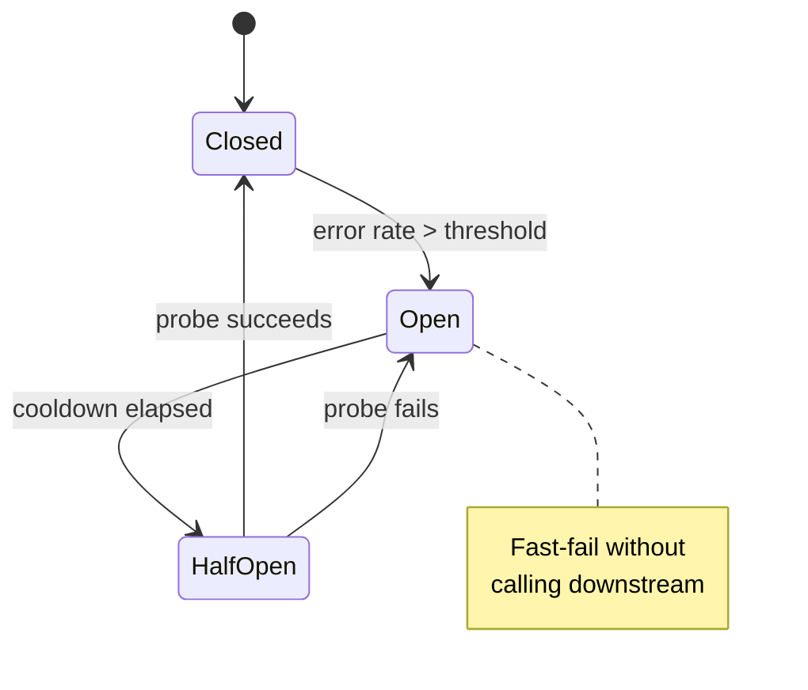

# 26 — Circuit Breakers, Bulkheads, Retries with Backoff

> Phase 5 • Distributed Systems • Topic 26/74

## Definition (interview-ready)

**Circuit breaker**: a state machine wrapping a remote call that **opens** (fast-fails) when failures exceed a threshold, **half-opens** to test recovery, and **closes** when healthy. **Bulkhead**: isolating resources (threads, connections) per dependency so a slow downstream can't drain shared pools. **Retry with backoff**: re-attempt failed calls with **exponential delay + jitter** to avoid synchronized retry storms.

## Why it matters

Cascading failures — one slow downstream taking down the whole system — are the most common production outage pattern. Circuit breakers, bulkheads, and disciplined retries are the resilience pattern stack every senior engineer needs to apply by default.



<div class="sde-anim" data-anim="circuit-breaker"></div>

## Core concepts

### Circuit breaker states

```
       success threshold
   closed -------> half-open -------> closed
     |                |
     | error %        | one bad call
     v                v
     open <-------- open
        cooldown timer
```

- **Closed**: requests flow through normally. Count failures.
- **Open**: fast-fail (return error / fallback immediately, no remote call).
- **Half-open**: after cooldown, allow a probe request. Success → close; failure → open again.

### Triggering rules

- **Error rate**: >50% errors over last 20 requests within 10s.
- **Error count**: 5 consecutive failures.
- **Latency**: p99 > 5s for 10s.

Pick a rule that matches the symptom you fear. Latency-based is often best — slow downstream is the bigger threat than total failure.

### Fallbacks

When circuit is open, what do you return?
- **Cached value** (last known good).
- **Default value** (empty list, "service unavailable").
- **Static** (queue for later, "try again").
- **Best-effort partial result** (e.g., feed without recommendations).

### Bulkheads

Pattern: isolate resources per dependency so one slow downstream can't drain shared pools.

Concretely:
- Separate **thread pools** per downstream service.
- Separate **connection pools** per DB / API.
- Separate **CPU/memory budgets** in containers.

Why: ship of compartments — flood one, others remain afloat. Without bulkheads, a Slack outage that holds your thread pool open for 30s drains all threads → entire app hangs.

Often implemented via **semaphores** instead of thread pools (cheaper):
```
sem = Semaphore(20)  // max 20 concurrent calls to service X
sem.acquire(timeout=100ms)
   call(...)
sem.release()
```

### Retries

Retry transient errors (network blip, 5xx, lock conflict). DON'T retry:
- 4xx errors (client problem, won't fix itself).
- Idempotency-sensitive calls without idempotency keys.
- Long-running internal failures (retry makes it worse).

#### Exponential backoff

```
delay = min(cap, base * 2^attempt)
```
Each retry doubles the delay. Caps prevent absurd waits.

#### Jitter

Without jitter, all clients retry at the same moments → **thundering herd**. Add randomness:
- **Full jitter**: `delay = random(0, base * 2^attempt)`. Simplest, very effective.
- **Equal jitter**: `delay = base * 2^attempt / 2 + random(0, base * 2^attempt / 2)`.
- **Decorrelated jitter** (AWS recommendation): `delay = min(cap, random(base, prev * 3))`.

Use **full jitter** unless you have a specific reason otherwise.

#### Retry budgets

Cap total retries — a calling service should never spend more than X% of its time retrying. Otherwise: retry storm amplifies the downstream's problem.

#### Idempotency requirement

Retries assume the call is idempotent (or has an idempotency key). Otherwise: duplicate charges, duplicate emails, duplicate orders. See Topic 19.

### Timeouts

The forgotten cousin. Every remote call needs a **timeout** — otherwise you wait forever for an answer that may never come, holding resources hostage.

Rule of thumb: a service's timeout calling a downstream should be **less than** its own SLO from upstream. Otherwise you'll exceed your SLO waiting on the downstream.

### Health checks

- **Liveness**: is the process alive? (Restart if not.)
- **Readiness**: is the process ready to serve traffic? (Pull from LB if not.)
- **Deep health**: do critical downstreams respond? (Use cautiously — propagates outages.)

### Combining these

A well-protected client looks like:
```
timeout(2s,
  retry(3, expBackoff with jitter,
    bulkhead(maxConcurrent=20,
      circuitBreaker(errorThreshold=50%,
        call(downstream)
      )
    )
  )
)
```

Used by Netflix Hystrix (deprecated but pioneered the pattern), resilience4j, Polly (.NET), Envoy filters.

## How it works (cascading failure walkthrough)

```
Without protection:
  Downstream service slow (5s p99).
  All upstream threads block on it.
  Upstream queue grows.
  Upstream itself can't accept new requests → unhealthy.
  Load balancer marks it down → traffic to others.
  Other instances overwhelmed → entire region down.
  Customer-facing.

With protection:
  Same downstream slow.
  Timeout fires at 2s — request errors out cleanly.
  Circuit breaker opens after 50% errors.
  Subsequent calls fast-fail via fallback.
  Upstream threads return immediately.
  Capacity preserved; degraded feature only.
```

## Real-world examples

- **Netflix Hystrix**: birthed the circuit breaker pattern in microservices. Now superseded by their own resilience4j-style libraries and the service mesh.
- **Envoy / Istio**: declarative outlier detection (circuit breaker), retry policies, timeouts.
- **AWS SDKs**: built-in exponential backoff + jitter (decorrelated since the AWS Architecture Blog post).
- **Spring Cloud**: Resilience4j integration.
- **Kubernetes liveness/readiness probes**: control restarts and traffic eligibility.

## Common pitfalls

- **Retrying without idempotency** → duplicate effects.
- **No jitter** → synchronized retry storms.
- **No timeout** → resource exhaustion.
- **Cascading deep health checks**: service A's readiness depends on B's health; B depends on C → C blips → all unhealthy.
- **Circuit breaker per-instance, not per-key**: a slow user breaks the entire downstream's circuit for everyone.
- **Bulkhead per route, not per dependency**: one slow third-party API depletes all routes' pools.
- **Endless retries** without budget → amplify outages.
- **Fail-open vs fail-closed**: when CB opens, you must decide if your service still works degraded. If not, opening just hides the problem.

## Interview questions

### Q1 — Easy: What is a circuit breaker?
A state machine wrapping a remote call. Closed (normal) → Open (fast-fail when error rate exceeds threshold) → Half-Open (probe to test recovery) → back to Closed if healthy. Prevents cascading failures by short-circuiting calls to a sick downstream.

### Q2 — Easy: Why do you add jitter to retry backoff?
Without jitter, all clients retry at the same moments after failure, causing a synchronized "thundering herd" that hits the recovering downstream simultaneously — preventing recovery. Random jitter spreads retries across time.

### Q3 — Medium: What's a bulkhead and what does it protect against?
Resource isolation per dependency — separate thread/connection pools or semaphores for each downstream. Prevents a slow downstream from monopolizing shared resources and dragging down unrelated parts of the service.

### Q4 — Medium: Walk through a cascading failure and how each pattern helps.
Downstream slows → upstream threads block → queue grows → service-wide latency → LB removes instances → load redistributes → other instances overwhelmed → outage.

Defenses (in order):
- **Timeout** — request fails fast, thread returns.
- **Bulkhead** — only N threads can block on downstream, rest serve other work.
- **Circuit breaker** — after enough failures, stop trying entirely.
- **Fallback** — return cached/default so upstream still responds.
- **Retry budget + backoff + jitter** — don't amplify the downstream's pain.

### Q5 — Medium: When should you NOT retry?
On 4xx errors (client problem won't change). On non-idempotent calls without idempotency keys. When error indicates persistent state (downstream's bug; retry won't help). When retry budget is exhausted. When circuit breaker is open.

### Q6 — Hard: Design a robust HTTP client for a microservice.
- **Timeout** per call: ~1–3s default, ~10s for known-slow calls. Always set.
- **Retry**: 3 attempts max, full-jitter exponential backoff (base 100ms, cap 5s). Retry only on transient errors (network, 5xx, 429 with Retry-After).
- **Bulkhead**: semaphore of max 20 concurrent calls per downstream.
- **Circuit breaker**: open at 50% error rate over 20 requests in last 10s; cooldown 30s.
- **Fallback**: return cached / default / partial.
- **Idempotency keys** for all writes.
- **Metrics**: per-downstream success rate, latency histogram, CB state, retries.
- **Headers**: include trace ID for correlation.

### Q7 — Hard: A team enabled retries and now their downstream is overloaded during normal load. Why?
Retry storm amplification. If 1% of calls fail and you retry 3 times, you add 3% extra load. If 30% fail (under stress), you add 90% load — pushing the downstream further into stress. Fix:
- **Retry budget** — cap retries to (say) 10% of total calls per minute.
- **Backoff + jitter** — spread retries across time.
- **Circuit breaker** — stop retrying when downstream is clearly degraded.
- **Lower retry count** — sometimes 1 retry is enough; 5 is excessive.

### Q8 — Hard: Designing a multi-tier dependency chain (A → B → C), what timeout should each set?
Total time budget from user perspective: say 2s.
- A's call to B: timeout = 1.5s (leaving 500ms for A's own work + slack).
- B's call to C: timeout = 1s (leaving 500ms for B's own work).
- C's own internal calls: < 500ms.

Each layer's timeout must be strictly less than its caller's, with budget for local processing. Without this, a slow C eats A's entire budget, A times out anyway, but resources stayed tied up in B + C uselessly.

## TL;DR cheat sheet

- **Timeout**: always. Calling service's timeout < its SLO from upstream.
- **Retry**: exponential backoff + **full jitter**. Cap attempts and total budget. Only on transient + idempotent.
- **Circuit breaker**: closed → open (fast-fail) → half-open (probe) → closed. Threshold on error rate or latency.
- **Bulkhead**: isolate threads/connections per dependency (or semaphores). Stops one slow downstream from draining shared pools.
- **Fallback**: cached, default, partial. Decide explicitly per call.
- **Health checks**: liveness vs readiness. Be careful with deep health (cascading false negatives).
- Combine: timeout → retry → bulkhead → circuit breaker → fallback.

## Go deeper

- **Martin Fowler**: ["Circuit Breaker"](https://martinfowler.com/bliki/CircuitBreaker.html).
- **AWS Architecture Blog**: ["Exponential Backoff and Jitter"](https://aws.amazon.com/blogs/architecture/exponential-backoff-and-jitter/).
- **AWS Builders Library**: [Timeouts, retries, and backoff with jitter](https://aws.amazon.com/builders-library/timeouts-retries-and-backoff-with-jitter/).
- **Netflix tech blog**: legacy Hystrix posts + post-Hystrix patterns.
- **resilience4j docs**: [resilience4j.readme.io](https://resilience4j.readme.io/) — modern reference impl.
- **Envoy docs**: outlier detection (circuit breaker), retry policies.
- **Book**: *Release It!* (Michael Nygard) — the source of "bulkhead" and circuit breaker in software.
- **Google SRE Book**: chapter on overload and graceful degradation.
