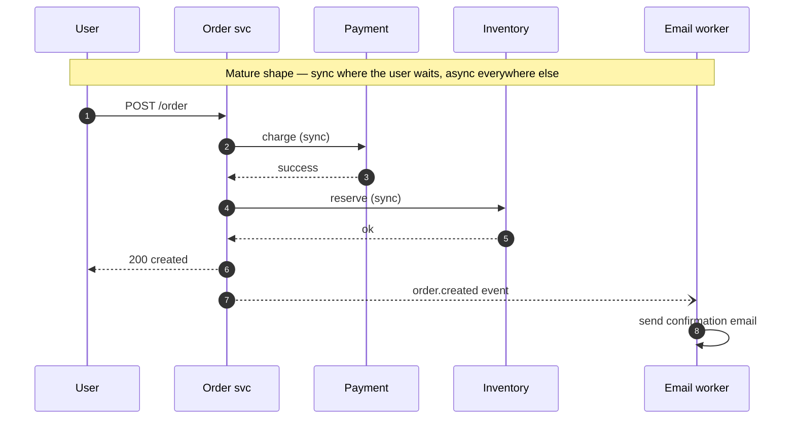

# 30 — Sync vs Async Communication, Event-Driven Architecture

> Phase 6 • HLD Patterns • Topic 30/74

## Definition (interview-ready)

**Synchronous** communication blocks the caller until the callee responds (REST/gRPC). **Asynchronous** communication decouples sender and receiver via a queue, log, or event bus (Kafka, SQS, RabbitMQ). **Event-driven architecture** uses asynchronous events as the primary communication style — services emit events about state changes and others react.

## Why it matters

Choosing sync vs async per interaction is the most consequential design decision in modern systems. Sync everywhere → fragile, slow, hard to scale, cascading failures. Async everywhere → eventual consistency surprises, debugging hell. The mature answer is **sync where you need an answer right now, async everywhere else.**



## Core concepts

### Sync (request-response)

- HTTP/REST, gRPC, GraphQL queries.
- Caller blocks; gets answer.
- Backpressure is implicit (caller has to wait).
- Failure modes: timeout, error, partial.
- Latency = sum of all hops on the critical path.

### Async (fire-and-forget or fire-and-callback)

- Message queue, event log, pub/sub.
- Caller publishes, doesn't wait for consumers.
- Consumers process independently, possibly later, possibly multiple times.
- Backpressure handled by queue depth.
- Failure modes: messages can pile up; retries; DLQ.

### When sync wins

- Read paths where the user needs the answer **now** (load my profile).
- Strong-consistency requirements (charge this card before I show "success").
- Simple operations with low latency.
- Debugging — stack traces tell a clear story.

### When async wins

- **Side effects** the user doesn't need to wait for: send email, update analytics, propagate to downstream services.
- **Long-running work**: image processing, report generation.
- **Decoupling**: producer doesn't know all consumers.
- **Variable load**: queue absorbs bursts.
- **Multiple consumers** of the same event (fan-out).
- **Cross-service propagation** of state changes.

### Event-driven architecture (EDA)

A style where services communicate primarily through **events** (immutable facts about something that happened). Variants:

#### Event notification

Producer emits a lightweight event: "OrderPlaced(orderId=42)". Consumers fetch details via the producer's API as needed.

Pros: small events; consistency via the producer.
Cons: consumers tightly coupled to the producer's API.

#### Event-carried state transfer

Producer emits an event with all relevant state: "OrderPlaced(orderId=42, items=[...], total=...)". Consumers don't need to call back.

Pros: looser coupling, consumers fully self-sufficient.
Cons: bigger events, more data duplicated across systems.

#### Event sourcing

Store **events as the source of truth**, derive current state by replaying. Stronger pattern with implications: full history; easy audit; expensive snapshots; complex projections.

#### CQRS (Command Query Responsibility Segregation)

Separate models for writes (commands) and reads (queries). Often paired with event sourcing: commands → events → various read models. Justified when read and write needs diverge dramatically.

### Choreography vs orchestration

Same dichotomy as in sagas (Topic 24):
- **Choreography**: services react to each other's events. Loose, but emergent flow.
- **Orchestration**: a central process drives the flow. Clear, observable.

For complex multi-step flows, orchestrate. For simple fan-outs, choreograph.

### Hybrid in practice

Real systems mix:
- **Edge → service**: sync (user wants the page).
- **Service → service for read** the response needs: sync.
- **Service → service for downstream propagation**: async.
- **Service → analytics/logging**: async.
- **Cross-service workflows**: orchestrated via Temporal/Step Functions + events.

### Backpressure

Sync: caller waits. If callee is slow, callers stack up → resource exhaustion.

Async: queue fills. Eventually:
- Queue caps (drop, return 429 to producer).
- Slow consumer falls behind — surface lag as a metric.
- Multiple consumer instances to scale out.

Async + visible backpressure = the safer mode.

### Eventual consistency surprises

The big async gotcha: state appears in different places at different times.

- User places order → UI shows success → fulfillment service hasn't seen it yet → user refreshes → "order not found."
- Mitigations: optimistic UI, retry on the client, dual-store strategy (write through sync to a read store), polling with eventual convergence.

### Idempotency, ordering, deduplication

Async makes these mandatory:
- Messages may be redelivered → idempotent consumers.
- Order matters within a key → key-aware partitioning.
- Duplicates happen → dedup with idempotency keys.

(See Topic 19.)

## How it works (event-driven order placement)

```
1. POST /orders (sync): API gateway → Order Service.
2. Order Service writes Order in its DB; writes "OrderPlaced" to outbox (same txn).
3. Returns 200 to client (sync).
4. Outbox CDC → Kafka topic "orders".
5. Subscribers (async, parallel):
   - Inventory: reserve items.
   - Payments: charge card.
   - Fulfillment: queue shipment.
   - Notifications: send confirmation email.
   - Analytics: update dashboard.
6. Each subscriber processes idempotently; failure → DLQ.
7. Saga orchestrator tracks the flow; if payment fails, emits "OrderFailed" → inventory un-reserves.
```

## Real-world examples

- **Uber**: trip events flow as Kafka events; many consumers (pricing, ETA, driver matching, accounting).
- **Netflix**: most internal state propagation is event-driven via Keystone (Kafka).
- **Shopify**: order events → fulfillment, ML, marketing.
- **Square**: payment flows via events with sagas for failures.
- **Slack**: messages → many consumers (notifications, search index, mobile push).

## Common pitfalls

- **Sync chain of 10 services**: latency tax + cascading failures.
- **Async for read-after-write**: user complains "where's my order?" — design for some sync confirmation.
- **No event schema versioning**: producer adds a field → consumers break.
- **Mixing events and commands**: a "DoX" event vs a "XHappened" event have different semantics. Be explicit.
- **No dedup / idempotency**: async retries cause double-charges.
- **Forgetting backpressure**: queue fills, OOM.
- **Hidden coupling via shared event shape**: "lightweight" events that secretly require all consumers to upgrade together.

## Interview questions

### Q1 — Easy: When would you use async over sync?
For side effects the user doesn't need immediately (emails, analytics, downstream propagation), long-running work (image processing), decoupling producer from many consumers (event fan-out), absorbing bursty load via queue. Use sync when the user needs an answer right now.

### Q2 — Easy: What's the difference between event notification and event-carried state transfer?
Event notification = small "X happened" event; consumers call back to the producer for details. Event-carried state transfer = event includes all data the consumer needs, no callback. Notification keeps events small but couples consumers to the producer; state transfer decouples but creates larger, duplicated events.

### Q3 — Medium: What is CQRS and when does it help?
Command Query Responsibility Segregation — separate models (and often stores) for writes (commands) and reads (queries). Helpful when read and write requirements diverge a lot: many read shapes, complex aggregations, real-time vs OLAP. Justifies the complexity only at scale; for small systems it's overkill.

### Q4 — Medium: Compare event sourcing with traditional state storage.
Traditional: store current state; mutations overwrite. Event sourcing: store events as the source of truth; derive state by replay. Benefits: full audit history, time-travel queries, easy debugging. Costs: event versioning, snapshot machinery, complex projections, eventual consistency for queries.

### Q5 — Medium: How would you guarantee the order of events for a single user?
Use a message system that supports per-key ordering (Kafka, Pulsar's Key_Shared). Partition the topic by user ID; same user → same partition; order preserved within a partition. Across partitions, no global order — but per-user is what most apps actually need.

### Q6 — Hard: Design event flow for a "place order" use case across cart, payment, inventory, fulfillment.
- Order Service: receives request (sync), creates pending order in DB + outbox event.
- Saga orchestrator (Temporal): consumes "OrderPlaced," runs:
  1. Inventory.reserve(items) — async RPC.
  2. Payment.charge(amount, orderId as idempotency key).
  3. Fulfillment.create(order).
- On failure: compensations (refund payment, release inventory).
- Side consumers: Notifications, Analytics — listen to events independently.
- API returns "pending" immediately; client polls or receives webhook on completion.

### Q7 — Hard: A team made everything async and now users see stale data 5+ seconds after writes. Fix?
- **Identify which writes need read-after-write**: the user's own immediate views.
- For those: synchronously update the read store (write-through), or sticky-read from the primary for a TTL.
- Use optimistic UI: show the change immediately, reconcile if backend disagrees.
- Add a "last updated" timestamp; client retries until it catches up.
- Don't make everything sync — just the user-visible critical path.

### Q8 — Hard: How do you version events without breaking consumers?
- Additive evolution only: new fields ok, never reuse field IDs (Protobuf rules).
- Maintain forward compatibility: consumers ignore unknown fields.
- Maintain backward compatibility: producers don't drop fields without a deprecation period.
- Use a **schema registry** (Confluent, Apicurio) to enforce compatibility on publish.
- For breaking changes: new event type / new topic; dual-publish during migration.
- Document an event contract per topic.

## TL;DR cheat sheet

- Sync = request-response. Async = decoupled via queue/log.
- Sync when user needs the answer now; async for side effects, downstream propagation, bursts.
- **Event-driven**: services emit events about state changes; others react.
- Event notification (small, callback) vs event-carried state transfer (large, self-sufficient).
- **Event sourcing**: events are source of truth; current state derived. Powerful but complex.
- **CQRS**: split read and write models; pairs well with event sourcing.
- **Choreography** (event-driven) vs **orchestration** (central driver).
- Async needs: idempotency, ordering, dedup, backpressure visibility, schema versioning.

## Go deeper

- **Confluent**: ["What is Event-Driven Architecture?"](https://www.confluent.io/learn/event-driven-architecture/).
- **Martin Fowler**: ["What do you mean by 'Event-Driven'?"](https://martinfowler.com/articles/201701-event-driven.html).
- **Sam Newman**, *Building Microservices*, Chapter 4.
- **Greg Young's talks** on event sourcing and CQRS (YouTube).
- **DDIA Chapter 11** — stream processing.
- **Microservices.io**: [event-driven patterns](https://microservices.io/patterns/).
- **Vaughn Vernon**, *Reactive Messaging Patterns with the Actor Model*.
