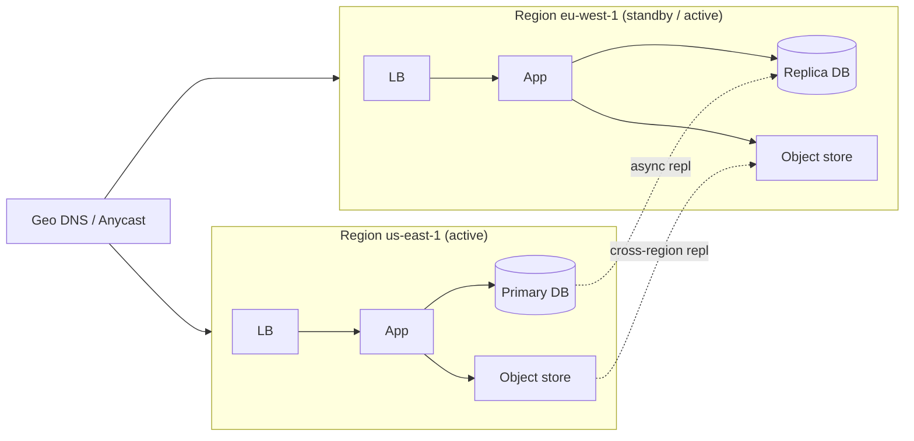

# 32 — Multi-Region, Multi-AZ, RPO/RTO

> Phase 6 • HLD Patterns • Topic 32/74

## Definition (interview-ready)

**Availability Zones (AZs)** are physically isolated data centers within a single cloud region (separate power, cooling, network). **Multi-AZ** = redundant within a region; **multi-region** = redundant across geographically separated regions. **RPO (Recovery Point Objective)** = how much data you can afford to lose (e.g., 5 minutes). **RTO (Recovery Time Objective)** = how long you can be down (e.g., 30 minutes).

## Why it matters

A region-wide cloud outage (AWS us-east-1 has had several) takes down anything single-region. Multi-AZ is table stakes for serious systems; multi-region is the next level — much more expensive and complex but essential for finance, healthcare, global apps. RPO/RTO are how you quantify what "available" actually means in dollars and minutes.



## Core concepts

### Region vs AZ vs edge

- **Region** = geographically distinct location (us-east-1 = N. Virginia, eu-west-1 = Ireland). 100+ms RTT between regions.
- **AZ** = physically separated DCs in one region. Sub-millisecond to ~2ms RTT between AZs.
- **Edge** (CDN PoP) = globally distributed cache, much smaller than a full region.

### Multi-AZ baseline

Standard production setup: spread services and data across 2 or 3 AZs in a region. Loss of one AZ ≠ outage.

- **Stateless services**: trivially multi-AZ (just run replicas in each AZ behind an LB).
- **Stateful services**: replicate synchronously across AZs (e.g., RDS Multi-AZ sync replica, Aurora's storage replicated 6 ways across 3 AZs).

Cost: ~2× compute for redundancy + cross-AZ data transfer.

### Multi-region architectures

Levels of complexity, lowest to highest:

#### 1. Active-passive (failover)

Primary region serves traffic; secondary region is a hot or warm standby.
- **Backup-only**: data replicated to S3 / snapshot to other region. Long RTO.
- **Pilot light**: minimal infra running in DR region; scale up on failover.
- **Warm standby**: scaled-down full stack in DR; takes traffic on failover.
- **Hot standby**: fully sized DR region, ready to take traffic instantly.

Pros: simpler than active-active. Cons: paying for idle capacity; failover is a tested-rarely operation that often fails.

#### 2. Active-active (read-anywhere, write-anywhere)

Both regions serve traffic concurrently.

**Read replication**: one region is the write leader; other reads from a replicated copy. Common (RDS read replica in another region).

**Multi-leader / writes in any region**: requires conflict resolution. CRDTs, vector clocks, or app-level merge. Used by DynamoDB global tables, Cosmos DB, Spanner.

**Strong consistency multi-region**: extremely hard. Spanner does it with TrueTime. Generally trades latency (cross-region quorum for every write).

#### 3. Geo-partitioned

Each region "owns" certain data (by user location, tenant, customer ID). Other regions read replicas. Writes happen in home region.

Pros: lowest latency for users in their home region; no cross-region conflicts.
Cons: data movement when users travel; "global views" are scatter-gather.

### RPO and RTO

- **RPO** (Recovery Point Objective): how much data loss is acceptable? Driven by replication choices.
  - Sync replication → RPO = 0.
  - Async replication → RPO = replication lag (often 1–60s).
  - Backups only → RPO = backup frequency (hours to a day).
- **RTO** (Recovery Time Objective): how fast must you be back? Driven by deployment topology and runbook quality.
  - Hot standby → seconds-to-minutes RTO.
  - Warm standby → minutes-to-hours.
  - Cold backup restore → hours-to-days.

These are **business decisions** with engineering implications. A payments company may need RPO ≤ 1s, RTO ≤ 5 min — drives Spanner-class architecture. A blog can tolerate RPO 1 day, RTO 1 day.

### Failover mechanics

- **DNS-based**: update DNS to point at DR. TTL-bound (10s to 5min); browsers cache aggressively.
- **Anycast IP**: BGP-driven. Faster than DNS, expensive (cloud provider mostly).
- **Application-level**: client SDKs aware of multiple endpoints, fall over automatically.
- **Database failover**: promote replica; clients reconnect (driver-handled).

Issues:
- **Split-brain risk**: old primary keeps accepting writes after failover. Fence with quorum or external coordinator (etcd).
- **Replication lag on failover**: unreplicated writes are lost. RPO realism.
- **Failback** is often harder than failover.

### Cross-region challenges

- **Latency**: every cross-region write adds 50–200ms. Quorum across regions = expensive.
- **Bandwidth cost**: AWS charges $0.02/GB for inter-region — at scale, this dominates.
- **Compliance**: data may not legally cross borders (GDPR, India's DPDP).
- **Time skew**: NTP across regions has more drift; HLC/TrueTime increasingly relevant.
- **Distributed transactions**: cross-region 2PC is unusable. Use single-region scopes + sagas.

### Practical patterns

- **Read-local, write-leader**: writes go to home region; reads served locally with eventual consistency. Most common.
- **Sticky region per user**: each user has a home region; their data and writes always there. Travel = small latency hit, no migration.
- **Active-active via CRDT**: counters, sets, key-value with LWW + HLC. Specific data types only.
- **Replication via Kafka MirrorMaker** or DB-level (Postgres logical, Aurora Global, MongoDB cross-region replica sets).

## How it works (multi-AZ Postgres on AWS RDS)

```
Region: us-east-1
  AZ-A (primary):  RDS primary
  AZ-B (standby):  RDS standby (sync replication)
  
Client → endpoint → DNS resolves to current primary
Write commits to primary; sync replicated to standby (RPO=0).
AZ-A fails → AWS promotes standby in AZ-B → DNS updated.
RTO ~1-2 minutes.
```

## Real-world examples

- **AWS us-east-1 outages**: every few years; takes down half the internet. Drives multi-region for serious infra.
- **Cloudflare**: multi-region active-active by design.
- **Netflix**: multi-region active-active across us-east, us-west, eu-west. Chaos Monkey simulating outages.
- **Stripe**: heavy multi-region; payment processing in multiple regions with eventual reconciliation.
- **Spanner-backed services (Google Photos, Ad systems)**: global strong consistency.

## Common pitfalls

- **Single-region in cloud**: a regional outage takes you down with no recourse.
- **"We have backups" RTO**: restoring 10 TB from snapshot is hours; many businesses can't afford that.
- **Untested failover**: the first time you fail over is during a real outage; many surprises. Run game days.
- **Forgetting DNS TTL** in failover plans.
- **Cross-region data charges**: surprise on the bill at scale.
- **Compliance violations**: replicating EU PII to US for "DR" → GDPR violation.
- **Latency-tail in active-active**: every write waits for cross-region quorum.
- **Asymmetric DR region**: cheaper instances → can't actually handle prod load on failover.

## Interview questions

### Q1 — Easy: Difference between multi-AZ and multi-region?
Multi-AZ = redundancy across data centers within one region (sub-ms RTT, single regional power/network). Multi-region = redundancy across geographically separated regions (100+ms RTT, separate infrastructure). Multi-AZ is table stakes; multi-region is for true disaster recovery and global users.

### Q2 — Easy: Define RPO and RTO.
RPO (Recovery Point Objective) = how much data you can afford to lose, in time units. RTO (Recovery Time Objective) = how long you can be down. They're business decisions that drive architecture.

### Q3 — Medium: Compare active-passive and active-active multi-region setups.
Active-passive: one region serves traffic, the other is standby. Simpler, but pays for idle capacity and failover is rarely tested. Active-active: both regions serve concurrently. Better cost utilization, faster failover, but requires conflict resolution and complex replication topology.

### Q4 — Medium: How do you choose between sync and async cross-region replication?
Sync: zero data loss (RPO=0), but write latency = max(local commit, cross-region RTT) → 100–200ms penalty. Async: low latency, but RPO = replication lag (usually seconds). Choose based on what the business can tolerate: payments often sync within region, async cross-region; analytics async.

### Q5 — Medium: What's "split brain" and how do you prevent it?
Split brain = a network partition where two sides each believe they're the primary, both accept writes, diverge. Prevent with:
- **Quorum-based decisions** (majority needed to act as primary).
- **External coordinator** (Zookeeper/etcd) holds the lease.
- **STONITH** (Shoot The Other Node In The Head) — fence the suspected old primary at the network or hardware level.
- Don't ever **manually** promote without fencing.

### Q6 — Hard: Design a multi-region setup for a global SaaS with low-latency reads everywhere and strong consistency for writes.
Two main approaches:
1. **Spanner-style**: globally distributed DB with TrueTime — sync writes with global quorum. Low ms penalty for global strong consistency.
2. **Geo-partitioned with home regions**: each tenant has a home region. Writes within home region (fast). Reads served locally from replicas (eventual consistency) or via the home region (slower but consistent).

Practical hybrid: use #2 with optional read-from-home for strong consistency. Keep tenant migrations rare.

### Q7 — Hard: A team claims RPO=0 with async cross-region replication. Critique.
Async replication means writes are acked locally before cross-region replication. On regional failure, anything not yet replicated is lost — RPO > 0 (typically equal to peak replication lag, which can spike to minutes under load). They likely mean RPO is "small" but it's not zero. True RPO=0 requires sync replication (or quorum across regions).

### Q8 — Hard: How would you reduce the blast radius of a regional outage to fewer customers?
- **Cell-based architecture (cells/shards)**: split the system into independent cells, each handling a subset of customers. A failure in one cell affects only that cell's customers.
- **Multi-region per cell**: each cell has its own multi-region setup; a cell-level outage doesn't propagate.
- **Tenant pinning**: tenant assigned to a cell; cell failures isolated.
- AWS uses this internally (Cell-Based Architectures). Salesforce, Slack, others have written about it.

## TL;DR cheat sheet

- AZ = data center within a region. Region = geo-separate.
- Multi-AZ = baseline production. Multi-region = serious DR / global.
- **RPO** = data loss budget. **RTO** = downtime budget. Business decisions.
- Active-passive: simpler; idle DR. Active-active: better utilization, harder consistency.
- Sync replication = RPO 0, latency cost. Async = some RPO, faster writes.
- Split brain: prevent with quorum + fencing.
- Cross-region: latency tax, bandwidth cost, compliance constraints.
- Cell-based architecture limits blast radius.
- Test failover regularly (game days) — untested DR is no DR.

## Go deeper

- **AWS Builders Library**: ["Static stability using Availability Zones"](https://aws.amazon.com/builders-library/static-stability-using-availability-zones/) and other resilience articles.
- **AWS Well-Architected Reliability Pillar**: [docs](https://aws.amazon.com/architecture/well-architected/).
- **Google Cloud Architecture Center**: multi-region patterns.
- **Google SRE Book**, Chapter 7 on managing disasters; Chapter 26 on data integrity.
- **DDIA Chapter 5** — replication topologies.
- **Cell-based architecture**: AWS re:Invent talks (ARC305, ARC303 series).
- **Netflix tech blog**: regional failover, Chaos Engineering.
- **AWS Architecture Blog**: ["Disaster Recovery Strategies"](https://aws.amazon.com/blogs/architecture/disaster-recovery-dr-architecture-on-aws-part-i-strategies-for-recovery-in-the-cloud/).
