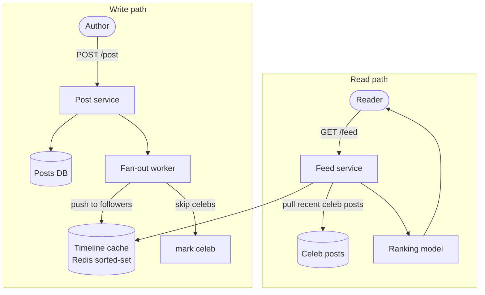

# 37 — HLD: News Feed (Twitter / Facebook)

> Phase 7 • HLD Problems • Topic 37/74

## Problem statement

Design a social news feed: users post (tweets/status), follow each other, and see a personalized timeline of their followees' recent activity, ranked or chronological.



## Requirements

### Functional
- POST `/post` — author writes a post.
- GET `/feed` — fetch ranked timeline.
- Follow/unfollow.
- Like/comment/repost.

### Non-functional
- Reads dominate (100:1 typical).
- p99 feed latency < 200 ms.
- Eventual consistency on visibility (slight delays acceptable).
- Handle "celebrities" with 100M followers.
- Tolerate eventual consistency for likes/counters.

## Scale estimation

- 300M DAU, 2 posts/user/day → **600M posts/day** = ~7K writes/sec average, 21K peak.
- Each user reads ~100 posts/day → 30B reads/day = ~350K reads/sec average, ~1M peak.
- Storage: 600M × 1 KB/post = **600 GB/day** raw, ~200 TB/year. With RF=3 → 600 TB/year.
- Reads are 100× writes → cache + materialization.

## Core API

```
POST /api/posts            { content, media_urls }
GET  /api/feed?limit=20    → recent posts from followees
POST /api/follow/{user}
DELETE /api/follow/{user}
POST /api/like/{post_id}
GET  /api/user/{id}/posts  → user's own timeline
```

## Feed generation strategies

### Pull (fan-out on read)

When user opens feed:
1. Query followees list.
2. For each followee, fetch recent posts.
3. Merge, rank, return.

Pros: cheap on write; works for celebrities.
Cons: expensive on read (N fetches → scatter-gather), high latency for users with many followees.

### Push (fan-out on write)

When user posts:
1. Look up their followers list.
2. Insert the post ID into each follower's timeline (often a per-user sorted set in Redis).

Pros: feed fetch is one read.
Cons: catastrophic for celebrities (write fans out to 100M timelines).

### Hybrid (recommended)

- **Push** for normal users (few followers).
- **Pull** for celebrities (many followers).
- On feed fetch: merge user's precomputed timeline + on-demand celebrity posts.

Threshold (Twitter historically used ~1M followers) determines who's "celebrity."

## High-level architecture

```
              ┌─────────────┐
Client ──► CDN│ API Gateway │
              └──────┬──────┘
                     ▼
            ┌────────┴──────────┐
            │   Feed Service    │ ──► ranking model
            └──┬─────────┬──────┘
               ▼         ▼
        ┌──────────┐  ┌────────────┐
        │ Timeline │  │ Post Service│
        │ (Redis)  │  │             │
        └──────────┘  └──────┬──────┘
                             ▼
                       ┌───────────┐
                       │ Post DB   │  (Cassandra / sharded SQL)
                       └───────────┘
                             │
                             ▼ event
                       ┌─────────────┐
                       │ Kafka       │
                       └─────┬───────┘
                             ▼
                     ┌──────────────────┐
                     │ Fan-out worker   │
                     └────────┬─────────┘
                              ▼
                   per-user timeline (Redis)
```

## Data model

### Posts (Cassandra example)

```cql
CREATE TABLE posts_by_user (
  user_id   uuid,
  post_id   timeuuid,
  content   text,
  media     list<text>,
  created   timestamp,
  PRIMARY KEY ((user_id), post_id)
) WITH CLUSTERING ORDER BY (post_id DESC);
```

### Per-user timeline (Redis sorted set)

```
ZSET feed:user:<user_id>  score=post_ts  member=post_id
```

Trim to last ~500 posts.

### Social graph

Either a graph DB (Neo4j) or sharded Postgres with two tables:
```
follows(follower_id, followee_id, created_at)
```
Indexed both directions.

For huge followers (celebrities), specifically: a separate `celebrity_followers` table or service.

## Detailed design

### Post creation

```
POST /api/posts
1. Validate, sanitize.
2. Write to posts_by_user.
3. Emit "PostCreated" event to Kafka.
4. Return immediately to client.
5. Fan-out worker (separate, async):
   - Lookup followers.
   - If author is non-celeb (<10K followers): for each follower, ZADD feed:user:<f> post_ts post_id.
   - If celeb: skip; pull-on-read for celebrities.
```

### Feed fetch

```
GET /api/feed
1. Load user's precomputed timeline: ZREVRANGE feed:user:<id> 0 20.
2. Get list of celebrities the user follows.
3. For each celebrity: fetch recent posts from posts_by_user.
4. Merge, rank (by score model), return.
```

Ranking ML model can run inline (cached features) or as a separate service.

### Ranking

Chronological is simplest. Ranked feeds:
- Features: recency, engagement (likes/comments), affinity (follower-followee interactions), content type.
- Model: gradient boosted trees (XGBoost) or deep learning, served via TensorFlow Serving / TorchServe.
- Inference per feed fetch is expensive — precompute candidate set, rank top K.

### Likes and counters

- Don't update post row's like_count on every like (lock contention).
- Use a separate counter (Redis HINCRBY or Cassandra counter).
- Periodic flush to durable storage for analytics.

### Trending/global timeline

- Stream of all public posts → in-memory ranking (e.g., score = engagement / age) → trending list, refreshed every minute.

## Bottlenecks & optimizations

- **Celebrity fan-out**: hybrid push/pull (already covered).
- **Hot post (viral)**: cache the post object; CDN for media.
- **Ranking latency**: precompute candidate set; serve from cache.
- **Timeline storage**: 500M users × 500 posts × ~8 bytes = ~2 TB in Redis. Shard across Redis cluster.
- **Following list cache**: hot lookups (every post needs follower list). Cache in Redis per user; invalidate on follow/unfollow.

## Trade-offs

- **Chronological vs ranked**: chronological is predictable and cheaper; ranked is engagement-optimized but opaque.
- **Push vs pull**: push optimizes read; pull optimizes write. Hybrid covers both.
- **Strong vs eventual consistency**: feed is eventually consistent (you post → fan-out may take seconds). UX: show your own posts immediately on your client.
- **Caching aggressively**: stale data trade-off; usually fine for non-critical signals (counts, suggestions).

## Interview questions

### Q1: Push vs pull — when each?
Push (fan-out on write): cheaper reads, expensive for celebrities. Pull (fan-out on read): cheaper writes, expensive reads for users with many followees. Real systems do hybrid: push for normal authors, pull for celebs at read time.

### Q2: How does the feed handle a celebrity with 100M followers?
Don't push to 100M timelines on every post — too expensive and slow. Mark accounts above a follower threshold as "celebrity"; on feed fetch, merge user's pushed timeline with celebrity timeline pulled directly. Adds a few reads per feed fetch — acceptable.

### Q3: How to handle a viral post?
Cache the post object aggressively (Redis + CDN). The timeline only stores the post ID, so the fan-out cost is the same — but every fetch resolves to a single cached post.

### Q4: Storage estimation for posts at 600M/day, kept 5 years.
- 600M × 1KB = 600 GB/day.
- 5 years = ~1100 TB raw.
- With RF=3 = ~3.3 PB.
- Hot recent data in main store (Cassandra/sharded SQL).
- Cold archive to S3 Parquet for analytics.

### Q5: A user just posted but doesn't see it in their own feed. Why?
The fan-out worker hasn't processed yet. Mitigations: client immediately shows the post (optimistic UI); server includes user's own latest posts directly in the feed fetch (not relying solely on fan-out).

### Q6: Design the ranking system.
- Candidate set: from precomputed timeline + celeb pulls.
- Features: post recency, author affinity (interactions, follows), content type, engagement velocity.
- Model: train offline on engagement data; serve via TF Serving.
- Cache user features and post features for fast inference.
- A/B test new models behind feature flags.

### Q7: How do you scale the social graph?
Shard by user ID (hash). For each user, store followers and followees in separate tables/sets. Hot reads (follower list for fan-out) cached in Redis. For celebs, separate storage (millions of followers per user). Use a graph DB (Neo4j, Dgraph) if traversal queries dominate; otherwise simple sharded KV works.

### Q8: How would you reduce p99 latency from 500 ms to 100 ms?
- Profile end-to-end: where's the time spent?
- Cache user's follower list (avoid DB hit).
- Precompute timeline (push) so feed fetch is one ZREVRANGE.
- Cache ranked candidate set.
- Use HTTP/2 multiplexing or gRPC to backends.
- Tail-tolerant fan-out (use the first N responses, ignore stragglers).
- Pre-warm caches on user login.

## TL;DR cheat sheet

- **Hybrid push + pull**: push for normal users, pull for celebs.
- Per-user timeline in Redis sorted set, trimmed to ~500 posts.
- Post storage in Cassandra/sharded SQL by author_id.
- Async fan-out via Kafka workers.
- Ranking: precompute candidates → rank top K with ML model.
- Counters: separate (Redis), not in the post row.
- Cache aggressively (follower list, post object, candidate set).
- CDN for media.

## Go deeper

- **ByteByteGo** YouTube and Alex Xu's *System Design Interview Vol 1* — Chapter 11 (News feed).
- **High Scalability**: ["Facebook News Feed"](http://highscalability.com/) articles.
- **Twitter Engineering blog**: famous "fan-out on write" articles.
- **Yao Yue (Pinterest)**: ["The Architecture of Pinterest's Smartfeed"](https://www.youtube.com/results?search_query=pinterest+smart+feed+architecture).
- **Discord engineering**: home-feed scale stories.
- **System Design Primer**: feed sections.
