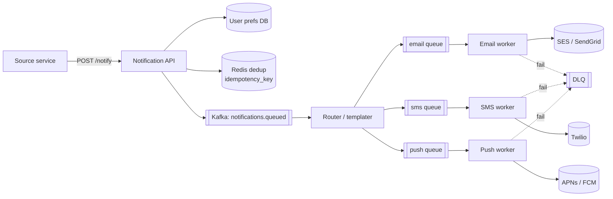

# 39 — HLD: Notification System

> Phase 7 • HLD Problems • Topic 39/74

## Problem statement

Design a system that delivers notifications (email, SMS, push, in-app) to users at scale, respecting preferences, deduplication, rate limits, and delivery retries.



## Requirements

### Functional
- Multiple channels: email, SMS, mobile push (APNs/FCM), web push, in-app.
- Templating (subject + body, localization).
- User preferences (opt-out per channel/category).
- Scheduling and time-zone awareness.
- Delivery status tracking.

### Non-functional
- High throughput: millions of notifications/hour.
- Reliable delivery (retries, DLQ).
- Low latency for transactional (OTP < 5 s).
- Idempotency (no duplicate sends).
- Cost-aware (SMS is expensive).

## Scale estimation

- 100M users, average 10 notifications/day → 1B/day = ~12K/sec average, ~40K peak.
- Email: 50%, push: 40%, SMS: 10%.
- Storage: notification logs at ~500 bytes × 1B = 500 GB/day raw.

## Core API

```
POST /api/notify
{
  "user_id": "...",
  "category": "order_shipped",
  "channels": ["push", "email"],
  "template_id": "tpl_order_shipped",
  "data": { "order_id": "...", "tracking": "..." },
  "idempotency_key": "..."
}
```

## High-level architecture

```
            ┌──────────────┐
Producers ─►│  Notify API  │ ─► writes to Kafka
            └──────────────┘
                   │
                   ▼
            ┌──────────────┐
            │ Kafka topic  │  (per-channel or sharded)
            └──────────────┘
                   │
       ┌───────────┼───────────┐
       ▼           ▼           ▼
   Email Worker  SMS Worker  Push Worker  In-App Worker
       │           │           │              │
       ▼           ▼           ▼              ▼
    SendGrid   Twilio    APNs/FCM         WebSocket / DB
   (provider) (provider) (provider)
       │           │           │
       └───────────┴───────────┘
                   ▼
            ┌──────────────┐
            │ Status Topic │ ── delivered, bounced, opened
            └──────────────┘
                   ▼
            ┌──────────────┐
            │   Analytics  │
            └──────────────┘
```

## Detailed design

### Notify API (sync)

1. Validate request, idempotency key.
2. Check user prefs (subscribed to this category/channel?).
3. Resolve template (subject, body, with vars rendered).
4. Publish to channel-specific Kafka topic.
5. Return 202 Accepted with notification ID.

### Channel workers

Each channel has its own worker pool consuming from its Kafka topic. Workers:
- Apply rate limiting (per provider, per category).
- Call external provider (SendGrid, Twilio, APNs, FCM).
- On success: emit status event.
- On failure: retry with backoff; after N retries → DLQ.

### User preferences

```sql
CREATE TABLE notification_prefs (
  user_id     uuid,
  category    text,
  channel     text,
  enabled     boolean,
  PRIMARY KEY (user_id, category, channel)
);
```

Cached in Redis for fast lookup.

### Templating

- Templates in a versioned store (DB or Git).
- Template engine: Mustache, Handlebars, or simple Jinja-style.
- Localization: template per language.
- Subject + body rendered with data passed in API call.

### Idempotency

- API requires `idempotency_key` for retries.
- Dedupe table: `(idempotency_key) UNIQUE`. If exists → return previous result.
- Window: hours to days; long enough to survive retries.

### Delivery tracking

- Provider webhooks (SendGrid delivery, Twilio status, APNs feedback) consumed via Kafka.
- Update notification status: queued → sent → delivered → opened/bounced.
- Surface to product (delivery rates) and users (read receipts on in-app).

### Scheduling

- For future notifications, persist with `scheduled_at`.
- A scheduler service polls for due notifications and enqueues them.
- Time-zone aware: convert scheduled_at to user's local time per template rule.

### Rate limiting

- Per-user: don't spam the same user.
- Per-category: marketing capped daily; transactional uncapped.
- Per-provider: respect SendGrid/Twilio limits.

### Cost control

- SMS is $0.01–0.10 per message — control spend.
- Fall through to email/push first; SMS only when needed (auth codes).
- Budget per category, per day.

## Bottlenecks & optimizations

- **Bursty senders** (a marketing campaign): smooth via worker pool size + rate limit at consumer.
- **Provider rate limits**: throttle send rate; backoff on 429s from provider.
- **Webhook ingestion**: provider webhooks can spike — buffer in Kafka, async process.
- **Stale prefs cache**: invalidate via CDC when user updates prefs.

## Trade-offs

- **In-band vs async**: transactional (OTP, password reset) needs low latency → consider sync HTTP to provider for these, async for everything else.
- **Single Kafka topic vs per-channel**: per-channel = different scaling, different consumer logic, clearer ownership.
- **Provider mix**: multi-vendor (SendGrid + AWS SES) for failover and price. Complexity vs reliability.
- **Personalization**: cache user data so worker doesn't query 10 services per notification.

## Interview questions

### Q1: How do you guarantee no duplicate notifications?
Idempotency key from caller; dedupe table at API boundary. Workers also dedupe by notification ID before calling provider. At-least-once delivery + idempotent send = at-most-once visible behavior.

### Q2: How do you respect user preferences?
Preferences table indexed by user_id, cached in Redis. API checks before publishing to Kafka. Channel-specific (user may opt out of SMS but keep push). Category-specific (marketing off but transactional on).

### Q3: A campaign sends 10M notifications in 5 minutes. Design.
- Producer writes 10M to Kafka topic (fast — millions/sec capacity).
- Channel workers consume at provider-allowed rate (e.g., SendGrid 100K/min).
- Spread over hours so we don't violate provider limits.
- Optionally rate-limit per-category to prevent campaign from starving transactional traffic.

### Q4: How do you ensure transactional OTPs are delivered in seconds?
- Separate "priority" topic with prioritized consumers and higher rate-limit budget.
- Or: skip Kafka and call provider sync from the API (with idempotency + retry).
- Multi-provider failover (Twilio + AWS SNS) to handle provider outages.
- Track p99 explicitly with alerts.

### Q5: A user reports they unsubscribed but still get emails. Investigate.
- Check pref cache freshness (CDC invalidating Redis on prefs update).
- Check if the campaign queue snapshot was taken before unsubscribe.
- Race: notification was already in Kafka when unsubscribe happened — worker should re-check prefs at consume time, not trust the published payload.
- GDPR: also check that compliance unsubscribe list is honored.

### Q6: How do you handle bouncing emails / disabled push tokens?
- Provider webhooks tell us bounces / token failures.
- Update user_devices table (set token to invalid).
- After N consecutive bounces, mark email as suppressed.
- Hard bounces (mailbox doesn't exist) → suppress permanently; soft bounces (mailbox full) → retry later.

### Q7: Multi-region notification delivery — design.
- Notifications by region (user's region determines worker location).
- Reduce cross-region traffic (provider POPs are global anyway).
- Failover: if a region's workers down, redirect topics to another region.
- Compliance: respect data residency (EU users' email content stays in EU workers).

### Q8: Design analytics on notification delivery.
- Status events to Kafka → ClickHouse/BigQuery.
- Dashboards: delivery rate, open rate, conversion, by channel/category/provider.
- A/B test framework: serve different templates/subjects, measure.
- Alerting on delivery rate drops by provider.

## TL;DR cheat sheet

- API → Kafka per channel → worker pools → providers.
- Idempotency keys + dedup table.
- User prefs cached in Redis with CDC invalidation.
- Templating with versioning + localization.
- Worker rate-limits matched to provider quotas.
- Webhooks update delivery status.
- Transactional priority queue separate from marketing.
- Multi-provider failover for critical channels.

## Go deeper

- **Alex Xu Vol 1**: Chapter 10 (Notification system).
- **ByteByteGo**: notification system video.
- **Twilio + SendGrid docs** for production realities.
- **AWS SNS / SES architectures**.
- **PostgreSQL pg_partman**: time-partitioned notification logs.
- **OneSignal / Mixpanel** engineering blogs.
