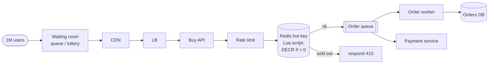

# 44 — HLD: Flash Sale + Inventory (Over-Sell Problem)

> Phase 7 • HLD Problems • Topic 44/74

## Problem statement

Design a system that sells limited-quantity items (a "flash sale") at high concurrency without overselling. Example: 10K units released; in the first second, 1M users try to buy.



## Requirements

### Functional
- Decrement inventory atomically.
- Reject excess buyers gracefully.
- Order creation linked to successful decrement.
- Optional: waitlist for excess.

### Non-functional
- Spike traffic (10× to 100× baseline) absorbed.
- Correctness: never sell more than inventory.
- Latency: < 1 s p99 for buy attempt.
- Fairness (mostly FIFO).

## Scale estimation

- 1M concurrent buyers in first second; 10K available units.
- Buy rate during sale: 1M attempts/sec for the first ~10 seconds.
- After sale ends: normal traffic.

## The over-sell problem

Naive flow:
```
1. SELECT inventory WHERE product_id = ?
2. if inventory > 0:  -- decision based on read
3.   UPDATE inventory SET qty = qty - 1
4.   INSERT order
```

Race condition: 100K concurrent threads all read `qty=10`, all decide it's available, all decrement → -99,990 inventory.

## Core API

```
POST /api/flash-sale/{id}/buy
  body: { user_id, qty }
  → 200 with order_id, or 409 sold-out
```

## Patterns to prevent over-sell

### 1. Atomic decrement in DB

```sql
UPDATE inventory
SET available = available - 1
WHERE product_id = ? AND available > 0
RETURNING available;
```

If `available` was 0 before, the row update doesn't happen → 0 rows affected → reject.

Pros: simple, correct.
Cons: hot row contention; lock per attempt; DB CPU saturated at high QPS.

### 2. Redis-based pre-decrement

```
DECR sale:product:42:remaining
if result < 0:
   INCR sale:product:42:remaining   -- compensate
   return SOLD_OUT
else:
   enqueue order to Kafka
   return SUCCESS
```

Redis is single-threaded — no race. ~100K ops/sec/node. Use Lua for atomicity if compensation isn't enough.

Pros: high throughput.
Cons: requires Kafka-backed durability for the order.

### 3. Pre-allocated tokens / queue

- Pre-generate 10K "purchase tokens" before sale starts.
- Buyers compete to pop a token from a Redis list.
- Token holder gets to place an order; no token → rejected.

```
LPOP sale:product:42:tokens
```

Single-threaded Redis ensures only first 10K pops succeed.

### 4. Stream-based: ordered consumption

- All buy attempts enter a Kafka topic (one partition for ordering).
- A single consumer processes in order, decrements (in memory or in DB).
- First 10K succeed; rest rejected.

Pros: clear ordering, perfect fairness.
Cons: serialized → limited throughput per product (a single partition).

### 5. Sharded inventory

Split inventory into N "buckets" across shards. Each bucket has 10000/N units. Spread buyers across shards by user-hash or random. Adds buyer-side hash + bucket selection; reduces contention.

Useful when inventory is large enough to split without coarse pre-allocations breaking fairness (1M units → 100 buckets of 10K).

## High-level architecture (typical)

```
              ┌─────────────┐
   Client ──► │ CDN / Edge  │ ── pre-sale page cached aggressively
              └──────┬──────┘
                     ▼
              ┌─────────────┐
              │ API GW + WAF│ ── rate limit; bot detection
              └──────┬──────┘
                     ▼
              ┌──────────────┐
              │ Buy Service  │ ── atomic decrement in Redis
              └──────┬───────┘
                     ▼ on success
              ┌────────────┐
              │   Kafka    │ ── order events
              └────┬───────┘
                   ▼
            ┌────────────┐
            │ Order      │ ── creates DB order, captures payment
            │ Service    │
            └────────────┘
```

## Detailed design

### Pre-sale page

- Heavy CDN caching.
- Static page with countdown.
- Don't query backend until sale starts.

### Sale starts

- Buy button enabled (client-side timer + server-validated).
- POST to `/buy` → atomic decrement.
- Success: order placed; async payment in saga.

### Bot mitigation

- WAF / Cloudflare Bot Management.
- Captcha for suspicious traffic.
- Rate limit per IP / fingerprint.
- Account-level limits (1 per user; reject if user_id already has order in this sale).

### Order finalization (saga)

- Inventory reserved (decrement succeeded).
- Payment authorization: charge card via provider.
- On payment failure: compensate (re-increment inventory). Common because customers abandon at payment.

### Reservation TTL

If buyer doesn't complete payment in N minutes → release reservation back to inventory.

Implementation: schedule with TTL; on TTL expire, re-INCR Redis counter + cancel order.

### After-sale

- Once 10K sold: subsequent buys instantly rejected (counter = 0).
- Optionally enqueue to waitlist for restocks.

## Bottlenecks & optimizations

- **Hot key in Redis**: single counter per product. For >100K QPS, shard the counter:
  - N counter shards per product: `sale:42:0`, `sale:42:1`, ..., `sale:42:N-1`.
  - Buyer hashes user_id → shard.
  - Each shard has `total / N` units.
- **DB write storm** on order insert: buffer through Kafka, write at controlled rate.
- **Payment downstream**: don't synchronously call provider in the buy path; pre-auth pattern.
- **Client retries**: clients retry aggressively when they see failure. Return clear error codes; debounce on client.

## Trade-offs

- **Atomic DB decrement vs Redis**: DB is correct + simple; Redis is fast but requires durability layer.
- **Strict fairness (FIFO) vs throughput**: fully serialized order is fair but slow; bucketed is fast but slightly unfair across buckets.
- **Reservation TTL**: shorter = more cycles available to others; longer = more time for customer.

## Interview questions

### Q1: Why does the naive read-then-update overscell?
Concurrent threads read the same value, all see "available," all proceed to decrement. The update is atomic but the decision was based on stale data. Need conditional atomic operation: "decrement only if positive."

### Q2: How would you handle 1M QPS with 10K units?
- Edge rate limit + bot mitigation reduces what reaches backend.
- Atomic counter in Redis (with sharded counters if needed) handles the decrement.
- Once counter hits 0, subsequent attempts get instant SOLD_OUT — fast rejection without DB hit.
- Successful attempts enter Kafka → order service processes at sustainable rate.

### Q3: A user's payment fails after inventory was reserved. What happens?
Saga compensation: re-increment the Redis counter. Mark order as canceled. Reservation TTL also handles users who abandon at checkout.

### Q4: Compare Redis DECR vs DB UPDATE WHERE available > 0.
DB UPDATE: correct, simple, but DB CPU/IO saturates at high concurrency on hot row. Redis DECR: in-memory, single-threaded → no race, much higher throughput (~100K+ per node), but you need durable order recording (Kafka).

### Q5: How to enforce "one purchase per user" on a flash sale?
Before decrementing, check Redis: `SET user:42:bought NX EX 3600`. If NX returns false, user already bought — reject. Combined with main inventory decrement to ensure atomicity.

### Q6: How to handle bots scraping inventory?
- WAF / Cloudflare Bot Management.
- Captcha for suspicious patterns.
- Account verification (phone, email).
- Behavioral analysis (mouse movements, request timing).
- IP rate limits; rotating IP detection.
- TLS fingerprinting.

### Q7: How to maintain fairness across users?
Strict FIFO requires serialization (one consumer / one partition) → caps throughput. Most systems accept "approximately FIFO" with bucketed counters or random ordering. Fairness across buckets is statistical.

### Q8: Design for a sale of 1M units (not 10K). What changes?
- Less contention per unit; more straightforward.
- Sharded counter (e.g., 100 buckets of 10K each).
- Order service scaled horizontally.
- DB writes batched.
- Still need bot / abuse mitigation but less of a "the moment the sale starts" thundering herd.

## TL;DR cheat sheet

- Atomic conditional decrement is non-negotiable: `DECR + compensate if negative` or `UPDATE WHERE qty > 0`.
- Redis counter handles high throughput; Kafka durably records orders.
- Sharded counters when one shard isn't enough.
- Token / queue model for strict ordering.
- Saga for payment with reservation TTL for compensation.
- Bot mitigation at the edge.
- One-purchase-per-user via additional Redis check.
- CDN-cache the pre-sale page heavily.

## Go deeper

- **High Scalability**: ["Alibaba flash sale"](http://highscalability.com/) architecture posts.
- **Taobao engineering blog**: flash sale stories.
- **Shopify**: BFCM (Black Friday Cyber Monday) architecture posts.
- **ByteByteGo**: flash sale and inventory videos.
- **Topic 25** (rate limiting) and **Topic 24** (sagas) in this collection.
