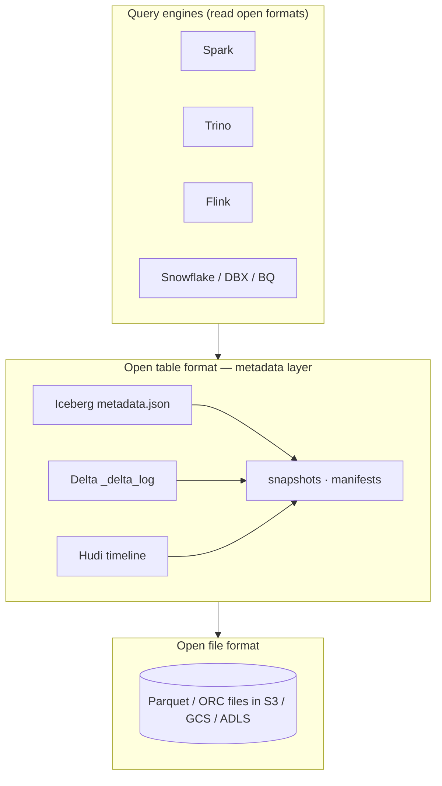
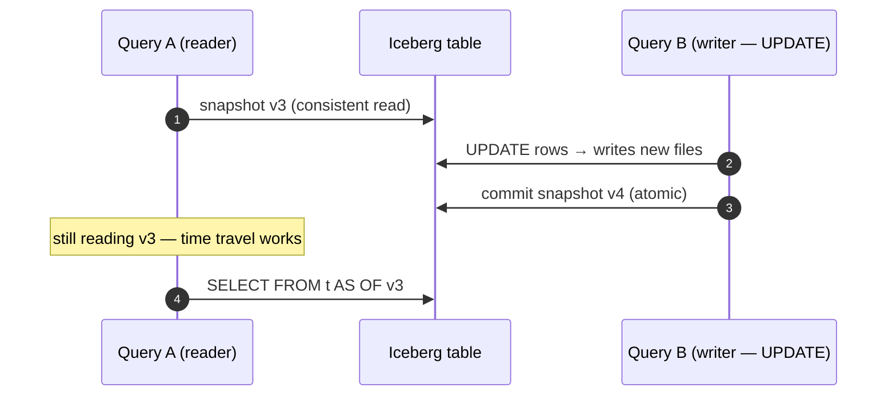

# 54 — Lakehouse: Iceberg, Delta Lake, Hudi

> Phase 8 • Data Engineering • Topic 54/74

## Definition (interview-ready)

A **lakehouse** is a data architecture that adds warehouse-grade features (ACID transactions, schema enforcement, time travel, upserts) on top of cheap object storage (S3/GCS/ADLS) with open file formats (Parquet/ORC). The three open table formats are **Apache Iceberg**, **Delta Lake**, and **Apache Hudi** — each implements lakehouse semantics via metadata layers on top of Parquet.

## Why it matters

Lakehouses replace the messy two-tier "data lake + warehouse" architecture. You get warehouse semantics at lake price and open-format flexibility. Modern data stacks at Netflix, Apple, Uber, Stripe, and most large teams are converging on lakehouse table formats.





## Core concepts

### The old two-tier problem

- **Data lake**: cheap S3 Parquet. No ACID; bad updates; manual cleanup. Good for ML and ad-hoc.
- **Data warehouse**: Snowflake/Redshift/BigQuery. Great query performance + ACID; expensive; closed format; data duplicated from the lake.

Maintaining both is the data-engineering tax.

### Lakehouse: one tier

ACID transactions on Parquet via a **metadata layer** that tracks which files belong to which version of each table.

Key features added:
- **ACID transactions**: serializable or snapshot isolation on table state.
- **Schema enforcement + evolution**: rejects bad writes; supports add/rename/drop columns.
- **Upserts / deletes / merges**: row-level changes (not just append).
- **Time travel**: query a table as of a past timestamp / version.
- **Hidden partitioning**: no need to manually compute partition columns.
- **Compaction / optimize**: rewrite small files into larger ones.
- **Concurrency control**: multiple writers safely.

### Apache Iceberg

- Originated at Netflix.
- Snapshot-based: each table version is an immutable snapshot.
- Metadata files: a manifest list pointing to manifests, each pointing to data files (Parquet).
- **Hidden partitioning**: query layer derives partition from a function of timestamp; no manual `year=`/`month=` columns.
- **Schema evolution**: by **field ID** (not by name) — safe rename, add, drop.
- Catalogs: REST catalog, Hive metastore, AWS Glue, Snowflake — pluggable.
- Query engine support: Spark, Trino/Presto, Flink, Snowflake (read), Athena, Databricks SQL.

### Delta Lake

- Originated at Databricks.
- Snapshot-based; metadata in `_delta_log` directory: JSON files + Parquet checkpoints.
- Strong Spark integration; works with Trino, Flink, Hive via connectors.
- **MERGE INTO**: upsert / SCD2 friendly.
- **Time travel**: `VERSION AS OF` / `TIMESTAMP AS OF`.
- **OPTIMIZE**: compaction; Z-ORDER for multi-dimensional clustering.
- **Delta Sharing**: open protocol for cross-org data sharing.

### Apache Hudi

- Originated at Uber.
- Strong focus on **incremental data ingestion** and **mutability**.
- Two table types:
  - **Copy-on-write (CoW)**: rewrites Parquet files on updates. Slower writes, fast reads.
  - **Merge-on-read (MoR)**: writes delta logs, merges on read. Fast writes, slower reads (until compaction).
- **Indexes**: HBase / bloom / hash → fast upserts.
- Stronger CDC + streaming use cases (because of MoR).

### Comparison

| | Iceberg | Delta Lake | Hudi |
|---|---|---|---|
| Origin | Netflix | Databricks | Uber |
| Engine support | broadest (Spark, Trino, Flink, Snowflake, Athena, ...) | best in Spark/Databricks | Spark, Hive, Presto |
| Schema evolution | by field ID (safest) | by name | by name |
| Updates | snapshot-based | snapshot-based | CoW or MoR with indexes |
| Time travel | yes | yes | yes |
| CDC | recent additions | yes (CDF) | yes (built-in incremental queries) |
| Streaming | growing | strong | strong |
| Hidden partitioning | yes (excellent) | no (manual) | partition spec |

**Most common choice in 2024–2026**: Iceberg (broadest support, open governance). Delta Lake if you're heavily Databricks-shop.

### Time travel

Query the table as of a past version:
```sql
SELECT * FROM orders VERSION AS OF 12345;
SELECT * FROM orders TIMESTAMP AS OF '2026-05-01';
```

Useful for: audits, reproducible ML, recovery from accidental writes.

### Compaction (OPTIMIZE)

Small-file problem hits lakehouses too. Periodic compaction rewrites small files into larger ones, updating the metadata atomically.

Delta: `OPTIMIZE table`. Iceberg: `RewriteDataFiles`. Hudi: clustering / compaction.

### Vacuum / garbage collection

Old snapshot files accumulate. Vacuum cleans them up — but respect retention to preserve time travel.

### Concurrency

- **Optimistic concurrency control**: each write attempts to commit; conflict detection via metadata. Conflict → retry.
- For high concurrency (streaming writes): tune for partition-level serializability.

### Streaming ingestion

- Iceberg, Delta, Hudi all support streaming writes (Flink → Iceberg, Spark Structured Streaming → Delta).
- For CDC pipelines: Debezium → Kafka → stream processor → lakehouse upserts.

## How it works (Iceberg write)

```
Writer:
1. Read current snapshot's manifest list.
2. Write new Parquet files to S3.
3. Generate a new manifest pointing to the new (and existing) files.
4. Update manifest list with the new manifest.
5. Atomically swap the table's current snapshot pointer (in catalog) to new snapshot.

Reader:
1. Resolve table → current snapshot.
2. Read manifest list → manifests → data files.
3. Plan query against this immutable set of files.
4. New writer's changes invisible until catalog pointer updates (atomic).
```

## Real-world examples

- **Netflix**: Iceberg birthplace; petabyte-scale.
- **Apple**: heavy Iceberg.
- **Adobe**: Iceberg.
- **Databricks customers**: Delta everywhere.
- **Uber**: Hudi origin; ingestion-heavy use cases.
- **Snowflake**: read Iceberg natively (since 2023).

## Common pitfalls

- **Small files explosion**: streaming writes produce tiny files. Compact regularly.
- **Vacuum too aggressive**: removes snapshots needed for time travel.
- **Schema rename without field IDs**: silently breaks downstream readers.
- **Cross-engine catalog mismatch**: Spark + Trino + Flink reading the same table need consistent catalog access. Use a shared metastore (Glue, Hive, REST catalog).
- **Concurrent writers without proper locking**: conflicts cause retries; high contention = slow.
- **Querying without partition predicates**: scans whole table — defeats partitioning.
- **Reusing partition columns as primary keys**: locked into bad design.

## Interview questions

### Q1: What problem does a lakehouse solve?
The two-tier "data lake + warehouse" problem. Lakes (S3 Parquet) are cheap and open but lack ACID, schema enforcement, upserts. Warehouses solve those but are expensive and proprietary. Lakehouses add warehouse semantics (ACID, schema, upserts, time travel) on top of cheap object storage via a metadata layer.

### Q2: How does Iceberg achieve atomic commits?
Each table version is a snapshot. Writer writes new Parquet files + new manifest, then atomically updates the table's snapshot pointer in the catalog. Readers see the old snapshot until the pointer flips. No partial state visible.

### Q3: What is time travel in Delta/Iceberg?
Each table version is preserved in metadata (and underlying files). Query as of a past version or timestamp. Useful for audit, reproducible ML, recovery from accidental writes. Bounded by vacuum retention.

### Q4: Iceberg vs Delta — when to pick which?
Iceberg: broadest engine support (Trino, Snowflake, Spark, Flink, Athena), open governance, schema evolution by field ID. Pick if engine variety matters. Delta: best in Databricks/Spark world, mature, strong feature set, Delta Sharing for cross-org. Pick if you're in Databricks land. Both are excellent.

### Q5: Hudi's Copy-on-Write vs Merge-on-Read.
CoW: updates rewrite the entire Parquet file → slower writes, but reads are fast (just read Parquet). MoR: updates appended as delta logs → fast writes, reads must merge logs at query time (until compaction merges them). MoR for write-heavy, low-latency ingestion (CDC); CoW for read-heavy.

### Q6: How would you handle GDPR delete on a lakehouse table?
Use the format's `DELETE` (Delta/Iceberg/Hudi all support row-level deletes). The format rewrites affected files / writes delete markers. Old snapshots still contain the row — run `VACUUM` to actually remove. Set retention carefully to balance time-travel vs compliance.

### Q7: Concurrent streaming writers to one Iceberg table — what happens?
Optimistic concurrency: each writer commits as a new snapshot; if the snapshot it based on isn't current, conflict → retry. For non-overlapping partitions, conflicts are rare. For high write-rate streaming, tune compaction and use a dedicated commit thread.

### Q8: How would you compact small files in a lakehouse?
Delta: `OPTIMIZE table` (optionally `ZORDER BY (col)`). Iceberg: `RewriteDataFiles` procedure. Schedule daily/hourly. Be aware of file rewrite cost (heavy I/O); run during low-traffic windows.

## TL;DR cheat sheet

- Lakehouse = warehouse features (ACID, schema, upserts, time travel) on top of Parquet + object store.
- **Iceberg** (Netflix), **Delta** (Databricks), **Hudi** (Uber) — three open formats.
- Each implements snapshot-based metadata + atomic commits.
- Iceberg: broadest engine support; Delta: best in Spark/Databricks; Hudi: best for write-heavy ingestion.
- Time travel = query past versions.
- Compaction (OPTIMIZE) for small-file problem.
- GDPR delete + vacuum carefully.
- Use a shared catalog (Glue, Hive metastore, REST catalog) for multi-engine.

## Go deeper

- **Iceberg docs**: [iceberg.apache.org](https://iceberg.apache.org/docs/).
- **Delta Lake docs**: [delta.io/docs](https://delta.io/docs/).
- **Hudi docs**: [hudi.apache.org/docs](https://hudi.apache.org/docs/overview).
- **Databricks blog**: many Delta and lakehouse posts.
- **Netflix tech blog**: Iceberg origin story.
- **Uber engineering**: Hudi origin and design.
- **Apple Iceberg posts**.
- **DDIA Chapter 10** — for batch context.
