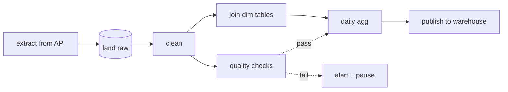

# 55 — Airflow Internals: DAG Semantics, Idempotency, Backfills, Deferrable Operators

> Phase 8 • Data Engineering • Topic 55/74

## Definition (interview-ready)

**Apache Airflow** is a workflow orchestrator: schedules and runs **DAGs** (directed acyclic graphs) of tasks. A **DAG run** is one execution of a DAG for a specific **logical date**. Tasks must be **idempotent** to support retries and backfills. **Deferrable operators** yield long waits to a "triggerer" service to free up workers — critical for scale.

## Why it matters

Most data teams orchestrate with Airflow. The same patterns (idempotency, backfills, deferrable ops, retries) apply to any modern orchestrator (Prefect, Dagster, Temporal). Knowing these well is what separates data engineers who can ship reliable pipelines from those whose jobs run nightly and break weekly.



## Core concepts

### DAG

A workflow definition (Python file):
```python
with DAG("daily_sales", schedule="@daily", start_date=...) as dag:
    extract = PythonOperator(task_id="extract", python_callable=...)
    transform = PythonOperator(task_id="transform", python_callable=...)
    load = PythonOperator(task_id="load", python_callable=...)
    extract >> transform >> load
```

- Static structure (mostly).
- Tasks have dependencies (`>>`).
- DAG scheduled at intervals (`@daily`, cron expression, or `None` for manual only).

### DAG run

One execution of the DAG for a specific **logical date** (a.k.a. **execution_date**).

For `daily_sales` on 2026-05-29, a DAG run with logical_date=2026-05-29 starts at the next interval (typically 00:00 UTC the next day in classic Airflow semantics).

Critical: **logical_date is the start of the data window**, not when the DAG actually runs. So `daily_sales` with logical_date=2026-05-29 processes the data for that day, running at end-of-day or whenever scheduled.

### Idempotency: rerunnable tasks

Tasks must be safe to run multiple times. Why:
- Retries on failure.
- Backfills (re-running historical periods).
- Reprocessing after bug fixes.

Patterns:
- Pass `logical_date` (or `run_id`) into the task.
- Idempotent operations: `INSERT ... ON CONFLICT DO NOTHING`, `MERGE INTO`, delete-then-insert, upsert.
- Idempotent file output: write to a path including `logical_date`.

```python
def extract(**ctx):
    date = ctx['logical_date'].date()
    output = f"s3://bucket/extract/{date}/data.parquet"
    # if rerun, overwrite same path
    db.export(f"SELECT * FROM source WHERE date = '{date}'", output)
```

### Scheduler

- Polls DAG files periodically (default every 30s).
- Parses Python DAG → in-memory representation.
- Decides which DAG runs are due, creates them.
- For each run, evaluates dependencies; enqueues ready tasks.
- Stores state in the metadata DB (Postgres).

### Executor

- **Local**: tasks run in subprocesses on scheduler host.
- **Celery**: distributed workers consume Redis/Rabbit queue.
- **Kubernetes**: each task = a pod.
- **EKS / GCP Composer**: managed wrappers.

### Backfill

Rerun a DAG for a past window:
```bash
airflow dags backfill -s 2026-04-01 -e 2026-04-30 daily_sales
```

Creates DAG runs for each missed date. Critical: tasks must be idempotent.

### Catchup

On scheduler startup, if DAG missed intervals during downtime, scheduler creates "catchup" runs. `catchup=False` disables (only run for current/future intervals).

### Sensors (and the deferrable pattern)

A **sensor** waits for an external condition: file in S3, partition in Hive, API ready.

Classic sensor: poll in a loop in the worker. Problem: **blocks a worker slot** while waiting. At scale, thousands of sensors → thousands of workers idle.

**Deferrable operators** (Airflow 2.2+): a sensor "yields" to the **triggerer** — a lightweight async event loop. When the condition is met, the triggerer wakes the task up and reattaches a worker.

Result: instead of 1000 idle workers, one triggerer can monitor 10000 conditions concurrently.

### Task states

```
NONE → SCHEDULED → QUEUED → RUNNING → SUCCESS
                                  ↓
                              UP_FOR_RETRY (after delay) → QUEUED
                                  ↓
                              FAILED
                                  ↓
                         UPSTREAM_FAILED / SKIPPED
                         (depending on trigger rules)
```

### Trigger rules

Default: a task runs when all upstreams succeed.

Variants:
- `all_done`: run after upstreams finish (success or failure).
- `one_failed`: run if any upstream failed.
- `all_failed`: run only if all upstreams failed.
- Useful for cleanup / notification tasks.

### Pools and concurrency

- **Pool**: named bucket with a fixed slot count. Tasks tagged with a pool wait for a free slot.
- Use: limit concurrent connections to a DB, expensive API calls.
- Per-DAG concurrency: max active tasks per DAG.
- Per-task concurrency: max active task instances across all DAGs.

### XCom (cross-task communication)

Tasks pass small values via XCom (stored in metadata DB). Used for: returning a query result, file path, status. Don't push huge payloads.

For big data, write to a known location (S3) and pass the path.

### Smart sensors → Deferrable (history)

Airflow 1 had no async; everything ran in workers. Airflow 2 introduced smart sensors then deferrable operators — much more scalable. Modern Airflow 2.7+: deferrable ops cover most async needs.

## Common pitfalls

- **Non-idempotent tasks**: retry on partial failure → duplicates / corruption.
- **Backfill of a non-idempotent DAG**: data integrity disaster.
- **Heavy work in DAG parsing**: scheduler parses Python files often; heavy parse = slow scheduler.
- **Sensors without deferrable**: kills scheduling at scale.
- **Big XCom payloads**: blows up metadata DB.
- **Dynamic task generation in Python loops**: harder to track; use TaskFlow / dynamic task mapping.
- **`catchup=True` on a long-dormant DAG**: huge thundering herd on restart.
- **`schedule_interval` semantics confusion**: DAG run for logical_date X executes AFTER period X ends.
- **DB bottleneck**: scheduler hammers metadata DB. Tune Postgres.

## Interview questions

### Q1: What's a deferrable operator and why does it matter?
A task that yields to the **triggerer** (async event loop) during long waits, freeing the worker. Replaces classic poll-in-worker sensors. One triggerer can handle 10000+ async conditions; without deferrable, you'd need that many workers.

### Q2: Why must Airflow tasks be idempotent?
Retries, backfills, and reprocessing all imply the same task can run multiple times. Idempotency ensures the output is the same regardless of how many times it ran — necessary for correctness.

### Q3: Explain logical_date vs run timing.
`logical_date` = the start of the data window the run covers (e.g., 2026-05-29 for daily DAG). The run actually executes *after* that window ends (typically next day). Tasks use logical_date to know what data to process, not when they're running.

### Q4: How to backfill an Airflow DAG?
`airflow dags backfill -s START -e END dag_id`. Creates DAG runs for each interval. Requires tasks to be idempotent. For huge backfills, schedule throttling to avoid hammering downstream systems.

### Q5: Compare Celery vs Kubernetes executor.
Celery: pre-baked workers consume from queue (Redis/Rabbit). Fast task launch, fewer per-task isolation. Kubernetes: each task = a Pod, full isolation, scales elastically, slower launch (~10-30s pod startup). K8s for cost-elastic and isolation; Celery for sustained high-rate workloads.

### Q6: How would you reduce scheduler delays?
- Smaller DAGs (split mega-DAGs).
- Avoid heavy parsing (no DB calls or big imports in DAG file).
- Tune `dag_dir_list_interval`, `min_file_process_interval`.
- Tune Postgres (scheduler hammers it).
- Multiple scheduler instances (Airflow 2 supports active-active scheduler).

### Q7: A DAG has 100 tasks running daily. Some take 1 second; one takes 4 hours. Improvements?
- Make sure the long task isn't blocking sensors (use deferrable).
- Parallelize the long task internally if possible (Spark job sized larger).
- Check if it can be skipped (e.g., only process changed data — incremental).
- Pool for resource control; isolate from rapid 1-second tasks.
- Backfills won't necessarily be slower since the long task dominates.

### Q8: Design idempotent loader from S3 to Postgres for daily partition.
```python
def load(**ctx):
    date = ctx['logical_date'].date()
    # Idempotent: delete existing rows for the date, then insert.
    conn.execute(f"DELETE FROM target WHERE date = '{date}'")
    conn.execute(f"""
       INSERT INTO target
       SELECT * FROM read_parquet('s3://bucket/source/{date}/*.parquet')
    """)
```

Or upsert via `MERGE INTO` (Postgres 15+) for partial updates. Rerunnable, no duplicates.

## TL;DR cheat sheet

- DAG = workflow definition; DAG run = execution for a logical_date.
- Tasks must be **idempotent** (retries, backfills).
- Use `logical_date` (or `run_id`) to scope work; output to known path per date.
- Scheduler parses DAGs, enqueues ready tasks; executor runs them.
- Sensors → **deferrable operators** for scale.
- Backfill = run for historical period. Catchup = automatic catch-up on startup.
- Pools and per-task concurrency for resource control.
- Don't put big payloads in XCom; use S3.
- Lightweight DAG files (no heavy parsing).

## Go deeper

- **Apache Airflow docs**: [airflow.apache.org/docs](https://airflow.apache.org/docs/apache-airflow/stable/).
- **Astronomer Academy**: free, comprehensive Airflow courses.
- **TaskFlow API** docs: modern Pythonic DAG syntax.
- **Marc Lamberti** YouTube channel: high-quality Airflow content.
- **Topic 49** in this collection (HLD job scheduler).
- **Prefect, Dagster, Temporal docs** for comparison.
