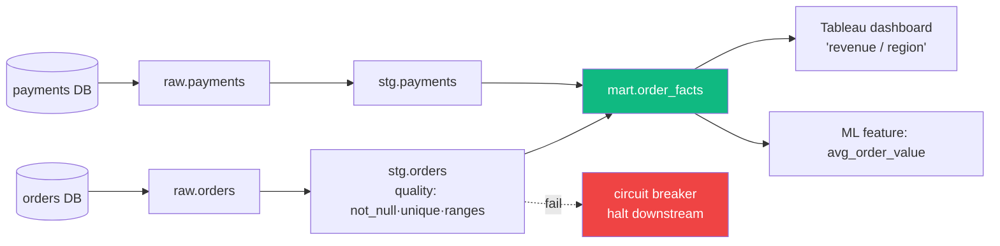

# 57 — Data Quality + Lineage (Great Expectations / DataHub)

> Phase 8 • Data Engineering • Topic 57/74

## Definition (interview-ready)

**Data quality** is the practice of asserting correctness, completeness, freshness, and validity of data via automated tests/expectations and monitoring. **Lineage** is the metadata that tracks how data flows from source through transformations to dashboards/ML, enabling impact analysis, debugging, and compliance. Tools: **Great Expectations**, **Soda**, **dbt tests** for quality; **DataHub**, **OpenLineage**, **Atlan**, **Monte Carlo** for lineage.

## Why it matters

"Garbage in, garbage out" — every analytics team that scales hits the data quality wall. Bad data leads to bad business decisions and broken trust. Lineage answers "if I change this table, what breaks?" — essential for safe evolution at scale.



## Core concepts

### What is data quality

Dimensions (from the DAMA framework + practical experience):

- **Accuracy**: does it match reality? (e.g., currency = "USD")
- **Completeness**: any missing rows or null columns? (e.g., 0 nulls in `order_id`)
- **Consistency**: do related tables agree? (e.g., sum of order lines = order total)
- **Timeliness / Freshness**: is it recent enough? (e.g., last update < 1 hour)
- **Validity**: conforms to schema/constraints? (e.g., `country in ('IN','US',...)`)
- **Uniqueness**: are there unintended duplicates? (e.g., distinct `order_id`)
- **Referential integrity**: foreign keys point somewhere real?

### Expectations / assertions

Declarative checks defined alongside the data:

```yaml
# Great Expectations example
expect_column_values_to_not_be_null: order_id
expect_column_values_to_be_unique: order_id
expect_column_values_to_be_in_set: { column: country, values: [IN,US,...] }
expect_column_values_to_be_between: { column: amount, min: 0, max: 1000000 }
expect_table_row_count_to_be_between: { min: 10000, max: 100000000 }
```

These run as part of the pipeline (after each load) or scheduled.

### dbt tests

```yaml
models:
  - name: orders
    columns:
      - name: order_id
        tests: [not_null, unique]
      - name: customer_id
        tests:
          - relationships:
              to: ref('customers')
              field: customer_id
```

Run with `dbt test`. Fails build on assertion failure.

### Anomaly detection

Beyond static rules:
- **Row count delta**: today's count vs 7-day average — alert if > 30% off.
- **Schema change**: new column appears.
- **Null rate spike**: previously 0% nulls, now 30%.
- **Distribution shift**: ML-driven detection of statistical drift.

Tools: **Monte Carlo**, **Anomalo**, **Bigeye** — commercial "data observability" platforms.

### Quality tiers

- **Bronze**: raw data, minimal validation.
- **Silver**: cleaned, schema-enforced, deduped.
- **Gold**: aggregated, business-ready.

Quality assertions strict for gold, less strict for bronze.

### Lineage

Tracks data flow:
- Source table → transformations → destination table.
- Column-level (sometimes): source column → derived column.
- Cross-tool: warehouse → BI dashboard → ML model.

Built from:
- **Static analysis** of SQL / dbt models.
- **Runtime tracing** (OpenLineage).
- **Manual catalog entries**.

### Use cases

- **Impact analysis**: "If I deprecate column X, what downstream breaks?"
- **Root cause**: "Why is dashboard wrong?" → trace upstream tables → find broken pipeline.
- **Compliance**: "Where is PII column X used?" — GDPR/DPDP.
- **Discovery**: "Is there a table for customer LTV?" — searchable catalog.

### Tools

- **DataHub** (LinkedIn open-source): metadata + lineage + discovery.
- **OpenLineage**: open standard for runtime lineage; Marquez is the reference UI.
- **dbt docs**: built-in lineage for dbt models.
- **Apache Atlas, Amundsen** (Lyft): older metadata platforms.
- **Atlan, Monte Carlo, Collibra** — commercial.

### Data contracts

A pact between data producer (e.g., an upstream service emitting events) and consumer (analytics team):
- Schema definition.
- Quality SLAs.
- Change-management process.
- Owner / SLA.

Stronger than informal expectations: built into producer's CI/CD, breaking the contract fails their deploys.

### SLAs for data

- **Freshness SLA**: data must be ≤ N hours old.
- **Completeness SLA**: 99.9% of expected rows.
- **Quality SLA**: 0 NULL in critical columns.
- **Alert + ownership**: on-call rotation; ownership clear.

## How it works (a pipeline with quality)

```
Source (Postgres) ──CDC──► raw_events (bronze) ──dbt──► clean_events (silver)
                                                            │
                                                            ▼ dbt tests
                                                       (fail = block)
                                                            │
                                                            ▼
                                                       gold_metrics
                                                            │
                                                            ▼
                                          DataHub catalog (auto-ingested from dbt manifest)
                                                            │
                                                            ▼
                                          BI dashboards (lineage extends here)
```

## Real-world examples

- **LinkedIn**: built DataHub for thousands of tables.
- **Lyft**: built Amundsen.
- **Airbnb**: built Dataportal.
- **Netflix**: Lyft-style lineage; data SLAs in production.
- **Stripe**: rigorous data contracts.

## Common pitfalls

- **No tests**: pipeline silently outputs garbage; trust eroded.
- **Tests but no alerting**: failures pile up unnoticed.
- **No ownership**: a broken table sits broken because no one's responsible.
- **Lineage only at the table level**: can't answer column-level questions.
- **Stale lineage**: manually maintained → drift. Use runtime tracing (OpenLineage).
- **No bronze/silver/gold separation**: every consumer hits raw data; bugs propagate.
- **Cosmic-scope quality** in early stages: assert too much, breaks often, team disables tests.

## Interview questions

### Q1: What's the difference between data quality and data observability?
Data quality = explicit assertions (tests/expectations) you write. Data observability = automated/ML-driven detection of anomalies (row count drops, schema drift, distribution change) without explicit rules. Both are needed.

### Q2: How do you implement data quality in a dbt project?
Built-in `tests` per model: `not_null`, `unique`, `relationships`, `accepted_values`. Custom tests as SQL files. Run `dbt test` as part of CI/CD; failure blocks deploys. Critical tests run after every load; full test suite scheduled daily.

### Q3: What's lineage and why does it matter?
Lineage = metadata showing how data flows from source through transformations to consumers. Matters for: impact analysis (what breaks if I change this), root cause (what's wrong upstream when dashboard is bad), compliance (where's PII used), and discovery (does a table for X exist).

### Q4: How do you handle a critical data quality SLA breach in production?
- Page on-call data engineer.
- Surface to consumers (dashboards show "data may be stale" banner).
- Investigate: trace lineage upstream, find broken pipeline.
- Fix and reload or roll back.
- Post-mortem: what assertion would have caught this earlier?

### Q5: A team has lineage at the table level but a column rename caused incidents. Improvement?
Move to **column-level lineage**. Tools like DataHub, OpenLineage, and SQL parser-based lineage (dbt-osmosis, AcrylDataHub) extract column-level info from SQL. Surface deprecation warnings to downstream owners before breaking changes.

### Q6: What is a data contract?
A formal agreement between data producer and consumer: schema, quality SLAs, change-management process, ownership. Encoded in code, enforced in producer's CI (their tests fail if they break the contract). Modern alternative to ad-hoc "we'll let you know about schema changes."

### Q7: Design an end-to-end data quality strategy.
- **Bronze**: validate basic schema + critical not-null on ingestion.
- **Silver**: stricter — unique constraints, accepted values, referential integrity.
- **Gold**: business rules + reconciliation with source-of-truth (e.g., sum of facts = ledger).
- **Monitoring**: anomaly detection on row counts, distributions.
- **Lineage**: tracked from raw to dashboard via OpenLineage.
- **Ownership**: each table has a clear owner; on-call for critical tables.
- **SLAs**: freshness, completeness, quality per tier.
- **Contracts** with critical upstream producers.

### Q8: How to track lineage automatically?
- For SQL/dbt: static parsing of SQL or dbt manifest → table dependencies.
- For Spark: instrument with OpenLineage; emits events to Marquez.
- For BI tools: pull lineage from BI tool's API (Tableau, Looker have it).
- Centralize in DataHub / Atlan / OpenMetadata. Don't maintain manually — it drifts.

## TL;DR cheat sheet

- Data quality dimensions: accuracy, completeness, consistency, timeliness, validity, uniqueness.
- Tools: Great Expectations, dbt tests, Soda for quality. Monte Carlo for observability.
- Tier data: bronze/silver/gold with progressively strict tests.
- Lineage = data flow metadata. Automate via SQL parsing or runtime tracing (OpenLineage).
- Column-level lineage > table-level.
- Data contracts: enforce upstream schema/SLAs via producer CI.
- Each critical table needs an owner and an SLA.
- Pair tests with alerting + ownership + runbook.

## Go deeper

- **Great Expectations docs**: [greatexpectations.io](https://greatexpectations.io/).
- **DataHub docs**: [datahubproject.io](https://datahubproject.io/).
- **OpenLineage**: [openlineage.io](https://openlineage.io/).
- **dbt docs**: tests, sources, exposures.
- **Monte Carlo blog**: data observability writeups.
- **Chad Sanderson** (data contracts) — Substack and book.
- **Book**: *Fundamentals of Data Engineering* (Reis, Housley) — chapter on quality + governance.
