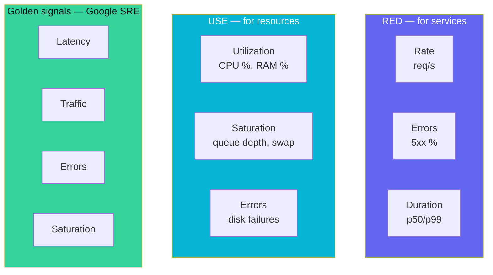

# 60 — RED / USE Methods + Golden Signals

> Phase 9 • Production Craft • Topic 60/74

## Definition (interview-ready)

Three complementary frameworks for what to monitor:
- **RED** (Tom Wilkie): **R**ate, **E**rrors, **D**uration — for **request-driven services**.
- **USE** (Brendan Gregg): **U**tilization, **S**aturation, **E**rrors — for **resources** (CPU, disk, network).
- **Golden Signals** (Google SRE): **Latency, Traffic, Errors, Saturation** — for user-facing services.



## Why it matters

Without a model, dashboards become "everything we could measure," and the signal gets lost. These frameworks give you a small, consistent set of metrics per service / per resource that catches most problems.

## Core concepts

### RED — for services

For every service:
- **Rate**: requests/sec (per endpoint).
- **Errors**: error rate (per endpoint, ideally percent).
- **Duration**: latency distribution (p50, p95, p99).

Example PromQL:
```
sum(rate(http_requests_total{job="api"}[1m])) by (endpoint)
sum(rate(http_requests_total{job="api",status=~"5.."}[1m])) by (endpoint)
histogram_quantile(0.99, sum(rate(http_request_duration_seconds_bucket{job="api"}[1m])) by (le, endpoint))
```

These three metrics, per endpoint, are 90% of what you need to know about a service's health.

### USE — for resources

For every resource:
- **Utilization**: % busy time.
- **Saturation**: queue depth or wait time (work piling up beyond capacity).
- **Errors**: error event count.

Apply to: CPU, memory, disk I/O, network, file descriptors, thread pool, connection pool.

Why both U and S: a resource at 100% utilization with no queue is fine; at 80% utilization with a queue is saturated.

### Golden Signals — Google SRE

For user-facing services:
- **Latency**: how long requests take.
- **Traffic**: how much demand (rate).
- **Errors**: rate of failed requests.
- **Saturation**: how full the service is (CPU, memory, queue depth).

Essentially RED + saturation.

### How they fit together

- **RED** for service health (above the kernel).
- **USE** for resource health (below the application).
- **Golden Signals** for user-facing experience.

Most teams build dashboards in a hierarchy:
1. **User experience** (golden signals): is the product working for users?
2. **Per-service** (RED): which service is sick?
3. **Per-resource** (USE): why is the service sick?

### Capacity planning

Saturation metric tells you when to scale:
- 70% sustained utilization → start scaling.
- Saturation > 0 → scale immediately.
- Combine with traffic forecast to size.

### Per-endpoint vs aggregate

Aggregate metrics hide per-endpoint problems. A service that's 99% healthy but its `/checkout` is broken looks fine on aggregate. Always break down by endpoint.

### Dashboard hierarchy

Typical layout:
- **Overview**: traffic, error rate, p99 latency.
- **Per-endpoint**: RED for each endpoint.
- **Dependencies**: status of upstreams (DB, cache, downstream services).
- **Resources**: USE for CPU, memory, pool saturation.
- **Business metrics**: revenue, orders/sec, signups/sec.

Keep each dashboard focused; link to deeper ones.

## How it works (alert on RED)

```
# Alert: error budget burning fast
- alert: HighErrorRate
  expr: |
    sum(rate(http_requests_total{status=~"5.."}[5m])) by (service)
    / sum(rate(http_requests_total[5m])) by (service)
    > 0.05
  for: 5m
  labels: { severity: page }
  annotations:
    summary: "{{ $labels.service }} error rate > 5%"

# Alert: p99 latency breach
- alert: HighLatency
  expr: histogram_quantile(0.99, sum(rate(http_duration_bucket[5m])) by (le, service)) > 1.5
  for: 5m
```

## Real-world examples

- **Google SRE Book**: established Golden Signals as the canonical framework.
- **Tom Wilkie at Weaveworks**: codified RED.
- **Brendan Gregg at Netflix**: codified USE for performance analysis.
- **Prometheus + Grafana** standard dashboards lean on these.

## Common pitfalls

- **CPU-only monitoring**: CPU at 80% with a deep queue is much worse than 95% with no queue. Use saturation.
- **Average latency**: lies about tail. Always include p95/p99.
- **One global dashboard for everything**: noisy. Per-service RED is more actionable.
- **No business metrics**: technical metrics green, but revenue dropped — you wouldn't notice.
- **Ignoring saturation**: until it's too late and customers feel it.

## Interview questions

### Q1: What's RED?
Rate, Errors, Duration — three metrics per service (typically per endpoint). Rate = requests/sec, errors = errored requests/sec, duration = latency distribution. Captures service health from the caller's perspective.

### Q2: What's USE and when do you apply it?
Utilization, Saturation, Errors — per resource (CPU, memory, disk, network, pools). Tells you whether a resource is the bottleneck. Crucial because utilization alone can mislead (100% utilization with no queue is fine; 80% with a queue is saturated).

### Q3: Difference between utilization and saturation?
Utilization = % of resource's time it was busy. Saturation = work piled up beyond capacity (queue depth, wait time). High utilization with no saturation = healthy. Low utilization but saturation > 0 = resource is bottleneck for some reason (e.g., serialized access). Both matter.

### Q4: Walk through Google's golden signals.
Latency (request duration), traffic (rate), errors (failure rate), saturation (how full). Cover user-facing health. Variant of RED + saturation. Used by Google SRE as a starting template for any service.

### Q5: How do you define "saturation" for a Kubernetes pod?
- CPU throttling rate (was capped by limit).
- Memory near limit (approaching OOM).
- Connection pool queue depth.
- HTTP server queue (queued requests).
- Disk I/O wait.
- Combination of these as "headroom remaining."

### Q6: How would you design alerts using these frameworks?
- RED-based: alert on error rate spike (>5% for 5min), p99 latency spike (>1.5s for 5min).
- USE-based: alert on saturation (queue depth > 0 for 5min) — early warning of capacity issues.
- Symptom-based (Google SRE preference): tie to SLOs (Topic 61) rather than direct resource thresholds.

### Q7: A service's CPU is at 30% but p99 latency is bad. Diagnose.
Not CPU-bound. Check:
- **Saturation elsewhere**: connection pool full, thread pool full, queue piling up.
- **GC**: stop-the-world pauses spiking tails.
- **Slow downstream**: DB, API, cache.
- **Lock contention**: low CPU but threads waiting.
- **Network**: bandwidth or RTT to dependency.

### Q8: A team has hundreds of dashboards. How do you bring sanity?
- Audit: who looks at what? Most go unused.
- Standardize: every service gets the same RED + USE template.
- Hierarchy: overview → per-service → per-resource.
- Link from alerts to specific dashboard rows.
- Deprecate unused dashboards aggressively.
- One business-KPI dashboard at the top.

## TL;DR cheat sheet

- **RED**: Rate, Errors, Duration — for services.
- **USE**: Utilization, Saturation, Errors — for resources.
- **Golden Signals**: Latency, Traffic, Errors, Saturation — for user-facing.
- Always include saturation; utilization alone is misleading.
- Always p95/p99 latency, not just average.
- Always per-endpoint, not just aggregate.
- Dashboard hierarchy: user experience → service health → resource health.
- Standardize across services; deprecate the rest.

## Go deeper

- **Brendan Gregg**: ["USE Method"](https://www.brendangregg.com/usemethod.html).
- **Tom Wilkie**: [RED method blog](https://www.weave.works/blog/the-red-method-key-metrics-for-microservices-architecture/).
- **Google SRE Book Ch. 6**: ["Monitoring Distributed Systems"](https://sre.google/sre-book/monitoring-distributed-systems/).
- **PromCon talks** on Prometheus dashboards.
- **Grafana docs** on dashboard design.
