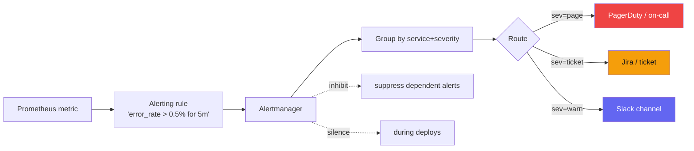

> Phase 9 • Production Craft • Topic 62/74

## Definition (interview-ready)

**Symptom-based alerts** fire on user-visible problems (error rate, latency breach, SLO burn). **Cause-based alerts** fire on root-cause signals (CPU high, disk full, queue depth). The Google SRE preference: **alert on symptoms; track causes in dashboards.** This minimizes false positives and aligns alerts with user impact.

## Why it matters

Alert fatigue (too many pages, mostly noise) is the #1 killer of on-call quality and the leading indicator of incident response problems. Every senior engineer needs to know how to design alerts that pass the "would I get out of bed at 3 AM for this?" test.



## Core concepts

### Symptom vs cause

- **Symptom**: "/checkout p99 > 2s for 5 min." Users feel this.
- **Cause**: "DB connections at 95%." Useful, but firing on cause when symptom is fine = false alarm.

Why prefer symptom-based:
- Aligns with user impact (SLO).
- Fewer false positives (cause without symptom = self-healed).
- Robust to changing systems (new cause shows up, your symptom alert still catches it).

When to use cause-based:
- **Early warnings** that prevent symptoms (disk full at 80%, escalate at 95%).
- **Operational hygiene** (certs expiring in 7 days).
- **Capacity planning** (saturation > 70%, plan growth).

### Severity tiers

- **P0 / page**: user-visible, needs immediate human response.
- **P1 / ticket**: needs response in business hours.
- **P2 / informational**: track in dashboard, no notification.

Most teams over-page; aim for 1-2 pages/on-call shift on average.

### SLO-based alerts

Best modern practice:
- Define SLO (Topic 61).
- Alert on **burn rate**: how fast the error budget is being consumed.
- Multi-window: fast burn (5-min window, page) + slow burn (1h window, ticket).

Standard 4-alert pattern:
1. **Fast burn high**: 5min × 14.4× rate → page (urgent, big incident).
2. **Fast burn medium**: 30min × 6× rate → page (smaller incident).
3. **Slow burn**: 6h × 1× rate → ticket (creeping issue).
4. **SLO breached**: budget = 0 → P0 incident.

### Alert hygiene

For every alert, ensure:
- **Clear title**: "checkout-svc p99 latency > 2s for 5 min."
- **Severity**: page / ticket / info.
- **Runbook link**: how to investigate and mitigate.
- **Owner**: which team responds.
- **Auto-resolve**: when the condition clears.

### Runbooks

A runbook is what the on-call reads at 3 AM:
1. What's the alert saying?
2. Is the user impact real? (Check dashboard.)
3. What are the first 3 things to check?
4. What's the rollback / mitigation?
5. Who to escalate to.

Without runbooks, every page is an archeology expedition.

### Anti-patterns

- **Per-host alerts**: 100 servers, any spikes → flood. Aggregate.
- **Disk full at 80% page**: hurry isn't urgent; ticket.
- **Alerts on internal metrics**: CPU% > 90% pages, but service is fine.
- **Cause alerts without symptom check**: noise.
- **Alerts no one acts on**: delete them.
- **No deduplication**: 100 services, same downstream issue → 100 pages.
- **No rate limit on pager**: cascading failure → 1000 pages in a minute.

### Mute / inhibit / silence

- **Silence**: temporary stop (maintenance window, known issue).
- **Inhibit**: an alert suppresses related ones (DB down → don't fire dependent service alerts too).
- **Group by**: cluster related alerts into one notification.

Alertmanager (Prometheus) supports all of these.

### Escalation policies

- First page: primary on-call.
- After 5 min unacknowledged: secondary.
- After 15 min: manager.
- Tools: PagerDuty, Opsgenie, VictorOps.

### Synthetic monitoring

Active probes from outside your network: hit known endpoints, expect known responses. Catch "user-visible" issues even before real user traffic does.

Tools: Pingdom, Datadog Synthetics, custom canaries.

### Anomaly detection

ML-based alerts: detect deviations from learned baselines.

Pros: catches things you didn't think to alert on.
Cons: false positives during real changes (legitimate spikes); harder to debug; less interpretable.

Use sparingly, alongside threshold-based.

## How it works (typical incident flow)

```
1. SLO burn rate alert fires (symptom).
2. On-call's phone rings.
3. Acknowledges in PagerDuty.
4. Opens runbook from alert.
5. Checks dashboards: which service degraded?
6. Traces to find slowest hop.
7. Decides: rollback, scale, restart, escalate?
8. Mitigates.
9. Alert auto-resolves when SLO recovers.
10. Files incident report; schedules post-mortem.
```

## Real-world examples

- **Google SRE**: pioneered symptom-based alerting + error budget approach.
- **Stripe**: famously rigorous about minimizing pages.
- **Netflix**: chaos engineering exposes alert gaps regularly.
- **GitHub**: public status page reflects symptom-based detection.

## Common pitfalls

- **Alert fatigue**: people start ignoring. Audit and prune.
- **No runbooks**: every page = scramble.
- **Severity inflation**: everything is P0 → nothing is.
- **Stale alerts**: thresholds from 2020 in a 2026 system. Periodic review.
- **Alerts without ownership**: orphan pages wake random people.
- **Compound alerts during incidents**: cascading fan-out. Use inhibit/group.
- **Synthetic monitoring from same data center**: blind to network issues outside.

## Interview questions

### Q1: Why prefer symptom-based alerts?
They align with user impact (what matters). They're robust to changing causes — you can refactor internals without rewriting alerts. They reduce false positives (a cause without symptom is often self-healed). Cause alerts have a place for early warning, but the page-worthy ones should be symptoms.

### Q2: How would you design alerts for a service with an SLO of 99.9%?
Multi-window, multi-burn-rate:
- 5min × 14.4× error budget burn → page.
- 30min × 6× burn → page.
- 6h × 1× burn → ticket.
- Plus a few cause-based early warnings (saturation > 70% → ticket).
- Each alert linked to a runbook with concrete steps.

### Q3: A team has 200 alerts daily. How do you fix?
- Audit: which fire, which lead to action, which are ignored?
- Delete unactionable.
- Convert per-host to per-service aggregates.
- Move cause-based pages to tickets unless they prevent imminent symptoms.
- Tier severities; only true P0 pages.
- Every remaining alert: runbook + ownership.

### Q4: Difference between silence, inhibit, and group?
Silence: temporary off (maintenance, known issue). Inhibit: one alert suppresses related ones (parent alert hides children). Group: combine multiple alerts into one notification (e.g., "5 endpoints degraded" instead of 5 separate pages).

### Q5: What's a runbook and what should it contain?
A document the on-call reads when an alert fires:
1. Alert meaning.
2. How to verify user impact.
3. Diagnostic steps (where to look).
4. Common causes + remediations.
5. Rollback procedure.
6. Escalation contacts.

Without runbooks, every page is solved from scratch.

### Q6: How do you handle alert storms during a cascading failure?
- Inhibit rules: if DB is down, suppress dependent service alerts.
- Grouping: many related alerts → one notification.
- Throttling: limit notifications per minute.
- Aggregate alerts: cluster level rather than service level for huge outages.
- Status page: communicate one issue to customers, not 50.

### Q7: When are cause-based alerts useful?
Early warnings before symptoms: disk filling, certs expiring, saturation rising, queue piling up. These let you act before users feel pain. Use as ticket severity, not page, unless they portend imminent failure.

### Q8: How do you measure alerting quality?
- **Pages per shift**: aim for 1-2 average; > 5 = fatigue.
- **% of pages leading to action**: > 50% target.
- **Mean time to detect (MTTD)**: how fast did we know?
- **Mean time to mitigate (MTTM)**: how fast did we fix?
- **% of incidents detected by users before alerts**: should be < 10%.
- Periodic on-call retros to surface bad alerts.

## TL;DR cheat sheet

- **Symptom > cause** for pages. Cause for early-warning tickets.
- **SLO burn-rate alerts** are the gold standard.
- **Multi-window, multi-burn-rate**: fast burn = page, slow burn = ticket.
- Every alert has: severity, runbook, owner, auto-resolve.
- Inhibit + group + silence to control storms.
- Audit + prune alerts regularly.
- 1-2 pages per shift is the target.
- Runbooks reduce 3 AM scrambling.

## Go deeper

- **Google SRE Book Ch. 6**: ["Monitoring Distributed Systems"](https://sre.google/sre-book/monitoring-distributed-systems/).
- **Google SRE Workbook Ch. 5**: ["Alerting on SLOs"](https://sre.google/workbook/alerting-on-slos/).
- **Alertmanager docs**: silences, inhibitions, grouping.
- **PagerDuty Incident Response docs**: severity tiers, escalation.
- **Charity Majors**: ["Stop Using Cause-Based Alerts"](https://www.honeycomb.io/blog).
- **Topic 61** in this collection (SLOs).
