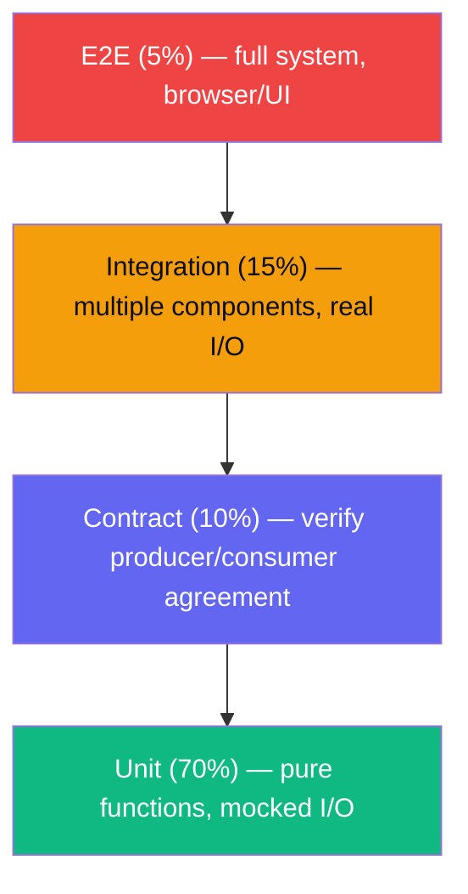
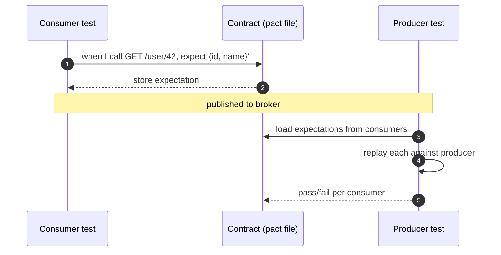

# 71 — Testing Pyramid + Contract Tests

> Phase 9 • Production Craft • Topic 71/74

## Definition (interview-ready)

The **testing pyramid** (Mike Cohn) prescribes more **unit** tests, fewer **integration** tests, even fewer **end-to-end (E2E)** tests — because cost and time scale upward while reliability scales downward. **Contract tests** are a specialized form that verifies the agreement between a producer (an API) and a consumer (its caller) without running both end-to-end.

## Why it matters

Without a coherent test strategy, you either ship bugs (too few tests) or move at the speed of glaciers (too many flaky, slow E2E tests). Knowing the pyramid prevents the most common anti-pattern in test suites: bloated, slow, fragile, and (worst) ignored.





## Core concepts

### The pyramid

```
            /‾‾‾‾‾\
           |  E2E  |   few, slow, expensive
           |-------|
           | Integ |   moderate
           |-------|
           |       |
           | Unit  |   many, fast, cheap
           ‾‾‾‾‾‾‾‾‾
```

- **Unit**: test a single function/class in isolation. Fast (ms each). High coverage of logic.
- **Integration**: tests across modules / against real DB / real downstream. Slower (seconds). Confirms wiring.
- **E2E**: full system, real or near-real env. Slowest. Confirms the user flow works.

Roughly: 70% unit, 20% integration, 10% E2E.

### Why this shape?

- Unit tests are fast → run on every save / every PR → fast feedback.
- E2E tests are slow → only practical to run on a small set of critical flows.
- Inverting the pyramid → slow CI, flaky tests, fragile suite.

### Anti-patterns

- **Ice cream cone**: lots of E2E, few unit. Slow CI, hard to diagnose failures.
- **Hourglass**: many unit + many E2E, no integration. Wiring bugs slip past unit, surface as flaky E2E.
- **No tests**: bugs ship to prod.

### Unit tests

- Mock or stub external dependencies (DB, HTTP).
- Test public interface, not internals.
- Single assertion focus (one behavior per test).
- Fast: < 100 ms per test.
- Examples: pure functions, business logic, edge cases.

### Integration tests

- Real DB (test container or in-memory equivalent), real HTTP servers (within process).
- Verify cross-component behavior.
- Slower: seconds per test.
- Examples: repository methods against a real DB, controller-to-service-to-DB chains.

### E2E tests

- Full system in a near-production environment.
- Tools: Cypress, Playwright (browser), Postman/Newman (API).
- Focus on **critical user journeys**, not every UI button.
- Examples: "user signs up, logs in, completes checkout."

### Contract tests

A pact between a **consumer** (e.g., mobile app) and a **provider** (e.g., backend API). Tests both sides match without running them together.

**Consumer-driven contract tests** (Pact framework):
1. Consumer writes its expectations: "When I call GET /user/42, I expect { id, name, email }."
2. Pact framework generates a "contract" file (JSON).
3. Provider runs tests against the contract: "Can I satisfy this consumer's expectation?"
4. If provider changes its API, its tests fail → know before deploy.

Use cases:
- Microservices: many consumers per provider; avoid running all consumers in CI.
- API + frontend: confirm shape without E2E.
- Cross-team API agreements.

### Property-based testing

- Don't write `assert function(2) == 4`; instead: `for all integers n, function(n) == n * 2`.
- Tools: QuickCheck (Haskell), Hypothesis (Python), fast-check (JS).
- Finds edge cases unit tests miss (negatives, edge integers, weird strings).

### Snapshot tests

- Capture output once; subsequent runs compare to snapshot.
- Useful for: rendered UI components, generated config.
- Beware: easy to commit a wrong snapshot ("looks fine, ship it").

### Mutation testing

- Tool intentionally modifies your code (e.g., flips `<` to `>`); runs your tests.
- If tests still pass, your tests aren't catching the mutation.
- Reveals weak tests. Tools: Stryker (JS), Pitest (Java).

### Test doubles

- **Stub**: returns canned data.
- **Mock**: verifies interaction (e.g., "was this method called once?").
- **Fake**: lightweight working implementation (in-memory DB).
- **Dummy**: placeholder, never used.

Prefer **fakes** over mocks where possible — closer to real behavior, less brittle.

### Test data management

- Fresh DB per test (test containers) or transaction rollback.
- Factory / fixture libraries (FactoryBot in Ruby, factory_boy in Python).
- Don't share state across tests.
- Seed minimal data; test sets up what it needs.

### Flakiness

A flaky test = passes sometimes, fails sometimes, same code. Kills trust in the suite. Causes:
- Time-dependent (timezone, clock).
- Order-dependent (state leak).
- Concurrency (race condition).
- Network/external (rely on flaky service).

Fix or **delete** flaky tests; they're worse than no tests.

### Test pyramid for backends

- 70% unit: business logic, data transformations, validators.
- 20% integration: DB, message bus, third-party stubs.
- 5-10% E2E: critical workflows (sign-up, payment, key feature).
- + Contract tests at the boundary between services.

### Test coverage

- Goal: catch important behaviors, not "100% line coverage."
- Coverage % is a proxy; can be gamed.
- Useful: identify untested code paths; flag PRs that drop coverage by > 5%.

## How it works (consumer-driven contract test with Pact)

```
Consumer (frontend) test:
  - Set up Pact mock provider.
  - "When I GET /api/user/42 → expect 200 + body { id, name }."
  - Run consumer code against mock.
  - Pact writes pacts/frontend-backend.json.

Pact broker:
  - Stores contracts.
  - Provider's CI fetches them.

Provider (backend) test:
  - "Replay the contract: does my real API return what consumer expects?"
  - Provider runs the contract test with its real handler.
  - Pass / fail per contract.

Provider CI fails if it would break consumer → safe to deploy.
```

## Real-world examples

- **Google**: famously rigorous test pyramid; uses Bazel for parallel execution.
- **Pact** (open-source from Realestate.com.au): de facto consumer-driven contract framework.
- **Microsoft (Azure)**: extensive contract testing across services.
- **Netflix**: chaos engineering as continuous E2E.

## Common pitfalls

- **Too many E2E, too few unit**: slow CI, flaky failures.
- **Mocking everything**: tests pass but app breaks (mocks don't match reality).
- **Shared mutable state**: order-dependent tests.
- **Ignoring flakiness**: people stop trusting CI.
- **"100% coverage" obsession**: write tests of trivial accessors instead of meaningful behavior.
- **No contract tests in microservices**: API changes break consumers silently.
- **Test data tied to dev DB**: can't run independently.

## Interview questions

### Q1: Explain the testing pyramid.
Bottom: many fast unit tests. Middle: fewer integration tests. Top: few E2E. Cost and time scale up the pyramid; coverage and feedback speed go down. Aim 70/20/10 unit/integration/E2E. Inverting (more E2E) leads to slow, flaky CI.

### Q2: When would you write a contract test instead of an E2E test?
When you want to verify the API agreement between two services without running both end-to-end. Faster, more isolated, scales to many consumers. E2E covers user flows; contract covers integration shape.

### Q3: How does Pact work?
Consumer writes expectations about provider's API; Pact framework generates a contract (JSON). Provider replays the contract against its real implementation. If consumer's expectations no longer match provider's behavior, the test fails. Catches breaking API changes before deploy.

### Q4: What's the difference between a mock and a stub?
Stub: returns canned data ("when called, return X"). Mock: verifies interaction ("was this method called once with these args?"). Stubs answer "what does dependency return"; mocks answer "did we call dependency correctly." Often used together.

### Q5: Flaky test — how to handle?
- Investigate the cause: timezone, order, race, external dependency.
- Fix the root cause if you can.
- Quarantine (run separately, allow failures) while investigating.
- Delete if can't be fixed and not catching real bugs. Better no test than a misleading one.

### Q6: How would you test a payment service?
- Unit: business logic (fee calc, validation, state transitions). Lots.
- Integration: against test DB, mock payment provider. Verify state writes.
- Contract: between payment service and consumers (orders, refunds).
- E2E: complete checkout flow, sandbox provider, on a few key paths.
- Property-based: invariants like "balance never negative."
- Chaos / load test: provider down, network partition.

### Q7: A 30-min E2E suite is too slow. How to reduce?
- Audit: which tests catch which bugs? Many are redundant.
- Move logic-heavy tests to unit; keep E2E for critical paths.
- Parallelize: split into shards across CI runners.
- Selective runs: only run E2E for changes touching certain areas.
- Cut flaky tests.

### Q8: How do you test code that calls external APIs?
- Unit: mock the API client; test your wrapping logic.
- Integration: use a recorded "VCR" cassette (record real responses, replay) — Polly.JS, VCR-Ruby. Or a local fake server (WireMock).
- Contract: verify the external API's actual shape periodically.
- Avoid: hitting the real third-party API in CI (rate limits, flakiness, cost).

## TL;DR cheat sheet

- Pyramid: many **unit** (70%), fewer **integration** (20%), fewest **E2E** (10%).
- Cost ↑ and feedback time ↑ as you go up.
- **Contract tests** between services (Pact) catch API breaks without E2E.
- **Property-based** for invariants.
- **Mutation testing** to assess test quality.
- Fakes > mocks where practical.
- Kill flaky tests.
- Don't chase 100% coverage; chase meaningful tests.

## Go deeper

- **Martin Fowler**: ["Practical Test Pyramid"](https://martinfowler.com/articles/practical-test-pyramid.html).
- **Pact docs**: [docs.pact.io](https://docs.pact.io/).
- **Mike Cohn**: *Succeeding with Agile* — origin of the pyramid.
- **Book**: *Working Effectively with Unit Tests* (Jay Fields).
- **Property-based**: Hypothesis (Python), fast-check (JS), QuickCheck (Haskell).
- **Mutation testing**: Stryker, Pitest.
- **Testcontainers**: real DB/services in tests.
