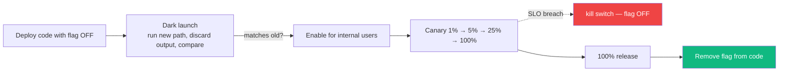
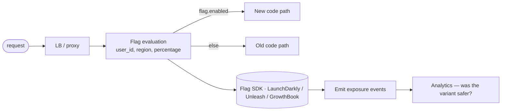

# 72 — Feature Flags, Canary Deploys, Dark Launches

> Phase 9 • Production Craft • Topic 72/74

## Definition (interview-ready)

**Feature flags** are runtime switches that gate code paths, decoupling deploy from release. **Canary deployment** sends a small fraction of traffic to a new version, monitors, then expands. **Dark launch** runs new code in production without exposing it to users (shadow traffic, internal-only, hidden UI). Together: ship code safely with the ability to roll back without redeploying.

## Why it matters

The biggest cause of production incidents is "this deploy broke something." Feature flags + canary + dark launch separate the **risk of deploying code** from the **risk of releasing a feature**. Top-tier teams ship many times a day because of these patterns; teams without them ship cautiously and slowly.





## Core concepts

### Feature flags

A conditional in code:

```python
if flags.is_enabled("new_search_algo", user=current_user):
    return new_search(query)
else:
    return legacy_search(query)
```

The flag value is fetched from a remote config service at runtime. Change the flag → behavior changes without redeploy.

#### Types

- **Release flags**: short-lived, gate new code until ready.
- **Experiment flags**: A/B test variants.
- **Ops flags**: emergency kill switches (disable a feature in incidents).
- **Permission flags**: feature available only to certain users (beta testers, paid plans).
- **Long-lived configuration**: borderline — at some point it's just config.

### Lifecycle of a flag

1. **Create**: scaffold the flag in code + tooling.
2. **Roll out**: enable for 1%, 10%, 50%, 100% of users.
3. **Cleanup**: when flag is 100% and stable, remove the conditional + delete the flag.

**Flags accumulate technical debt.** A team with 200 active flags has a complicated codebase. Schedule cleanups.

### Canary deployment

Gradually ramp traffic to a new version:
- Deploy v2 alongside v1 (separate instances).
- Route 1-5% of traffic to v2.
- Monitor SLOs, error rates, latency.
- If healthy: 25% → 50% → 100%.
- If unhealthy: revert all traffic to v1, investigate.

Often implemented via:
- Service mesh (Istio, Linkerd) traffic splitting.
- Ingress controller weighted routing.
- Argo Rollouts / Flagger for k8s.
- LB weighted target groups.

### Blue-green deployment

Two complete environments — **blue** (current) and **green** (new). Cut over traffic from blue to green when ready. Easy rollback (switch back). Resource-intensive (double infra during transition).

### Dark launch

Run new code in production without users seeing it:
- **Shadow traffic**: send a copy of real requests to new code; compare results offline; users get the old code's response.
- **Hidden UI**: code is live, UI element not exposed.
- **Internal users only**: employees test in prod.

Useful for validating performance and correctness at scale before exposing to users.

### Progressive delivery

The umbrella term: feature flags + canary + dark launch + automated promotion. Combine to deploy code "to everyone in dev, behind flag" and roll out gradually with monitoring + auto-rollback.

### Targeting / segmentation

Flags can target:
- Percentage of users (random).
- Specific users (admins, beta testers).
- User attributes (country, plan, role).
- Sticky: same user always sees same variant (consistent UX).

```python
flags.is_enabled("new_checkout", user_id=42, country="IN", plan="pro")
```

### A/B testing

Same as experiment flags + analytics:
- Variant A vs B.
- Measure metric (conversion, engagement, latency).
- Statistical significance.
- Pick winner.

### Auto-rollback

CI/CD measures SLO during canary; if breached, revert traffic to old version automatically. Combine with feature flags: a bad path triggers flag-off without redeploy.

### Vendor tools

- **LaunchDarkly**: market leader; full-featured.
- **Optimizely**: A/B + flags.
- **Split.io**: flags + experimentation.
- **Unleash**: open-source.
- **GrowthBook**: open-source + experimentation.
- **Statsig**: experimentation + flags + product analytics.
- Roll-your-own (DB + cache + SDK): viable for small teams.

### Common patterns

#### Kill switch
```python
if flags.is_enabled("disable_payments"):
    return error("Payments temporarily disabled")
```
On incidents, flip the switch — fast mitigation.

#### Gradual feature rollout
```python
if flags.is_enabled("new_algo", percentage=10):  # 10% rollout
    new_algo(...)
```

#### Backward compatibility
Keep both code paths; deprecate old after rollout complete.

#### Experimentation
```python
variant = flags.get_variant("checkout_layout", user_id, default="A")
render(variant)
analytics.log("checkout_view", variant=variant, user_id=user_id)
```

## How it works (a canary rollout)

```
1. Deploy v2 to 1 pod alongside v1 (which has 20 pods).
2. Service mesh / ingress configured: 5% traffic to v2.
3. Monitor for 15 min: error rate, p99 latency, business metrics.
4. If healthy: shift to 25% (5 pods of v2, scaled down v1).
5. Continue: 50% → 100%.
6. If unhealthy at any step: rollback all to v1.
7. Argo Rollouts / Flagger automates this.
```

## Real-world examples

- **Facebook**: pioneered feature flags at scale; everything behind flags.
- **Netflix**: chaos engineering + canary as continuous practice.
- **Google**: rollout to small fraction of users by experiment ID.
- **Microsoft**: feature flags in Windows Insider builds.
- **Stripe**: rigorous canary + auto-rollback.

## Common pitfalls

- **Flag debt**: hundreds of stale flags clutter code.
- **No cleanup**: flag is 100% but conditional stays forever.
- **Flags as configuration**: blurs purpose; lifecycle is unclear.
- **No sticky bucketing**: user flickers between variants → bad UX.
- **No monitoring per variant**: don't know if rollout is OK.
- **Flag service as SPOF**: if flag service is down, default to safe behavior (usually old).
- **Testing only one variant**: untested code path waits for production.
- **No canary observability**: you'd never know if canary breaks.

## Interview questions

### Q1: Why decouple deploy from release?
Deploying code != exposing feature. You can deploy dark code, run canaries, ship features to subsets of users — all reducing risk per deploy. Without this, every deploy is "release" — high stakes, hence slow.

### Q2: Walk through a canary deployment.
Deploy v2 alongside v1. Route small % (1-5%) of traffic to v2. Monitor SLOs and key metrics. If healthy, expand: 25%, 50%, 100%. If unhealthy, rollback traffic to v1 — code is still deployed for inspection. Common tooling: Argo Rollouts, Flagger, service mesh, LB weighting.

### Q3: When use feature flags vs canary?
Both, often together. Feature flags: per-user/per-feature control, applied within the running code. Canary: per-traffic-percentage control, applied at the LB / mesh. Use feature flag to switch behavior; use canary to gradually expose code. Many teams ship: deploy with flag off (dark code) → canary → enable flag for 1% → ramp.

### Q4: Pitfalls of feature flags?
- Code complexity (every conditional adds branches).
- Stale flags (forgotten conditionals).
- Hard to test all permutations (N flags → 2^N combinations).
- Flag service can be SPOF.
- Misuse as configuration without lifecycle.

### Q5: How do you do A/B testing?
Assign users to variants (sticky, consistent). Render different code/UI. Measure target metric (conversion, retention, etc.). Compute statistical significance. Pick winner. Tools: Optimizely, GrowthBook, LaunchDarkly, Statsig.

### Q6: Design a feature flag service from scratch.
- **Storage**: flag definitions (rules, percentages) in a config DB.
- **Cache**: each app instance caches flags + refreshes every 30s.
- **SDK**: language-specific clients with consistent bucketing (hash user_id + flag_name for sticky).
- **API**: admin UI for changes.
- **Audit**: every change logged.
- **Defaults**: SDK falls back to safe default if service unreachable.
- **Real-time push** (optional): WebSocket / SSE for instant propagation of critical changes.

### Q7: A canary deploy is healthy at 5% but errors spike at 50%. Why?
- Hot keys / cache stampede at higher load.
- Connection pool / thread pool exhaustion.
- Latent bug exercised only by specific traffic patterns (e.g., admin users land disproportionately at 50%).
- Time-of-day effects (5% during low traffic, 50% during peak).
- Tail-latency multiplied at scale.

Fix: more conservative ramps, better canary observability, load tests.

### Q8: How to clean up flag debt?
- Audit: list active flags + last change date.
- Owner per flag.
- Default action: if flag is 100% for > 30 days, schedule removal.
- Automate: linter that flags conditionals on long-since-100% flags.
- Make removal a PR: small, scoped, reviewed.
- Track flag count as a metric.

## TL;DR cheat sheet

- **Feature flag** = runtime switch; deploy != release.
- **Canary** = % traffic to new version; ramp + monitor + auto-rollback.
- **Blue-green** = two full envs; switch cutover.
- **Dark launch** = run in prod without users seeing.
- Combine for **progressive delivery**.
- Targets: percentage, user attributes, sticky.
- Use kill switches for emergency mitigation.
- Schedule **flag cleanup**; flag debt is real.
- Vendor tools: LaunchDarkly, Optimizely, Split, GrowthBook, Statsig.

## Go deeper

- **Martin Fowler**: ["Feature Toggles"](https://martinfowler.com/articles/feature-toggles.html).
- **LaunchDarkly blog**: progressive delivery content.
- **Flagger / Argo Rollouts** docs.
- **Etsy engineering**: deployinator and feature flagging stories.
- **Pete Hodgson**: posts on feature flag patterns.
- **Book**: *Continuous Delivery* (Humble, Farley).
- **GrowthBook docs**: open-source experimentation.
