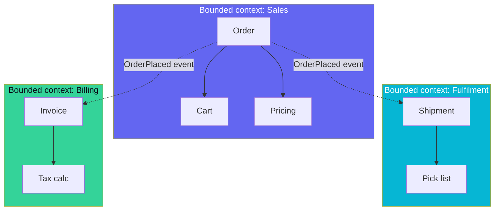

# 73 — DDD Basics: Bounded Contexts, Aggregates

> Phase 9 • Production Craft • Topic 73/74

## Definition (interview-ready)

**Domain-Driven Design (DDD)** is a software-design approach centered on a deep model of the business domain. Key concepts:
- **Bounded context**: a portion of the system with its own consistent model and ubiquitous language.
- **Ubiquitous language**: shared vocabulary between developers and domain experts.
- **Aggregate**: a cluster of objects treated as a unit; an **aggregate root** is the entry point for changes.
- **Entity / Value object**: things with identity vs things defined by their values.
- **Domain event**: something significant that happened in the domain.



## Why it matters

DDD's tactical patterns (aggregates, entities, repositories) clarify code structure; its strategic patterns (bounded contexts, ubiquitous language) drive microservice boundaries, team boundaries, and API design. Most "microservices but everything's coupled" problems trace to ignoring DDD's strategic principles.

## Core concepts

### Bounded context

A consistent model within a clear boundary. Different bounded contexts may use the same word with different meanings:
- "Order" in **Sales context**: a request to purchase, with line items, payment intent, customer info.
- "Order" in **Fulfillment context**: a shipping unit with weight, dimensions, carrier, tracking number.
- "Order" in **Billing context**: a financial record with invoice number, tax, paid amount.

Same noun, different shape, different lifecycle. **Don't try to unify them** into one model — that's the path to ProductionMonolith.

### Context map

Diagram showing relationships between bounded contexts:
- **Partnership**: two teams co-design.
- **Customer-supplier**: upstream provides; downstream depends; coordination needed.
- **Conformist**: downstream accepts upstream's model as-is.
- **Anticorruption layer (ACL)**: translation layer protecting downstream from upstream's model.
- **Open Host Service**: published API for many consumers.
- **Published Language**: standard format (e.g., events) shared by multiple contexts.
- **Separate ways**: contexts choose not to integrate.

Useful for designing inter-service contracts.

### Ubiquitous language

The shared vocabulary used in conversations, code, docs. Developer says "Order" and domain expert understands — code's `class Order` reflects what the business calls it. No translation layer between conversation and code.

If you find yourself translating ("the user means X but we call it Y"), you have a model problem.

### Entity vs value object

- **Entity**: has identity that persists over time. `Customer(id=42)` is the same customer whether name changes or not.
- **Value object**: defined by its values. `Money(100, USD)`, `Address(...)`, `DateRange(start, end)`. Immutable. Two value objects with same values are interchangeable.

Rule of thumb: anything you'd query by id is an entity; anything you'd compare by `==` on values is a value object.

### Aggregate

A cluster of objects treated as a unit. One **aggregate root** is the entry point for all reads/writes through the aggregate.

Example:
```
Order (root)
├── OrderLine (child)
├── OrderLine
└── ShippingAddress (value object)
```

Outside code can only reference the root (`Order`). Changes to children go through the root (`order.addLine(...)`).

#### Rules

1. **One aggregate per transaction**: a transaction modifies one aggregate; cross-aggregate changes use domain events.
2. **Strong consistency within aggregate**: enforced atomically.
3. **Eventual consistency between aggregates**.
4. **Aggregate as DB transaction boundary**: typically.

Why: keeps transactions small, scales horizontally, avoids cross-aggregate locking.

#### Sizing

- Too big: long transactions, contention.
- Too small: hard to enforce invariants.
- Sweet spot: smallest aggregate that maintains its invariants.

### Domain event

Something significant happened: `OrderPlaced`, `PaymentFailed`, `InventoryReserved`.

- Past-tense.
- Carries enough data for consumers.
- Published after aggregate change commits.
- Consumed by other contexts (via Kafka / outbox).

### Repository

Abstracts persistence. Code uses `OrderRepository.find(id)` and `OrderRepository.save(order)`; doesn't know about SQL.

### Domain service

When logic doesn't naturally belong to one entity, put it in a **domain service** — stateless, named after a domain concept (`PricingService`, `TaxCalculator`).

### Anticorruption layer (ACL)

Translation between your model and an external model (legacy system, third-party API). Your code uses your model; ACL translates at the boundary.

Use case: integrating with a legacy ERP whose data model is ugly. Don't pollute your code; build an ACL.

### Event storming

Workshop method (Alberto Brandolini) for discovering bounded contexts:
- Sticky notes on a wall.
- Domain events (orange) in time order.
- Commands (blue) that trigger events.
- Aggregates (yellow) grouped by responsibility.
- Bounded contexts emerge from clusters.

Excellent for kicking off a new system or refactor.

## How it works (designing checkout)

```
Events:
  ItemAddedToCart, CheckoutInitiated, OrderPlaced,
  PaymentAuthorized, PaymentCaptured, OrderShipped, OrderDelivered

Bounded contexts identified:
  - Cart: ItemAdded, CheckoutInitiated.
  - Order: OrderPlaced.
  - Payment: PaymentAuthorized, PaymentCaptured.
  - Fulfillment: OrderShipped, OrderDelivered.

Each context has its own aggregates:
  - Cart (cart_id, line items, customer_ref).
  - Order (order_id, lines, status).
  - Payment (payment_id, amount, status).
  - Shipment (shipment_id, carrier, status).

Cross-context coordination via domain events on Kafka (or outbox).
Each context's "Order" is shaped to its needs.
```

## Real-world examples

- **Shopify**: bounded contexts loosely map to their pod structure (modular monolith).
- **Amazon**: famous two-pizza teams roughly = bounded contexts.
- **Uber**: trips, payments, fulfillment as distinct contexts.
- **DDD adopters at scale**: Stripe (engineering blog), Stripe's "Working Backwards" doc culture.

## Common pitfalls

- **One God model** for the whole company: "the Customer" with 100 fields, used by every service.
- **Anemic domain model**: entities are dumb data bags; logic in services. (Just procedural with extra steps.)
- **Aggregates too big**: contention, slow transactions.
- **Aggregates referencing each other by object**: introduces transactional coupling. Use IDs instead.
- **No ubiquitous language**: developers use one term, business another → translations errors.
- **Microservices without bounded contexts**: distributed monolith.

## Interview questions

### Q1: What's a bounded context?
A boundary within which a domain model is consistent and coherent. Different bounded contexts can use the same word (Order, Customer) with different shapes and lifecycles. Aligns with microservice / team boundaries in practice.

### Q2: What's an aggregate?
A cluster of objects treated as a single unit for consistency. The **aggregate root** is the entry point — external code only references the root. Changes go through it. One aggregate per transaction; cross-aggregate eventual consistency.

### Q3: Difference between entity and value object?
Entity has identity (Customer(id=42) is the same customer even if attributes change). Value object is defined by its values (Money(100, USD), Address). Two value objects with same values are equivalent. Value objects are immutable.

### Q4: How does DDD inform microservice design?
Bounded contexts often map 1:1 with microservices. Aggregates suggest natural transaction boundaries. Ubiquitous language ensures the service's API uses the right terms. Context maps describe inter-service relationships and integration patterns.

### Q5: What's an anticorruption layer?
A translation layer between your bounded context and an external system's model. Lets you use your clean model internally while integrating with messy externals (legacy systems, third-party APIs). Protects your design from external rot.

### Q6: Why "one aggregate per transaction"?
- Keeps transactions small → less contention.
- Aggregates can be sharded across DBs.
- Cross-aggregate via domain events → loosely coupled.
- Forces explicit design of cross-aggregate consistency (eventual, sagas).

### Q7: A team has a Customer model with 80 fields used by every service. Critique.
- Likely not respecting bounded contexts; different parts of the business need different shapes.
- Coupling: changes ripple everywhere.
- Performance: load 80 fields even when 5 are needed.
- Privacy: PII fields accidentally exposed in non-PII services.

Fix: identify contexts; each owns its slice of "customer." Share a stable identifier (customer_id) and integrate via events.

### Q8: How to do event storming?
Group of devs + domain experts. Whiteboard or virtual canvas.
1. Domain events on orange stickies, in time order.
2. Commands (blue) that produced each event.
3. Actors (yellow) executing commands.
4. Aggregates (yellow groups) emerge from related events.
5. Bounded contexts (lines on whiteboard) cluster aggregates.
6. Issues/questions surface naturally.

Output: a domain map and shared understanding.

## TL;DR cheat sheet

- **Bounded context**: boundary of a coherent model.
- **Ubiquitous language**: same vocab in code and conversation.
- **Entity**: has identity. **Value object**: defined by values, immutable.
- **Aggregate**: cluster of objects with one root entry point.
- **One aggregate per transaction**; eventual consistency between.
- **Domain events**: past-tense facts, propagated cross-context.
- **ACL**: translate at boundaries with messy externals.
- **Event storming**: collaborative discovery workshop.
- Microservices ≈ bounded contexts (mostly).
- Avoid anemic models and god aggregates.

## Go deeper

- **Eric Evans**: *Domain-Driven Design* — the "Blue Book."
- **Vaughn Vernon**: *Implementing Domain-Driven Design* — practical follow-up.
- **Alberto Brandolini**: *Introducing EventStorming* + blog.
- **Martin Fowler**: ["DomainDrivenDesign"](https://martinfowler.com/bliki/DomainDrivenDesign.html).
- **Sam Newman**: *Building Microservices* — strategic DDD applied to service boundaries.
- **Pluralsight / Udemy** DDD courses.
- **Topic 29** (microservices vs monolith) in this collection.
