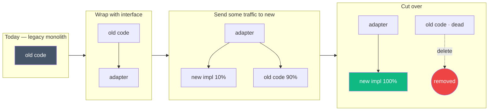

# 74 — Refactoring Patterns + Tech Debt Management

> Phase 9 • Production Craft • Topic 74/74

## Definition (interview-ready)

**Refactoring** is improving the internal structure of code without changing its external behavior. **Tech debt** is the implied cost of additional rework caused by choosing an easy/quick solution now instead of a better approach. Healthy teams continuously refactor and consciously manage debt — paying it down deliberately rather than waiting for catastrophic failure.

## Why it matters

Every codebase accumulates debt; what differs is how teams respond. Teams that ignore debt slow down progressively until they can't ship. Teams that refactor continuously keep velocity high for years. Refactoring is the practical skill; debt management is the discipline.



## Core concepts

### Refactoring (Fowler's definition)

> Disciplined technique for restructuring an existing body of code, altering its internal structure without changing its external behavior.

Key property: **behavior preservation**. Refactoring + tests = safe restructuring.

### Common refactorings

#### Method-level
- **Extract method**: pull a block into a named method.
- **Inline method**: when a method's body is as clear as its name.
- **Rename**: make names match concepts (a small change with big impact).
- **Replace temp with query**: replace a local variable with a method call.
- **Introduce parameter object**: bundle related parameters.

#### Class-level
- **Extract class**: when a class does two things.
- **Move method/field**: between classes.
- **Replace inheritance with delegation**: composition over inheritance.
- **Extract interface**: separate abstraction.

#### Design-level
- **Replace conditional with polymorphism**: a switch on type → subclasses.
- **Replace nested conditional with guard clauses**: flatten if/else nesting.
- **Replace null with null object** or Option/Maybe.
- **Introduce strategy pattern**: extract behavioral variants.

#### System-level
- **Strangler fig**: gradually replace a legacy system by routing new functionality to a new system while old continues.
- **Branch by abstraction**: introduce abstraction, swap implementations.
- **Expand-and-contract** (Topic 33): for schema/API changes without big-bang releases.

### Code smells (Fowler)

Signs that refactoring may be needed:
- **Long method**: > ~20 lines often hard to follow.
- **Large class**: doing too many things.
- **Long parameter list**: bundle into objects.
- **Duplicated code**: extract method or shared utility.
- **Feature envy**: one class accessing another's data heavily — move the method.
- **Data clumps**: groups of variables always passed together — make a value object.
- **Primitive obsession**: string for everything (use a small typed wrapper).
- **Switch statement on type**: polymorphism.
- **Shotgun surgery**: one change touches many files — consolidate responsibility.
- **Comments**: often a smell — code should be self-explanatory; comments compensate.

### Test before refactor

The premise of refactoring: tests give you confidence behavior didn't change. If tests are missing:
1. Add **characterization tests** first (tests that document current behavior, even if quirky).
2. Then refactor.
3. As you refactor, improve tests.

### Tech debt categorization

Ward Cunningham coined "debt" as a metaphor. Martin Fowler's quadrant:

|             | Reckless        | Prudent             |
|-------------|-----------------|---------------------|
| **Deliberate** | "We don't have time" | "Ship now; refactor later" |
| **Inadvertent** | "What's design?"   | "Now we know better"      |

- **Reckless deliberate**: knowing better, choosing worse.
- **Prudent deliberate**: conscious tradeoff (often justified for speed).
- **Reckless inadvertent**: ignorance.
- **Prudent inadvertent**: learning shows what we'd do differently.

Manage all four. Prudent debt is fine if you actually plan to pay it.

### Strategies for managing debt

#### Boy Scout rule

Leave the campground cleaner than you found it. Every PR that touches a file should improve it slightly — rename a variable, extract a small function, add a missing test.

Over time, the codebase improves silently.

#### Refactoring as part of feature work

Tie refactoring to features: "to add feature X, first refactor Y." Don't make standalone "refactor PR-only" sprints — they have no business justification and stall.

#### Tech debt sprints / 20% time

Some teams dedicate ~20% of capacity to debt reduction. Helps but is no substitute for continuous improvement.

#### Inventory and prioritize

Maintain a tech debt list:
- What is the debt?
- What does it cost (per week, per incident)?
- What does fixing it unblock?
- Effort vs payoff.

Pick the highest-impact items.

#### Strangler fig pattern

For legacy systems too big to rewrite:
1. Build new system alongside.
2. Route new requests to new system.
3. Migrate functionality incrementally.
4. Eventually decommission old.

Named after the strangler fig tree that grows around its host.

### Anti-patterns

- **Big rewrite**: re-implement from scratch. Almost always fails — you re-create bugs, lose institutional knowledge, drag on for years.
- **Refactor in a separate branch for months**: merge becomes impossible. Refactor in main, behind flags.
- **Refactor without tests**: behavioral regressions.
- **"Productivity dip"**: ignoring debt until it cripples velocity, then heroics.
- **No metric for debt**: invisible; never prioritized.

### Refactoring techniques in practice

#### Working with legacy code

(Michael Feathers' *Working Effectively with Legacy Code*)

- **Sprout method / class**: add new functionality in a new method/class; tested separately.
- **Wrap method**: wrap legacy with new behavior + delegate.
- **Identify seams**: places where you can inject test doubles to make code testable.

#### Test-driven development (TDD)

Red → Green → Refactor. Write failing test, make it pass minimally, refactor with safety. Produces well-tested, often well-factored code.

### Measuring debt

- **Code coverage**: low coverage = riskier refactors.
- **Cyclomatic complexity**: high in files = harder to maintain.
- **Code churn**: files changed frequently = candidates for refactoring.
- **Sentry / on-call frequency**: which areas cause most incidents?
- **PR cycle time**: getting slower = code resistance.
- **DORA metrics**: deployment frequency dropping is a debt signal.

## How it works (a strangler migration)

```
Year 0: Legacy monolith handles all requests.
Year 1: New service receives a subset (e.g., /v2/user/...) via routing.
Year 2: More functionality migrated, monolith shrinks.
Year 3: Monolith handles only legacy data lookups; new code added to new service.
Year 4: Monolith decommissioned; new system is the system.

Throughout: both systems run; tests cover both; team can roll back any step.
```

## Real-world examples

- **GitHub's Rails monolith**: incremental refactoring; haven't done a big rewrite, just continuous improvement.
- **Shopify**: refactoring + modular monolith; pods own modules.
- **Etsy**: famous for continuous delivery; constant small refactors.
- **Netflix**: refactored from monolith to microservices over years (not a big-bang rewrite).
- **Twitter's RoR-to-JVM migration**: years of strangler-style refactoring.

## Common pitfalls

- **Big rewrite**: kills velocity for years; often fails.
- **No tests + ambitious refactor**: bugs.
- **Refactoring in a parallel branch**: drift, merge pain.
- **Cosmetic-only refactoring**: rename without understanding → introduce bugs.
- **Refactor without aligning with product**: business doesn't see value; deprioritized.
- **"It's working, don't touch"**: until it isn't and then everyone's stuck.
- **Refactoring inside critical incidents**: don't. Stabilize, then refactor.

## Interview questions

### Q1: What's the difference between refactoring and rewriting?
Refactoring: changing internal structure without changing external behavior; small, frequent, safe (with tests). Rewriting: replacing significant chunks of code, may change behavior. Refactor often; rewrite rarely.

### Q2: How would you approach a legacy codebase you've inherited?
- Read; don't change immediately.
- Add tests where missing (characterization tests).
- Identify smells, but don't refactor everything at once.
- Use the Boy Scout rule: small improvements every PR.
- Tie larger refactors to feature work — pay debt with payoff.
- Watch for high-churn or incident-prone areas — refactor those first.

### Q3: When is rewriting actually justified?
- Technology is genuinely incompatible (e.g., dead framework, no upgrade path).
- Codebase is small enough to rewrite in weeks, not years.
- Business has explicitly scoped the rewrite as a project.
- Team has full understanding of current behavior (so it can be re-implemented).

For anything else: refactor incrementally. Big rewrites usually fail.

### Q4: What's the strangler fig pattern?
Build new system alongside legacy. Route some functionality to new system, gradually expanding. Legacy shrinks over time. Eventually decommissioned. Lets you migrate without big-bang risk.

### Q5: How do you justify refactoring to non-engineering stakeholders?
- Tie to product outcomes: "After this refactor, we can ship feature X in 1 week instead of 6."
- Show data: incidents, slow deploys, on-call burden.
- Avoid "refactor for refactoring's sake" pitches.
- Bundle into feature work where possible.

### Q6: What's "code smell"?
A surface indicator that something is wrong in the code: long methods, duplicated code, large classes, primitive obsession. Smells don't dictate refactoring but suggest where to look. Fowler's *Refactoring* book lists ~22 common smells.

### Q7: A team is debating whether to ship now (with known debt) or refactor first. How to decide?
- Is the debt blocking the feature, or just adjacent?
- What's the cost of carrying it (per week)?
- What's the cost of fixing it now?
- Is there a quick mitigation (workaround) that buys time?
- Critical: track the debt explicitly so it isn't forgotten.

### Q8: Design a process for managing tech debt.
- **Inventory**: backlog of known debt, with impact and effort estimates.
- **Ownership**: each item has a team owner.
- **Prioritization**: by ROI (impact / effort), incident proximity, business risk.
- **Capacity allocation**: 20% of sprint capacity, or rolled into feature work.
- **Metrics**: track items shipped, incidents reduced, velocity trends.
- **Avoid**: standalone "tech debt months" — they create context switches.

## TL;DR cheat sheet

- **Refactor**: improve structure without changing behavior.
- **Tests are the safety net**: characterize first if missing.
- Common smells: long method, large class, duplicates, primitive obsession, feature envy.
- **Boy Scout rule**: improve as you go.
- Bundle refactors with feature work.
- **Strangler fig** for big legacy migrations.
- **Big rewrites** usually fail. Avoid.
- Track debt explicitly: inventory + impact + plan.
- DORA metrics + on-call frequency reveal debt impact.

## Go deeper

- **Martin Fowler**: *Refactoring* (2nd ed) — bible of the discipline.
- **Refactoring Guru**: [refactoring.guru](https://refactoring.guru/) — patterns + examples.
- **Michael Feathers**: *Working Effectively with Legacy Code* — the playbook for messy codebases.
- **Kent Beck**: *Test-Driven Development by Example*.
- **Ward Cunningham**: original "debt" coining; videos on debt metaphor.
- **Sandi Metz** talks: pragmatic refactoring (OO, often Ruby).
- **Topic 33** (schema evolution) — expand-migrate-contract is a refactoring pattern.
- **Continuous Refactoring** culture posts from Spotify, Shopify, Etsy.
