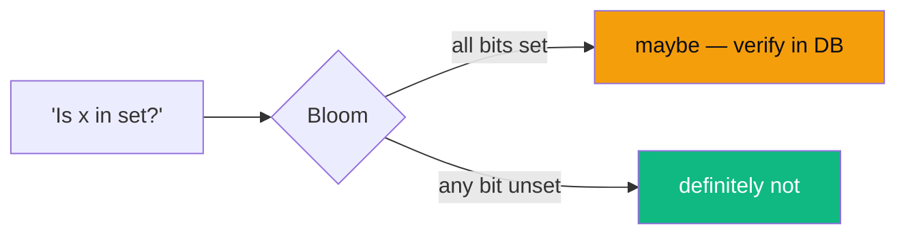
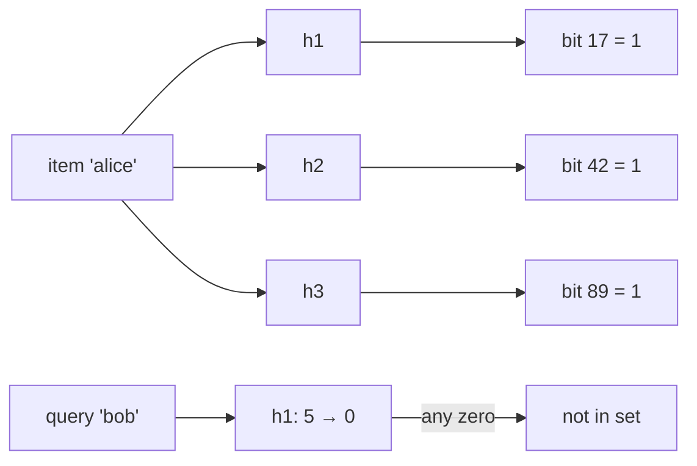
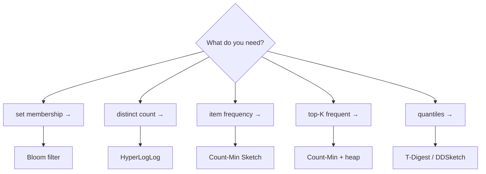
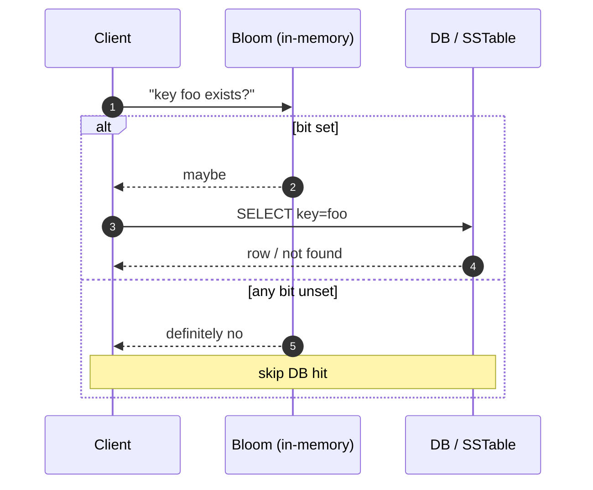

# 76 — Probabilistic Data Structures: Bloom, HyperLogLog, Count-Min, Top-K

> Phase 10 • Modern Additions • Topic 76/77

## Definition (interview-ready)

**Probabilistic data structures** trade exact answers for orders-of-magnitude less memory and CPU, by accepting a bounded error rate. **Bloom filter**: set membership with no false negatives, tunable false positives. **HyperLogLog (HLL)**: cardinality (distinct count) using ~1.5 KB to estimate billions of uniques with ~1% error. **Count-Min Sketch (CMS)**: frequency estimates for stream items in bounded memory. **Top-K** / **Heavy Hitters**: track the K most-frequent items in a stream without storing all of them.

## Why it matters

Once your data doesn't fit in memory (and at scale, it never does), exact answers become prohibitively expensive. Probabilistic structures let you answer "is this email in our spam list?" or "how many unique visitors today?" or "what are the trending hashtags right now?" using a tiny fraction of the memory exact answers would need — at error rates so low they're indistinguishable for the use case.

## Core concepts

### Bloom filter

A bit-array of size `m` plus `k` independent hash functions. To **add** an item: hash with each of the `k` functions, set those `k` bits. To **test**: hash, check all `k` bits — if any is 0, definitely not present; if all are 1, *probably* present (false positives possible).

- **False positive rate** ≈ `(1 - e^(-kn/m))^k` where `n` = items inserted. With `m = 10n` and `k = 7`, error ≈ 0.8%.
- **No deletes** (without a *counting* Bloom variant — each cell is a small counter instead of a bit).
- **No false negatives** — if it says "not present," it's truly absent.

### HyperLogLog (HLL)

Estimates the cardinality (number of distinct elements) of a stream. Memory: ~12 KB for **2^64 distinct values with ~0.81% relative error.**

How: hash each item to a uniform bit string; observe the position of the leftmost 1-bit; the maximum observed → estimate of cardinality (≈ 2^max). Use multiple "registers" (one per hash bucket) and harmonic mean for stability.

- Merges associatively: HLL(A) ∪ HLL(B) = pairwise max of registers. Lets you parallel-count per shard and combine.

### Count-Min Sketch (CMS)

A 2D matrix of size `d × w` (d = number of hash rows, w = width). To **add** item `x` with count `c`: for each row `i`, increment `CMS[i][h_i(x) % w] += c`. To **query frequency** of `x`: return the *minimum* of those `d` cells.

- Always **overestimates** (collisions add); never underestimates (you can't lose counts).
- Error ≈ `c · count_total / w` with probability `1 - (1/2)^d`.
- Common sizing: `w = 2/ε`, `d = log(1/δ)`.

### Top-K (Heavy Hitters)

Either:
- **Count-Min + min-heap** of top K observed items. When a candidate beats the heap min, replace.
- **Misra-Gries** / **Space-Saving** algorithms: deterministic, bounded-error counters.

## How it works — when to reach for which

| Structure | Memory | Error | Operations |
|---|---|---|---|
| Bloom (m=10n) | ~10n bits | ~1% FP | add, test |
| HLL | ~12 KB | ~0.81% | add, count, merge |
| CMS (d=5, w=2^16) | ~1.5 MB | ~1.5% per query | add, count |
| T-Digest | ~5 KB | sub-1% on tails | quantile |

### Bloom in front of a slow store (canonical pattern)

Cassandra/RocksDB use this per-SSTable: a read first checks the per-file Bloom; if no, skip the file entirely. Cuts read amplification dramatically.

### HLL for daily uniques

- Each event ingester maintains an HLL register.
- Aggregator merges HLLs hourly into a daily HLL.
- Store the **HLL itself** (not the count) so any window can be re-aggregated (HLL(week) = merge(HLL(d1), ..., HLL(d7))).

## Real-world examples

- **Cassandra/RocksDB** Bloom filters on SSTables.
- **Chrome's Safe Browsing** uses a Bloom of malicious URLs locally + verify against server only on hit.
- **Bitcoin SPV clients** use Bloom filters to ask full nodes for relevant txs without revealing exactly which addresses.
- **Reddit, Medium, etc.** use Bloom filters for "have you already seen this article?" cards.
- **Redis** ships HLL (`PFADD`, `PFCOUNT`, `PFMERGE`) for cardinality.
- **Druid, Pinot, ClickHouse** use HLL for approximate distinct counts in queries.
- **DDoS detection / heavy hitter detection** in routers: Count-Min on src-IP.
- **Twitter's algorithmic trending topics:** count-min sketch + decay + heap.
- **Quantile estimation in observability** (Datadog metrics, Prometheus): T-Digest or DDSketch.

## Common pitfalls

- **Treating Bloom positives as definitive.** A positive means *maybe* — you must verify in the source of truth.
- **Forgetting to size for the eventual `n`.** A Bloom sized for 1M items used at 100M items has ~100% false positive rate (every bit set). Re-create with bigger `m` and rebuild from data.
- **Sharing one Bloom across mutating sets** — no deletes. Either use counting-Bloom (more memory) or **rebuild periodically** from authoritative data.
- **HLL over a tiny cardinality.** Below ~100 distinct items, HLL's error variance is larger than the count itself. Use exact for small sets, switch to HLL above a threshold.
- **CMS for negative counts (decays).** Standard CMS assumes monotonic counts. If you need decay (sliding-window heavy hitters), use **count-min with conservative update** + time-decay multiplier, or **DDSketch** for histograms.
- **Hashing the same item with correlated hash functions.** `k` Bloom hashes must be *independent*. Common trick: `h_i(x) = h_a(x) + i * h_b(x)` with two strong hashes.
- **Persisting Bloom bits but not the parameters.** Recreating needs `m`, `k`, and the exact hash functions. Encode them in the serialized payload.
- **Confusing approximate with wrong.** A 1% false positive rate on a spam check is fine; on a "do they have permission to access this row?" check it's a security bug. Match the structure's error model to the use case.

## Interview questions

### Easy

1. **What's a Bloom filter and why use it?**  
   Bit-array + k hashes for set membership. Used to avoid an expensive lookup when the answer is "no." False positives possible, false negatives impossible.

2. **A Bloom filter says "yes" — what does that mean?**  
   The item *might* be in the set. You must verify against the authoritative source. Only "no" is certain.

### Medium

3. **How would you count daily unique visitors across 100 web servers, each seeing tens of thousands of events per second?**  
   Each server maintains an HLL in memory (~12 KB). Each minute, server pushes its HLL to a central aggregator. Aggregator merges HLLs (pairwise max of registers) into hourly/daily HLLs. Query the daily HLL for the count. Total RAM cost: trivial. Network: tiny.

4. **Size a Bloom for 10M items at 1% false-positive rate.**  
   Use `m = -n·ln(p) / (ln 2)²` → `m ≈ 95.85 M bits ≈ 12 MB`. `k = (m/n)·ln 2 ≈ 6.6` → use 7 hashes. Memory-efficient, but for a single server. For a distributed deployment, partition.

5. **Why can't you delete from a Bloom filter?**  
   Multiple items may share each bit. Clearing a bit could remove other items' membership signals — introducing false negatives, which Bloom guarantees never happen. Use **counting Bloom** (each cell is a small counter, increment on add, decrement on remove) at the cost of more memory.

### Hard

6. **Design a real-time "trending hashtags" service at Twitter scale.**  
   Ingest tweet stream → per-shard Count-Min Sketch keyed by hashtag, plus a per-shard min-heap of top-K candidates. Every minute, each shard ships its (CMS, top-K) to a global merger. Global merger combines CMSes element-wise, picks top-K of the combined heaps. Decay the CMS counts on each merge (multiply all cells by 0.95) so old hashtags fade. Query: read the global top-K. Memory: O(1) per shard regardless of hashtag diversity.

7. **You serve a recommendation system; reading from a cold store on each query is 100ms. How can you use a Bloom filter to cut p99?**  
   In front of the cold store, maintain a Bloom of all keys *known to exist*. On a query, hit the Bloom first (in-memory, <1 µs). If "no," return empty immediately. If "yes," go to the cold store. Sized for, say, 10M items at 0.5% false positives, the Bloom is ~17 MB and you save 100ms on every miss — which is most of them in a cold-tail workload. Rebuild the Bloom from a snapshot daily.

8. **A teammate proposes using HLL to count distinct IPs hitting an endpoint per hour. What edge cases do you raise?**  
   (a) HLL is biased for very small cardinalities — switch to exact below ~100. (b) HLL gives **count**, not the actual IPs — you can't list them. (c) HLLs over different time windows aren't trivially subtractable (HLL(today) - HLL(yesterday) ≠ HLL(today \ yesterday)). For "new uniques today," compute HLL(today ∪ yesterday) and subtract HLL(yesterday) → approximate, but biased on tails. (d) Persistence: store the HLL register state, not the estimated count, so you can re-aggregate.

## TL;DR cheat sheet

- **Bloom** = "is x in set?" — bit array + k hashes — false positives, no false negatives.
- **HyperLogLog** = "how many distinct?" — ~12 KB → billions of distincts at ~1% error, merges cleanly.
- **Count-Min Sketch** = "frequency of x?" — overestimates, never under.
- **Top-K** = CMS + min-heap, or Misra-Gries / Space-Saving.
- **T-Digest / DDSketch** = quantiles (p50/p99).
- Sizing: Bloom `m ≈ 1.44 · n · log2(1/p)` bits; pick `k ≈ ln 2 · m/n`.
- Always verify Bloom positives in the source of truth.
- No deletes from plain Bloom — use counting variant or rebuild.
- HLL biased at low cardinalities; switch to exact below a threshold.

## Go deeper

- "Space/Time Trade-offs in Hash Coding with Allowable Errors" — Burton Bloom, 1970 (the original paper)
- "HyperLogLog: the analysis of a near-optimal cardinality estimation algorithm" — Flajolet et al., 2007
- "An Improved Data Stream Summary: The Count-Min Sketch and its Applications" — Cormode & Muthukrishnan
- [Redis Probabilistic Data Structures docs](https://redis.io/docs/data-types/probabilistic/)
- "Approximate Membership Query Filters" — survey by Graf & Lemire
