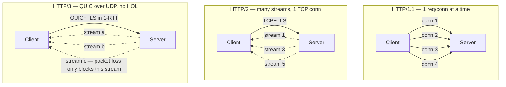

## Definition (interview-ready)

**HTTP/1.1** is text-based, one request per connection at a time (or pipelined poorly). **HTTP/2** is binary, multiplexes many streams over a single TCP connection, and adds header compression. **HTTP/3** keeps HTTP/2's semantics but runs on **QUIC** (UDP-based), eliminating TCP head-of-line blocking and combining the transport + TLS handshake into one round trip.

## Why it matters

A backend dev needs to understand:
- Why connection pooling and keep-alive exist
- Why HTTP/2 didn't really fix the latency problem under loss
- Why HTTP/3 / QUIC is showing up in load balancers, CDNs, and gRPC
- Why gRPC requires HTTP/2 and what that means for proxies


- When SSE / long-polling / WebSockets break under HTTP/2 multiplexing

## Core concepts

### HTTP/1.1 (1997)

- **Text protocol**: `GET /foo HTTP/1.1\r\n...`. Easy to debug with `curl` and `telnet`.
- **One request in flight per connection.** Browsers open ~6 parallel connections per origin to parallelize.
- **Keep-alive** reuses the TCP connection across requests (default on since 1.1).
- **Pipelining** (send next request before response arrives) exists in the spec but is broken in practice — disabled in all major browsers.
- **Head-of-line blocking** at the application layer: slow response holds up next request on the same connection.

### HTTP/2 (2015, RFC 7540)

- **Binary framing**: frames (`HEADERS`, `DATA`, `SETTINGS`, ...) over a single TCP connection.
- **Streams**: independent bidirectional sequences of frames. Many streams per connection — true multiplexing.
- **HPACK header compression** — huge win when clients send the same headers (cookies, auth) repeatedly.
- **Server push**: server can send resources before the client asks. Largely deprecated — Chrome removed it; replaced by 103 Early Hints.
- **Stream prioritization**: clients hint which streams matter more (also rarely used well in practice).
- **TCP HOL blocking remains**: if one packet is lost, *all* streams on the connection stall waiting for retransmit, even though HTTP/2 fixed the application-level HOL.

### HTTP/3 (2022, RFC 9114) — HTTP over QUIC

- **QUIC** = UDP-based reliable transport with built-in TLS 1.3.
- Each QUIC stream has independent reliability — packet loss on stream A doesn't stall stream B.
- **0-RTT** handshake on resumption: cached connection, no round trip before first byte.
- **Connection migration**: connection survives client IP change (Wi-Fi → LTE). Identified by connection ID, not 4-tuple.
- Encryption is **mandatory** — there is no plaintext HTTP/3.

### What didn't change

The HTTP **semantics** (methods, headers, status codes) are the same across all three versions. What changed is the wire format and transport.

## How it works (the key mental model)

```
HTTP/1.1:  [TCP] [TLS] [HTTP text]                  — one req per conn at a time
HTTP/2:    [TCP] [TLS] [HTTP/2 binary frames]       — N streams per conn (TCP HOL)
HTTP/3:    [UDP] [QUIC (includes TLS 1.3)] [HTTP]   — N independent streams (no TCP HOL)
```

## Real-world examples

- **Browsers**: prefer h3 → h2 → h1 via ALPN negotiation in TLS or `Alt-Svc` headers.
- **gRPC**: requires HTTP/2. gRPC-web exists because HTTP/2 features (trailers, bidirectional streaming) don't work through most CORS-aware proxies.
- **CDNs**: Cloudflare, Fastly, Akamai all serve HTTP/3 at the edge to mobile clients (where lossy networks make QUIC's per-stream reliability shine).
- **YouTube, Facebook, Google Search**: heavy QUIC users; Google built QUIC before it was standardized.

## Common pitfalls

- **Load balancer terminates HTTP/2 → upstream HTTP/1.1**: you lose stream multiplexing and may see degraded throughput. Check upstream protocol if performance regresses after enabling h2 at the edge.
- **HTTP/2 with one connection breaks LB algorithms** that assume `connection = request`. A single client can monopolize a backend. Use stream-aware proxies.
- **Long-lived h2 connection + flaky network** = catastrophic HOL stall. h3 fixes this.
- **Server push abuse**: pushing CSS/JS the client already cached just wastes bandwidth. Use 103 Early Hints instead.
- **gRPC + HTTP/1.1 proxy**: silent failure. Always verify the entire path supports h2.

## Interview questions

### Q1 — Easy: Why is HTTP/2 faster than HTTP/1.1?
Three reasons: (a) multiplexing eliminates application-level head-of-line blocking and the need for multiple TCP connections, (b) HPACK header compression cuts request size dramatically for cookie-heavy traffic, (c) binary framing is cheaper to parse than text.

### Q2 — Easy: What's the difference between HTTP/2 and HTTP/3?
HTTP/3 runs on QUIC (UDP) instead of TCP. This eliminates TCP-level head-of-line blocking, gives 0-RTT resumption, and supports connection migration across network changes.

### Q3 — Medium: HTTP/2 multiplexes, so why do browsers still open multiple connections?
Because of **TCP HOL blocking** — if one packet is lost, all streams on that connection stall. Browsers fall back to opening a second connection as resilience against this. HTTP/3 removes the need.

### Q4 — Medium: What is ALPN and why does it matter?
**Application-Layer Protocol Negotiation** — an extension to TLS where client and server agree on the application protocol (h2, http/1.1) *during* the TLS handshake. Saves a round trip vs Upgrade-style negotiation.

### Q5 — Medium: Why does gRPC require HTTP/2?
gRPC needs bidirectional streaming, multiplexing many concurrent RPCs over one connection, and HTTP trailers (used to send the gRPC status code at end-of-stream). HTTP/1.1 doesn't support these cleanly.

### Q6 — Hard: Your service uses HTTP/2 between an Nginx LB and Go backends. Latency spikes during high request rates. What could be wrong?
Likely candidates: (1) Nginx's `http2_max_concurrent_streams` is hit and clients are queued. (2) A small number of long-running requests starve other streams on the same connection. (3) Connection-coalescing causes one client to dominate one backend. Mitigations: tune stream limits, use multiple upstream connections per LB instance, consider HTTP/3.

### Q7 — Hard: Why is 0-RTT in HTTP/3 dangerous, and how do servers handle it safely?
0-RTT data can be **replayed** by an attacker who captured it. Servers must only allow 0-RTT for idempotent requests (GET, HEAD, OPTIONS), and ideally maintain a short-lived dedupe cache of accepted 0-RTT requests so the same payload can't be replayed twice.

### Q8 — Hard: Explain HPACK and a known security issue with it.
HPACK compresses headers using a shared static + dynamic table indexed by both sides. Both client and server keep state. Issue: **CRIME-style attacks** can leak secrets if attacker can inject headers — compression size reveals whether their guess matches a real value. Mitigated by careful never-indexed marking of sensitive headers (cookies, auth).

## TL;DR cheat sheet

| | HTTP/1.1 | HTTP/2 | HTTP/3 |
|---|---|---|---|
| Transport | TCP | TCP | UDP (QUIC) |
| Wire format | Text | Binary | Binary |
| Multiplexing | No (6 conns) | Yes | Yes |
| HOL blocking | App + TCP | TCP only | None |
| Header compression | None (or gzip body) | HPACK | QPACK |
| Handshake to first byte | TCP + TLS = 2 RTT | TCP + TLS = 2 RTT | 1 RTT (or 0-RTT) |
| Required encryption | No | De facto yes | Yes |

## Go deeper

- **RFCs**: [9114 HTTP/3](https://www.rfc-editor.org/rfc/rfc9114), [9000 QUIC](https://www.rfc-editor.org/rfc/rfc9000), [7540 HTTP/2](https://www.rfc-editor.org/rfc/rfc7540) (with 9113 update).
- **Hussein Nasser**: ["HTTP/2 vs HTTP/3"](https://www.youtube.com/results?search_query=hussein+nasser+http+2+http+3), entire HTTP playlist.
- **Cloudflare blog**: [HTTP/3](https://blog.cloudflare.com/http3-the-past-present-and-future/), [QUIC explainer series](https://blog.cloudflare.com/the-road-to-quic/).
- **web.dev**: [HTTP/2 reference](https://web.dev/performance-http2/), [HTTP/3 explainer](https://web.dev/performance-http3/).
- **Robin Marx**: long-form QUIC/HTTP/3 [blog posts on Smashing Magazine](https://www.smashingmagazine.com/2021/08/http3-core-concepts-part1/).
