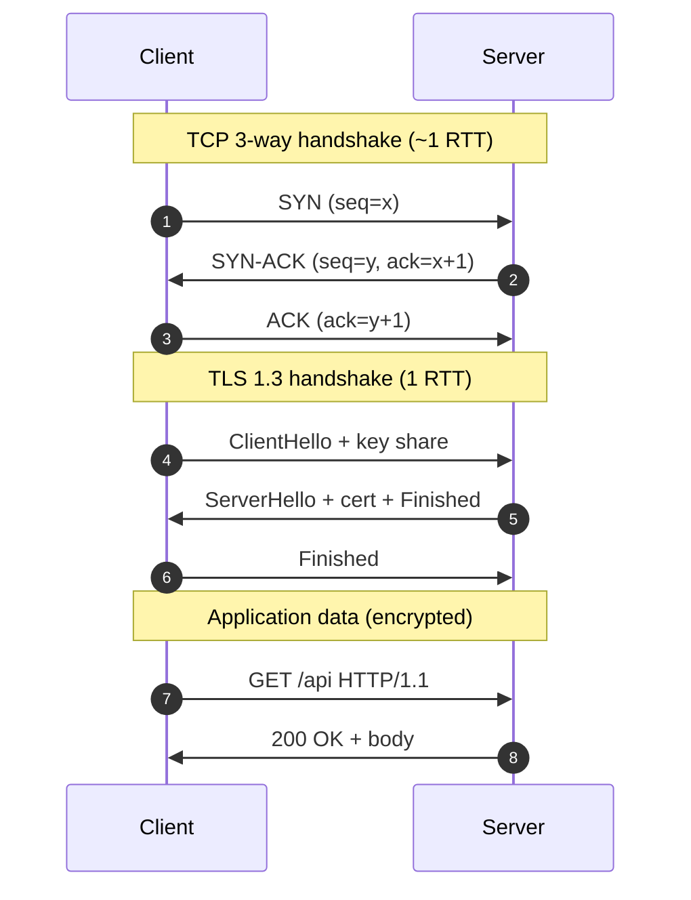

## Definition (interview-ready)

**TCP** is a connection-oriented, reliable, ordered, byte-stream transport protocol. **UDP** is a connectionless, unreliable, datagram protocol. **TLS** is a security layer that runs on top of TCP (or QUIC for HTTP/3) and provides encryption, integrity, and authentication via an asymmetric handshake that sets up a symmetric session key.

## Why it matters

Almost every backend conversation — load balancing, gRPC, Kafka, WebSockets, HTTP/3, mTLS — pulls on these four primitives: 3-way handshake, congestion control, TLS handshake, datagrams. If you can't explain what happens between `connect()` and the first byte of payload, you can't reason about p99 latency, head-of-line blocking, or connection pooling.



## Core concepts

### TCP — what guarantees you get

- **Reliable**: lost packets are retransmitted.
- **Ordered**: bytes arrive in the order sent.
- **Byte-stream** (not message-oriented): the application sees a stream of bytes; TCP does not preserve "message" boundaries — your application must frame.
- **Flow control**: receiver advertises a window so a fast sender doesn't drown a slow receiver.
- **Congestion control** (AIMD, CUBIC, BBR): sender backs off when the *network* (not the receiver) is saturated.

### UDP — what you give up

- No connection, no retransmission, no order, no flow/congestion control.
- Each `sendto()` is one datagram (a message), preserved end-to-end (or dropped).
- Wins: lower latency, no head-of-line blocking, multicast support, smaller header (8 bytes vs 20 for TCP).
- Used by: DNS, NTP, QUIC (which builds reliability on top of UDP itself), video/voice (where late packets are useless), gaming.

### TCP 3-way handshake

```
Client                            Server
  | ---- SYN (seq=x) -----------> |
  | <--- SYN-ACK (seq=y, ack=x+1) |
  | ---- ACK (ack=y+1) ---------> |
  [connection established]
```

One full round-trip (1 RTT) before any data flows. This is why connection reuse matters — every cold connection costs you ~50–100ms on the public internet.

### TCP 4-way teardown

`FIN` → `ACK` → `FIN` → `ACK`. The connection enters `TIME_WAIT` for ~2×MSL on the closing side to absorb late packets. Too many `TIME_WAIT` sockets exhaust ephemeral ports — a classic production issue.

### TLS 1.2 handshake (2 RTTs)

1. `ClientHello` (cipher suites, random, SNI)
2. `ServerHello` + certificate + key exchange + `ServerHelloDone`
3. Client verifies cert, sends `ClientKeyExchange`, `ChangeCipherSpec`, `Finished`
4. Server `ChangeCipherSpec`, `Finished`
5. Encrypted application data

### TLS 1.3 handshake (1 RTT, 0-RTT for resumption)

Eliminates the second round-trip by sending key shares in `ClientHello`. With session resumption, the client can send encrypted data in the *very first packet* (0-RTT) — but 0-RTT data is replayable, so it's only safe for idempotent requests.

### What TLS actually gives you

- **Confidentiality**: encryption with the session key (AES-GCM, ChaCha20-Poly1305).
- **Integrity**: MAC/AEAD ensures packets weren't tampered with.
- **Authentication**: server proves identity via X.509 cert chain to a trusted CA. Optionally, client too (mTLS).

## How it works (the trace)

A typical HTTPS request to a fresh host:

```
DNS lookup        ~20ms  (UDP)
TCP handshake     1 RTT  ~30ms
TLS handshake     1 RTT  ~30ms  (TLS 1.3)
HTTP request      0.5 RTT ~15ms
Server processing ?
Response          0.5 RTT ~15ms
                  -----------------
First byte: ~110ms before the server even starts working
```

This is why HTTP/2 multiplexing, connection pooling, and edge termination matter.

## Real-world examples

- **Kafka**: TCP. Long-lived connections per broker — pooled and reused.
- **gRPC**: HTTP/2 over TLS — multiplexes many streams over one TCP connection.
- **DNS**: UDP for queries < 512 bytes, falls back to TCP for larger.
- **QUIC / HTTP/3**: UDP + reliability + TLS 1.3 built into the protocol — no separate handshake.
- **Redis**: TCP with optional TLS. Pipelining batches commands to amortize RTT.

## Common pitfalls

- **TCP is not message-oriented**: a single `send()` can be split or merged on the wire. Frame your messages (length-prefix or delimiter).
- **`TIME_WAIT` exhaustion**: many short-lived connections on the client side burn through ephemeral ports. Fix with connection pooling or `SO_REUSEADDR`/`SO_REUSEPORT`.
- **Nagle + Delayed ACK**: small writes can stall up to 200ms. Set `TCP_NODELAY` for low-latency interactive protocols.
- **TLS cert chain**: missing intermediates work in browsers (which fetch them) but break for many clients. Always serve the full chain.
- **SNI**: server uses the hostname in `ClientHello` to pick the cert. Without SNI you can't host multiple HTTPS sites on one IP.
- **HOL blocking in TCP**: one lost packet stalls *all* streams on the same connection. HTTP/2 didn't fix this. HTTP/3 (QUIC) does, because each stream has independent reliability.

## Interview questions

### Q1 — Easy: When would you use UDP over TCP?
When latency matters more than reliability, or when you handle reliability yourself: DNS, NTP, real-time voice/video, gaming, telemetry, QUIC. UDP also when you need multicast.

### Q2 — Easy: How many round trips for HTTPS to a brand-new server?
DNS (1) + TCP handshake (1) + TLS 1.3 (1) = ~3 RTTs before the first HTTP byte. TLS 1.2 = 4 RTTs. With QUIC + 0-RTT and cached DNS, you can get the first byte in essentially 0 RTTs.

### Q3 — Medium: Explain TCP congestion control in one paragraph.
TCP uses a congestion window (`cwnd`) that grows on ACK and shrinks on loss. Slow start doubles `cwnd` per RTT until a threshold, then switches to congestion avoidance (additive increase). On packet loss, modern algorithms (CUBIC default on Linux, BBR on Google services) cut the window and recover. The goal: fill the pipe without causing buffer bloat or fairness issues.

### Q4 — Medium: Why does TLS use both asymmetric and symmetric crypto?
Asymmetric (RSA/ECDHE) is slow but lets two strangers agree on a secret over a public channel. Symmetric (AES) is fast. TLS uses asymmetric during the handshake to negotiate a symmetric session key, then switches to symmetric for the bulk data. Modern handshakes use ECDHE for *forward secrecy* — even if the server's private key leaks later, past sessions stay safe.

### Q5 — Medium: What is mTLS and when do you use it?
**Mutual TLS** — both client and server present certificates. Server-to-server inside a service mesh (Istio, Linkerd), B2B APIs, IoT device auth. Replaces shared secrets with verifiable identities and gives you encryption and authentication in one step.

### Q6 — Hard: A client sees high p99 on a service hop. Walk through the network-level causes you'd investigate.
Cold connections (no pool), DNS resolution delay, TCP retransmits (loss + RTO), TLS handshake on every call, head-of-line blocking on HTTP/2, Nagle/delayed-ACK interaction, ephemeral port exhaustion on the client, MTU mismatch causing fragmentation, GC or accept-queue saturation on the server side mimicking network issues.

### Q7 — Hard: Why is 0-RTT in TLS 1.3 dangerous, and how do you mitigate?
0-RTT data can be replayed by an attacker who captures it — TLS only guarantees in-order, no-replay *within* a session. Mitigation: only allow 0-RTT for idempotent, side-effect-free requests (typically GETs), and have the server track and reject duplicates within a freshness window.

### Q8 — Hard: What's the difference between flow control and congestion control?
Flow control protects the **receiver** (advertised window, set by the receiver). Congestion control protects the **network** (congestion window, set by the sender based on loss/RTT signals). The effective send rate is `min(rwnd, cwnd)`.

## TL;DR cheat sheet

- TCP = reliable, ordered byte stream. UDP = fire-and-forget datagrams.
- 3-way handshake = SYN, SYN-ACK, ACK. 1 RTT before data.
- TLS 1.3 = 1 RTT handshake, 0-RTT on resumption (replayable — idempotent only).
- TLS gives **C**onfidentiality, **I**ntegrity, **A**uthentication.
- HTTP/2 multiplexes streams over one TCP connection but still has TCP-level HOL blocking. HTTP/3 fixes that by running on QUIC (UDP).
- Always pool/reuse TCP+TLS connections — the handshake is the expensive part.

## Go deeper

- **Book**: Kurose & Ross, *Computer Networking: A Top-Down Approach*, Ch. 3 (transport layer).
- **YouTube**: [Hussein Nasser channel](https://www.youtube.com/@hnasr) — exceptionally good network deep dives.
- **Hussein Nasser**: ["TCP Slow Start"](https://www.youtube.com/results?search_query=hussein+nasser+tcp+slow+start), ["TLS 1.3 explained"](https://www.youtube.com/results?search_query=hussein+nasser+tls+1.3).
- **Cloudflare blog**: [TLS 1.3 explainer](https://blog.cloudflare.com/rfc-8446-aka-tls-1-3/), [QUIC](https://blog.cloudflare.com/the-road-to-quic/).
- **RFC 9000** (QUIC), **RFC 8446** (TLS 1.3) — short and readable.
- **Tool**: `tcpdump -i any -nn 'port 443'` then `wireshark` to actually *see* the handshake.
