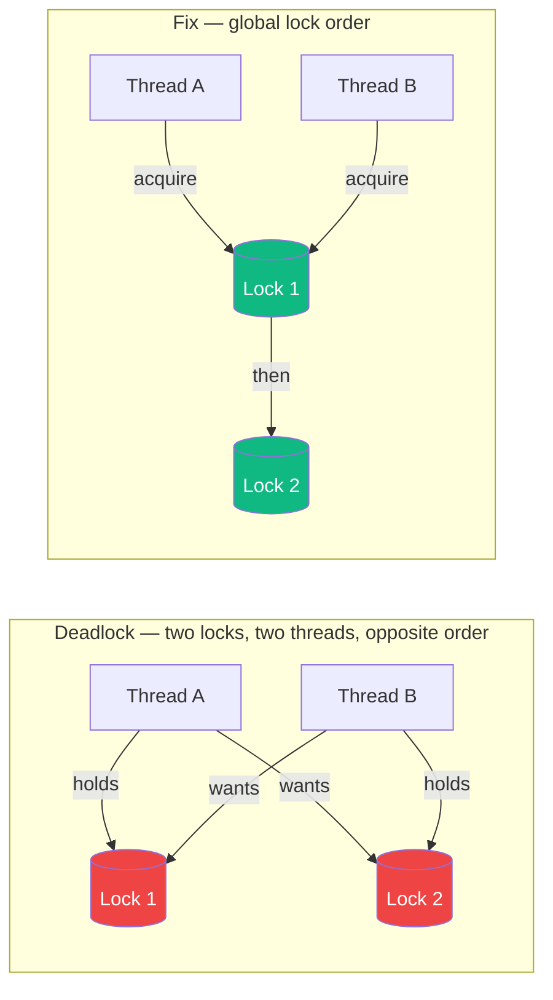

## Definition (interview-ready)

**Concurrency** is structuring a program as independent units of work that can be interleaved. A **thread** is a unit of execution sharing memory with its peers within a process. A **race condition** is when correctness depends on uncontrolled ordering. A **mutex** is a primitive that ensures only one thread enters a critical section. A **deadlock** is two-or-more threads each holding a resource the other needs.

## Why it matters

Every backend that handles more than one request at a time deals with concurrency: thread pools, connection pools, async I/O, locks, atomics, queues. Bugs here are non-deterministic, expensive in production, and brutal to debug. Interviews use locks/deadlock/race-condition questions as proxies for "have you actually written a multi-threaded service."



## Core concepts

### Process vs thread

- **Process**: isolated address space, own heap, own file descriptors. Cheap context switch only with copy-on-write fork. Crash isolation.
- **Thread**: shares heap with peers, has its own stack + program counter + registers. Cheap to create, fast to communicate (shared memory).
- **Goroutine / fiber / virtual thread**: language-level lightweight thread, multiplexed onto OS threads. Cheap (few KB stack each).

### Race condition

Two threads access shared state, at least one writes, and the result depends on timing.

```go
counter := 0
// Thread A: counter++  (read, +1, write)
// Thread B: counter++  (read, +1, write)
// Final value can be 1 instead of 2 if reads interleave.
```

Fix: make the operation atomic (`atomic.AddInt64`) or protect with a mutex.

### Mutex (mutual exclusion)

Lock before entering critical section, unlock after. Blocks other threads.

```go
var mu sync.Mutex
mu.Lock()
counter++
mu.Unlock()
```

Variants:
- **Spinlock**: busy-waits. Good for very short critical sections on multi-core.
- **Reentrant mutex**: same thread can lock twice without deadlocking.
- **RW mutex / `sync.RWMutex`**: many readers OR one writer.
- **Semaphore**: counter-based, allows up to N holders.
- **Condition variable**: thread waits on a predicate; another thread signals it.

### Deadlock

Four conditions (Coffman, all required):
1. **Mutual exclusion** — resource held by one at a time.
2. **Hold and wait** — thread holds one resource while waiting for another.
3. **No preemption** — can't forcibly take a resource away.
4. **Circular wait** — A→B→C→A.

Break any one to prevent deadlock. Most common fix: **lock ordering** — always acquire locks in a fixed global order.

### Livelock and starvation

- **Livelock**: threads keep changing state in response to each other, no progress. (Two people stepping aside in a hallway repeatedly.)
- **Starvation**: a thread never gets the lock because others always do. Fix with fair locks (FIFO queue).

### Memory model & visibility

In multi-core CPUs, each core has caches. Without synchronization, thread A's write may not be visible to thread B for arbitrary time. Languages define a **memory model** (Java JMM, Go memory model, C++ memory order) that specifies what reordering compilers and CPUs can do.

- **Atomic operations** give you guaranteed visibility for one variable.
- **Mutexes** establish "happens-before" relationships — anything done before unlock is visible after a subsequent lock.
- **Volatile** in Java prevents reordering but doesn't make compound ops atomic.

### Concurrency vs parallelism

- **Concurrency**: dealing with many things at once (structure).
- **Parallelism**: doing many things at once (execution).
- You can have concurrency without parallelism (single-core event loop).

### Common synchronization patterns

- **Producer-consumer**: bounded queue with condition variables.
- **Worker pool**: N threads pulling from a shared queue.
- **Read-write lock**: cache or config.
- **Once / lazy init**: `sync.Once`, double-checked locking.
- **Fork-join**: split work, wait for all (Go's `WaitGroup`, Java `Fork/Join`).

## How it works (a deadlock walkthrough)

```
Thread 1: lock(A); ...; lock(B); ...; unlock(B); unlock(A);
Thread 2: lock(B); ...; lock(A); ...; unlock(A); unlock(B);
```

Thread 1 holds A and waits on B. Thread 2 holds B and waits on A. Neither releases. **Fix**: both acquire in the same order (A then B).

## Real-world examples

- **Java `synchronized` keyword**: implicit object-level mutex.
- **Redis is single-threaded** for command execution → no locks needed at the data structure level. (Trade-off: parallelism comes from the cluster, not the single instance.)
- **Postgres MVCC**: uses concurrency control without writer-vs-reader locks for most operations.
- **Go's race detector** (`go test -race`): instruments memory accesses, reports races at runtime.
- **JVM**: java.util.concurrent has lock-free `ConcurrentHashMap`, atomic counters, work-stealing pools.
- **Linux kernel**: RCU (Read-Copy-Update) lets readers proceed without locks while writers swap pointers.

## Common pitfalls

- **Forgetting to unlock** on every return path — use RAII (`defer mu.Unlock()`, `try-with-resources`).
- **Double-checked locking without proper memory barriers** — broken in older Java; fixed since JDK 5 with `volatile`.
- **Holding a lock across I/O** — never call out to network/disk while holding a hot lock.
- **Lock granularity**: too coarse → contention bottleneck. Too fine → deadlock and complexity.
- **Recursive lock acquisition** in non-reentrant mutex → deadlock against yourself.
- **Concurrent map access in Go without `sync.Map` or a mutex** → runtime panic.
- **Thread leaks**: spawned goroutines that never exit because their channel never closes.

## Interview questions

### Q1 — Easy: What is a race condition?
A bug where program correctness depends on the timing/interleaving of concurrent operations on shared state. Classic: two threads incrementing a counter without synchronization.

### Q2 — Easy: How does a mutex prevent a race condition?
A mutex ensures only one thread can be inside the critical section at a time. Combined with the memory model's happens-before guarantee around lock/unlock, it also makes one thread's writes visible to the next thread that takes the lock.

### Q3 — Medium: Explain deadlock and how to prevent it.
Deadlock = two or more threads circularly waiting for resources each holds. Coffman's four conditions: mutual exclusion, hold-and-wait, no preemption, circular wait. Break any one. Most practical fix: **lock ordering** — define a global order and always acquire locks in that order. Or use try-lock with timeout and back off on failure.

### Q4 — Medium: Difference between concurrency and parallelism.
Concurrency = dealing with multiple things over time (structure). Parallelism = doing multiple things simultaneously (execution). A single-core event loop is concurrent but not parallel.

### Q5 — Medium: What's the difference between a mutex and a semaphore?
A mutex permits exactly one holder. A semaphore permits up to N holders (counting). A mutex is also typically tied to ownership (only the holder can unlock); a semaphore is not.

### Q6 — Hard: You see a thread holding a lock spike from 1 ms to 200 ms in production. How do you debug?
Profile the critical section — find what's running under the lock. Common cause: network/disk I/O moved under the lock (e.g., a logger flushing synchronously). Other causes: GC pause inside the section, lock convoy (many threads piling up), priority inversion (high-priority thread blocked waiting for a low-priority one). Look at flame graphs, lock contention metrics, GC logs.

### Q7 — Hard: Implement a thread-safe LRU cache. What primitives?
A hash map + a doubly-linked list. Mutex around all ops, or finer-grained: RW lock if reads dominate (but moving an entry to the head is a write — degrades to single-writer in practice). Better: sharded — N maps + N mutexes, hash key to shard. Or use `concurrent-skiplistmap` style. For very high contention, use a lock-free LRU (much harder).

### Q8 — Hard: Why is "double-checked locking" famously broken?
```java
if (instance == null) {            // (1) check without lock
    synchronized (lock) {
        if (instance == null) {    // (2) check with lock
            instance = new Singleton();
        }
    }
}
```
Without `volatile`, another thread can observe `instance != null` while the object's fields are still being initialized (constructor reordered with assignment). Fix in Java: declare `instance` as `volatile`. Fix in C++: use `std::atomic` with proper memory order, or just `std::call_once`.

## TL;DR cheat sheet

- **Race condition**: timing-dependent bug on shared state. Fix with mutex or atomic.
- **Mutex**: one holder; **semaphore**: N holders; **RWMutex**: many readers OR one writer.
- **Deadlock**: 4 Coffman conditions, break any one. Prefer global lock ordering.
- **Livelock**: progress-free flapping. **Starvation**: unfair scheduling.
- **Memory model**: lock/unlock = happens-before barrier. Without it, writes may be invisible cross-core.
- **Concurrency ≠ parallelism**.
- Never hold a lock across I/O. Use RAII for unlocking.

## Go deeper

- **OSTEP** (free): Operating Systems: Three Easy Pieces, [pages.cs.wisc.edu/~remzi/OSTEP/](https://pages.cs.wisc.edu/~remzi/OSTEP/), Chapters 26–32.
- **Java Concurrency in Practice** (Brian Goetz) — still the gold standard.
- **The Go Memory Model**: [go.dev/ref/mem](https://go.dev/ref/mem).
- **The C++ memory order reference**: [en.cppreference.com/w/cpp/atomic/memory_order](https://en.cppreference.com/w/cpp/atomic/memory_order).
- **Jeff Preshing's blog**: [preshing.com](https://preshing.com/) — accessible deep dives on memory models, lock-free programming.
- **Talk**: ["Concurrency Is Not Parallelism"](https://www.youtube.com/watch?v=oV9rvDllKEg) by Rob Pike.
