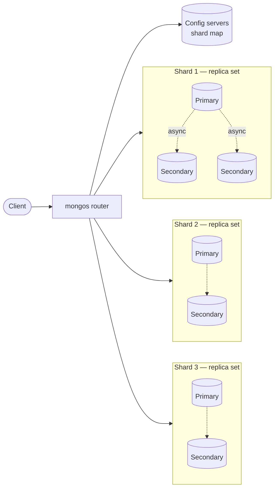

## Definition (interview-ready)

**MongoDB** is a document-oriented NoSQL database. Data is stored as BSON documents in collections; schemas are flexible. It scales reads with **replica sets** (one primary, N secondaries) and scales writes with **sharded clusters**. Complex queries use the **aggregation pipeline**.

## Why it matters

MongoDB shows up everywhere — early-stage products, content platforms, mobile backends. Knowing when to pick it (flexible schemas, hierarchical data, fast iteration) and when not to (multi-document transactions across collections, heavy joins, strict relational integrity) is a baseline backend skill.



## Core concepts

### Documents and collections

- **Document**: JSON-like (stored as BSON — Binary JSON). Up to 16 MB per document.
- **Collection**: group of documents (analogous to a table). No enforced schema by default; you can enable JSON Schema validation.
- **_id**: every document has a unique `_id`; default is ObjectId (12 bytes — timestamp + machine + counter).

### Why "flexible schema" is a double-edged sword

Pros: easy iteration, version data side by side, fewer migrations.
Cons: no enforcement of structure → easy to ship bad data, slow drift makes refactoring painful. Use schema validation in production.

### Storage engine

WiredTiger (default since 3.2). MVCC, document-level locking, snapshot isolation. B+ tree (or LSM with the rocksdb adapter, no longer common). Compression enabled by default.

### Indexes

- **Single-field**, **compound**, **multikey** (auto-created when indexing array fields).
- **Text** (full-text search), **geospatial** (2dsphere), **hashed** (for sharding), **TTL** (auto-expire), **partial**, **wildcard**, **unique**.
- Same lookup rules as relational: leftmost prefix on compound indexes, equality before range.

### Query semantics

```js
db.orders.find({ customer_id: 42, status: "OPEN" })
         .sort({ created_at: -1 })
         .limit(50)
```
- Supports rich predicates, projections, sort, limit.
- `explain("executionStats")` is the equivalent of EXPLAIN ANALYZE.

### Aggregation pipeline

Composable stages, each transforming a stream of documents:
```js
db.orders.aggregate([
  { $match: { created_at: { $gte: ISODate("2026-01-01") } } },
  { $group: { _id: "$merchant_id", total: { $sum: "$amount" } } },
  { $sort: { total: -1 } },
  { $limit: 10 }
])
```
- Stages: `$match`, `$project`, `$group`, `$sort`, `$lookup` (left outer join), `$unwind`, `$facet`, `$bucket`, `$addFields`, `$replaceRoot`, `$merge` (writes results).
- Use `$match` early to leverage indexes.
- `$lookup` exists, but performance is worse than relational joins. Often a sign you should denormalize.

### Embedded vs referenced documents

- **Embedded**: `order.items[]` inside the order doc. Locality + atomic update of the whole order. Limit: 16 MB; arrays that grow unbounded → pathological.
- **Referenced**: store `customer_id` and look up the customer doc separately. Like a foreign key without FK enforcement.

Heuristic: 1:1 → embed. 1:many bounded → embed. 1:many unbounded → reference. Many:many → reference.

### Replica sets

- 1 primary, N secondaries (usually 2). One **arbiter** allowed (votes but holds no data).
- All writes go to primary; replicated to secondaries via the **oplog** (a capped collection).
- Reads default to primary; can route to secondaries with read preference (consistency tradeoff).
- Failover: secondaries elect a new primary on heartbeat loss (Raft-like).

### Write concern & read concern

- **Write concern** `w`: how many nodes must acknowledge. `w: 1` (primary only), `w: "majority"` (recommended), `w: 0` (fire-and-forget).
- **Journal** `j`: wait for write to hit the on-disk journal before ack.
- **Read concern**: `local` (default — possibly stale), `majority` (only data committed to majority), `linearizable` (real-time guarantee, slow), `snapshot` (for transactions).

### Sharding

- Horizontal split across multiple replica sets called **shards**.
- **mongos** routes queries.
- **Config servers** (a small replica set) store metadata.
- **Shard key** chosen at collection creation; cannot be changed easily (in 5.0+ you can refine/reshard, but it's a heavy operation).
- Strategies: ranged, hashed, zoned (geo).

### Transactions

- Multi-document ACID transactions since 4.0 (replica sets) and 4.2 (sharded).
- Use sparingly — performance penalty, lock contention, transaction time limits.
- Most modeling should aim to keep operations within a single document where possible.

## How it works (a write at `w: "majority"`)

```
Client → mongos → primary shard
   Primary appends to oplog
   Primary writes to journal (depending on j)
   Secondaries replicate from oplog
   Once majority of voting members have applied → write acked
```

## Real-world examples

- **MongoDB at Disney+**: catalog and metadata (semi-structured, frequently iterated).
- **Toyota Connected**: telemetry storage.
- **eBay**: search suggestions, semi-structured product data.
- **Stack Overflow, EA**: various services historically; have since added/replaced with other stores.

## Common pitfalls

- **Unbounded arrays**: a doc with `events: []` that grows forever → 16 MB cap hit, then queries become slow well before that.
- **Schema drift**: 5 versions of "user" in the same collection. Painful refactors. Use validators.
- **`$lookup` for relational joins**: works but slow; sign you should reshape your data.
- **Read from secondaries → stale reads**: explicit read preference required.
- **Bad shard key**: hard to fix later. Time as shard key → hot shard.
- **Misusing transactions**: people reach for them when they should embed instead. Each transaction has a 60-second default limit; long-running ops fail.
- **Default `w: 1`**: a primary crash mid-replication loses writes. Use `w: "majority"`.
- **Indexes use lots of RAM**: WiredTiger best when working set + indexes fit in RAM.

## Interview questions

### Q1 — Easy: When would you pick MongoDB over Postgres?
Flexible schemas (e.g., CMS, product catalog with variable attributes), hierarchical nested data fitting in single docs, rapid iteration on data shape, horizontal sharding as a primary concern. Avoid when you need rich relational joins, strict referential integrity, or complex multi-table transactions.

### Q2 — Easy: What's the difference between embedded and referenced documents?
Embedded: data nested in the parent doc — fast reads, atomic updates of the whole tree, but watch the 16 MB cap and array growth. Referenced: store an ID pointing to another collection — like a soft FK; needs follow-up query or `$lookup`.

### Q3 — Medium: Explain how the aggregation pipeline works.
A pipeline of stages, each consuming a stream of documents and producing a transformed stream. Common stages: `$match` (filter, push down for indexes), `$group` (aggregate), `$lookup` (left outer join), `$sort`, `$project`. Order matters — put `$match` and `$sort` early to leverage indexes. Output goes to client or via `$merge` back to a collection.

### Q4 — Medium: How does failover work in a replica set?
Secondaries monitor primary via heartbeats. On loss, eligible members hold an election (similar to Raft, with priority and recency rules). The most up-to-date member wins; clients reconnect via the replica set name (driver discovers the new primary automatically). Old primary, on rejoin, rolls back any unreplicated writes.

### Q5 — Medium: What is write concern `w: "majority"` and why use it?
Wait until a majority of replica-set voting members have applied the write before acking. Prevents data loss on failover: any majority-committed write can survive a primary crash because at least one secondary in the next majority has it.

### Q6 — Hard: A collection's `_id` is high-cardinality monotonic (ObjectId). You shard on `_id` (hashed). What problems and benefits?
Hashed shard key distributes writes evenly (no hot shard from monotonic IDs) — good. But: you lose **range queries** on `_id` (scatter-gather across shards). For time-ordered range scans, you'd need an alternative shard key (compound with tenant ID, for instance) or a secondary index that's also globally accessible (cross-shard, slow).

### Q7 — Hard: A team uses MongoDB with a doc per user containing `events: []`. After 6 months, queries are slow and some docs are 12 MB. What do you do?
Migrate the events to a separate collection keyed by `user_id` (referenced model). Cap or rotate by time (e.g., one doc per user per month). Add an index on `user_id, timestamp`. Set up TTL index for old events. Update writers to append to the new collection — and pre-build read paths (e.g., `$lookup` only when needed; better: separate query path).

### Q8 — Hard: When should you use multi-document transactions in MongoDB?
Sparingly. Use them when invariants span multiple documents and you can't redesign to embed. Constraints: 60-second default time limit, performance overhead, lock contention. Always retry on transient errors. Prefer to model so a single document carries the invariant (atomic at the document level by default).

## TL;DR cheat sheet

- BSON documents in collections, no enforced schema (use validators).
- 16 MB per document. Watch unbounded arrays.
- WiredTiger: MVCC, document-level locking, compression.
- Aggregation pipeline: `$match` early, `$lookup` sparingly.
- Embed for 1:1 and bounded 1:many; reference for unbounded or many-to-many.
- Replica set: 1 primary, N secondaries. Failover via election.
- Write concern `majority` is the production baseline.
- Sharding via shard key; **hashed shard key for even distribution, ranged for locality**.
- Multi-doc transactions exist but are expensive — design to avoid.

## Go deeper

- **MongoDB University**: free courses M001 (basics), M201 (performance), M320 (data modeling).
- **MongoDB docs**: [Data modeling](https://www.mongodb.com/docs/manual/data-modeling/), [Aggregation](https://www.mongodb.com/docs/manual/aggregation/), [Sharding](https://www.mongodb.com/docs/manual/sharding/).
- **Practical MongoDB Aggregations** book (Paul Done) — free online.
- **DDIA Chapters 2, 5** for context.
- **Hussein Nasser**: MongoDB internals videos on YouTube.
