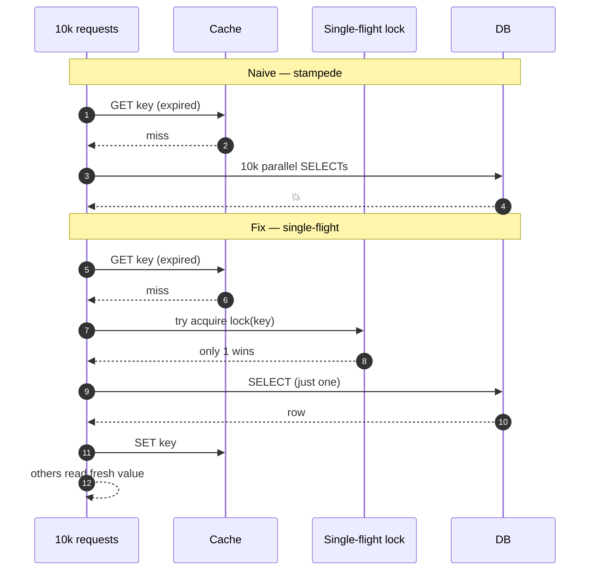

## Definition (interview-ready)

A **cache stampede** (a.k.a. **thundering herd**) is when many concurrent requests for the same expired or missing cache key all fall through to the origin (database / API), overwhelming it. The fix is to serialize the regeneration with **single-flight** locks, return slightly stale values during refresh, or smear TTLs with jitter and probabilistic early refresh.

## Why it matters

Stampedes are a top cause of cache-fronted service outages. The DB is sized assuming the cache absorbs 99% of reads — when a key expires and 10K requests miss simultaneously, the DB sees a 10K-instant spike and falls over. Real production incident class; every senior engineer should know the fixes.



## Core concepts

### What triggers a stampede

- A **hot key** TTLs (millions QPS into one row).
- A **deployment** invalidates many keys at once.
- A **cache failure** (Redis restart, network partition) wipes warm data; all callers refill simultaneously.
- A **bot** or unusual traffic burst hits a cold key.
- A **TTL alignment** issue: 1000 keys all expire at the same second (because writes happened around the same time).

### Three categories of fix

1. **Serialize the refill** (don't let everyone hit origin).
2. **Avoid hard expiration** (don't synchronously TTL — refresh ahead).
3. **Tolerate staleness** (serve stale-while-revalidate).

### 1. Single-flight / mutex / lock

Only one process refills; others wait or serve stale.

Pattern (using Redis):
```
val = redis.get(key)
if val:
    return val
ok = redis.set("lock:" + key, "1", NX=True, EX=10)
if ok:
    val = db.fetch(...)
    redis.set(key, val, EX=ttl)
    redis.del("lock:" + key)
    return val
else:
    sleep(50ms); retry
```

Library-level: Go's `singleflight` package collapses concurrent calls per key into one upstream request. golang.org/x/sync/singleflight.

### 2. Jitter on TTL

Don't set `EX 300` for everyone. Set `EX 300 + random(0, 60)`. Spreads expirations.

```
ttl = base_ttl + random_jitter(0, base_ttl * 0.1)
```

Especially important after bulk loads (everything written at once expires at once).

### 3. Probabilistic early expiration (XFetch)

As TTL approaches, randomly refresh the cache. The probability of refresh rises near expiration.

```
expiry = cache.expiry(key)
now = time.now()
delta = compute_time_estimate(key)
if random() < e^(-(expiry - now) / delta):
    refresh()
return cache_value  # serve current value
```

Reference: ["Optimal Probabilistic Cache Stampede Prevention"](http://cseweb.ucsd.edu/~avattani/papers/cache_stampede.pdf) (Vattani et al, VLDB '15).

Effect: hot keys are refreshed before expiry, by exactly one caller. Cold keys behave normally.

### 4. Stale-while-revalidate (SWR)

Standard HTTP cache pattern (`Cache-Control: stale-while-revalidate=N`). Within the staleness budget, the cache serves the old value AND triggers async refresh. Used by browsers, CDNs (Fastly, Cloudflare), and many in-process caches.

Result: users never see a miss; origin sees at most one refresh per key per refresh interval.

### 5. Negative caching (cache the "not found")

A common stampede variant: someone queries a key that doesn't exist (404). Without negative caching, every miss hits DB. Cache the "nothing here" result with a short TTL.

Watch for cache poisoning if someone can spam non-existent keys (set an LFU cap or use bloom filter to test existence).

### 6. Bloom filter front-door

For "does this key exist?" lookups (e.g., username availability), put a bloom filter in front. False positives still query origin; false negatives never reach it. Good for sparse keyspaces.

## How it works (single-flight in detail)

```
T0: 1000 requests for key=foo arrive simultaneously.
T0: First request takes the lock, calls db.fetch (300ms).
T1..T0+300: 999 requests find lock held → loop with backoff or return stale.
T0+300: First request stores value in cache, releases lock.
T0+301: 999 retries hit cache → all return.
```

vs without single-flight:
```
T0: 1000 requests, all miss → 1000 db.fetch calls.
T0+300ms: DB has burned 1000× the work, possibly fell over.
```

## Real-world examples

- **Instagram**: documented their stampede protection with single-flight + jitter.
- **Mike Perham (Sidekiq)**: blog post on thundering herds during deploys.
- **Cloudflare**: stale-while-revalidate at the edge for huge wins.
- **CDN-level**: Akamai/Fastly/Varnish all support request collapsing — multiple in-flight requests for the same URL get collapsed to one origin fetch.
- **CDN purge storms**: a global cache purge that doesn't ramp gradually = stampede. CDNs offer "soft purge" (mark stale, async refresh).

## Common pitfalls

- **No jitter on bulk-loaded data** — everything expires at once.
- **Locking without TTL on the lock** — lock owner dies, no one ever refills. Always TTL the lock.
- **Lock granularity too coarse** — one lock for all keys → serialization bottleneck. Lock per key (`lock:userid`).
- **Forgetting negative cache** — every non-existent username bombs the DB.
- **Cold cache after restart**: build warmup or shadow-route writes.
- **Async refresh that fails silently** — old data stays forever. Always retry and alert on stale-refresh failures.
- **Reaching origin on miss with no rate limit**: a stampede plus no rate limit = compounded blast. Always have origin-side admission control.

## Interview questions

### Q1 — Easy: What is a cache stampede?
A spike of concurrent misses for the same expired/missing cache key, all falling through to the origin database simultaneously and overwhelming it.

### Q2 — Easy: How does TTL jitter help?
Without jitter, many keys written at the same time expire at the same second — all hitting origin at once. Jitter spreads expirations across a window, smoothing load.

### Q3 — Medium: Implement single-flight in Redis.
```
val = GET key
if val: return val
got = SET lock:key 1 NX EX 10
if got:
    val = db.fetch()
    SET key val EX ttl
    DEL lock:key
    return val
else:
    # wait + retry, or return stale if available
```
For correctness: always TTL the lock; use a token-based release; per-key lock granularity.

### Q4 — Medium: What is stale-while-revalidate and when do you use it?
Serve the stale cached value while asynchronously refreshing in the background. Users never see a miss; origin sees ≤1 refresh per key per interval. Built into HTTP caches; used by CDNs, browsers, and in-process caches. Use it when slightly stale data is acceptable for the read.

### Q5 — Medium: How would you prevent a stampede after a deploy that invalidates everything?
- **Bulk-invalidate over time**, not all at once.
- **Pre-warm cache** with a script before the cutover.
- **Single-flight + admission control** at the origin so concurrent misses serialize.
- Consider **two-phase rollout**: new cache, dual reads, then cut over.

### Q6 — Hard: Compare locking vs probabilistic early expiration.
Locking guarantees only one refill per key but adds complexity (TTLs, tokens, retries, latency for losers). Probabilistic early expiration is lockless — random small fraction of accesses near expiry trigger refresh ahead of time; expected ~1 refresh per TTL window for hot keys; cold keys behave normally. PEE has no waiting and no extra round trip, but no hard guarantee — under pathological conditions multiple refreshes still possible. Combine: PEE for hot keys + locking as a safety net.

### Q7 — Hard: A misbehaving bot hits a non-existent username 100 KQPS. How do you handle?
- **Negative cache** the 404 with short TTL (5–30s).
- **Bloom filter** front-door for "does this username exist."
- **Rate limit** the offender at the API gateway.
- **Origin protection**: admission control + circuit breaker so DB isn't drowned even if cache is bypassed.

### Q8 — Hard: A pre-deploy cache warmer floods the DB and brings down production. What went wrong?
- The warmer fetched keys faster than the DB could serve → it stampeded itself.
- Possibly used a wide SELECT that locked tables.
- Possibly didn't tier requests (high concurrency, no backpressure).
- Fix: throttle the warmer (token bucket), use index-friendly queries, run it from a non-production replica or during low traffic, observe DB load and back off.

## TL;DR cheat sheet

- **Stampede** = many concurrent misses bomb origin.
- Fixes (combine):
  1. **Single-flight** (per-key lock, TTLed lock, token-based release).
  2. **TTL jitter** to desynchronize expirations.
  3. **Probabilistic early expiration** (XFetch) for hot keys.
  4. **Stale-while-revalidate** — serve stale, refresh async.
  5. **Negative cache** for "not found."
  6. **Bloom filter** for sparse existence checks.
  7. **Origin admission control** as the last line of defense.
- Always **lock per key**, **TTL the lock**, **release with token CAS**.
- Pre-warm caches before cutovers.

## Go deeper

- **Vattani et al, VLDB 2015**: ["Optimal Probabilistic Cache Stampede Prevention"](http://cseweb.ucsd.edu/~avattani/papers/cache_stampede.pdf) — short, readable.
- **Mike Perham**: ["The Thundering Herd Problem"](https://www.mikeperham.com/) blog posts.
- **Instagram engineering**: stampede protection writeups (search "instagram cache stampede").
- **Fastly blog**: stale-while-revalidate at the edge.
- **Go**: [`golang.org/x/sync/singleflight`](https://pkg.go.dev/golang.org/x/sync/singleflight) for in-process collapse.
- **HTTP spec**: [RFC 5861 stale-while-revalidate](https://datatracker.ietf.org/doc/html/rfc5861).
