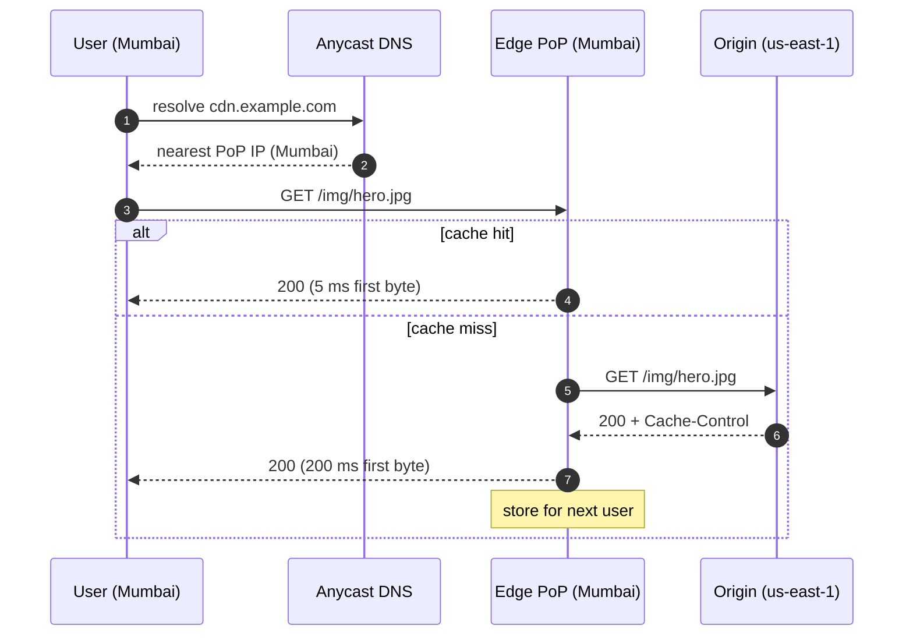

## Definition (interview-ready)

A **CDN** (Content Delivery Network) is a globally distributed cache of edge servers (PoPs — Points of Presence) that sit close to users, serving static content (and increasingly dynamic content) on behalf of an origin server. Users hit the nearest PoP via **Anycast DNS** + **BGP**; caches are invalidated/refreshed by **purge** and **TTL** semantics.

## Why it matters

Once your app has users in more than one country, the speed of light becomes the bottleneck. A CDN drops first-byte latency from 200ms to 20ms, absorbs traffic spikes (the origin sees a tiny fraction of requests), and absorbs DDoS. Every modern app — web, mobile API, video — uses a CDN.



## Core concepts

### Why a CDN

- **Latency**: cross-continent round trip is ~150ms. PoPs in 50+ cities cut this to ~10–30ms.
- **Throughput**: aggregate edge bandwidth dwarfs origin's. Big video, big releases, big sales.
- **Offload**: origin serves only cache misses (perhaps 1% of total).
- **DDoS absorption**: edges fronted by huge networks soak up attacks (Cloudflare, Akamai pride themselves on this).
- **TLS termination + HTTP/3** at the edge — fast handshake near the user.

### How traffic reaches the right PoP

- **Anycast**: same IP advertised from many locations via BGP. Internet routing chooses the closest.
- **DNS-based**: `cname.cdn.com` resolves to different IPs based on the resolver's location (GeoDNS).
- **Hybrid**: most modern CDNs do Anycast for speed and DNS for fallback / routing.

### What gets cached

- **Static assets**: images, CSS, JS, video chunks, fonts. Trivially cacheable, immutable filenames recommended.
- **HTML pages**: cacheable if not personalized.
- **API responses**: cacheable for GET endpoints with stable keys.
- **Video streaming**: HLS / DASH manifest + chunks. CDNs are the only way to scale this.
- **Dynamic**: edge compute (Cloudflare Workers, Lambda@Edge, Fastly Compute@Edge) generates responses at the edge.

### Cache key

Default: full URL. You can include / exclude query params and headers per route. Common knobs:
- `Vary: Accept-Encoding, Cookie` — separate cache entries per varying header.
- Strip tracking query params (`?utm_*`) so duplicate URLs share one cache entry.

### Cache control headers

- `Cache-Control: public, max-age=86400` — cacheable for 1 day.
- `Cache-Control: private, no-store` — never cache (sensitive data).
- `Cache-Control: s-maxage=600, max-age=60` — CDN gets 10min, browser 1min.
- `Cache-Control: stale-while-revalidate=300` — serve stale up to 5min while refreshing.
- `ETag: "abc"` and `Last-Modified` — conditional revalidation (`If-None-Match`, `If-Modified-Since`).
- `Surrogate-Control` — header for CDN only (origin can hide from browser).

### Invalidation (purge)

- **Purge by URL**: invalidate a specific path. Fast, instant.
- **Purge by tag / surrogate key**: tag responses on origin (`Surrogate-Key: product-42`). Purge by tag to wipe all related responses (product page, listings showing it, search results).
- **Wipe all**: nuclear option; expect a brief origin storm — use soft purge if possible.
- **Soft purge**: mark stale; next request triggers async refresh while serving stale.

### Edge compute

- **Cloudflare Workers**: V8 isolates, serverless functions in 250+ cities.
- **Lambda@Edge / CloudFront Functions**: AWS equivalent.
- **Fastly Compute@Edge**: WebAssembly-based, very fast.
- Use cases: A/B routing, header rewriting, auth checks, response personalization, light JSON shaping.

### Origin shield

- An extra cache layer between PoPs and origin. PoPs that miss go to the shield, which may have the data. Reduces origin load from N PoPs to 1 shield.
- AWS CloudFront, Akamai, Fastly all support this.

### Image / video optimization at the edge

- Resize, reformat (AVIF/WebP), compress on the fly based on `Accept` header.
- Adaptive bitrate streaming: PoP picks the right HLS variant based on the user's bandwidth.
- Saves origin storage + bandwidth.

## How it works (a CDN request)

```
1. Client resolves DNS for static.example.com → anycast IP of CDN.
2. Client opens TCP+TLS to nearest PoP (~20ms RTT).
3. PoP checks local cache:
   - Hit: respond.
   - Miss: ask the regional shield (or origin) → fill cache → respond.
4. Future requests within TTL → served from PoP directly.
```

## Real-world examples

- **Netflix**: huge CDN strategy. Built **Open Connect Appliances** — Netflix-owned CDN boxes inside ISPs. Saves transit cost, gets closest to users.
- **YouTube / Google**: own private CDN backbone.
- **Cloudflare**: anycast everywhere; powers a huge chunk of the public web.
- **Fastly**: powered news sites with fast purge; famously had a major outage in 2021 that took down half the internet for an hour.
- **Akamai**: original CDN, heavy enterprise / financial / video presence.

## Common pitfalls

- **Caching personalized pages**: leaking one user's data to another. Always `Cache-Control: private` (or vary by auth) for authenticated responses.
- **Vary explosion**: `Vary: User-Agent` → thousands of cache entries per URL → near-zero hit rate. Strip variation you don't need.
- **Query string variations**: `?utm_*` doubles cache entries pointlessly. Strip them at the edge.
- **Long TTL on something you'll need to change**: prefer cache-busting filenames (`app.abc123.js`) for static; short TTL or tag-purge for dynamic.
- **Origin hiding behind CDN by IP**: attackers find your origin via historical DNS / SSL transparency logs. Use origin auth (CF Tunnel, AWS WAF + signed requests) to refuse non-CDN traffic.
- **Purge floods**: aggressive purges trigger origin stampedes — use soft purge or staggered.
- **HTTPS misconfiguration**: CDN ↔ origin TLS can be weaker than client ↔ CDN. Set "full strict" mode.

## Interview questions

### Q1 — Easy: What problems does a CDN solve?
Latency (PoPs near users), throughput (massive aggregate bandwidth), origin offload (CDN absorbs >99% of traffic for static content), DDoS protection (edges have huge capacity), and TLS termination near the user.

### Q2 — Easy: What's the difference between max-age and s-maxage?
`max-age` applies to all caches including browsers. `s-maxage` applies only to **shared caches** (CDNs, proxies) — useful when you want a different TTL at the edge vs in the browser.

### Q3 — Medium: How does cache invalidation work in a CDN?
Two main approaches: **TTL-based** — content expires automatically; new request re-validates with origin. **Purge** — explicit eviction by URL, tag/surrogate key, or all. Modern systems use both: long TTL + targeted purge on content changes. Soft purge marks stale and serves while async revalidating.

### Q4 — Medium: How does Anycast DNS work for a CDN?
Multiple data centers advertise the same IP address via BGP. Internet routers pick the topologically closest one. So `1.1.1.1` resolves to a different physical box for users in different locations — without any per-user logic. Combined with PoP redundancy, it gives instant failover too.

### Q5 — Medium: When can/can't you cache an API response in a CDN?
**Can**: GET requests with stable keys, low personalization, public data (product catalog, public profile, public posts). **Can't (without care)**: personalized data, authenticated endpoints, anything with side effects. **Sometimes**: cache the public part of a personalized page, hydrate the rest client-side or via edge compute.

### Q6 — Hard: Design caching for a news site's article pages — millions of pageviews per article, occasional edits.
- **Origin**: render full article HTML.
- **Cache**: long TTL (1 hour), `s-maxage=3600` at CDN, shorter at browser.
- **Surrogate-Key** = article ID + tag(s).
- **Edit flow**: editorial CMS triggers purge by surrogate key → invalidates article and any pages tagged with it (category, search). Use soft purge to avoid origin spike.
- **Edge compute** for personalization (recommended-for-you side panel) so the main article body stays cacheable.
- **A/B variants** → separate cache key per variant; use Vary or distinct paths.

### Q7 — Hard: Your CDN hit rate is 70% but you expect 99%. Investigate.
- **Cache-Control headers** missing or short-lived (audit a sample).
- **Vary header** causing fragmentation (Vary: User-Agent is a classic killer).
- **Query string variations** uncoalesced (utm tracking).
- **Cookie variations** — auth cookies preventing caching.
- **PoP-level evictions** — small/cold PoPs evict due to memory pressure.
- **Origin sending no-store / private inadvertently** — CDN obeys.
- **Inconsistent URLs** for the same asset (e.g., versioned vs unversioned).

### Q8 — Hard: How do you protect origin behind a CDN from being hit directly?
- **IP allowlist** at the firewall — only CDN IP ranges allowed.
- **CDN-issued signed headers / mTLS** between CDN and origin — origin rejects requests without them.
- **Cloudflare Tunnel / AWS PrivateLink** — no public origin at all; CDN connects via private network.
- **WAF rules** for bot signatures.
- Watch out for: historical DNS records, certificate transparency logs leaking origin IP. Move origin to a new IP and lock it down if leaked.

## TL;DR cheat sheet

- CDN = global cache + DDoS shield + TLS terminator near users.
- Anycast (BGP) or GeoDNS routes users to nearest PoP.
- Cache key = URL + selected headers. Watch `Vary` carefully.
- `Cache-Control`, `s-maxage`, `stale-while-revalidate`, `ETag` are your levers.
- Invalidate via TTL (default) and purge (URL or surrogate key).
- Edge compute (Workers, Lambda@Edge) for personalization without losing cache hits.
- Origin shield + tag purge for big sites.
- Lock origin so it can only be reached via CDN.

## Go deeper

- **Cloudflare Learning**: [what is a CDN](https://www.cloudflare.com/learning/cdn/what-is-a-cdn/), [Anycast](https://www.cloudflare.com/learning/cdn/glossary/anycast-network/), [HTTP caching](https://www.cloudflare.com/learning/cdn/what-is-caching/).
- **Fastly blog**: surrogate keys, stale-while-revalidate, varnish-derived terminology.
- **MDN**: [HTTP caching](https://developer.mozilla.org/en-US/docs/Web/HTTP/Caching) — the canonical reference for headers.
- **Netflix Open Connect** docs and blog posts.
- **RFC 7234** (HTTP caching) — short and worth reading once.
- **Cloudflare YouTube**: "How Cloudflare works" series.
