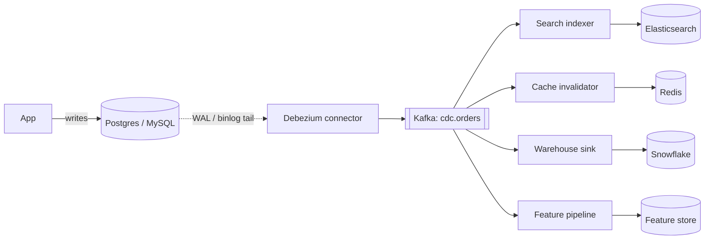

## Definition (interview-ready)

**Change Data Capture (CDC)** is the practice of streaming every row-level change in a database (INSERT, UPDATE, DELETE) as an event to a downstream system, typically by tailing the database's replication log (binlog / WAL). Tools like **Debezium** (Kafka Connect) and **Maxwell** read the log directly so the source app doesn't need to know it's emitting events.

## Why it matters

CDC is how modern systems propagate the source of truth (a database) to caches, search indexes, data warehouses, ML feature stores, downstream services, and audit logs — without dual writes (which would be race-prone) and without rewriting the app. It powers the "event-driven architecture" most teams talk about.



## Core concepts

### Why not just dual-write?

Naive: app writes to DB AND emits an event to Kafka. Problems:
- One can succeed and the other fail → divergence.
- Network blip between the two → ordering issues.
- "Reads from cache after write" inconsistency until the second write propagates.

**Dual writes are an antipattern** because there's no atomic operation across DB + Kafka. Solutions:
1. **CDC** — derive events from the DB log (this topic).
2. **Outbox pattern** — write to DB + outbox row in same transaction; CDC reads outbox.
3. **Distributed transactions (2PC)** — slow, fragile.

### How CDC works

Modern DBs already maintain a replication log:
- Postgres: **WAL** (Write-Ahead Log) + logical decoding.
- MySQL: **binlog** (row-based).
- SQL Server: transaction log.
- MongoDB: **oplog**.

CDC tools subscribe to that log as if they were a replica:
1. Take a **snapshot** of current state (consistent at a single log position).
2. Tail the log forward in order.
3. Translate each row-level change into an event (JSON/Avro/Protobuf) with **before** and **after** images + metadata (op, ts, txn id).
4. Publish to Kafka (or Kinesis, Pulsar).

### Event shape (Debezium-style)

```json
{
  "before": { "id": 42, "name": "Aman", "balance": 100 },
  "after":  { "id": 42, "name": "Aman", "balance": 150 },
  "source": { "table": "users", "ts_ms": 1716985200000, "lsn": "..." },
  "op": "u",   // c=create, u=update, d=delete, r=snapshot read
  "ts_ms": 1716985200000
}
```

### Debezium

- Built on Kafka Connect (so it benefits from connect's cluster/restart semantics).
- Connectors for Postgres, MySQL, MongoDB, SQL Server, Oracle, Cassandra, etc.
- Topic naming: one Kafka topic per source table.
- Schema registry integration (Avro/Protobuf).
- Snapshot mode + incremental.

### Maxwell

- MySQL-only (originally).
- Simpler than Debezium; reads binlog, emits JSON.
- Lighter weight; used by smaller setups.

### Use cases

1. **DB → Search**: keep Elasticsearch in sync with Postgres without app changes.
2. **DB → Cache invalidation**: precise key-level invalidation via CDC events.
3. **DB → Warehouse**: stream into Snowflake/BigQuery/S3 (modern ELT).
4. **DB → Microservices**: other services consume events instead of querying the DB.
5. **Audit log**: every change captured with metadata.
6. **DB migration / replatform**: dual-write transitional period.

### Outbox pattern (CDC's best friend)

For when you want **app-emitted** events (not just raw row changes), but still atomically with the DB write:
1. In the same DB transaction: write business data + insert into `outbox` table.
2. CDC tails the `outbox` table.
3. Downstream consumes nicely typed business events; failure-free because DB commit is the boundary.

This is the standard pattern in microservices that need to emit events on writes.

### Ordering and partitioning

- A CDC stream from a single DB is naturally ordered.
- When publishing to Kafka, key by **primary key** of the row → events for the same row land in the same Kafka partition → preserved order at the row level.
- Across rows / transactions, order is preserved within a partition only.

### Compacted topics for CDC

Use Kafka **log compaction** on CDC topics: Kafka retains only the latest event per key. Result: a "table state" topic where the topic represents current state per row. Used by Kafka Streams for state, by other services that want to consume "current state" rather than "stream of changes."

### Snapshot challenges

The initial snapshot of a big table can take hours or days. Debezium 2.x added **incremental snapshots** — slice the snapshot into chunks, alternated with log tailing. Less disruptive.

## How it works (Postgres CDC end-to-end)

```
Postgres:
  Configure logical replication: wal_level=logical, max_replication_slots=N
  CREATE PUBLICATION pub_orders FOR TABLE orders;

Debezium connector:
  Creates replication slot, starts replication stream
  Reads decoded WAL: row-by-row changes
  Snapshot existing rows (consistent at LSN start)
  Publishes to topic "dbserver1.public.orders" partitioned by PK

Consumer:
  Reads topic, applies to Elasticsearch / cache / warehouse
  At-least-once delivery; idempotent on PK
```

## Real-world examples

- **Airbnb**: huge CDC pipeline from MySQL → DataWarehouse, eliminating dual-writes.
- **Shopify**: MySQL → Kafka via CDC for downstream services.
- **Netflix**: CDC from Cassandra and MySQL into data platform.
- **Square**: Outbox + Debezium for service event emission.
- **LinkedIn**: Brooklin (their own CDC + replication system).

## Common pitfalls

- **Replication slot retention** (Postgres): an unconsumed slot keeps WAL files forever → disk fills. Monitor lag and slot age.
- **Schema changes**: ALTER TABLE during snapshot or active streaming can break the connector. Use connector's schema-history handling; coordinate DDL.
- **DELETE handling**: CDC emits a "delete" event; downstream must process it (else stale rows linger). Some configs add a **tombstone** event for compaction.
- **Capturing too much**: every column change creates events. Filter columns/tables you actually need (`column.exclude.list`).
- **Long transactions**: Postgres WAL can't be truncated past oldest active txn → unbounded WAL growth. Keep transactions short.
- **Reordering on partition boundaries**: partition by primary key, never round-robin.
- **CDC as a queue**: don't use CDC for transient events — use a dedicated topic + producer for those.
- **Snapshot impact**: snapshotting a hot table can hammer the DB. Use read replica or incremental snapshot.
- **PII**: CDC dumps full row before/after. Mask sensitive columns at the connector level.

## Interview questions

### Q1 — Easy: What is CDC?
Change Data Capture — streaming every change to a database (insert/update/delete) as an event by reading the DB's replication log, without touching the application that writes.

### Q2 — Easy: Why is CDC better than dual-write?
Dual-write (app writes DB + emits event) has no atomic boundary — one can succeed and the other fail. CDC derives events from the DB log itself, so events match the committed DB state exactly. No divergence possible.

### Q3 — Medium: How does the outbox pattern work?
In the same DB transaction, the app writes business data AND an "outbox" row describing the event. CDC reads the outbox table and publishes the events. Because the outbox write is in the same transaction as the business data, you get atomicity — and you get nicely typed business events (not raw row diffs).

### Q4 — Medium: How does Debezium handle the initial snapshot?
On first start, takes a consistent snapshot of selected tables — reading rows while bookmarking a replication log position. Emits each row as a "read" event. Then switches to tailing the log from that position forward. Recent versions support **incremental snapshots** that interleave with normal streaming for large tables.

### Q5 — Medium: How do you preserve row-level ordering in CDC events sent to Kafka?
Partition the Kafka topic by primary key. All events for the same row land in the same partition, where Kafka preserves order strictly.

### Q6 — Hard: A Debezium-based pipeline starts dropping events after a deployment. What do you check?
- **Replication slot**: is it still attached? Was it dropped accidentally?
- **WAL position** (Postgres): is the slot keeping up, or is it lagging? Has WAL retention been exceeded?
- **Schema changes**: did a DDL break the connector's schema history?
- **Connector state**: errors in Kafka Connect; restart limits hit?
- **Topic creation**: new topic for a new table needs config (or `auto.create.topics.enable`).
- **DLQ** in the connector — bad events may be quarantined.

### Q7 — Hard: How would you use CDC to sync Postgres to Elasticsearch for search?
- Configure Debezium Postgres connector.
- Topic per table; partition by PK.
- Build a consumer (or Kafka Connect Elastic sink) that:
  - On `c`/`u`: upsert into Elasticsearch (idempotent by `_id` = PK).
  - On `d`: delete document.
- Use a transform to flatten before/after into the document shape Elasticsearch wants.
- Handle schema evolution: index template + dynamic mapping.
- Backfill via initial snapshot.

### Q8 — Hard: A team uses CDC and ships a giant SQL migration with `UPDATE huge_table SET col = ?`. What happens?
- One huge transaction → millions of CDC events in a single transaction.
- Downstream backs up; Kafka topic lag spikes.
- Postgres WAL retention may temporarily balloon (slot can't move until txn completes).
- Snapshot of new col values may be incomplete in downstream until catchup.
- Fix forward: throttled chunked migration (1000 rows at a time, commit between).

## TL;DR cheat sheet

- CDC = stream row-level changes by tailing the DB replication log (binlog/WAL).
- Replaces fragile dual-writes.
- Debezium (multi-DB, Kafka Connect) and Maxwell (MySQL, simpler) are the common tools.
- Event shape: before/after/op/ts/source. Partition Kafka topic by primary key.
- Use **outbox pattern** for app-emitted business events.
- Use **compacted topics** when you want "current state per key."
- Watch replication slot retention, WAL growth, schema changes, PII in row dumps.
- Initial snapshot can be heavy — use incremental in modern Debezium.

## Go deeper

- **Debezium docs**: [debezium.io/documentation](https://debezium.io/documentation/) — examples per DB.
- **Confluent**: ["No More Silos: Integrating Databases into Apache Kafka"](https://www.confluent.io/blog/no-more-silos-how-to-integrate-your-databases-with-apache-kafka-and-cdc/).
- **Martin Kleppmann**: ["Turning the Database Inside Out"](https://www.youtube.com/watch?v=fU9hR3kiOK0) — the philosophy behind CDC.
- **Microservices.io**: [Outbox pattern](https://microservices.io/patterns/data/transactional-outbox.html).
- **DDIA Chapter 11** — change streams.
- **Gunnar Morling's blog** (Debezium lead): superb writeups.
