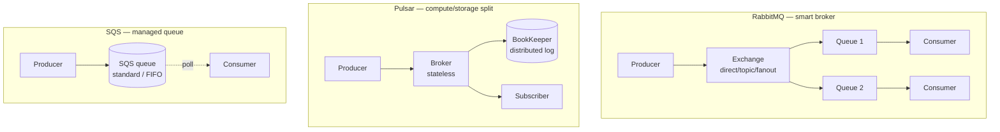

## Definition (interview-ready)

**RabbitMQ** is a traditional message broker with rich routing (exchanges/queues, fanout, topic, headers) over AMQP — flexible but per-message overhead. **Apache Pulsar** is a Kafka-like streaming platform that separates compute (brokers) from storage (BookKeeper), supports both queueing and streaming semantics, and has built-in geo-replication and multi-tenancy. **Amazon SQS** is a fully managed AWS queue (Standard = at-least-once, FIFO = ordered + exactly-once at the queue boundary), with no broker to operate.

## Why it matters

Picking the right messaging system is a long-term commitment — operationally, architecturally, and culturally. Knowing the trade-offs avoids spending six months later migrating off the wrong choice.

| | RabbitMQ | Kafka | Pulsar | SQS |
|---|---|---|---|---|
| Model | smart broker | log | broker + log | managed queue |
| Order | per-queue | per-partition | per-partition | FIFO mode only |
| Retention | drain | configurable | tiered | 14 d max |
| Throughput | 10s K/s | 1M+/s | 1M+/s | unlimited (managed) |
| Ops cost | medium | high | high | none (AWS-managed) |

## Core concepts

### RabbitMQ

- **Protocol**: AMQP 0-9-1 (mature, expressive).
- **Routing model**: producers publish to **exchanges**, exchanges route to **queues** based on bindings (direct, topic, fanout, headers).
- **Consumer pattern**: queue-based — once consumed and acked, the message is gone.
- **Per-message state**: each message has acks, redeliveries, dead-lettering.
- **Strengths**: rich routing (request/reply, RPC), per-message TTL, priority queues, delayed delivery.
- **Weaknesses**: limited throughput (~50–100K msgs/sec/broker), bookkeeping overhead per message, harder to scale horizontally for high-volume streaming.
- **HA**: mirrored queues (deprecated) → **Quorum Queues** (Raft, recommended) → **Streams** (newer, Kafka-style append-only log).
- **Use cases**: task queues, RPC, asynchronous workflows, microservices with diverse routing needs.

### Apache Pulsar

- **Architecture**: brokers (stateless) + BookKeeper (storage). Compute and storage scale independently.
- **Topics**: like Kafka topics, partitioned and replicated.
- **Subscription modes** (the killer feature):
  - **Exclusive** — one consumer.
  - **Failover** — backup consumer takes over if primary dies.
  - **Shared** — round-robin across consumers (queue-style).
  - **Key_Shared** — consistent-hash by key (preserves per-key order across consumers).
- **Tiered storage**: cold data automatically offloaded to S3/GCS.
- **Geo-replication**: built-in cross-cluster replication.
- **Multi-tenancy**: namespaces, tenants, RBAC.
- **Strengths**: combines streaming (Kafka-style) and queueing (RabbitMQ-style) in one system; better separation of storage and compute; built-in tiered storage and geo-replication.
- **Weaknesses**: smaller ecosystem than Kafka; BookKeeper adds operational complexity; fewer managed offerings (StreamNative, DataStax Astra, Confluent does not).
- **Use cases**: when you want Kafka + queue semantics + multi-tenancy + tiered storage and you have the ops bandwidth.

### Amazon SQS

- **Standard queue**: at-least-once, best-effort ordering, very high throughput (essentially unlimited), 256KB max message.
- **FIFO queue**: exactly-once + ordered within a **message group ID**. 3000 msgs/sec/group, 30K/sec total (with high throughput mode).
- **Visibility timeout**: message hidden after consumer reads, until ack or timeout (default 30s).
- **DLQ**: built-in.
- **Long polling**: up to 20s for a message.
- **Strengths**: zero ops, integrated with AWS (Lambda triggers, SNS fanout, EventBridge).
- **Weaknesses**: no replay (messages deleted after ack); 256KB max payload; FIFO throughput limits; vendor lock-in.
- **Use cases**: simple AWS-native queue between Lambdas / ECS / EC2, fanning out via SNS+SQS, decoupling slow consumers.

### Kafka (for comparison)

- **Streaming-first**: append-only log; consumers track offsets; replay supported.
- **High throughput**: millions of msgs/sec.
- **Ordering**: per partition.
- **Storage**: tied to brokers (until tiered storage, recently added).
- **Use case**: event sourcing, analytics, CDC, high-throughput pipelines.

## Comparison table

| | RabbitMQ | Pulsar | SQS | Kafka |
|---|---|---|---|---|
| Model | Queue (rich routing) | Queue + Streaming | Queue | Streaming log |
| Throughput | 50–100K/s/broker | Millions/s | Standard: unlimited; FIFO: 30K/s | Millions/s |
| Ordering | Per queue | Per partition or key (Key_Shared) | FIFO per group | Per partition |
| Replay | Limited (Streams) | Yes | No | Yes |
| Delivery semantics | At-most/least-once, exactly-once with care | At-least/most/exactly-once | At-least-once (Standard); exactly-once at queue boundary (FIFO) | At-least-once + EOS in Kafka boundary |
| Multi-tenancy | Per vhost | First-class (tenants/namespaces) | AWS account | Limited (ACLs) |
| Geo-replication | Federation/shovel | Built-in | Cross-region via S3 events | MirrorMaker / Cluster Linking |
| Storage tiering | None | Built-in | N/A (managed) | Tiered storage (recent) |
| Ops burden | Medium | High (without managed) | None | High (without managed) |
| Best for | Task queues, RPC, microservice routing | Streaming + queueing in one, multi-tenant | Simple AWS queueing | High-throughput streaming |

## When to pick which

- **You're building a task queue with retries and delays** → RabbitMQ (or SQS if AWS-native).
- **You're building an event bus for microservices** → Kafka or Pulsar.
- **You need both queue (per-message work) and stream (replay) semantics** → Pulsar (it does both natively).
- **You're entirely on AWS and want zero ops** → SQS, with SNS for fanout.
- **You need geo-replicated multi-tenant streaming** → Pulsar.
- **You have a Kafka-heavy team already** → stay Kafka unless you have a specific Pulsar need.
- **You need RPC patterns (request/reply)** → RabbitMQ has reply queues; many use gRPC instead.

## Common pitfalls

- **Choosing RabbitMQ for streaming workloads** — you'll hit throughput walls and ops pain.
- **Choosing Kafka for task queues** — works, but you'll write your own delay, priority, retry — RabbitMQ does it natively.
- **SQS FIFO throughput surprises**: 3000 msgs/sec **per message group ID** is a real cap. Choose group ID to spread load.
- **Pulsar BookKeeper operations**: separate storage layer = more to monitor. Many teams underestimate.
- **Mixing semantics**: trying to use one queue for replay + work distribution → frustration. Use the system suited to each.

## Interview questions

### Q1 — Easy: When would you pick RabbitMQ over Kafka?
For task/worker queues with per-message ack, retries, delays, priority, complex routing (topic exchanges), and moderate throughput. Kafka is overkill and inconvenient for those patterns.

### Q2 — Easy: What's the difference between SQS Standard and FIFO?
Standard: at-least-once delivery, best-effort ordering, very high throughput. FIFO: ordered + exactly-once within a message group, lower per-group throughput (3K/sec).

### Q3 — Medium: How is Pulsar's architecture different from Kafka's?
Pulsar separates the broker (compute, stateless) from BookKeeper (storage). Brokers can be added/removed independently. Compaction, replication, and tiered storage happen in BookKeeper. Kafka couples compute and storage in a broker (tiered storage in Kafka is recent).

### Q4 — Medium: Pulsar offers Key_Shared subscription. What is it and when is it useful?
Multiple consumers receive messages from the same partition, but messages with the same **key** always go to the same consumer. Lets you scale beyond one consumer per partition while preserving per-key ordering. Kafka can't do this within one consumer group (one partition → one consumer).

### Q5 — Medium: Why is SNS+SQS a common pattern on AWS?
SNS is publish/subscribe (one event, many subscribers); SQS is a durable queue. Combine: producer publishes to SNS, multiple SQS queues subscribe → fanout with durable per-subscriber queues. Each consumer process its own queue independently. Backpressure isolated per subscriber.

### Q6 — Hard: A team uses RabbitMQ as a "log" (subscribers join, replay old messages, multiple consumer groups). What's wrong?
RabbitMQ queues are consumed-and-gone — no replay. Subscribers joining late don't see prior messages. Multiple "consumer groups" require multiple queues bound to the same exchange with separate state. The team is forcing a queue into a log shape. Migrate to Kafka, Pulsar, or RabbitMQ **Streams** (newer feature that mimics Kafka logs).

### Q7 — Hard: Design a multi-region event bus serving 10 microservices across 3 regions, with strict per-key ordering and tier-cold replay.
- **Pulsar** would be the natural fit: built-in geo-replication, partitioned topics with key-based routing, tiered storage to S3 for cold data, multi-tenancy for namespaces.
- Alternative: **Kafka with MirrorMaker 2** (or Confluent Cluster Linking) and tiered storage (Kafka 3.6+).
- Key by entity ID for per-entity ordering.
- Plan for cross-region latency on replication; consumers in each region read from local cluster.
- Schema registry shared (or replicated).

### Q8 — Hard: Compare RabbitMQ Quorum Queues vs Kafka partitions for durability.
Quorum Queues use **Raft consensus** across N replicas; writes acked on majority. Strong consistency, durable. Throughput ~ tens of thousands/sec per queue. Kafka partitions use leader/replica with ISR; writes acked by min ISR. Higher throughput (sequential-log advantage), but no consensus for offsets (no Raft until KRaft). Both durable; Kafka usually faster per partition; Quorum Queues better for per-message semantics (ack, redeliver).

## TL;DR cheat sheet

- **RabbitMQ**: queue with rich routing; great for task queues + RPC. Throughput limited.
- **Pulsar**: streaming + queueing in one. Separate compute (broker) + storage (BookKeeper). Multi-tenant, geo-replicated, tiered storage. More ops.
- **SQS**: zero-ops AWS queue. Standard = high throughput, best-effort order; FIFO = ordered + dedupe with throughput caps.
- **Kafka**: streaming log; replay, high throughput; per-partition order.
- Pick based on patterns: task queue → RabbitMQ/SQS; event log → Kafka/Pulsar; multi-tenant streaming → Pulsar; AWS-native, simple → SQS.

## Go deeper

- **ByteByteGo**: ["RabbitMQ vs Kafka vs Pulsar"](https://blog.bytebytego.com/p/ep203-rabbitmq-vs-kafka-vs-pulsar).
- **Pulsar docs**: [pulsar.apache.org](https://pulsar.apache.org/docs/).
- **RabbitMQ docs**: [rabbitmq.com](https://www.rabbitmq.com/documentation.html) — specifically the [Streams](https://www.rabbitmq.com/streams.html) and [Quorum Queues](https://www.rabbitmq.com/quorum-queues.html) sections.
- **AWS SQS docs**: [docs.aws.amazon.com/AWSSimpleQueueService](https://docs.aws.amazon.com/AWSSimpleQueueService/latest/SQSDeveloperGuide/welcome.html).
- **StreamNative blog**: deep Pulsar content (founders' company).
- **Talk**: "Apache Pulsar 101" by Jowanza Joseph or Confluent comparisons of Kafka vs Pulsar.
