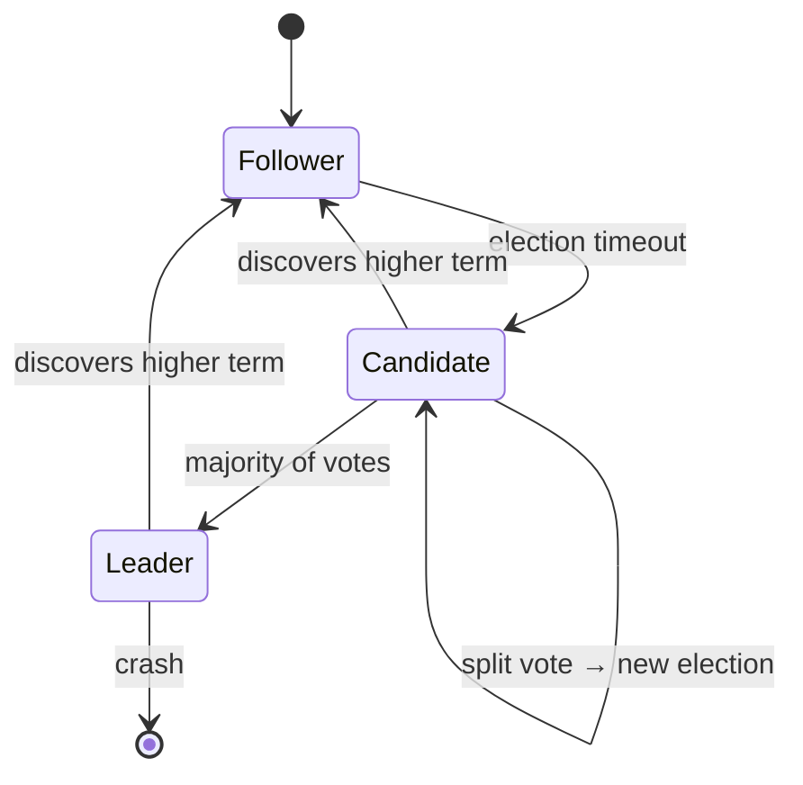

## Definition (interview-ready)

**Consensus** is the problem of getting multiple distributed processes to agree on a single value (or sequence of values) despite failures and network partitions. **Paxos** (Lamport, 1989) is the original algorithm — correct but notoriously hard to understand. **Raft** (Ongaro & Ousterhout, 2014) is a more understandable redesign with the same safety guarantees, used by etcd, Consul, CockroachDB, TiDB, MongoDB replica sets, Redis Cluster (variant), and Kafka KRaft.

## Why it matters

Every system that needs leader election, distributed locks, atomic config updates, or replicated state machines uses consensus under the hood. Knowing what consensus guarantees (and the cost of providing it) lets you decide when to lean on Raft/Paxos vs softer designs (gossip, CRDTs, last-write-wins).

<Anim id="raft" />



## Core concepts

### What consensus solves

Given N processes that can crash, restart, or be partitioned:
- **Agreement**: all non-faulty nodes decide on the same value.
- **Validity**: the decided value was proposed by some node.
- **Termination**: all non-faulty nodes eventually decide.

The FLP impossibility (Fischer-Lynch-Paterson, 1985) proves that in fully asynchronous networks, no deterministic consensus algorithm guarantees termination with even one faulty node. Real systems sidestep with **timeouts** + **randomization**.

### Majority quorums

Consensus requires a **majority** (`floor(N/2) + 1`) to agree. With N=3, you need 2; with N=5, you need 3.

- 3 nodes → tolerates 1 failure.
- 5 nodes → tolerates 2 failures.
- 7 nodes → tolerates 3 failures.

Why **odd N**? Even N (e.g., 4) tolerates the same number of failures as N-1 (3), but needs more nodes for the same majority. Diminishing return; odd is convention.

### Raft

The whole algorithm is built around **a strong leader**. Time is divided into **terms** — each term has at most one leader.

#### Raft has three subproblems

1. **Leader election** — pick a single leader per term.
2. **Log replication** — leader sends log entries to followers.
3. **Safety** — committed entries are never lost.

#### States

Each node is one of: **Follower**, **Candidate**, **Leader**.

#### Leader election

- Followers run a randomized election timeout (150–300ms).
- If no heartbeat, they become **Candidate**, increment term, vote for themselves, request votes from peers.
- A node grants a vote if (a) it hasn't voted this term, (b) the candidate's log is at least as up-to-date as its own.
- Candidate with majority becomes Leader; if split vote, randomized backoff and retry.

#### Log replication

- Leader appends client commands to its log.
- Sends `AppendEntries` to followers.
- Followers append and acknowledge.
- Once a majority has acknowledged, the entry is **committed** and applied to the state machine.
- Leader sends commit index in next AppendEntries.

#### Safety invariants

- **Log matching**: if two logs have the same `(term, index)`, all preceding entries match.
- **Leader completeness**: a committed entry is in the log of every future leader's term ≥ that term.
- **State machine safety**: if a server has applied an entry at index i, no other server applies a different entry at i.

#### Snapshotting

Logs grow unboundedly. Periodically take a snapshot of state and discard log entries before the snapshot index. New followers receive snapshot + log tail to catch up.

#### Cluster membership changes

Done in two steps via **joint consensus** to avoid two majority cliques: old config + new config briefly both active until the transition commits.

### Paxos (overview)

- **Proposers, Acceptors, Learners** roles.
- Two phases: **Prepare** (numbered proposal, gather promises) and **Accept** (with majority).
- Original Paxos proves a single value; **Multi-Paxos** extends to a log of values by amortizing prepare via a stable leader.
- Hard to implement correctly; many subtle variants (Fast Paxos, Cheap Paxos, Egalitarian Paxos).

Paxos is **algorithmically equivalent in safety/availability to Raft** but harder to understand and implement. Hence Raft's popularity.

### Variants and alternatives

- **Multi-Paxos**: Paxos for a log of decisions.
- **Egalitarian Paxos (EPaxos)**: lets any node serve as leader for non-conflicting operations.
- **Zab** (ZooKeeper): a Paxos variant.
- **Viewstamped Replication**: an academic ancestor to Raft/Paxos.
- **PBFT / Tendermint / HotStuff**: Byzantine fault tolerant — handle malicious nodes (blockchain).

### Liveness vs safety

- **Safety**: nothing bad happens (no two leaders, no committed-then-lost entry). Always preserved by Raft/Paxos.
- **Liveness**: progress eventually. Depends on timely networks; can stall during long partitions or split votes.

## How it works (Raft log replication)

```
1. Client sends command to Leader L.
2. L appends (term, index, command) to its log.
3. L sends AppendEntries(prevTerm, prevIndex, [command], commitIndex) to all followers.
4. Followers verify prevTerm/prevIndex matches → append → ack.
5. When L sees majority ack, sets commitIndex = index.
6. L applies command to state machine, responds to client.
7. In next heartbeat, L tells followers new commitIndex; they apply too.
```

## Real-world examples

- **etcd**: Raft-based KV store; backbone of Kubernetes.
- **Consul**: service discovery + KV; Raft underneath.
- **CockroachDB**: Raft per range (a shard), thousands of Raft groups per cluster.
- **TiKV / TiDB**: same pattern.
- **MongoDB replica sets**: Raft-like.
- **Kafka KRaft**: Raft replacing ZooKeeper for metadata.
- **Google Chubby**: Paxos-based lock service — foundational paper.
- **Apache ZooKeeper**: Zab, used for coordination by HBase, Hadoop, Solr.

## Common pitfalls

- **Even number of voters**: split votes more likely; choose odd.
- **Single-node "consensus"**: not consensus, no fault tolerance.
- **Network partitions and minority side**: minority can't make progress (correct — it must give up availability to preserve consistency).
- **Long election timeouts**: slow failover. Too short: false elections. Tune to network RTTs.
- **Disk fsync per log append**: critical for safety but slow → group commit.
- **Snapshot blocking**: take asynchronously or you stall the cluster.
- **Joint consensus implementation bugs**: many Raft bugs in cluster reconfiguration; use a battle-tested library.
- **Believing consensus is cheap**: every committed entry is one RTT to a majority. Cross-DC = expensive. Place voters in same region.

## Interview questions

### Q1 — Easy: Why does Raft need an odd number of nodes?
Because consensus requires a majority quorum. Even N gives the same fault tolerance as N-1 (e.g., 4 tolerates 1 fault same as 3) but uses more nodes for the same majority. Odd is the efficient choice.

### Q2 — Easy: What does it mean for a Raft entry to be "committed"?
An entry is committed when the leader has replicated it to a majority of nodes (including itself). Committed entries are durable across leader changes and will eventually be applied to the state machine on every node.

### Q3 — Medium: Walk through Raft leader election.
On election timeout (randomized, e.g., 150–300ms), a follower becomes candidate, increments its term, votes for itself, and sends RequestVote to all peers. Followers grant a vote if they haven't voted this term AND the candidate's log is at least as up-to-date as their own. Candidate with majority becomes leader. Randomization prevents continuous split votes.

### Q4 — Medium: How does Raft handle a network partition?
Side with the majority can still elect a leader and commit; side with minority cannot — they may elect a candidate but can't get a majority. When partition heals, minority leader (if any) steps down on seeing higher term; their uncommitted entries are discarded.

### Q5 — Medium: Why are Paxos and Raft considered equivalent?
Both solve consensus with the same safety properties (agreement, validity), tolerate f failures with 2f+1 nodes, and rely on majority quorums. Paxos is more general but harder to implement; Raft is opinionated (strong leader) and easier to understand and verify.

### Q6 — Hard: A 5-node Raft cluster has 2 nodes in DC-A and 3 in DC-B. DC-B becomes unreachable. What happens?
The 2 DC-A nodes can't form a majority (need 3). They stop committing and may keep electing without success. The 3 DC-B nodes (if connected to each other) can keep operating with their majority — they continue serving writes and reads.

If DC-B becomes split-brain (its 3 nodes can talk to each other but not DC-A), DC-A is effectively unavailable for writes. Reconfigure proactively or accept the asymmetry.

### Q7 — Hard: How would you minimize consensus latency across regions?
- **Place voters in same region** when possible — cross-region RTT is brutal.
- **Use read-only learners** in other regions — they don't vote but can serve stale reads.
- **Lease-based reads** (Raft optimization): leader holds a lease and can serve reads without consulting followers.
- **Multi-Raft per range** (CockroachDB approach): different Raft groups, different leader placements per data range.
- **Don't put consensus in the hot path** for everything — use it for metadata and replication, not every key operation.

### Q8 — Hard: A Raft cluster has 3 nodes. Node 1 (leader) crashes. Nodes 2 and 3 elect node 2. Node 1 returns with uncommitted entries. What happens?
On rejoining, node 1 will hear from leader node 2 with a higher term. Node 1 reverts to follower, **discards any uncommitted entries** in its log that conflict with the new leader's, and accepts the new leader's log. If node 1 had committed entries that the new leader doesn't have — that's impossible by Raft's leader-completeness property (a new leader is guaranteed to have all committed entries because it needs a majority vote, and that majority must include at least one node with the committed entry).

## TL;DR cheat sheet

- **Consensus**: agreement among N nodes despite failures. Needs majority quorum.
- 3 nodes tolerate 1 failure, 5 tolerate 2, 7 tolerate 3. Use **odd**.
- **Raft**: strong leader; subproblems = leader election, log replication, safety.
- Leader election via randomized timeouts.
- Entries committed when majority acks. Apply to state machine in order.
- Safety: committed entries never lost across leader changes.
- **Paxos** = older, harder, same safety. Multi-Paxos for a log.
- Minority side of partition: unavailable for writes (consistency wins).
- Place voters in same region for latency; use learners across regions.
- Used by: etcd, Consul, CockroachDB, MongoDB, Kafka KRaft, Spanner (Paxos).

## Go deeper

- **Raft paper (Ongaro & Ousterhout, 2014)**: ["In Search of an Understandable Consensus Algorithm"](https://raft.github.io/raft.pdf) — readable, the recommended starting point.
- **Animated Raft**: [thesecretlivesofdata.com/raft](https://thesecretlivesofdata.com/raft/) — best visualization.
- **Raft Visualization** (interactive): [raft.github.io](https://raft.github.io/).
- **Ousterhout talk**: ["Designing for Understandability — The Raft Consensus Algorithm"](https://www.youtube.com/watch?v=vYp4LYbnnW8).
- **Paxos**: Lamport's ["Paxos Made Simple"](https://lamport.azurewebsites.net/pubs/paxos-simple.pdf) (the title is ironic — it isn't).
- **Heidi Howard's blog** — modern consensus research, very accessible.
- **Book**: *Designing Data-Intensive Applications*, Chapter 9.
