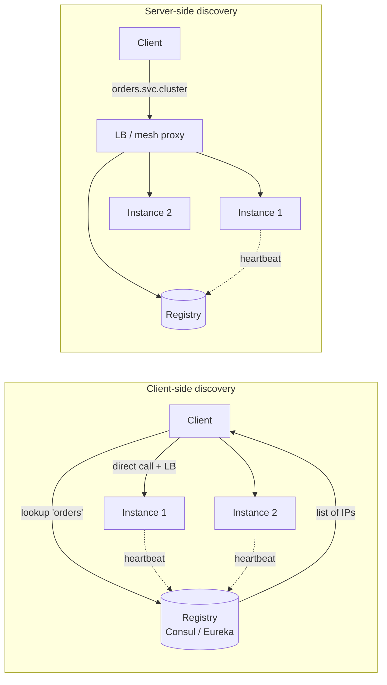

## Definition (interview-ready)

**Service discovery** is how services find the network addresses of others in a dynamic environment where instances come and go. **Client-side** discovery has clients query a registry directly; **server-side** discovery routes through a load balancer that does the lookup. **Health checks** track which instances are alive and ready to serve, so the registry/LB only routes to healthy ones.

## Why it matters

Static config + DNS works until your service auto-scales, deploys frequently, or runs containers — then instances change every few minutes. Service discovery + health checks are how Kubernetes, Consul, Eureka, and modern service meshes route correctly through that churn.



## Core concepts

### Why DNS alone isn't enough

- DNS TTLs cache aggressively (clients ignore changes for minutes).
- DNS doesn't track per-instance health (only what someone updated).
- DNS doesn't carry metadata (version, weight, zone).
- DNS is push-once, poll-when-cache-expires; not real-time.

You can patch some of this (low TTL, periodic re-resolve, health-checked DNS), but for fast-moving environments, dedicated service discovery is cleaner.

### Service registry

A database of "service X has these instances at these addresses, with these health states and metadata." Updated by:
- **Self-registration**: instance starts → POSTs to registry → de-registers on shutdown.
- **Third-party registration**: orchestrator (k8s, ECS) registers/deregisters based on container lifecycle.

Examples: Consul, etcd, Eureka, Zookeeper, kube-apiserver.

### Client-side discovery

Client queries the registry, picks an instance, calls it directly.

```
client → registry: "where is service X?"
registry → client: ["10.0.1.5:8080", "10.0.1.6:8080", "10.0.1.7:8080"]
client → 10.0.1.6:8080: actual request
```

Pros: no LB hop, client knows about all instances (can do smart load balancing — least-loaded, EWMA, locality-aware).
Cons: every client needs the registry client + LB logic. Polyglot environments duplicate code.

Used by: Eureka + Ribbon (classic Netflix), gRPC name resolvers.

### Server-side discovery

Client talks to a load balancer; LB queries the registry and routes.

```
client → LB at "service-x.internal" → picks 10.0.1.6:8080 → request
```

Pros: client logic is simple (DNS or fixed URL). LB centralizes policy.
Cons: extra hop; LB becomes single source of routing logic.

Used by: AWS ALB/NLB + target groups, Kubernetes Services (kube-proxy + DNS), Envoy sidecars.

### Service mesh (best of both worlds)

A **sidecar proxy** (Envoy, Linkerd-proxy) runs alongside every service. The mesh control plane (Istio, Linkerd) feeds the proxies routing rules and instance lists.

- Apps make requests as if to a local proxy (`localhost:9000`).
- Proxy handles discovery, load balancing, retries, mTLS, telemetry.
- Polyglot-friendly: app doesn't need a special library.
- Control plane = source of truth, data plane = proxies execute.

### Health checks

The registry needs to know which instances are healthy.

#### Types

- **Liveness**: is the process running? (Restart if not — k8s does this.)
- **Readiness**: is the process ready to serve? (Pull from LB if not. E.g., warming up cache.)
- **Startup**: separate to allow long initial boot before liveness kicks in.

#### Mechanisms

- **HTTP probe**: GET `/health` returns 200.
- **TCP probe**: can we open a connection on port X?
- **Exec probe**: run a script inside the container.
- **gRPC health check**: standard protocol.

#### Active vs passive

- **Active**: load balancer polls each instance every N seconds. Catches all failures; some baseline cost.
- **Passive (outlier detection)**: LB watches real traffic; ejects instances that error too much. Detects only what traffic reveals; cheap.

Combine: active health checks for binary up/down, passive outlier detection for "this one is misbehaving on real requests."

### Common patterns

- **Heartbeats**: instance posts "I'm alive" every N seconds. Registry removes after T seconds without heartbeat.
- **Gossip**: instances exchange membership state P2P (Consul, Cassandra). No central registry to fail.
- **DNS service discovery**: registry exposes DNS records (`service-x.consul`). Clients use DNS as usual but with low TTL or DNS push.

### Avoiding flapping

A node that "barely" passes/fails health check oscillates → traffic redirects every poll → bad UX.
- **Failure threshold**: 3 consecutive failures before marking unhealthy.
- **Hysteresis**: different thresholds for unhealthy → healthy than healthy → unhealthy.

### Caution: deep health checks

A `/health` endpoint that depends on DB + Redis + downstream services will report unhealthy whenever any of them is unhealthy. Result: every blip cascades into "service down."

Prefer:
- **Shallow liveness**: process is alive, not deadlocked.
- **Readiness**: process can accept traffic (warm cache, dependencies *known* to be available — but not necessarily perfectly healthy).
- **Specific dependency checks** as separate signals, not as overall health.

## How it works (k8s service discovery)

```
Pod starts → kube-apiserver registers endpoint in Service's Endpoints object.
kube-proxy on each node watches Endpoints, updates iptables/IPVS.
Pod B does "curl http://service-x" → DNS resolves to service ClusterIP.
ClusterIP routes via kube-proxy to a healthy pod.

Health: kubelet runs liveness/readiness probes; on failure, pod removed from Endpoints.
```

## Real-world examples

- **Kubernetes**: built-in service discovery via Services + kube-dns/CoreDNS.
- **Netflix Eureka + Ribbon**: classic client-side discovery for AWS deployments.
- **Consul**: discovery + KV + mesh; popular in non-k8s environments.
- **etcd**: powers k8s discovery (and many others as KV/coordination).
- **Istio + Envoy**: sidecar mesh; the modern best-practice for polyglot microservices.
- **AWS Cloud Map**: managed service discovery for ECS / EKS / EC2.

## Common pitfalls

- **DNS TTL too high**: failover delayed.
- **JVM DNS cache** (`networkaddress.cache.ttl=-1` by default in some JVMs): caches DNS forever. Set to 30s.
- **Deep health checks**: cascade failures across the fleet.
- **No graceful shutdown**: instance dies before deregistering → clients get connection refused for TTL window. Trap signals → deregister → drain → exit.
- **Heartbeat-only discovery without failure detection**: instance hangs without crashing → still heartbeats → traffic continues. Use active health checks.
- **Discovery as a single point of failure**: if the registry is down, can new instances be reached? Cache last-known-good locally.
- **Stale endpoints**: process restarted but k8s endpoint not yet updated → TCP RST for a few seconds. Use connection retries.

## Interview questions

### Q1 — Easy: What's the difference between client-side and server-side service discovery?
Client-side: client queries the registry directly, picks an instance, calls it. Server-side: client calls a load balancer (or service VIP); LB does the lookup and routes. Server-side simpler for clients; client-side enables richer load balancing decisions.

### Q2 — Easy: Why do we need both liveness and readiness probes?
Liveness = "is the process alive" (failure → restart). Readiness = "is the process ready to serve traffic" (failure → remove from LB but don't restart). A process can be alive but warming up, draining for shutdown, or experiencing a transient downstream issue — readiness handles these without unnecessary restarts.

### Q3 — Medium: How does service discovery work in Kubernetes?
Pods register with the apiserver (orchestrator-managed registration). Services group pods by label selector and get a stable virtual IP (ClusterIP). kube-proxy on each node watches the Endpoints object and updates iptables/IPVS rules so requests to the ClusterIP get DNATed to a healthy pod IP. DNS (CoreDNS) resolves service names to ClusterIPs.

### Q4 — Medium: What's a service mesh and what does it solve?
A network of sidecar proxies (one per pod) that handle service-to-service traffic — discovery, load balancing, retries, timeouts, mTLS, observability. Plus a control plane to push policy. Solves: polyglot service problem (no library per language), centralized policy, security (mTLS everywhere), uniform observability.

### Q5 — Medium: How do you design a `/health` endpoint?
Two endpoints:
- `/health` (liveness): cheap process-alive check. Always 200 unless the process is wedged.
- `/ready`: ready to serve real traffic. Confirms required local state (cache warmed, replicas connected). Be careful with deep dependency checks — don't propagate downstream outages into "unhealthy" status.

### Q6 — Hard: A service is deployed, registered, and immediately starts getting 5xx errors from clients. Why?
- **Started but not warm**: JVM warming up, cache empty → slow. Use readiness probe with delay.
- **Race**: registered before fully bound to port. Bind first, then register.
- **Health check passing too eagerly**: app reports healthy before all dependencies are connected.
- **DNS stale**: clients still hitting old instance whose entry is being removed.
- **Graceful shutdown of replaced pod**: old still serving stale data while new is registered.

### Q7 — Hard: Your service discovery registry crashes. What happens?
- **In-memory cache of last-known-good**: clients continue routing to known instances. New instances aren't discoverable, dead ones aren't ejected — degraded but not catastrophic.
- **Hard dependency**: clients failing every call. Bad design.
- Mitigation: HA registry (Consul/etcd are typically odd-N Raft); local discovery cache; fall back to DNS or static config.
- Service meshes typically cache aggressively in the data plane proxies for exactly this reason.

### Q8 — Hard: How would you avoid cascading failures from health-check-driven service ejection?
- **Don't include downstream health** in your own readiness. You're independent of downstream's intermittent issues; circuit breakers handle that.
- **Quorum-based ejection**: don't eject an instance if too many are already unhealthy (the "panic threshold" in Envoy outlier detection — keeps serving even if most look bad).
- **Threshold + hysteresis**: 3 consecutive failures to eject, 5 successes to re-add.
- **Synthetic traffic**: differentiate "real failure" from "pulled from rotation."
- **Pre-failure preparation**: bulkheads + circuit breakers handle slow downstreams without ejecting healthy local instances.

## TL;DR cheat sheet

- Service discovery = "where are my dependencies right now."
- **Client-side**: client queries registry. Smarter LB; more client logic.
- **Server-side**: client calls LB/VIP, LB routes. Simpler clients.
- **Service mesh**: sidecar proxies handle everything for the app.
- Registries: Consul, etcd, Eureka, kube-apiserver, ZK.
- Health checks: liveness (restart) + readiness (LB eligibility) + startup.
- Active probes + passive outlier detection both.
- Beware deep health checks → cascading failures.
- Failover thresholds + hysteresis to avoid flapping.

## Go deeper

- **Sam Newman**, *Building Microservices*, Chapter 5 — discovery.
- **Kubernetes docs**: [Services](https://kubernetes.io/docs/concepts/services-networking/service/), [Probes](https://kubernetes.io/docs/tasks/configure-pod-container/configure-liveness-readiness-startup-probes/).
- **Consul docs**: [developer.hashicorp.com/consul](https://developer.hashicorp.com/consul) — service discovery + mesh.
- **Istio / Linkerd** docs.
- **Envoy docs**: outlier detection, health checking.
- **Netflix tech blog** — historical Eureka + Ribbon writeups.
