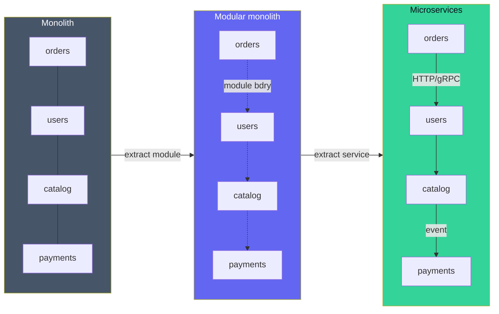

## Definition (interview-ready)

A **monolith** is a single deployable unit holding all functionality. **Microservices** split functionality across independently deployable services that communicate over the network. A **modular monolith** is a monolith with strict internal module boundaries — you get logical separation without the operational cost of distributed systems.

## Why it matters

The microservices-first instinct of the 2010s burned many teams: distributed transactions, observability complexity, deployment overhead. The current consensus: **start with a modular monolith; extract services when you have a real, measured reason.**



## Core concepts

### Monolith

One codebase, one process, one deploy. All features share the same DB connection pool, the same memory, the same release.

Pros:
- Simple to develop and deploy initially.
- Strong consistency by default (one DB, ACID).
- Easy to refactor across boundaries (one IDE, one compile).
- Cheap operations: one service to monitor.

Cons:
- Single deploy unit: one feature's bug can roll back everyone's work.
- Hard to scale parts independently.
- Tech stack lock-in.
- Big-bang releases over time as the team grows.

### Microservices

Many small services, each owned by a team, each independently deployable. Communicate over network (REST/gRPC/events).

Pros:
- Independent deploys: teams move at their own pace.
- Polyglot — best tool per job.
- Fault isolation — one service down ≠ all down.
- Scale-specific: scale the bottleneck, not everything.
- Smaller cognitive surface per team.

Cons:
- Distributed system complexity: every cross-service call is a network call (timeout, retries, idempotency).
- No more cross-service transactions — need sagas.
- Operations: service mesh, observability, deployment infra.
- Latency tax (serialization + network).
- Versioning and contracts.
- More to monitor, alert on, page about.

### Modular monolith

One deployable, but internally organized as **strictly enforced modules** with explicit interfaces and no cross-module DB access. Often the *right* answer for most teams.

Characteristics:
- Modules talk via in-process interfaces (or domain events on a bus).
- Each module owns its data; other modules only read via the module's API.
- Build can enforce: no cross-module imports of internal types.
- Single deploy, single DB (possibly with schema-per-module for isolation).

You get most of the microservices benefits (boundaries, ownership) without the network tax.

### When to extract a service

Extract when you have a **specific reason** that the monolith can't address:
- **Different scaling profile**: search needs 100× CPU but the monolith doesn't.
- **Different release cadence**: payment service can't deploy as often as marketing pages.
- **Different team ownership**: separate teams, different stacks.
- **Independent failure domains**: payments must not be impacted by mobile feed bugs.
- **Different stack**: ML scoring in Python while the rest is in Go.
- **Compliance boundary**: PCI/HIPAA-scoped code isolated.

If you can't name the reason, **don't extract.**

### Microservices anti-patterns

- **Distributed monolith**: services so coupled they can only deploy together. Worst of both worlds.
- **Shared database between services**: kills the "independent" claim.
- **Chatty inter-service calls**: a request fanning out to 20 services. Latency death.
- **Per-team service explosion**: 50 services for a 30-person company.
- **Services without ownership**: orphaned services nobody updates.
- **No observability**: distributed traces are required, not optional.

### Domain-driven design (DDD) for boundaries

The right service/module boundaries follow **bounded contexts** from DDD:
- A bounded context = a clear domain model with its own ubiquitous language.
- Different contexts may have the same noun (`Order` in checkout ≠ `Order` in fulfillment) with different shapes.
- Services often map 1:1 with bounded contexts, modules with sub-contexts.

### Operational requirements for microservices

Before going microservices, you need:
- **CI/CD per service** with safe deploys (canary, blue-green).
- **Service discovery + service mesh** or strong load-balancer hygiene.
- **Observability**: metrics, logs, distributed tracing.
- **Idempotency + retries** standard.
- **Schema registry / API contracts**.
- **Async + saga support** for cross-service flows.

Without these, microservices = chaos.

## How it works (refactoring journey)

```
Stage 1: Monolith
  - One repo, one DB, one deploy.

Stage 2: Modular monolith
  - Refactor into modules with explicit interfaces.
  - One repo, one deploy, but no internal cross-module DB access.
  - Optional: one DB schema per module.

Stage 3: Extract a service
  - Pick a module with a clear reason (scaling, ownership, stack).
  - Build the API contract; extract the DB schema.
  - Run side-by-side with the monolith calling it.
  - Gradually shift more functionality.
  - Decommission the module in the monolith.

Repeat as needed; don't over-extract.
```

## Real-world examples

- **Shopify**: famously a **modular monolith** ("majestic monolith") in Rails, with strict pod boundaries.
- **Amazon, Netflix, Uber**: full microservices at huge scale — but they have thousands of engineers, full DevOps platforms, observability infra.
- **Stack Overflow**: monolith on a few big servers; serves enormous traffic.
- **GitHub**: monolith in Rails, slowly extracting services.
- **Basecamp/37signals**: ardently monolith advocates.

## Common pitfalls

- **Microservices for a 10-person team**: ops overhead exceeds benefit.
- **Service per noun**: don't make a "UserService" + "OrderService" + "PaymentService" just because they're different nouns. Follow bounded contexts.
- **Shared DB between services**: tightly couples them at schema, deploys, scaling.
- **Network calls in hot loops**: 10 sequential RPCs in a request = death.
- **No async path**: every call synchronous, fan-out kills latency. Use events for non-essential side effects.
- **Missing idempotency**: retries duplicate state changes.
- **Migration without baseline metrics**: can't tell if the extraction helped.

## Interview questions

### Q1 — Easy: What are the main tradeoffs of microservices?
Independent deploys + polyglot + scale-specific vs operational complexity (observability, deployments, service discovery), distributed-system overhead (timeouts, retries, idempotency, sagas), and latency tax of network calls.

### Q2 — Easy: What's a modular monolith?
A monolith with strict internal module boundaries — modules own their data, expose APIs, and the build enforces no cross-module internal imports. You get logical separation without the network and ops tax of microservices.

### Q3 — Medium: When would you extract a microservice?
When you have a specific, measurable reason: different scaling profile, different release cadence, different team ownership, different stack, compliance boundary, or different failure domain. If you can't name the reason, don't extract — the operational cost is real.

### Q4 — Medium: A team wants to split a monolith into 20 services. What questions do you ask?
- How many engineers are on this team? (Microservices need >1 team per service generally.)
- What's the deployment infra — CI/CD per service, service mesh, observability?
- What's the specific pain point each split solves?
- Is the DB schema split-ready (no cross-cutting joins)?
- Are bounded contexts clear, or are you just chopping up nouns?
- What's the rollback story if a split causes incidents?

### Q5 — Medium: How do bounded contexts inform service boundaries?
A bounded context is a self-contained domain model with its own ubiquitous language. The "Order" in checkout has different attributes than the "Order" in shipping. Services should follow these contexts so that internal coherence is high and inter-service contracts are stable.

### Q6 — Hard: A microservices migration causes 10× more incidents. Diagnose.
- **Distributed transactions** without sagas → partial-state bugs.
- **No idempotency** → retries duplicate state.
- **No service mesh / discovery** → connection chaos.
- **No distributed tracing** → can't tell what failed.
- **Cascading failures** without circuit breakers/bulkheads.
- **Coupled deploys** → forced lockstep releases.
- **Database not split** → schema migrations affect everyone.
- **Team-service mismatch** → services without owners.

Fix: bring back coherent pieces into a modular monolith; invest in platform (mesh, observability) before further splitting.

### Q7 — Hard: Design the service topology for an e-commerce site.
Start with bounded contexts:
- **Catalog** (products, inventory) — read-heavy, often cached.
- **Cart / Checkout** — session, transactional.
- **Order management** — workflow, sagas, state machine.
- **Payments** — compliance boundary, isolated.
- **Fulfillment / Shipping** — operations team.
- **User accounts / Auth** — separate, security-sensitive.
- **Search** — Elasticsearch fed by CDC.
- **Recommendations / Personalization** — ML.

Communication:
- Sync gRPC/REST for read-required paths (catalog reads from checkout).
- Async events (Kafka) for downstream propagation (order placed → fulfillment, payments, analytics).
- Sagas for distributed flows (place-order across cart, payment, inventory).

### Q8 — Hard: When does the modular monolith stop being enough?
- **Team scaling**: when independent teams' deploys start blocking each other.
- **Scaling profile divergence**: one feature needs 10× capacity, the rest don't.
- **Compliance**: PCI / HIPAA-scoped code must be isolated.
- **Stack divergence**: an ML team needs Python; rest is Go.
- **Reliability requirements**: a feature must not be impacted by others' bugs.
- **Code-base size** when build/test cycles become unbearable.

Even then, extract one service at a time, with a real reason.

## TL;DR cheat sheet

- **Monolith**: simple, fast to ship, hard to scale parts.
- **Modular monolith**: one deploy, hard internal boundaries — best default.
- **Microservices**: independent deploys + polyglot, but ops cost is real.
- Extract only when you have a specific reason: scaling, ownership, stack, failure domain.
- Follow **bounded contexts** for boundaries.
- Without platform investment (mesh, observability, sagas, idempotency), microservices = pain.
- Shared DB across services = distributed monolith antipattern.
- Async events over sync calls when possible.

## Go deeper

- **Sam Newman**, *Building Microservices*, 2nd ed — the canonical reference.
- **Sam Newman**, *Monolith to Microservices* — how to migrate.
- **Vaughn Vernon**, *Implementing DDD* — bounded contexts.
- **Shopify engineering**: ["Deconstructing the Monolith"](https://shopify.engineering/deconstructing-monolith-designing-software-maximizes-developer-productivity) — modular monolith experience.
- **Fowler**: ["MicroservicePremium"](https://martinfowler.com/bliki/MicroservicePremium.html) and the ["Microservices guide"](https://martinfowler.com/microservices/).
- **Microservices.io** by Chris Richardson — comprehensive pattern catalog.
- **YouTube**: Sam Newman conference talks, Fowler talks on microservices.
