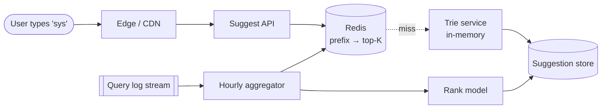

## Problem statement

Design a typeahead service that suggests the most likely completions for a user's prefix in real time, ranked by popularity and relevance.



## Requirements

### Functional
- For prefix `p`, return top K (e.g., 10) suggestions.
- Update suggestion popularity from real query traffic.
- Personalization (optional): biased by user history.

### Non-functional
- p99 < 100 ms (sub-keystroke).
- High QPS: every keystroke is a query.
- Eventual consistency on popularity updates is fine.
- Handle billions of queries/day.

## Scale estimation

- 1B queries/day = ~12K QPS average, ~50K peak.
- Each user typing produces ~5 keystrokes/query → **60K typeahead QPS average, ~250K peak**.
- ~10M unique terms in popularity dataset.

## Core API

```
GET /api/autocomplete?q=red+wi
→ { "suggestions": [
     {"text": "red wine", "score": 0.92},
     {"text": "red winter", "score": 0.41},
     ...
] }
```

## Data structure: trie + Top-K per node

A **trie** (prefix tree) of characters; at each node, store the top K suggestions for the prefix ending at that node.

```
root
├─ r
│  └─ e
│     └─ d
│        └─ ' '
│           └─ w
│              ├─ i
│              │  ├─ top10: ["red wine 0.92", "red winter 0.41", ...]
│              │  └─ n
│              │     └─ e
│              │        └─ top10: ["red wine 0.92", ...]
│              └─ a
│                 └─ ...
```

Lookup: walk the trie by characters of the prefix; at the final node, return its precomputed top K. O(prefix length) lookup.

**Tradeoff**: trie is memory-heavy if stored naïvely. Compress (radix tree / "Patricia trie") or shard by first 1–2 chars.

## High-level architecture

```
                      ┌────────────┐
   Client (typing) ──►│ Edge / CDN │ ──► local PoP cache for common prefixes
                      └─────┬──────┘
                            ▼
                      ┌────────────┐
                      │ TypeAhead  │ ──► Trie service (in-memory)
                      │  Service   │
                      └─────┬──────┘
                            ▼
                      ┌────────────┐
                      │   Stats    │ ──► aggregation pipeline
                      │ Aggregator │
                      └────────────┘

User queries (clicks) ──► Kafka ──► batch jobs (Spark/Flink) ──► updated trie
```

## Detailed design

### Trie service

- In-memory trie sharded by first 1–2 characters across nodes.
- Each node holds top K suggestions with scores.
- Updated periodically (every few minutes to a few hours) from analytics pipeline.

### Building the trie

Offline batch (Spark or Flink):

1. Query log → aggregate (term, count) over time window.
2. Compute score per term (recency × frequency, optionally per-user / per-region).
3. For each prefix of each term, attach the term to the prefix's top K (using a min-heap of K).
4. Serialize trie and load into trie service (atomically swap).

Realtime increments via streaming for trending terms (Flink keeps top K per prefix in a windowed aggregation).

### Caching

- Most queried prefixes are short (1–3 chars) and repeat heavily.
- Cache at CDN edge with very short TTL (1–10 minutes).
- Edge cache key = prefix; hits >50% in practice.

### Ranking signal

- Base: query frequency over last N days.
- Boost: trending (last hour vs week average).
- Penalty: stale, blocked, or low-quality terms.
- Personalization (optional): blend in user history.
- A/B test ranking functions behind flags.

### Multi-language / locale

- One trie per locale (en-US, en-GB, ja-JP).
- Tokenization differs (CJK has no spaces).
- Diacritics normalized (`café` → `cafe`).
- Routing by `Accept-Language` or user pref.

### Personalization

- Lightweight: store user's recent searches; merge into ranked results.
- Heavyweight: per-user trie (expensive in memory).
- Common: hybrid — global trie + small per-user boost layer.

## Bottlenecks & optimizations

- **Trie memory**: 10M terms × avg path = lots of nodes. Use radix tree compression (collapse single-child chains).
- **Trie update**: atomic swap (rebuild offline, hot-swap pointer) avoids inconsistency.
- **Hot prefixes**: 1-char prefixes are tiny and hot — CDN caches them.
- **Latency spikes during update**: pre-warm caches on the new trie before swap.

## Trade-offs

- **Real-time vs batch updates**: real-time is more responsive but more complex. Most prod systems batch every few minutes.
- **In-memory vs distributed**: a single trie in RAM is simplest; sharded trie scales but adds routing.
- **Spell-correction at the edge**: typeahead can suggest spell-corrections on-the-fly (Did you mean...) — useful UX but extra cost.

## Interview questions

### Q1: Why use a trie?
O(prefix length) lookup with all suggestions for that prefix precomputed at the node. Beats LIKE queries on a database (O(N × prefix) scan) by orders of magnitude.

### Q2: How do you precompute the top K per prefix?
Walk all terms; for each term `t`, for each prefix `p` of `t`, push (score, t) into a min-heap of size K stored at the trie node for `p`. Heap maintenance: O(K log K) per prefix.

### Q3: How would you update suggestions for trending events?
Real-time stream (Flink) keeps a windowed top-K per prefix from recent queries. Merge with the baseline trie at query time (or rebuild more frequently for popular prefixes).

### Q4: How do you handle non-Latin scripts (Chinese, Japanese)?
- Different tokenization per locale.
- For CJK: build trie over characters and over pinyin/romaji where applicable.
- Match on multiple representations.
- Normalize: full-width vs half-width, traditional vs simplified, accents.

### Q5: How big is the trie?
10M terms, avg term length 12 chars → ~30M nodes after radix compression. Each node 40-100 bytes → ~1-3 GB. Fits in memory easily on one box; shard for HA and scale.

### Q6: How to do personalized typeahead?
Global trie for everyone. Layer: per-user recent searches (last 100) joined at query time. Boost user's history terms in the global ranking. Memory: 100 × 10M users = expensive — store in Redis with TTL.

### Q7: Privacy considerations.
- Don't log raw user queries for training without consent.
- Anonymize / aggregate before retention.
- Honor GDPR/CCPA right to deletion (user history scrubbing).
- Suppress sensitive completions (medical, legal — depends on policy).

### Q8: A new feature launches and certain terms must always appear (sponsor). How?
- Editorial overrides table: prefix → fixed top result.
- Merged at query time before normal ranking.
- Marked clearly in UI (paid placements).
- Time-bound (expires automatically).

## TL;DR cheat sheet

- Trie (radix-compressed) with top K precomputed per node.
- Offline batch builds trie; atomic swap on load.
- Real-time stream layer for trending.
- Edge cache for hot prefixes.
- Per-locale tries; personalization as lightweight overlay.
- Editorial overrides for sponsored / blocked terms.

## Go deeper

- **Alex Xu Vol 1**: Chapter 13 (Search autocomplete).
- **Gaurav Sen**: ["Designing Typeahead"](https://www.youtube.com/results?search_query=gaurav+sen+typeahead).
- **High Scalability**: Google/Yahoo typeahead architecture posts.
- **Elasticsearch**: completion suggester, edge n-gram tokenizer.
- **Solr**: AnalyzingInfixSuggester.
- **System Design Primer**: search section.
