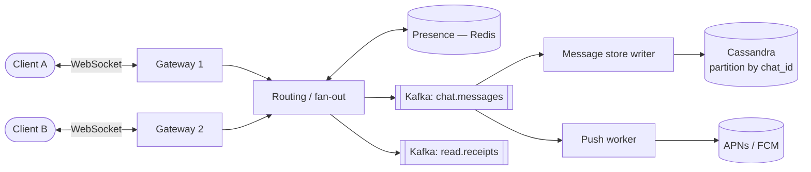

## Problem statement

Design a real-time messaging system supporting 1-to-1 and group chats, with delivery, read receipts, presence, and message history.



## Requirements

### Functional
- Send/receive messages 1:1 and in groups.
- Delivery and read receipts.
- Online/offline presence.
- Push notifications when user is offline.
- Message history (months or years).
- Media (images, video, files).

### Non-functional
- Real-time (< 100 ms message delivery).
- Reliable — no lost messages.
- Scale: 1B users, 100B messages/day.
- High availability.
- End-to-end encryption (for WhatsApp-style).

## Scale estimation

- 1B users, 100B messages/day = ~1.2M msgs/sec average, ~5M peak.
- ~200 bytes per text message → 100B × 200 = **20 TB/day** raw, ~7 PB/year, ×3 RF = 21 PB.
- Concurrent connections: ~10% online → 100M concurrent.

## High-level architecture

```
                ┌──────────────┐
   Clients ────►│ Edge Servers │ (WebSocket / QUIC)
                └──────┬───────┘
                       ▼ (route to user's chat server)
                ┌──────────────┐
                │ Chat Servers │ (stateful, holds user connections)
                └──┬──────┬────┘
                   ▼      ▼
           ┌──────────┐  ┌──────────────┐
           │ Presence │  │ Message Bus  │ (Kafka / NATS)
           │ Service  │  └──────┬───────┘
           └──────────┘         ▼
                         ┌──────────────┐
                         │ Storage      │ (Cassandra/Scylla)
                         └──────┬───────┘
                                ▼
                         ┌──────────────┐
                         │ Push Notif   │ (APNs/FCM)
                         └──────────────┘
```

## Connection management

- **WebSocket** (or persistent HTTPS/QUIC) from client to a chat server.
- Server identified by **consistent hash** of user ID → user always connects to same server set (sticky session).
- Edge load balancer with TCP-aware routing or app-level routing after auth.
- Long-lived connections: thousands per server with epoll/kqueue. Erlang's WhatsApp famously hit 2M concurrent per server.

## Data model

```cql
CREATE TABLE messages_by_channel (
  channel_id   uuid,
  bucket       text,       -- e.g., '2026-05-29' for partition bounding
  message_id   timeuuid,
  sender_id    uuid,
  content      blob,        -- encrypted if E2E
  type         text,
  created      timestamp,
  PRIMARY KEY ((channel_id, bucket), message_id)
) WITH CLUSTERING ORDER BY (message_id DESC);

CREATE TABLE channels_by_user (
  user_id      uuid,
  channel_id   uuid,
  last_read_id timeuuid,
  joined_at    timestamp,
  PRIMARY KEY ((user_id), channel_id)
);
```

Channel = 1:1 chat ID or group ID. Bucketed by day to avoid mega-partitions.

## Detailed design

### Sending a message (1:1)

1. Client A sends to its chat server (WebSocket).
2. Chat server:
   - Persist to Cassandra (single quorum write).
   - Look up recipient's connection (which chat server holds it).
   - If recipient online: forward via internal RPC/Kafka to their chat server → push to client.
   - If offline: queue push notification via APNs/FCM.
3. Recipient's client acks delivery → chat server emits delivery receipt to sender.
4. Recipient reads → chat server emits read receipt.

### Group messages

- Channel has many members.
- Server iterates members, forwards to each member's chat server.
- For huge channels (Slack workspace with 100K), fan-out is heavier — use Kafka.

### Presence

- Soft signal — clients heartbeat every N seconds.
- Presence Service tracks (with TTL) which users are online.
- High volume, eventual consistency. Use Redis.

### Read receipts

- Store last-read message ID per (user, channel).
- Compute unread count from this.

### Encryption (E2E for WhatsApp/Signal-style)

- **Signal Protocol**: Double Ratchet for forward secrecy, X3DH for key agreement.
- Server stores only ciphertext.
- Server can't read messages — but can see metadata (sender, recipient, timing).
- Group chat E2E is harder (key distribution).

### Offline & sync

- When user reconnects, server sends missed messages since last_read.
- Cassandra range query: `WHERE channel_id = ? AND message_id > last_read`.
- Mobile: paginate efficiently to avoid bulk transfer.

### Media

- Don't put media in messages — upload to object store (S3), reference URL.
- Pre-signed upload URLs for direct client → S3.
- CDN for distribution.

## Bottlenecks & optimizations

- **Mega-partitions** for hot channels: bucket by time.
- **Tail latency** during fan-out: parallel push, partial-result-OK semantics.
- **Mobile networks**: keep messages small; use compression; batched delivery for offline catch-up.
- **Read receipts at scale**: send aggregated, not per-message (one update for "read up to msg X").
- **Storage**: hot recent data (3 months) in Cassandra; cold archive to S3 Parquet for queryable history.

## Trade-offs

- **WebSocket vs HTTP/2 SSE**: WebSocket = bidirectional, well-supported. SSE = simpler but server → client only.
- **Push notifications**: Apple APNs and Google FCM are the only mobile delivery paths when app is killed.
- **E2E vs server-readable**: business needs (search, compliance) vs privacy.
- **At-most-once vs at-least-once delivery**: client-side dedup by message ID lets you use at-least-once safely.

## Interview questions

### Q1: How would you keep millions of WebSocket connections per server?
Use efficient I/O (epoll/kqueue), non-blocking architecture (Erlang processes, Go goroutines), modest memory per connection, OS tuning (file descriptors, TCP buffers). WhatsApp famously got to 2M connections per FreeBSD/Erlang box; modern servers commonly handle 100K-1M.

### Q2: How do you handle a user being on multiple devices?
Each device has its own connection. The user has multiple device IDs. Server pushes to all devices. State (read receipts, last-read) synced across devices.

### Q3: Design message history with 100B messages/day.
Cassandra/Scylla, partitioned by `(channel_id, day_bucket)`. Bucket by day prevents mega-partitions. Clustering by message_id DESC for newest-first reads. Tiered storage: hot (last 3 months) on SSD, cold archived to S3/Parquet for queryable history.

### Q4: How does the server know which chat server a recipient is on?
Service discovery layer: a directory mapping user_id → chat_server. Updated when user connects/disconnects. Stored in a fast KV (Redis). The sender's chat server looks up and forwards.

### Q5: How does end-to-end encryption work?
Signal Protocol: each conversation has session keys ratcheting forward; X3DH key agreement on initial setup. Server stores only ciphertext + metadata. Group E2E uses sender keys + per-recipient key distribution. Server can't decrypt.

### Q6: What if a chat server crashes with users connected?
- Clients detect disconnection and reconnect.
- They connect to a new chat server (consistent-hashed by user_id, or any healthy server).
- Recent unread messages already persisted in DB → sync after reconnect.
- No data loss; minor reconnection delay (typically < 1s).

### Q7: How to scale group chat to 100K members in a workspace?
- Cap message broadcast: never write 100K rows per message.
- Instead, store one message per channel; readers query their own view.
- Use Kafka to fan out delivery notifications efficiently.
- Compute unread counts asynchronously.
- For huge groups, hierarchical groups or read-mostly broadcast lists.

### Q8: Push notifications: how to avoid hammering APNs/FCM?
- Batched send when possible.
- Token-per-device, retry on transient failures with backoff.
- Honor APNs/FCM's quotas (they enforce them).
- Coalesce multiple messages into one notification ("5 new messages").
- Per-user mute/DND settings — don't push if user has DND on.

## TL;DR cheat sheet

- WebSocket connections to chat servers (consistent-hashed by user).
- Cassandra/Scylla for messages, partitioned by channel + day bucket.
- Presence in Redis with TTLs.
- APNs/FCM for offline push.
- Group messages: server fan-out, possibly via Kafka.
- E2E: Signal Protocol (Double Ratchet + X3DH).
- Media uploads direct to S3 via pre-signed URLs.
- Hot/cold storage tiering for history.

## Go deeper

- **WhatsApp engineering**: famous Erlang scale stories (2M connections per box).
- **Discord engineering**: [How Discord Handles Two and Half Million Concurrent Voice Users using WebRTC](https://discord.com/blog/how-discord-handles-two-and-half-million-concurrent-voice-users-using-webrtc), Trillions of messages blog.
- **Signal docs**: [Double Ratchet](https://signal.org/docs/specifications/doubleratchet/), [X3DH](https://signal.org/docs/specifications/x3dh/).
- **High Scalability**: [WhatsApp architecture](http://highscalability.com/blog/2014/2/26/the-whatsapp-architecture-facebook-bought-for-19-billion.html).
- **ByteByteGo**: Design WhatsApp series.
- **Alex Xu Vol 1**: Chapter 12 (Chat system).
