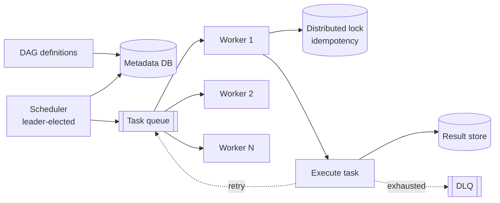

## Problem statement

Design a distributed scheduler that runs millions of jobs on time (cron-like) and dependency-driven (DAGs), with retries, failure handling, and observability.



## Requirements

### Functional
- Schedule jobs by time (cron) or trigger.
- Run DAGs (directed acyclic graphs of tasks with dependencies).
- Retries with backoff.
- Idempotency.
- Status: running, success, failed, retried, skipped.

### Non-functional
- Reliable: a missed job is a P1.
- Scale: 1M jobs/day, 100K concurrent.
- Multi-tenant.
- Observable: timeline, logs, alerts.

## Scale estimation

- 1M jobs/day = ~12/sec average; ~100/sec peak.
- 100K concurrent (think long-running ETL).
- DAG complexity: 100s of tasks each.

## High-level architecture

```
            ┌──────────┐
   UI/API ─►│ Scheduler│ ── parses DAGs, computes ready set
            └────┬─────┘
                 ▼
            ┌──────────┐
            │ Job DB   │ ── DAG state, task state, schedules
            │ (Postgres)
            └────┬─────┘
                 ▼
            ┌──────────┐
            │ Queue    │ ── tasks ready to run (Redis / Kafka)
            └────┬─────┘
                 ▼
            ┌──────────┐
            │ Workers  │ ── execute task; report status
            └────┬─────┘
                 ▼
       ┌──────────────────┐
       │  Object storage  │ ── logs (S3)
       └──────────────────┘
```

## Detailed design

### Job model

- **DAG**: a workflow definition (`Python file` in Airflow, declarative YAML elsewhere).
- **Task**: a unit of work (run bash, call API, run Spark job).
- **Run / Execution**: a specific instantiation of a DAG with input data (e.g., DAG `daily_sales` for 2026-05-29).
- **Task instance**: a specific task within a run.

### Scheduler

- Periodically scans DAGs.
- For each DAG, determines if a new run should be created (cron, manual trigger, sensor passes).
- For each active run, examines task dependencies and marks ready tasks.
- Enqueues ready task instances to the queue.

### Queue

- Tasks → worker queue (Celery, Redis-backed, Kafka, or SQS).
- Workers poll and consume.
- Multiple queues for different priorities, resource needs.

### Workers

- Long-running processes that consume from queue.
- For each task: load code, execute, report status (running, success, failed) back to the DB.
- Push logs to object storage.
- On failure: status set; scheduler decides whether to retry.

### Retries

- Configurable per task: max retries, retry delay (exponential backoff).
- Scheduler picks up failed task, re-enqueues with increasing delay.
- After max retries: terminal failure; mark DAG run failed (per failure policy).

### Dependencies

- A task is ready when all its upstream dependencies have succeeded (or skipped per skip_rule).
- Computed by scheduler on every scan cycle.
- Stored in DB for visualization.

### State machine (task instance)

```
NONE → QUEUED → RUNNING → SUCCESS
              ↓
           FAILED → UP_FOR_RETRY → QUEUED ...
              ↓
           UPSTREAM_FAILED
              ↓
           SKIPPED
```

### Idempotency

- Tasks should be idempotent.
- Pass `execution_date` / `run_id` to task code; idempotent operations use it as key.
- Critical for retries.

### Cron + sensors

- Cron triggers: standard cron expressions.
- Sensors: long-poll for an external condition (file in S3, DB row exists). Push-based via event triggers (modern Airflow deferrable operators) is better than polling.

### Multi-tenancy

- Per-team DAG quotas.
- Resource pools (e.g., "spark_cluster" pool with max parallelism).
- Tagging for cost allocation.

### Catchup & backfill

- If scheduler is down for a day, on restart it can "catch up" missed runs.
- Backfill: manually rerun historical DAGs (e.g., reprocess data after bug fix).
- Controls: `catchup=False` to skip historical runs.

## Bottlenecks & optimizations

- **Scheduler scan time**: bigger DAGs take longer to evaluate. Parallelize scheduler scans. Use incremental scan ('only changed DAGs').
- **DB contention**: every task state change writes a row. Tune Postgres; consider sharded DB.
- **Worker scaling**: autoscale workers based on queue depth.
- **Deferrable operators (Airflow 2.2+)**: sensors that yield instead of blocking a worker — huge concurrency win.

## Trade-offs

- **Push vs pull workers**: pull (worker polls queue) is simpler, naturally backpressured. Push has lower latency.
- **Centralized DB vs distributed state**: centralized is simpler; distributed scales further but adds consensus complexity.
- **Polling sensors vs event-driven**: polling is simple but burns worker slots. Event-driven is efficient but requires plumbing.

## Interview questions

### Q1: How does the scheduler decide what to run?
On each scan: for each active DAG run, find tasks whose dependencies are all in success state and which haven't been queued. Enqueue them. For DAGs with cron schedule, create a new run when the schedule fires.

### Q2: How do you handle a task failure?
Mark task as failed. Increment retry count. If retries remain, schedule for retry after backoff delay. If max retries exhausted, mark terminal failure. DAG run failure policy: fail whole run, continue with downstream tasks, etc.

### Q3: Why do tasks need to be idempotent?
Retries (failure, then re-run), backfills (re-run historical periods), partial failures (a task started but its state wasn't recorded) — all imply the same task might run more than once. Idempotency ensures no duplicate side effects.

### Q4: How would you scale to 100K concurrent tasks?
- Multiple scheduler instances (sharded by DAG hash).
- Many worker pools across machines.
- Autoscaling based on queue depth.
- Deferrable / async sensors instead of polling.
- Sharded task DB (or specialized state store).
- Queue tier (Kafka or Redis cluster) handles the fanout.

### Q5: Compare push and pull worker models.
Pull (worker polls queue, popular in Celery/Airflow): simple, natural backpressure (workers process at their speed), easy to scale workers up/down. Push (scheduler dispatches): lower latency, but coordination is more complex (scheduler needs worker registry).

### Q6: How does catchup vs backfill differ?
Catchup = scheduler runs missed historical schedules on startup. Backfill = manually trigger rerun of historical period (typically after a bug fix or change). Catchup is automatic; backfill is operator-initiated.

### Q7: Design retry policy.
- Configurable per task: max retries, base delay, exponential factor.
- Default: 3 retries, exponential backoff (1m, 5m, 15m).
- Permanent failures (parse error, missing data): no retry.
- Transient failures (5xx, timeout): retry.
- Custom hooks to decide based on exception type.

### Q8: How to monitor 1M jobs/day?
- Per-task metrics: duration, success rate, retry count.
- Per-DAG metrics: end-to-end SLO, lateness.
- Alerts: SLO breach, repeat failures, scheduler health.
- Visualization: Gantt of run, dependency graph.
- Lineage: which downstream broke because of which upstream.
- Cost attribution per team.

## TL;DR cheat sheet

- Scheduler scans DAGs → identifies ready tasks → enqueues.
- Workers pull from queue → run task → report status.
- Centralized DB tracks state.
- Tasks must be idempotent (retries, backfills).
- Cron + sensors trigger runs.
- Resource pools for concurrency control.
- Deferrable / async sensors for scale.
- Multi-tenant via DAG quotas + cost attribution.

## Go deeper

- **Apache Airflow docs**: [airflow.apache.org/docs](https://airflow.apache.org/docs/apache-airflow/stable/).
- **Astronomer Academy**: free Airflow courses.
- **Temporal docs**: [docs.temporal.io](https://docs.temporal.io/) — workflow + retry primitives at scale.
- **Cadence (Uber's predecessor)** — same family.
- **Argo Workflows**: Kubernetes-native.
- **Prefect, Dagster**: modern alternatives.
- **High Scalability**: Airbnb's Airflow story (origin).
