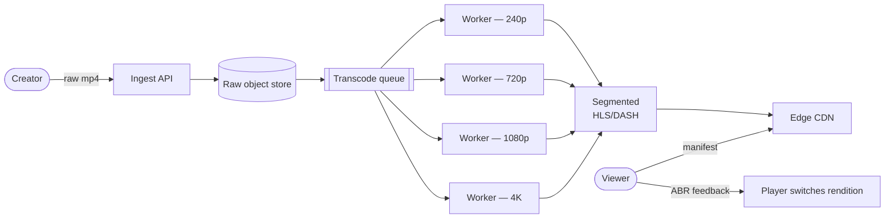

## Problem statement

Design a video streaming platform: users upload videos, the system transcodes to multiple bitrates, stores them, and streams to viewers globally with low buffering and minimal cost.



## Requirements

### Functional
- Upload video (any format).
- Transcode to adaptive bitrate formats (HLS / DASH).
- Stream on demand globally.
- Search / browse.
- Comments, likes, recommendations.

### Non-functional
- Massive scale: petabytes of video, billions of views.
- p99 startup < 2 s.
- Buffer ratio < 1% (rarely stalls).
- Cost-optimized: bandwidth is the main cost.

## Scale estimation

- 500M DAU; each watches 1 hour/day = 500M hours/day of streaming.
- At 5 Mbps average → 500M × 3600 × 5/8 = ~1.1 EB/day total bandwidth.
- 500K new uploads/day, 100 MB avg → 50 TB/day ingress raw.
- Storage: years of video × multiple resolutions × replication = petabytes to exabytes.

## High-level architecture

```
                       ┌─────────────┐
   Uploader ─────►     │ Upload Svc  │ ──► raw video to S3
                       └──────┬──────┘
                              ▼
                       ┌─────────────┐
                       │ Transcoding │ (Spark/distributed jobs)
                       │ Pipeline    │
                       └──────┬──────┘
                              ▼
                       ┌─────────────┐
                       │ Storage     │ (S3 + cold tier)
                       └──────┬──────┘
                              ▼
                       ┌─────────────┐
                       │ CDN (edge)  │ ── geographic delivery
                       └──────┬──────┘
                              ▼
                          Viewer ► adaptive bitrate (HLS/DASH)
                              │
                              ▼
              ┌─────────────┐    ┌───────────────┐
              │ Recommend.  │    │ Analytics     │
              │   Service   │    │ (ClickHouse)  │
              └─────────────┘    └───────────────┘
```

## Detailed design

### Upload

1. Client requests a pre-signed S3 URL (large file → multipart).
2. Client uploads parts directly to S3 (don't proxy through API).
3. On completion, S3 event → transcoding pipeline.
4. Metadata service records video.

### Transcoding

- Single upload → many output renditions (240p, 360p, 480p, 720p, 1080p, 4K).
- Two codecs (H.264 widely compatible, AV1/HEVC modern).
- Per rendition, segmented into ~6–10s chunks for HLS/DASH.
- Heavy CPU/GPU: distributed cluster (Spark, custom orchestrator).
- Per video: 10–60 minutes processing time.

### Storage

- Each output rendition stored as many small chunk files in S3.
- Manifest (`.m3u8` for HLS, `.mpd` for DASH) lists chunks per rendition.
- Cold tier (Glacier) for old, rarely-watched content.

### Adaptive bitrate streaming (HLS/DASH)

```
client requests manifest (.m3u8)
manifest lists available renditions: 240p, 360p, 720p, 1080p
client picks rendition based on bandwidth + screen
client fetches chunk by chunk
client measures throughput per chunk; switches up/down as needed
```

Each chunk is independently cacheable on CDN — huge cache hit rates because all viewers of the same rendition fetch the same chunk.

### CDN (the magic ingredient)

- Most expensive thing about streaming is bandwidth.
- CDN at edge caches popular content close to viewers.
- Major CDNs: CloudFront, Akamai, Cloudflare, Fastly.
- Netflix built **Open Connect**: their own CDN appliances inside ISPs, dramatically reducing transit cost.

### Recommendation system

- Offline: collaborative filtering, content embeddings, sessions.
- Online: feature service feeding a model serving layer.
- Cached top-N per user (refreshed every few hours).

### Live streaming (extension)

- Encoder pushes RTMP/SRT to ingest.
- Server transcodes in real time → segments → CDN.
- Latency target: 5–30s (DVR-like) or sub-second (WebRTC-based) — different architectures.

## Bottlenecks & optimizations

- **Per-byte cost**: CDN dominates. Optimize bitrate ladder; use AV1/HEVC for big savings.
- **Transcoding cost**: GPUs faster than CPU; spot instances reduce cost.
- **Cold start latency**: pre-fetch first chunks on page load; small initial chunk.
- **Recommendation latency**: cache per-user lists; precompute candidates.

## Trade-offs

- **VOD vs live**: VOD is simpler (transcode once, cache forever). Live is real-time, harder.
- **HLS vs DASH**: HLS is the dominant standard (Apple's ecosystem); DASH is more flexible. Often serve both.
- **Push (Netflix Open Connect) vs commercial CDN**: Open Connect has huge upfront cost but huge marginal savings; commercial CDN is pay-as-you-go.

## Interview questions

### Q1: Why adaptive bitrate streaming?
Network conditions vary. ABR lets the client pick the best rendition for current bandwidth and adjust dynamically — avoids buffering when bandwidth drops, gives best quality when bandwidth is high.

### Q2: Why segment video into chunks?
Chunks (~6-10s) are independently cacheable on CDN → huge hit rates. They enable ABR (switch rendition between chunks). Bad chunks can be re-fetched without restarting playback.

### Q3: Estimate bandwidth for 100M concurrent viewers at 4 Mbps avg.
100M × 4 Mbps = 400 Tbps. Insane — only practical via massive CDN distribution (many PoPs, ISP-embedded). No single origin could serve this.

### Q4: How does Netflix Open Connect reduce cost?
Netflix-owned CDN appliances installed inside ISPs (free for the ISP). Most Netflix traffic never traverses internet transit — it's served from inside the ISP's network. Saves Netflix transit cost, saves ISP transit cost. Win-win that smaller players can't replicate.

### Q5: How do you handle a viral video getting 100x normal traffic?
- CDN absorbs the load (the entire point of CDN).
- Pre-warm caches if you can predict the spike (premieres).
- Origin shield protects the source.
- For genuinely unpredictable virality: CDN's elastic capacity is the answer.

### Q6: Design the transcoding pipeline.
- Distributed job system (Spark or custom).
- Job per video: split into segments, transcode each in parallel to all required renditions/codecs.
- Output to S3.
- Manifest generation post-completion.
- Priority queue: short videos first, long videos in batch.
- Backoff on failures; alert on persistent ones.

### Q7: How would you store video metadata for 1B videos?
Sharded SQL (or KV) by video ID hash. Indexes for search-by-uploader, by category, by date. Search via Elasticsearch (separate, fed by CDC). Stats (view count, likes) in a separate counter-friendly store (Redis or counter columns in Cassandra).

### Q8: Cold start latency — how to load video in < 1s?
- Pre-fetch manifest aggressively (CDN caches it).
- Small initial chunk (1-2s) requested ASAP.
- Skip rendition selection initially — pick a safe middle rendition immediately, refine after first chunk completes.
- CDN edge near user.

## TL;DR cheat sheet

- Upload via pre-signed S3 URLs (direct, multipart).
- Transcode to multiple renditions + codecs (HLS/DASH chunks of 6-10s).
- Store chunks in S3; manifest lists them.
- CDN at edge serves chunks to viewers (highest hit rate).
- Adaptive bitrate: client picks rendition per chunk.
- Recommendations precomputed.
- Open Connect or similar for big players; commercial CDN for smaller.

## Go deeper

- **Netflix Tech Blog**: [Open Connect](https://openconnect.netflix.com/) and many ABR/encoding posts.
- **YouTube engineering**: ABR + encoding history.
- **Mux blog**: video streaming details.
- **HLS spec**: [datatracker.ietf.org/doc/html/rfc8216](https://datatracker.ietf.org/doc/html/rfc8216).
- **DASH overview**.
- **ByteByteGo**: video streaming videos.
