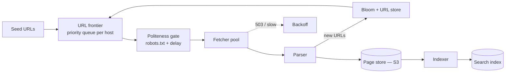

## Problem statement

Design a distributed web crawler: fetch billions of pages from the public web, parse and index them, respect robots.txt and politeness, while scaling efficiently.



## Requirements

### Functional
- Fetch URLs at high parallelism.
- Parse HTML, extract links + text.
- Store content for indexing.
- Schedule recrawls.
- Honor robots.txt, crawl-delay.

### Non-functional
- Scale to billions of pages.
- Politeness: limit QPS per domain.
- Avoid duplicates (URL + content).
- Resilient to bad URLs, slow servers, traps.

## Scale estimation

- 10B URLs in the seed/queue.
- 1B fetches/day → ~12K fetches/sec.
- Avg page size 200 KB → 200 TB/day raw → ~73 PB/year. Compression → ~25 PB/year.

## High-level architecture

```
              ┌────────────┐
   Seed URLs ►│ Frontier   │ ── prioritized queue (per-domain shards)
              └──────┬─────┘
                     ▼
              ┌────────────┐
              │ Fetcher    │ ── HTTP client pool, politeness
              │ workers    │
              └──────┬─────┘
                     ▼
              ┌────────────┐
              │ Parser     │ ── extract text, links, metadata
              └──────┬─────┘
                     ▼
        ┌────────────┼─────────────┐
        ▼            ▼             ▼
   Content store   Link extractor  URL filter
   (S3/HBase)      ─ new URLs ─►  ─ dedup + filter ─► back to frontier
```

## Detailed design

### URL frontier (queue)

The priority/queue of URLs to fetch.

- **Sharded by domain** — politeness is per-domain.
- **Priority**: high for important sites, fresh updates; low for tail.
- Persisted (durable) — crawlers crash often.
- Tools: Kafka topic per priority tier, with consumer groups.

### Politeness

Per-domain rate limit (typical: 1 req/sec/domain).

Implementation:
- Per-domain bucket in Redis or in-process token bucket.
- Worker holding a domain's lease must respect crawl-delay.
- robots.txt cached per domain (refetch weekly).

### Fetcher

- Async HTTP client (1000s of concurrent requests per worker).
- Timeout aggressive (~10–30s).
- DNS caching (huge speedup).
- HTTP/2 connection pooling per origin.
- Detect and avoid traps (infinite redirects, calendar pages with infinite next-month links).
- Bandwidth shaping per worker (avoid saturating any one upstream).

### Parser

- HTML parsing (lxml, Go html.Parser).
- Strip JS/CSS, extract text + links + meta.
- For SPAs (heavy JS): headless browser (Puppeteer, Playwright) — much more expensive.
- Canonical URL extraction (`<link rel="canonical">`).

### Deduplication

URL dedup:
- Bloom filter per shard: "have we seen this URL?"
- Negative result → definitely new; positive → likely seen, check.
- 10B URLs at ~5 bits/URL ≈ 6 GB per bloom.

Content dedup:
- Hash content (SimHash for near-duplicates).
- Compare against seen hashes → skip if seen.

### URL filters

- Reject: bad MIME types, login pages, robots.txt disallows.
- Normalize: drop fragments, sort query params, lowercase host.
- Limit URL length.
- Blocklist for traps and spam.

### Content store

- Raw HTML: S3 (with content hash as key for natural dedup).
- Parsed text + metadata: HBase / Cassandra (large-scale row store).
- For analytics: Parquet in S3, queried via Trino.

### Index pipeline

- Crawl pipeline emits "parsed page" events to Kafka.
- Search index builder (Elasticsearch / custom inverted index) consumes.
- Periodic full rebuild + incremental updates.

### Recrawl scheduling

- Priority sites: every hour or day.
- Long-tail: every week or month.
- Adaptive: pages that change frequently get recrawled more often.

### Robot.txt

- Fetch once per N hours per domain.
- Apply rules to candidate URLs.
- Cache the result.
- Set User-Agent string for identification.

## Bottlenecks & optimizations

- **Politeness per domain limits throughput**: only as fast as the slowest popular domain. Solution: many domains in parallel; small domains get full attention.
- **DNS bottleneck**: cache aggressively; use multiple recursors.
- **Massive URL dedup state**: bloom filters + persistent storage for definites.
- **Parser cost on SPAs**: budget per page; skip if cost too high.
- **Network burst**: rate-limit per IP egress; multiple IPs per worker.

## Trade-offs

- **Politeness vs throughput**: must be polite; rate per domain.
- **Headless browser vs HTML-only parsing**: full JS rendering is 100× more expensive but catches SPAs.
- **Storage tier**: keep recent pages hot, older pages cold (Glacier).
- **Fresh vs broad coverage**: budget for both — high-priority sites get fresh; tail gets stale.

## Interview questions

### Q1: How do you avoid hitting a domain too aggressively?
Per-domain rate limiter (token bucket in Redis or in-process). Honor `Crawl-Delay` in robots.txt. Default to 1 req/sec/domain (configurable). Workers acquire a domain lease before fetching; release after honor delay.

### Q2: How to deduplicate URLs at scale?
Bloom filters per shard for fast "have we seen it?" check. Bloom is probabilistic — false positives mean we may skip a new URL (acceptable); false negatives never. Backed by persistent storage for definitive checks when needed.

### Q3: Storage estimation.
1B pages/day × 200KB = 200 TB/day raw. With compression (3×), ~70 TB/day. Over 5 years = ~120 PB compressed. Cold tier (Glacier) for old; hot tier (HBase) for recent.

### Q4: What's a crawler trap?
Infinite-link pages: calendars with infinite next-month, paginations that never end, query-parameter explosions. Mitigations: depth limits, URL length limits, parameter normalization, heuristics flagging spam sites.

### Q5: How do you scale to billions of pages?
- Distributed fetchers (many workers).
- Sharded URL frontier (by domain hash).
- Distributed parser/processor pools.
- Sharded storage (S3 with key-prefix sharding).
- Async I/O — fetchers can hold thousands of in-flight HTTP requests.

### Q6: How do you handle JavaScript-heavy pages (SPAs)?
- Detect via content (mostly empty `<body>` + JS).
- Route to a headless browser pool (Puppeteer/Playwright).
- Expensive: 100× the cost; budget per page.
- Cache rendered content aggressively.
- Many crawlers prioritize cheap HTML and only escalate to JS rendering for high-value pages.

### Q7: How do you schedule recrawls?
- Priority per domain: news sites every hour, blogs daily, static sites weekly.
- Adaptive: track change frequency per page; pages that change often → frequent recrawls.
- Bloom-aged data: re-evaluate stale entries.
- Burst recrawls on sitemap signal or trending events.

### Q8: Politeness vs throughput — design.
Politeness is a per-domain constraint. Throughput is achieved by **parallelism across domains**, not within a domain. With 1B unique domains and 1 req/sec per domain, theoretical limit = 1B req/sec. In practice: long-tail dominates, polite to each, total throughput high.

## TL;DR cheat sheet

- Sharded URL frontier per domain.
- Per-domain rate limiter (robots.txt + crawl-delay).
- Async fetchers with DNS cache + HTTP/2 pooling.
- Parser extracts text + links; SimHash for content dedup.
- Bloom filters for URL dedup.
- Content to S3, parsed data to HBase / Cassandra.
- Recrawl scheduling with priority + adaptive frequency.
- Detect crawler traps.

## Go deeper

- **System Design Primer**: web crawler.
- **Alex Xu Vol 1** Chapter 9.
- **Mercator paper** (Heydon & Najork, 1999) — classic crawler design.
- **Common Crawl**: open dataset and engineering writeups.
- **Apache Nutch**: open-source crawler.
- **Google's "How Search organizes information"** docs.
- **ByteByteGo**: web crawler videos.
