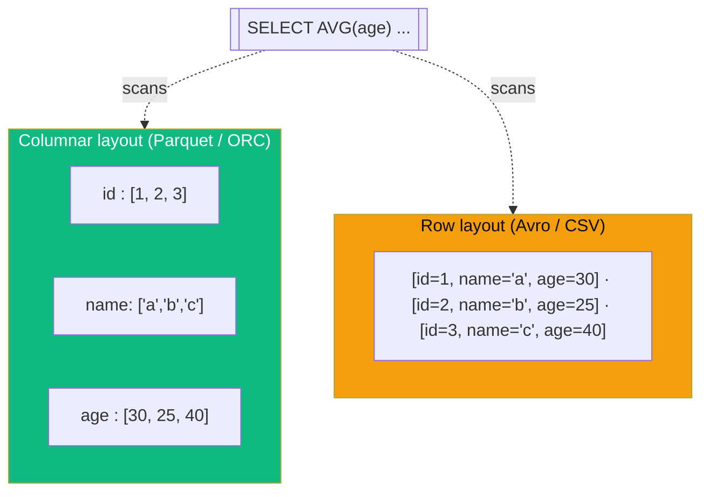

## Definition (interview-ready)

**Parquet** and **ORC** are **columnar** file formats optimized for analytics: store each column separately, enabling column pruning, predicate pushdown, and efficient compression. **Avro** is a **row-based** format with strong schema evolution support, optimized for streaming and serialization (Kafka payloads, RPC).

## Why it matters

The file format decision affects every downstream query's performance and cost. Storing analytics data in JSON or CSV instead of Parquet typically multiplies your S3 + query costs by 5-50× and slows queries by 10-100×.



| | Parquet | ORC | Avro |
|---|---|---|---|
| Layout | columnar | columnar | row |
| Best for | analytics (Spark/Trino) | analytics (Hive) | streaming, RPC payloads |
| Compression | strong (per-column) | strong (stripe-level) | good |
| Schema evolution | yes (loose) | yes | strongest |
| Predicate pushdown | yes (stats per page) | yes (indexes per stripe) | no |

## Core concepts

### Columnar vs row-based

```
Row-based (CSV/JSON/Avro):
  row1: [a1, b1, c1, d1]
  row2: [a2, b2, c2, d2]
  row3: [a3, b3, c3, d3]

Columnar (Parquet/ORC):
  col_a: [a1, a2, a3]
  col_b: [b1, b2, b3]
  col_c: [c1, c2, c3]
  col_d: [d1, d2, d3]
```

For "SELECT col_a, col_b WHERE col_b > 100" on a 50-column table:
- Row-based: read all 50 columns to find the 2 needed.
- Columnar: read only 2 columns.

Big savings for wide tables.

### Parquet

- Apache Parquet, Hadoop ecosystem, ubiquitous.
- Row groups (typically 128 MB): chunks of rows.
- Within row group: column chunks, each stored separately.
- Column chunks: page-aligned for efficient reads.
- Min/max stats per column per row group: enables row-group skipping for predicates.

```
File:
├── Footer: schema + row group metadata
├── Row group 1 (~128MB)
│   ├── Column A chunk
│   ├── Column B chunk
│   └── Column C chunk
├── Row group 2
├── ...
```

Compression: per column. Different codecs (Snappy, GZIP, ZSTD).
Encoding: per column. RLE, dictionary, delta — adapts to data type.

### ORC (Optimized Row Columnar)

- Apache ORC, Hive-native.
- Similar to Parquet: stripes (≈ row groups), columns inside.
- Better metadata: bloom filters built-in, fine indexes per column.
- Strong predicate pushdown.
- Spark and Hive both support ORC; Parquet is more widely supported across non-Hadoop tools.

Parquet vs ORC: 95% similar; choose based on tooling. Spark/Athena: Parquet. Hive-native: ORC.

### Avro

- Row-based, binary encoding.
- **Schema travels with data** (or via schema registry).
- Strong evolution: default values, aliases, schema resolution between writer and reader schemas.
- Used by:
  - Kafka payloads.
  - Hadoop intermediate / RPC.
  - Sometimes long-term storage if you need streaming-friendly format.

### When to use which

| Format | Use case |
|---|---|
| Parquet | Analytics on lake, OLAP, batch processing (Spark/Trino) — **default for analytics** |
| ORC | Hive-native ecosystems, where ORC has better integration |
| Avro | Streaming (Kafka), RPC, schema-evolution-critical row data |
| CSV | Tiny / human-readable; never for production analytics |
| JSON | API interchange, semi-structured; bad for warehouse storage |

### Compression codecs

- **Snappy**: fast compression / decompression. Default for many systems.
- **GZIP**: ~30% smaller than Snappy, ~2x slower. Use for cold storage.
- **ZSTD**: best ratio, fast decompression, slightly slower compression. **Often the best choice now.**
- **LZ4**: very fast, lower compression ratio than Snappy.

### File size guidance

- Aim for ~128 MB - 1 GB per Parquet/ORC file. Smaller = small-file overhead; larger = wastes parallelism.
- Spark/Trino can read in parallel within a file (row groups / stripes).
- Compact periodically with `OPTIMIZE` (Delta) or custom jobs.

### Partitioning

- Files organized by partition columns (e.g., `year=2026/month=05/`).
- Helps with predicate pushdown at the directory level: query for `year=2026` skips other directories entirely.
- Avoid over-partitioning (many small partitions = small file problem).

## How Parquet read works

```
Query: SELECT col_a, col_b FROM t WHERE col_b > 100;
1. Open file footer → schema, row group locations + stats.
2. For each row group:
   - Check col_b min/max — skip if entire group < 100.
3. For surviving row groups:
   - Read only col_a and col_b column chunks (skip others).
   - Apply col_b > 100 predicate to filter rows.
   - Return col_a, col_b for matching rows.
```

## Real-world examples

- **Almost every modern data lake**: Parquet on S3.
- **Iceberg, Delta Lake, Hudi**: lakehouse formats — all built on Parquet (and sometimes ORC).
- **Kafka + Confluent Schema Registry**: Avro is the canonical payload format.
- **Cloudera (Hadoop-native)**: heavy ORC usage.

## Common pitfalls

- **CSV / JSON for warehouse**: huge cost; do NOT.
- **Per-row Parquet writes**: tiny files explosion. Buffer to ~128MB before writing.
- **Bad partitioning**: hour partitions for hourly data — fine. Per-user partitions: hundreds of millions of dirs, kills metastore.
- **Missing or stale statistics**: row-group skipping doesn't fire. Re-collect stats (`ANALYZE TABLE`).
- **Snappy + tiny files**: not amortizing the overhead.
- **No compression at all**: ridiculous.
- **Schema evolution mismatch**: writing a column then renaming → tools may fail to read older files. Use Parquet field IDs (Iceberg helps).
- **`SELECT *` on wide tables**: defeats column pruning.

## Interview questions

### Q1: Why is Parquet faster than CSV for analytics?
- Columnar storage → read only the columns needed.
- Compression per column (each type uses optimal encoding).
- Predicate pushdown via min/max stats per row group.
- Binary encoding (no text parsing).
Typical: 5-50× I/O reduction, 10-100× query speedup.

### Q2: Parquet vs ORC?
Both are columnar with row groups/stripes, predicate pushdown, compression. Largely interchangeable. Choose by ecosystem: Parquet for Spark/Trino/Athena/Snowflake, ORC for Hive-native stacks. Functionally 95% the same.

### Q3: When use Avro instead of Parquet?
Avro for row-by-row workloads with schema evolution needs: Kafka payloads, RPC serialization, intermediate Hadoop data, situations where you read one row at a time. Parquet is for analytics queries on many rows of selected columns.

### Q4: How does Parquet do predicate pushdown?
Each row group has min/max statistics per column in the footer. Query engine reads footer, checks stats against predicate: if no row in group could match, skip the entire row group without reading data pages. For ranges, this skip is very effective on sorted-ish data.

### Q5: What's the ideal Parquet file size?
~128 MB to 1 GB per file. Smaller = small-file overhead (each file = separate task + metadata read). Larger = wastes parallelism (one task per file unless engine splits within). Compact regularly via maintenance jobs.

### Q6: Compression: Snappy vs ZSTD vs GZIP?
Snappy: fast, default. ZSTD: best balance — high compression ratio, fast decompression — **often the modern default**. GZIP: highest ratio but slow CPU; use only for archive. LZ4: fast but worse ratio than Snappy.

### Q7: A team writes Parquet files of 5 MB each. What goes wrong?
- Each file = separate read task → planning overhead dominates.
- Small file count grows huge over time; S3 listing slow.
- Cluster doesn't utilize parallelism well per row group.
- Solution: buffer writes to reach ~128MB-1GB; compact periodically (OPTIMIZE in Delta/Iceberg, custom job otherwise).

### Q8: Schema evolution in Parquet.
- Add column: safe — readers ignore unknown; older files return NULL.
- Remove column: safe for readers requesting it; writers stop including it.
- Rename: not safe by name — engines may break. Use **field IDs** (Iceberg's contribution).
- Type change: usually unsafe (silent corruption). Test carefully.

## TL;DR cheat sheet

- **Parquet/ORC**: columnar, perfect for analytics. Column pruning + predicate pushdown.
- **Avro**: row-based, schema-evolution-friendly. Kafka payloads, RPC.
- **CSV/JSON**: never for production warehouse.
- Target file size: 128 MB - 1 GB. Compact small files.
- ZSTD is the modern default compression.
- Partition for directory-level pruning, but not too granular.
- Keep statistics fresh.
- Avoid `SELECT *` to leverage column pruning.

## Go deeper

- **Apache Parquet docs**: [parquet.apache.org](https://parquet.apache.org/docs/).
- **Apache ORC docs**: [orc.apache.org](https://orc.apache.org/docs/).
- **Apache Avro docs**: [avro.apache.org](https://avro.apache.org/docs/1.11.1/).
- **Uber engineering**: ["Why we use Parquet"](https://www.uber.com/blog/cost-efficiency-big-data/) at scale.
- **DDIA Chapter 3** (storage formats), 4 (encoding).
- **Compression benchmarks**: ZSTD vs Snappy vs GZIP per workload.
