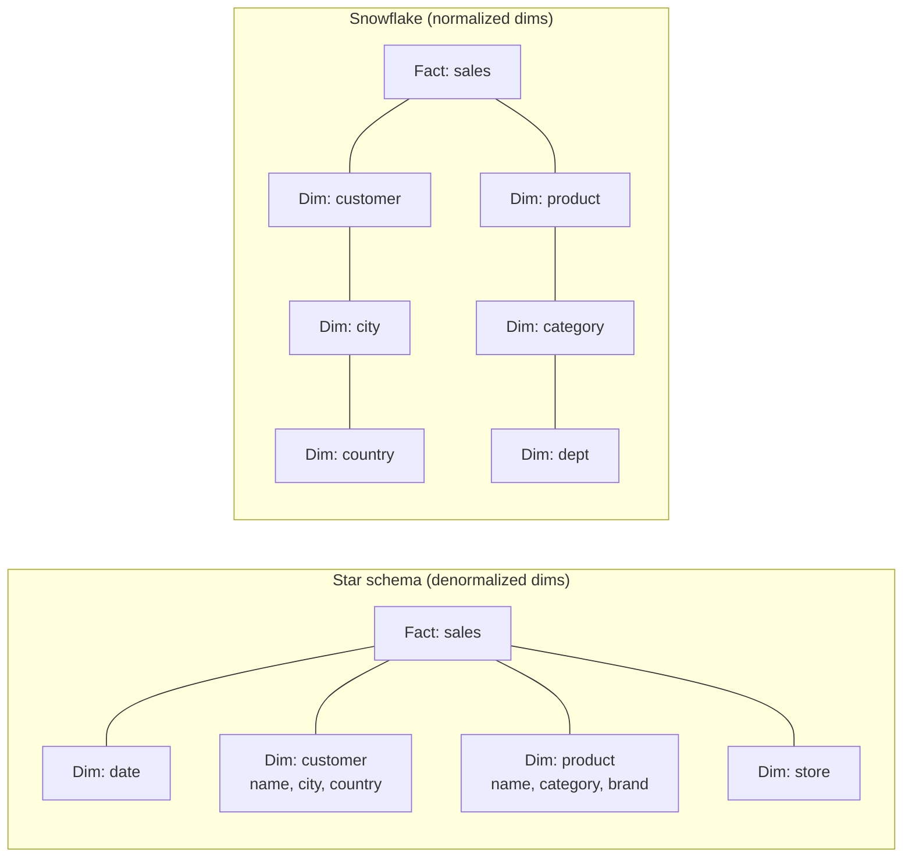
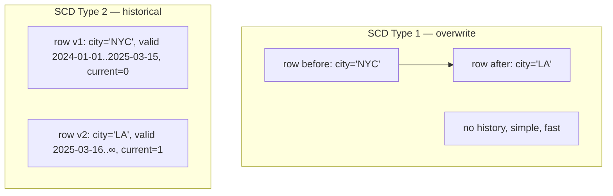

## Definition (interview-ready)

In dimensional modeling, **fact tables** store metrics (sales, clicks, sessions) and **dimension tables** store descriptive attributes (customer, product, store). **Slowly Changing Dimensions (SCDs)** are strategies for tracking changes to dimension attributes over time (Type 1 = overwrite, Type 2 = history with effective dates). **Star schema** denormalizes dimensions; **snowflake schema** normalizes them into sub-dimensions.

## Why it matters

Dimensional modeling is the backbone of every analytics warehouse — it's the language analysts use, the schema BI tools assume, and the structure that makes queries simple and fast. Understanding SCDs avoids "historical reports that change every day" type bugs.





## Core concepts

### Fact tables

- Store measurements (numerical) and foreign keys to dimensions.
- Typically very long, narrow (millions to billions of rows).
- Examples: `sales` (one row per transaction), `clicks`, `page_views`.

```
fact_sales(
  sale_id, sale_date,
  customer_key, product_key, store_key,  -- FK to dimensions
  quantity, amount, tax
)
```

### Dimension tables

- Store descriptive attributes.
- Wider (more columns), shorter.
- Used in WHERE clauses and GROUP BY.
- Examples: `customers`, `products`, `dates`, `stores`.

```
dim_customer(
  customer_key, customer_id, name, segment, country, signup_date
)
```

### Star schema

Dimensions directly joined to fact (denormalized).

```
                  dim_customer
                       │
   dim_date ── fact_sales ── dim_product
                       │
                  dim_store
```

Pros: simple joins, fast queries, easy for BI tools.
Cons: redundancy (denormalized dims), bigger storage.

### Snowflake schema

Dimensions normalized into sub-dimensions.

```
   dim_country ── dim_customer ── fact_sales ── dim_product ── dim_category
```

Pros: less redundancy.
Cons: more joins, slower queries, harder for analysts. **Generally avoid** unless storage is critical.

Default to **star schema** in analytics.

### Slowly Changing Dimensions (SCDs)

When dimension data changes (customer moves city, product category renamed), how do you reflect that?

#### Type 0: never change

Static — never update. Rarely useful.

#### Type 1: overwrite

```sql
UPDATE dim_customer SET city = 'Bangalore' WHERE customer_key = 42;
```

History lost. Old sales now appear linked to the new city. Easy but destroys audit.

#### Type 2: track history (most common)

Add validity dates + a current flag. Insert a new row on change.

```
dim_customer(
  customer_key,    -- surrogate, unique per version
  customer_id,     -- natural ID, stable
  city,            -- attribute
  effective_from,
  effective_to,
  is_current
)
```

```
customer_id=42, city=Delhi,      effective_from=2023-01-01, effective_to=2025-06-01, is_current=0
customer_id=42, city=Bangalore,  effective_from=2025-06-01, effective_to=9999-12-31, is_current=1
```

Facts reference `customer_key`, not `customer_id` — they're "frozen" to the version at sale time. Past reports stay accurate (the 2024 sales show Delhi, the 2026 sales show Bangalore).

#### Type 3: add a column for prior value

```
dim_customer(customer_id, current_city, previous_city)
```

Only the most recent prior value preserved. Rare.

#### Type 4: history table

Separate table tracks history; main dim is current.

#### Type 6: hybrid (1+2+3)

Combines overwrites, history rows, and prior-value columns. Used in some BI tools (MicroStrategy historically).

**Default**: Type 2 for any dimension where historical accuracy matters; Type 1 for cosmetic changes.

### Surrogate keys

Always use surrogate keys (`customer_key`) in dimensions, not natural keys (`customer_id`):
- Natural IDs can change.
- Surrogate allows multiple versions (Type 2).
- Joins are faster with integer surrogates.

### Date dimension

Always have a `dim_date` table — precomputed rows for every day with attributes (day_of_week, quarter, fiscal_year, holiday_flag).

Makes queries easy:
```sql
SELECT SUM(amount)
FROM fact_sales f JOIN dim_date d ON f.date_key = d.date_key
WHERE d.is_holiday = TRUE;
```

### Conformed dimensions

A dimension used by multiple fact tables (same `dim_customer` in `fact_sales` and `fact_returns`). Keeps reports consistent across subject areas.

## Modern lakehouse take

In Iceberg / Delta tables:
- **MERGE INTO** for Type 2:
  ```sql
  MERGE INTO dim_customer t USING source s
    ON t.customer_id = s.customer_id AND t.is_current
    WHEN MATCHED AND s.city <> t.city THEN UPDATE SET is_current = 0, effective_to = current_date
    WHEN NOT MATCHED THEN INSERT (...)
  ```
- **dbt snapshots** automate Type 2 SCDs declaratively.

### dbt snapshots

```yaml
snapshots:
  customers_snapshot:
    target_schema: snapshots
    unique_key: customer_id
    strategy: timestamp
    updated_at: updated_at
```

dbt manages effective dates + current flag automatically.

## How it works (Type 2 update)

```
Source has customer_id=42, city=Bangalore (was Delhi).

Update procedure:
BEGIN;
  UPDATE dim_customer
    SET effective_to = current_date, is_current = 0
    WHERE customer_id = 42 AND is_current = 1;
  INSERT INTO dim_customer
    (customer_id, city, effective_from, effective_to, is_current)
    VALUES (42, 'Bangalore', current_date, '9999-12-31', 1);
COMMIT;
```

Future sales link to the new `customer_key`. Past sales stay linked to the old one.

## Real-world examples

- **Kimball Data Warehouse Toolkit** — the canonical methodology.
- **Walmart, Costco, retail giants** — heavy Kimball dimensional modeling.
- **dbt + Snowflake/BigQuery** at modern data teams — declarative SCDs.
- **Looker / Tableau / PowerBI** — assume star schemas.

## Common pitfalls

- **Updating attributes in place (Type 1) on critical dimensions** — past reports change retroactively, hard to defend in audits.
- **Forgetting effective_to / is_current logic** — duplicate "current" rows, broken joins.
- **Joining on natural ID instead of surrogate**: Type 2 doesn't work.
- **Over-normalizing into snowflake** — slower queries, harder analyst experience.
- **No date dimension** — every analyst rolls their own.
- **Forgetting late-arriving dimensions** — sale comes in for a customer not yet in dim_customer; need to handle gracefully (insert placeholder, update later).

## Interview questions

### Q1: Star vs snowflake — which to use?
Star schema (denormalized dimensions) almost always. Snowflake (normalized) saves storage but adds joins and complexity; analysts and BI tools are happier with star.

### Q2: Explain Type 2 SCD.
Track historical changes by inserting a new dim row on change. Use `effective_from`, `effective_to`, `is_current` columns. Facts link to the version-specific surrogate key. Past reports stay accurate; current reports reflect current attributes.

### Q3: Why use surrogate keys?
- Natural IDs can change (rare but real).
- Type 2 requires multiple "versions" of the same entity.
- Integer surrogates make joins fast.
- Decouple warehouse from source systems' ID schemes.

### Q4: Design a dim_date table.
```
date_key (e.g., 20260529), date, year, quarter, month, day, day_of_week,
day_name, is_weekend, is_holiday, fiscal_year, fiscal_quarter, week_of_year
```
Precomputed for many years. Saves all analysts from date math in queries.

### Q5: Implement Type 2 SCD in dbt.
```yaml

  {{ config(target_schema='snapshots', unique_key='customer_id',
            strategy='check', check_cols=['city','segment']) }}
  SELECT * FROM {{ source('crm', 'customers') }}

```

dbt tracks changes; on each run it adds new rows when columns change.

### Q6: A report showing 2024 sales now shows new city names. Diagnose.
Dimension was updated Type 1 (overwrite). Past facts now join to current dimension values. To fix retroactively: re-create historical dim entries (hard if you don't have history) or accept the loss and switch to Type 2 going forward.

### Q7: Late-arriving dimension — what is it and how do you handle?
A fact arrives referencing a dim member that doesn't exist yet (e.g., new customer recorded in fact_sales before dim_customer was loaded). Strategies:
- **Placeholder** row in dim with `is_unknown=1`, replaced when real data arrives.
- Hold the fact in a staging area until dim arrives.
- Most warehouses use the placeholder pattern.

### Q8: A team uses surrogate keys but stores 30 attributes in dim_product, updated weekly. They're losing history. Why?
Likely Type 1 updates. Need to convert to Type 2 with effective dates. Tooling: dbt snapshots or manual MERGE pattern with old-row-close + new-row-insert.

## TL;DR cheat sheet

- **Star schema** = fact + denormalized dimensions. Default.
- **Snowflake** = normalized dimensions. Avoid unless storage critical.
- **Type 1 SCD**: overwrite. Loses history.
- **Type 2 SCD**: insert new row with effective_from / effective_to / is_current. Preserves history.
- **Surrogate keys** always.
- **dim_date** is mandatory.
- **dbt snapshots** automate Type 2.
- **Late-arriving dims**: use placeholder rows.

## Go deeper

- **Ralph Kimball, *The Data Warehouse Toolkit*** — the canonical book.
- **dbt docs**: [snapshots](https://docs.getdbt.com/docs/build/snapshots).
- **DDIA Chapter 3** for context.
- **Kent Graziano blog** on data warehousing.
- **Snowflake / BigQuery docs**: MERGE syntax for SCDs.
- **AWS, Microsoft documentation** on data warehousing patterns.
