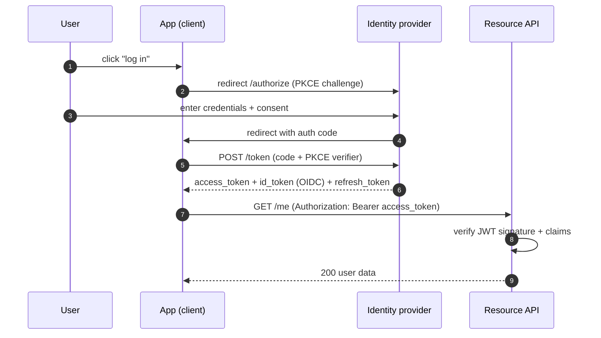

## Definition (interview-ready)

**Authentication (AuthN)**: verifying who you are. **Authorization (AuthZ)**: what you're allowed to do. **OAuth 2.0**: a delegation protocol — "let app X access my resources at provider Y without sharing my password." **OIDC (OpenID Connect)**: an authentication layer on top of OAuth 2.0 — adds an ID token proving who the user is. **JWT (JSON Web Token)**: a compact, signed token format often used to carry identity/claims.

## Why it matters

Auth is in every system; getting it wrong is a security incident. The patterns here are universal across SaaS, mobile apps, internal systems, microservices. Knowing the difference between OAuth and OIDC, and what JWTs actually guarantee (and don't), is foundational.



## Core concepts

### AuthN vs AuthZ

- **AuthN**: prove identity. Methods: password, SSO, OIDC, certificate, biometric.
- **AuthZ**: enforce access. Methods: role-based (RBAC), attribute-based (ABAC), policy engines (OPA, Cedar).

Auth is the umbrella; AuthN ≠ AuthZ.

### OAuth 2.0 — the delegation protocol

Roles:
- **Resource Owner**: the user.
- **Client**: the app wanting access.
- **Authorization Server**: issues tokens (e.g., auth.google.com).
- **Resource Server**: hosts the protected resource (e.g., gmail.googleapis.com).

Common flow: **Authorization Code with PKCE** (the modern default for web/mobile).

```
1. User clicks "Sign in with Google" in client app.
2. Client redirects user to Authorization Server with state + code_challenge (PKCE).
3. User logs in at Authorization Server; consents.
4. Auth Server redirects back to client with auth code.
5. Client exchanges code + code_verifier for access token (+ refresh token).
6. Client uses access token to call Resource Server (gmail API).
```

Tokens:
- **Access token**: short-lived (~1h), carries scopes. Used to call APIs.
- **Refresh token**: long-lived; used to get new access tokens without re-auth.
- **ID token** (OIDC): proves who the user is.

### OAuth 2.0 grant types (flows)

- **Authorization Code + PKCE**: web/mobile/SPA. Recommended.
- **Client credentials**: server-to-server, no user. Backend services calling each other.
- **Device code**: TVs / CLI tools without browser.
- **Implicit**: legacy SPA flow. **Deprecated**.
- **Resource Owner Password**: legacy. **Deprecated** (defeats the point of delegation).

### OIDC — auth on top of OAuth

OAuth was for *authorization* (delegation). People used it for *authentication* with a hack ("if Google gives me an access token, the user must have logged in"). OIDC formalized this: adds an **ID token** (JWT) that explicitly proves the user's identity.

Now: OAuth + OIDC together = login flow for most modern apps.

### JWT — what it is

A self-contained, signed token: `header.payload.signature` (base64url).

```
header:   { "alg": "RS256", "typ": "JWT" }
payload:  { "sub": "user42", "iat": ..., "exp": ..., "scope": "read write" }
signature: signed by issuer's private key
```

Verifier:
1. Parse and verify signature with issuer's public key.
2. Check claims: `exp` (not expired), `iss` (expected issuer), `aud` (this service).
3. Trust claims if valid.

Self-contained = no DB lookup needed to validate; just signature verification.

### JWT caveats

- **Stateless = no revocation**: once issued, valid until exp. Use short-lived JWTs + refresh tokens.
- **Signing key compromise = all tokens valid**: rotate keys carefully (JWKS endpoint with multiple keys).
- **Don't store sensitive PII in JWT**: anyone can decode (only signature is verified, payload is base64, not encrypted).
- **`alg: none` attacks**: never accept; always validate the algorithm matches expected.
- **Asymmetric (RS256/ES256) better than symmetric (HS256)** in distributed systems — public key can be shared widely.

### Session vs JWT

- **Session cookie + server-side store**: revocable, stateful, server lookup per request.
- **JWT**: stateless, no DB hit, no revocation.

For web apps with login: session cookies are often *simpler and more secure*. JWTs shine for service-to-service or stateless mobile auth.

### RBAC vs ABAC

- **RBAC**: role → permissions. "User is admin → can delete." Simple, easy to audit.
- **ABAC**: based on attributes of user, resource, action, context. "Allow if user.department = resource.department." Flexible, complex.
- **Policy engines** (OPA, Cedar): general-purpose AuthZ; declarative policies.

### Common storage of access decisions

- In code: simple, fast, but scattered.
- Sidecar / interceptor: middleware checks per request.
- Central policy service: query for decisions. Higher latency, easier to audit/update.

### mTLS for service-to-service

For internal service auth (no user), use **mTLS** (client cert). Stronger than tokens — the certificate itself proves identity. See Topic 64.

### Scopes vs roles vs permissions

- **Scope** (OAuth): what an access token is allowed to do at the resource server (e.g., `read:email`).
- **Role**: a label that bundles permissions (admin, editor, viewer).
- **Permission**: a specific allowed action (`delete:document`).

Don't confuse scopes (OAuth-level delegation) with roles (resource-internal AuthZ).

## How it works (a SaaS app with Google login)

```
1. User → MyApp: visits.
2. MyApp redirects to Google with `scope=openid email` + PKCE.
3. User signs in at Google; consents.
4. Google redirects to MyApp with auth code.
5. MyApp exchanges code for { id_token, access_token, refresh_token }.
6. MyApp verifies id_token signature (Google's JWKS) + claims.
7. MyApp creates its own session (cookie) for the user; doesn't store Google's tokens long-term.
8. Subsequent requests: MyApp session cookie. (Or short-lived JWT.)
9. If MyApp needs Gmail data: use access_token. Refresh via refresh_token when expired.
```

## Real-world examples

- **Google, GitHub, Facebook**: SSO providers via OIDC.
- **Auth0, Okta, Cognito**: managed identity providers.
- **Keycloak**: open-source identity provider.
- **AWS IAM**: roles and policies for service AuthZ.
- **Open Policy Agent (OPA)**: declarative AuthZ engine.

## Common pitfalls

- **Storing JWT in localStorage**: XSS can steal it. Use **HttpOnly secure cookies**.
- **Long-lived access tokens**: hard to revoke. Keep them short (~15 min).
- **Trusting the `iss` claim** without verifying issuer's JWKS.
- **No clock skew tolerance**: tokens expire just after they're issued. Allow ±60s skew.
- **Mixing auth + authorization**: JWT contains claims about user; service still needs to authorize per request.
- **OAuth without PKCE on public clients**: vulnerable to code interception.
- **No CSRF protection on auth callback**: state parameter required.
- **Hardcoding secrets**: rotate via secrets manager.

## Interview questions

### Q1: AuthN vs AuthZ?
AuthN = who are you (login). AuthZ = what can you do (permissions). Different concerns; same system handles both but they're conceptually separate.

### Q2: Difference between OAuth 2.0 and OIDC?
OAuth is **authorization** (delegation): "let this app access my resources." OIDC is **authentication** on top: adds an ID token proving who the user is. OIDC = OAuth + identity layer. Modern login = OIDC.

### Q3: What's a JWT?
A signed, base64-encoded token with three parts: header, payload (claims), signature. Self-contained — verifier checks signature with issuer's public key and trusts claims. Used for stateless auth in distributed systems. Limitations: no revocation, payload not encrypted.

### Q4: When NOT to use JWT?
- When you need to **revoke** tokens (e.g., logout, security incident). Use session cookies with server-side store.
- When tokens carry **sensitive data**. They're not encrypted.
- For purely web apps with login. Cookies + session store is simpler and more secure.
- When key rotation is hard.

### Q5: Why use PKCE?
PKCE (Proof Key for Code Exchange) prevents authorization code interception. Client generates a code_verifier (random) + code_challenge (hashed). Sends challenge in auth request; sends verifier in token exchange. Even if the auth code is intercepted, attacker can't exchange it without the verifier. Required for public clients (SPA, mobile); recommended everywhere.

### Q6: Compare RBAC and ABAC.
RBAC: role-based — assign users to roles, roles have permissions. Simple, easy to audit. Doesn't scale to fine-grained contextual rules. ABAC: attribute-based — evaluate (user attrs, resource attrs, action, context) at decision time. Flexible but complex. Most systems start RBAC and add ABAC for specific rules.

### Q7: Design auth for a microservice architecture.
- Edge: OAuth/OIDC for user login; gateway issues short-lived JWT for the session.
- Service-to-service: mTLS for identity; JWT carries forwarded user identity.
- Authorization: per-service, with shared policy engine (OPA) or library.
- Token verification: cache JWKS; verify on every request.
- Revocation: short-lived access tokens; refresh via long-lived but revocable refresh tokens stored server-side.

### Q8: A team uses long-lived JWT (24h) for sessions. Risks?
- Can't revoke after logout — token still valid.
- Compromise = 24-hour window.
- No way to push a permission change.
- Fix: short-lived access token (15 min) + refresh token stored server-side (revocable). On logout, invalidate the refresh token.

## TL;DR cheat sheet

- **AuthN** = who. **AuthZ** = what.
- **OAuth 2.0** = delegation. **OIDC** = login on top of OAuth.
- Modern flow: **Authorization Code + PKCE**.
- **JWT** = signed claims, self-contained, no revocation. Short-lived.
- ID token vs access token vs refresh token — different jobs.
- **Cookies** > JWT in localStorage for web (XSS).
- Use a **JWKS endpoint** for key rotation.
- Validate: signature, exp, iss, aud, alg.
- **mTLS** for service-to-service.
- **RBAC** for simple, **ABAC/OPA** for fine-grained.

## Go deeper

- **ByteByteGo**: ["OAuth 2.0 explained"](https://blog.bytebytego.com/p/ep72-oauth-20-explained-with-simple), ["Session/Cookie/JWT/SSO"](https://blog.bytebytego.com/p/ep34-session-cookie-jwt-token-sso).
- **oauth.net**: [oauth.net/2/](https://oauth.net/2/) — the canonical reference.
- **OpenID Foundation**: [openid.net/connect](https://openid.net/connect/).
- **jwt.io**: tool to inspect JWTs.
- **OWASP JWT cheat sheet**: [cheatsheetseries.owasp.org](https://cheatsheetseries.owasp.org/cheatsheets/JSON_Web_Token_for_Java_Cheat_Sheet.html).
- **Auth0 blog**: high-quality identity content.
- **Book**: *OAuth 2 in Action* (Manning).
