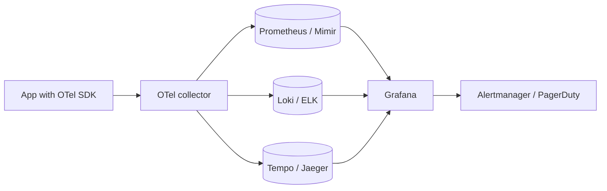

## Definition (interview-ready)

The "three pillars" of observability:
- **Metrics**: aggregated numerical time-series (CPU, request rate, error count). Tools: Prometheus, Datadog, Grafana.
- **Logs**: discrete event records, structured or unstructured. Tools: ELK / EFK (Elasticsearch + Logstash/Fluentd + Kibana), Loki, Splunk.
- **Traces**: causally linked spans across services for a single request. Tools: Jaeger, Tempo, Zipkin, Datadog APM.

**OpenTelemetry (OTel)** is the emerging unified standard for instrumenting and exporting all three.



## Why it matters

You can't operate what you can't observe. The difference between "the site is slow" and "the auth service has a p99 spike from DB connection pool exhaustion" is exactly the difference between a long incident and a fast one. Building observability is engineering's primary defense against production unknown unknowns.

## Core concepts

### Metrics

- Numerical samples over time, aggregated at collection.
- Tags / labels for dimensions: `http_requests_total{method="GET", status="200"}`.
- Pre-aggregated (counter, gauge, histogram, summary).
- Cheap to store, fast to query, ideal for dashboards and alerting.

**Prometheus model**: scrape metrics from /metrics endpoint on each instance; query with PromQL; store as time series.

**Cardinality killer**: too many tag combinations (e.g., `user_id` as a label) blow up the time-series count.

### Logs

- Discrete records of events.
- Structured (JSON) is far better than unstructured (free text) — queryable, filterable.
- Volume can be huge; cost can dominate observability spend.
- Use sparingly for high-cardinality stuff that doesn't fit metrics.

**Pattern**: log record = \{timestamp, level, service, trace_id, message, fields\}.

### Traces

- A trace = one request's journey across services.
- A trace = many spans, each with parent-child links.
- Each span: start time, duration, service, operation, tags.
- Sampled (1% typical) — full tracing would be too expensive.

Lets you see "request X took 2.3s — 1.8s was waiting for service Y."

### How they complement

- Metrics: aggregate — answers "is the system healthy overall?"
- Logs: detail — answers "what happened here?"
- Traces: causality — answers "what slowed *this* request?"

Use all three together; each one alone is incomplete.

### OpenTelemetry

- SDK in every language + collector that processes and routes telemetry.
- Vendor-agnostic export: same data → Prometheus, Jaeger, Datadog, etc.
- Auto-instrumentation for common frameworks.
- Becoming the default; replacing vendor-specific SDKs.

### Histograms vs summaries (Prometheus)

- **Histogram**: bucketed counts; aggregatable across instances; preferred.
- **Summary**: percentiles computed per-instance; can't aggregate (a server's p99 isn't averageable).

Use **histograms** with appropriate buckets; aggregate with `histogram_quantile()`.

### Latency percentiles

Always measure p50, p95, p99, p99.9 — not just average. Tail latency is what users feel.

### Service-level health vs deep dive

- Dashboard for service-level: golden signals (Topic 60), error rate, p99 latency, RPS.
- Deep dive: traces for slow requests + logs scoped by trace_id.

### Sampling

For traces:
- **Head-based** (sample at start): simple, may miss interesting traces.
- **Tail-based** (decide at end based on outcome): keep all errors and slow ones; sample successful ones. More accurate but harder to implement.

For metrics: no sampling — aggregated at the source.
For logs: usually no sampling, but be selective about what you log.

### Cost management

- Logs are expensive in storage and ingestion fees.
- Drop low-value debug logs in prod.
- Retention tiers: hot (7 days, queryable) → cold (90 days, S3) → archive.
- Pre-aggregate logs into metrics where the data is fundamentally numeric.

## How it works (a debugging session)

```
Incident: "checkout slow"

1. Dashboard: checkout service p99 went from 200ms to 5s. Error rate normal.
2. Drill in by tag: which endpoint? -> /checkout.
3. Trace: pick a recent slow trace.
   - 4.8s spent in payment-service.
4. Payment service traces: 4.5s in DB call.
5. DB metrics: connection pool saturation; many waits.
6. Logs (filtered by trace_id): "connection acquired after 4500ms".
7. Root cause: pool too small after recent deploy.
```

## Real-world examples

- **Netflix**: extensive Atlas (metrics) + Mantis + traces. Famous for chaos engineering.
- **Google**: Borgmon (metrics) → Monarch; Dapper (tracing).
- **Uber**: Jaeger (open-sourced their tracing system).
- **Honeycomb**: pioneered high-cardinality observability events.
- **OpenTelemetry + Grafana stack**: open-source-first observability.

## Common pitfalls

- **High-cardinality labels in metrics**: blows up storage. Avoid user_id, request_id as labels.
- **Free-text logs**: ungrep-able when you need them most. Always structured.
- **No trace IDs in logs**: can't link logs to traces.
- **Sampling rate too low**: miss the interesting 0.1%.
- **No SLO-derived alerts**: noise from per-host alerts; alert fatigue.
- **Logs as primary signal**: expensive and slow. Metrics first, logs for detail.
- **Vendor lock-in**: telemetry pipeline only works for one vendor.

## Interview questions

### Q1: Difference between metrics, logs, and traces?
Metrics = aggregated time-series (cheap, fast, for dashboards/alerts). Logs = discrete events (detailed, expensive). Traces = causally linked spans across services for one request (best for latency debugging). All three complement each other.

### Q2: Why prefer histograms over summaries in Prometheus?
Histograms aggregate across instances (servers): you can compute p99 over the whole service. Summaries compute per-instance percentiles, which can't be averaged or combined — useless for fleet-wide views.

### Q3: How do you connect logs to traces?
Include the `trace_id` (and ideally `span_id`) in every log record emitted during a request. OpenTelemetry SDKs handle this automatically. In your logging pipeline, search "all logs with trace_id=X" to see everything that happened during one request across services.

### Q4: A service has p99 latency at 2s but average at 100ms. What does that mean?
A small fraction of requests are very slow. Tail latency. Often caused by: GC pauses, cold cache, slow downstream calls, lock contention, ratchet effects. The average masks it; users feel the tail. Investigate via traces of slow requests.

### Q5: How do you reduce trace volume cost?
- Sampling (1% typical for normal traffic).
- Tail-based sampling: keep all errors and traces > X duration, sample the rest.
- Drop irrelevant traces (health checks).
- Retention: keep recent traces hot, archive older.

### Q6: What's OpenTelemetry?
Open-source, vendor-neutral standard + SDKs for instrumenting metrics, logs, traces. Collector processes and exports to any backend (Datadog, Honeycomb, Jaeger, Grafana). Removes vendor lock-in; auto-instruments common frameworks.

### Q7: Design observability for a new microservice from day 1.
- OpenTelemetry SDK; auto-instrument HTTP + DB.
- Emit metrics: RPS, error rate, latency histogram per endpoint.
- Structured logs with trace_id, level, service, request fields.
- Trace propagation across services.
- Dashboards from a template (RED/USE + golden signals).
- Alerts tied to SLOs.
- All exports via OTel Collector to your platform.

### Q8: A team has 500 alerts daily, most ignored. How do you fix?
- Audit: which alerts have fired, which led to action, which are noise?
- Delete alerts that never lead to action.
- Convert per-host alerts to SLO-based service-level alerts.
- Tier severities; only critical = page, others = ticket.
- Establish ownership; orphan alerts deleted.
- Post-mortem: every page should have a clear runbook.

## TL;DR cheat sheet

- Three pillars: **Metrics** (aggregated), **Logs** (discrete), **Traces** (causal).
- Use OTel for vendor-neutral telemetry.
- Histograms not summaries.
- Avoid high-cardinality labels.
- Trace IDs in logs for cross-pillar correlation.
- Sampling + tail-based for trace volume.
- Alert on SLO breaches, not per-host.
- Cheap to add at the start; expensive to add after incidents.

## Go deeper

- **OpenTelemetry docs**: [opentelemetry.io/docs](https://opentelemetry.io/docs/).
- **Book**: *Observability Engineering* (Honeycomb).
- **Prometheus docs**: [prometheus.io/docs](https://prometheus.io/docs/).
- **Charity Majors** (Honeycomb CTO): blogs and talks on observability.
- **Distributed Tracing in Practice** (O'Reilly).
- **Cindy Sridharan**: ["Distributed Systems Observability"](https://www.oreilly.com/library/view/distributed-systems-observability/9781492033431/) free O'Reilly report.
- **Google SRE Book Ch. 6** (monitoring).
