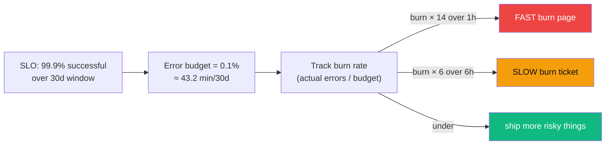

## Definition (interview-ready)

- **SLI (Service Level Indicator)**: a measured aspect of service quality (e.g., success rate, p99 latency).
- **SLO (Service Level Objective)**: an internal target for an SLI (e.g., 99.9% successful requests).
- **SLA (Service Level Agreement)**: an external contract with consequences (refunds, penalties) if SLO is missed.
- **Error budget**: 1 - SLO. The amount of unreliability you can "spend" — on risky deploys, experiments, or just unlucky incidents — before missing the SLO.



| Term | Audience | Teeth |
|---|---|---|
| **SLI** | engineers | what you measure |
| **SLO** | internal | what you target |
| **SLA** | customers | contractually owed (refunds, etc.) |
| **Error budget** | leadership + eng | how much risk you can spend |

## Why it matters

Without SLOs, "reliability" is debated forever. With SLOs, you have a concrete target everyone agrees on, alerts you only when it matters, and an error budget that turns reliability into a quantitative resource you can spend. This is the foundation of Google-style SRE.

## Core concepts

### SLI examples

- **Availability**: (successful requests) / (total requests).
- **Latency**: % of requests faster than threshold (e.g., 95% < 500ms).
- **Quality**: % of requests with full results (vs degraded).
- **Freshness**: % of data updated within N minutes.
- **Correctness**: % of operations that produce correct results (harder to measure).

Pick SLIs that **users feel**. CPU utilization is not an SLI; it's a resource metric.

### Choosing SLOs

A common framework:
- **Easy SLOs**: 99% / 99.5% — early-stage services, low impact.
- **Standard**: 99.9% (three 9s) — most production services.
- **Aggressive**: 99.99% — payment, auth, core infra.
- **Extreme**: 99.999% — only for critical infra (DNS, search backbone). Very expensive.

Each 9 added is roughly 10× cost.

### Time windows

SLO is over a **window**: rolling 30 days, calendar month, etc.

Common: rolling 30 days. Captures both short-term and slow burns.

### Error budget

Budget = 1 - SLO. For 99.9% SLO over 30 days:
```
Total minutes in 30 days = 43,200
Allowed downtime = 0.1% × 43,200 = 43.2 minutes
```

That's the budget. Spend it on deploys, chaos experiments, planned maintenance, real incidents.

### Burn rate

How fast you're burning through the budget.

```
burn_rate = (current error rate) / (allowable error rate per SLO)
```

If burn_rate = 1, you'll exhaust the budget exactly at the SLO window end.
If burn_rate = 10, you'll exhaust it in 1/10 the time.

### Multi-window, multi-burn-rate alerts

Google SRE pattern for sane alerting:
- **Fast burn**: errors spiking now (5min × 14.4 × baseline).
- **Slow burn**: subtle issue over hours (1h × 6× baseline).

Alert when either triggers — fast for incidents, slow for creeping issues.

```yaml
- alert: SLOErrorBudgetBurnFast
  expr: |
    job:slo_errors_per_request:ratio_rate1h{job="api"} > (14.4 * 0.001)
    and
    job:slo_errors_per_request:ratio_rate5m{job="api"} > (14.4 * 0.001)
  for: 2m
  labels: { severity: page }
```

### SLA vs SLO

- **SLA**: external commitment with **penalties**. "If we breach 99.9%, you get 10% refund."
- **SLO**: internal target, always **stricter than SLA** to allow buffer.
- **SLI**: the measurement.

E.g., SLA 99.9%, SLO 99.95% — gives you 0.05% buffer to fix issues before users get refunds.

### Error budget policy

A pre-agreed policy about what to do when budget is spent:
- **Budget healthy**: deploy freely, take risks, run experiments.
- **Budget depleted**: pause non-critical changes, focus on reliability fixes.
- **Budget exhausted (SLO breached)**: incident retrospective; engineering priorities shift.

Codify this; otherwise the conversation about "should we deploy now?" never ends.

### Multi-tier SLOs

Different SLOs for different operations:
- Critical (POST /payment): 99.99%.
- Important (GET /home): 99.9%.
- Background (POST /analytics): 99%.

Per-endpoint SLOs reflect business impact.

## How it works (a quarter of SLO management)

```
Q3 SLO: 99.9% availability for /checkout.

Week 1: deploy, accidental 5-min outage. Budget burned: 5 min / 43 min = 12%.
Week 2: smooth.
Week 3: subtle degradation, 0.5% errors for 2 hours. Budget burned: 25%.
Week 4: half-month checkpoint — 60% budget remaining; team is doing well.
Week 5: deploy goes wrong, 1-hour incident. Budget burned: 75% total.
Week 6: budget tight; freeze risky deploys for the rest of the period.
Week 7: small fixes only; budget at 95% by end.
Week 8: SLO met at 99.91%.

Retrospective: which incidents were preventable? What invest in prevention?
```

## Real-world examples

- **Google SRE**: founded the methodology.
- **GitHub**: public status page + SLOs.
- **Stripe**: rigorous internal SLOs on payment endpoints.
- **AWS**: SLA on every service publicly stated; internal SLOs much tighter.
- **Twilio, Slack, Cloudflare**: public SLAs visible on their pricing pages.

## Common pitfalls

- **No SLOs**: every outage is debated by feel.
- **SLOs without policies**: budget burn never triggers action.
- **Vanity SLOs**: 99.99% on everything → costly and futile.
- **SLI of internal metrics, not user-felt**: CPU% isn't an SLI.
- **No multi-window alerts**: either too noisy or too slow.
- **SLA stricter than SLO**: zero buffer — refund storms when you breach.
- **Ignoring planned maintenance**: must be accounted for in budget.
- **No team ownership** of the SLO.

## Interview questions

### Q1: SLI vs SLO vs SLA?
SLI = measured aspect (e.g., success rate). SLO = internal target (99.9%). SLA = external commitment with penalties (99% with refund on breach). SLA < SLO < perfection — buffer between.

### Q2: What's an error budget?
1 - SLO. For 99.9% SLO over 30 days, error budget = ~43 minutes. Lets you spend "unreliability" on deploys, experiments, planned maintenance, or incidents without violating the SLO. Quantifies reliability vs velocity tradeoffs.

### Q3: How do you pick the right SLO?
Based on user expectations and business impact. Critical (payments, auth): 99.99% or higher. Standard: 99.9%. Lower for non-critical. Avoid "too tight" SLOs — they're expensive and force unnecessary work.

### Q4: How do you alert on SLO?
Multi-window, multi-burn-rate: detect both fast burn (e.g., 14× normal in 5 min) and slow burn (6× normal in 1 hour). Page on fast; ticket on slow. Avoids per-event alerts that drown the on-call.

### Q5: How do you handle a recent feature that's slow but not broken?
Check SLO impact. If it eats into budget, classify it as a reliability issue and prioritize fix. If under budget, you can ship and iterate. Error budget makes this objective.

### Q6: Design SLOs for a new e-commerce service.
- /search SLO: 99.9% requests successful, 99% < 500ms.
- /product (catalog read): 99.95% available, 99% < 300ms.
- /cart (mutation): 99.9% available, 99% < 500ms.
- /checkout (payment): 99.99% available, 99% < 800ms. Highest tier.
- /order-history (read): 99.5% available, 95% < 1s.

Per-endpoint differentiation reflects business impact.

### Q7: A team consistently misses SLO. What now?
- Honest retrospective: are SLOs realistic given the work?
- Either: invest in reliability (rate limit, CB, redundancy), OR relax SLO to a sustainable target.
- Engineering prioritization shifts to reliability work.
- Budget policy: pause risky changes until back in budget.
- If repeatedly missed despite investment: SLO may be too aggressive for the system's current state.

### Q8: What's the difference between burn rate and budget remaining?
Burn rate = rate at which budget is being consumed (% per hour). Budget remaining = absolute remaining unreliability allowed. Burn rate tells you about *trajectory*: even with budget remaining, a high burn rate means you'll exhaust it soon. Use both: budget for context, burn rate for urgency.

## TL;DR cheat sheet

- **SLI**: measured aspect (e.g., success rate).
- **SLO**: internal target (e.g., 99.9% in 30 days).
- **SLA**: external commitment with penalties.
- **Error budget = 1 - SLO**; allowable unreliability.
- **Burn rate**: how fast you're consuming the budget.
- Multi-window, multi-burn-rate alerts (fast burn = page, slow = ticket).
- Per-endpoint SLOs reflect business impact.
- Each "9" added costs ~10×.
- Error budget policy: freeze risky changes when budget low.
- SLO is a tool to balance velocity vs reliability.

## Go deeper

- **Google SRE Book Ch. 4**: ["Service Level Objectives"](https://sre.google/sre-book/service-level-objectives/).
- **Google SRE Workbook**: ["Implementing SLOs"](https://sre.google/workbook/implementing-slos/) — the practical guide.
- **Alex Hidalgo**: ["Implementing Service Level Objectives"](https://www.oreilly.com/library/view/implementing-service-level/9781492076803/).
- **Charity Majors**: blogs on observability and SLOs.
- **Burn rate alerts** in Prometheus: docs and recipes.
- **OpenSLO** spec.
