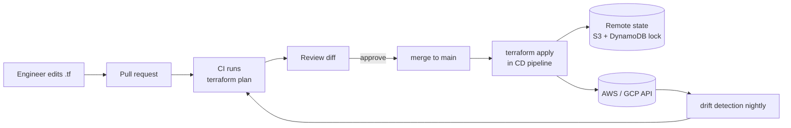

## Definition (interview-ready)

**Infrastructure as Code (IaC)** is managing cloud infrastructure via declarative source files (versioned, reviewed, applied programmatically) instead of clicking in consoles. **Terraform** (HashiCorp) is the dominant tool: write `.tf` files describing desired state, Terraform plans diffs against current state, applies them. **State** (`.tfstate`) tracks what's deployed.

## Why it matters

Hand-managed infra drifts, can't be audited, and is the #1 cause of "it works in staging but not prod." IaC turns infra into code: review, test, version, repeat. Every modern team needs IaC.



## Core concepts

### Terraform basics

```hcl
# main.tf
provider "aws" { region = "us-east-1" }

resource "aws_s3_bucket" "logs" {
  bucket = "myapp-logs-2026"
}

resource "aws_iam_role" "lambda" {
  name = "lambda-exec-role"
  assume_role_policy = jsonencode({ ... })
}
```

Commands:
- `terraform init`: download provider plugins.
- `terraform plan`: show what would change.
- `terraform apply`: make it so.
- `terraform destroy`: tear it down.

### State

`terraform.tfstate`: source of truth for what Terraform created. Stored:
- Locally (default — bad for teams).
- **Remote backend**: S3, GCS, Azure, Terraform Cloud — required for shared use.
- **State locking**: DynamoDB lock table (AWS), Cloud Storage object lock — prevents two engineers applying simultaneously.

### Variables and outputs

```hcl
variable "env" { type = string }
output "bucket_arn" { value = aws_s3_bucket.logs.arn }
```

### Modules

Reusable building blocks: a directory of `.tf` files that you call:

```hcl
module "vpc" {
  source = "./modules/vpc"
  name   = "prod-vpc"
  cidr   = "10.0.0.0/16"
}
```

Or from the registry: `source = "terraform-aws-modules/vpc/aws"`.

### Workspaces / environments

- One config, multiple state files (dev, staging, prod).
- Common pattern: separate directories per env (`envs/prod/`, `envs/staging/`) sharing modules.
- Avoid Terraform workspaces for env separation in production — directory-based is clearer.

### Drift detection

`terraform plan` shows the difference between code and reality. If someone manually changes infra, plan reveals drift. Reapply to converge.

### Lifecycle

```hcl
resource "aws_db_instance" "primary" {
  ...
  lifecycle {
    prevent_destroy = true        # safety
    ignore_changes = [password]   # avoid drift on managed-elsewhere fields
    create_before_destroy = true  # new before kill on replacement
  }
}
```

### Best practices

- **Remote state** with locking.
- **Modules** for reusable patterns.
- **Naming conventions** (env in resource names).
- **Tags everywhere** for cost attribution.
- **No secrets in tf files** — use Secrets Manager / Vault.
- **`terraform plan` in CI** for every PR.
- **Manual approval** before `apply` in prod.
- **State backups**: state file corruption = manual recovery hell.
- **Use cloud-managed where possible** (RDS over EC2-with-MySQL).

### Pulumi (alternative)

IaC in real programming languages (TypeScript, Python, Go, .NET) instead of HCL. Pros: real loops, conditionals, libraries; ecosystem familiarity. Cons: easier to write bad infra code; same state-management complexity.

### CDK (AWS)

AWS Cloud Development Kit: TypeScript/Python/Java DSL that synthesizes to CloudFormation. AWS-native. Good if you're all-in on AWS.

### CloudFormation (AWS native)

Declarative YAML/JSON. Native AWS rollback semantics. Less ergonomic than Terraform; AWS-only.

### Ansible / Chef / Puppet

Configuration management for existing servers (install packages, manage files). Different layer from Terraform (which provisions cloud resources). Some overlap; immutable-image patterns (Packer + Terraform) often replace them.

## How it works (a PR flow)

```
Developer:
  edit terraform/prod/main.tf
  terraform plan locally → check
  open PR
CI:
  terraform plan against remote state → result in PR
Reviewer:
  reads plan: 1 resource to add, 1 to modify
  approves
Merge:
  CI runs terraform apply with prod creds (gated by manual approval or signed-off plan)
  state updated
```

## Common pitfalls

- **State file in git**: contains secrets, sensitive. Never commit. Use remote backend.
- **No state lock**: two applies at once → corruption.
- **Hand-editing infra**: drift. Always go through Terraform.
- **Mega-config in one file**: slow, scary plans. Split into smaller modules / states.
- **No CI plan**: surprises on apply.
- **Secrets in tf files**: visible in state. Pull from Vault / Secrets Manager.
- **Forgetting `prevent_destroy`** on stateful resources (RDS, S3): one bad PR can delete production data.
- **Mixing Terraform with manual changes**: pick one.
- **No backup of state**: corruption = manual reconstruction.
- **Mixed providers/versions in one config**: dependency hell.

## Interview questions

### Q1: What's IaC and why use it?
Infrastructure as Code: cloud resources defined in versioned code, reviewed, applied programmatically. Benefits: reproducible (same code → same infra), reviewable (PRs, diffs), auditable (git history), recoverable (re-apply after disaster). Replaces manual console clicks.

### Q2: How does Terraform state work?
State file (`.tfstate`) tracks what Terraform has created. Compares desired (config) vs actual (state) to compute a plan. Stored remotely (S3, GCS) for team use, with locking (DynamoDB, GCS object lock) to prevent concurrent applies.

### Q3: A teammate manually changed infra. What happens?
Next `terraform plan` shows drift. You can either: re-apply Terraform to revert (if change wasn't intended), or `import` the change to bring it into state (if it's legit). Worst case: gradually align state and code over multiple PRs.

### Q4: How would you organize Terraform for prod / staging / dev?
Per-env directories sharing modules:
```
modules/
  vpc/
  rds/
  app/
envs/
  dev/  (uses modules with dev vars + dev state file)
  staging/
  prod/
```
Each env has its own remote state. Avoid Terraform workspaces for environment separation (confusing); directory-based is clearer.

### Q5: How do you handle secrets in Terraform?
Don't store in `.tf` files (they end up in state). Options:
- Pull from Secrets Manager / Vault at provision time.
- Use `random_password` resource + write to Secrets Manager via Terraform.
- For sensitive variables: mark `sensitive = true`; CI uses environment variables.
- Keep state file encrypted (S3 SSE, GCS encryption).

### Q6: What does `create_before_destroy` do?
Resource lifecycle policy: when replacing a resource, create the new one *before* destroying the old. Avoids brief outages for stateless resources (e.g., LB target group). For stateful (RDS), use with care.

### Q7: Terraform vs CloudFormation vs Pulumi?
- **Terraform**: multi-cloud, HCL, dominant. Industry standard.
- **CloudFormation**: AWS-native, YAML/JSON, less ergonomic.
- **Pulumi**: real programming languages (TS, Python, Go) for IaC. More expressive but easier to write bad infra code.
- **CDK**: TS/Python on top of CloudFormation; AWS-native.

For multi-cloud or non-AWS: Terraform. AWS-only with strong programming preference: CDK or Pulumi.

### Q8: How would you test Terraform code?
- **Validate**: `terraform validate` for syntax.
- **Plan in CI**: catches accidental destructions.
- **Static analysis**: tfsec, Checkov for security/compliance.
- **Integration tests**: Terratest (Go), kitchen-terraform — provision a real test environment, validate behavior, tear down.
- **Module tests**: tighter feedback than full integration.
- **Policy-as-code**: OPA / Sentinel to enforce org rules ("no public S3 buckets").

## TL;DR cheat sheet

- IaC = infra in code: versioned, reviewed, reproducible.
- **Terraform** = dominant tool, HCL, multi-cloud.
- **State** = source of truth. Remote backend with locking.
- **Modules** for reusable patterns.
- **PR + plan in CI** before apply.
- **Secrets** never in `.tf` files; from Secrets Manager / Vault.
- **prevent_destroy** on critical resources.
- **Drift** = manual changes; reapply or import.
- **Policy as code** (OPA/Sentinel) for org rules.

## Go deeper

- **Terraform docs**: [developer.hashicorp.com/terraform](https://developer.hashicorp.com/terraform/tutorials).
- **Gruntwork blog**: production Terraform patterns.
- **Terraform Up & Running** (Yevgeniy Brikman).
- **Pulumi docs** for programmable IaC.
- **AWS CDK docs**.
- **Spacelift / Atlantis / Terraform Cloud** for CI/CD-style workflows.
- **tfsec, Checkov, OPA Conftest** for security.
