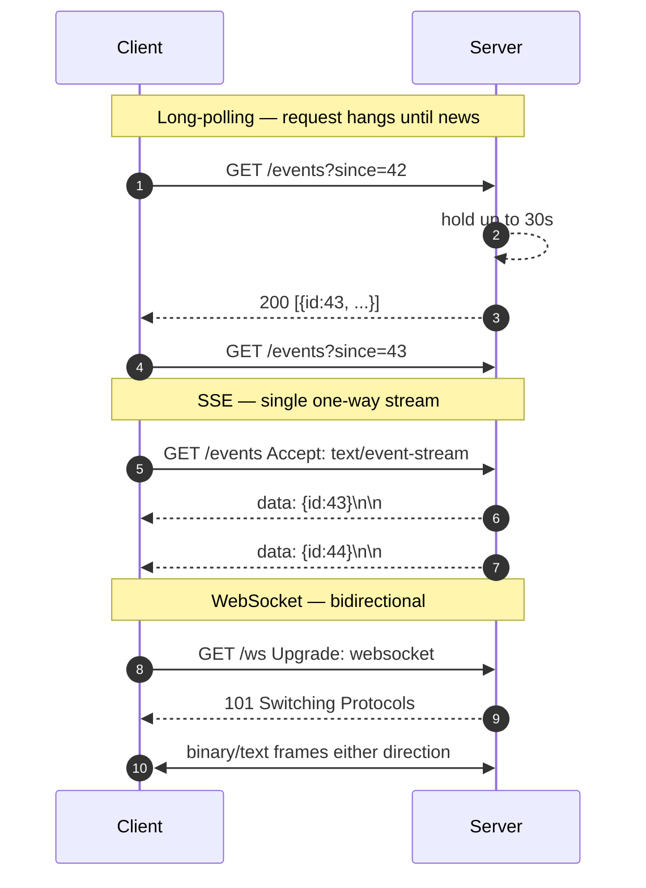
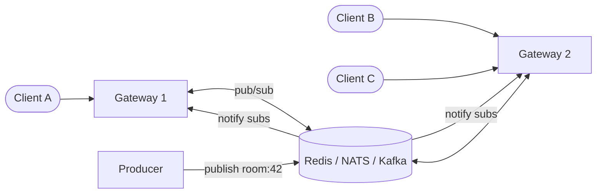

## Definition (interview-ready)

When a server needs to push data to a client without the client asking, you choose between **long-polling** (client keeps opening HTTP requests that the server holds open until it has news), **Server-Sent Events (SSE)** (one-way HTTP stream from server to client over a long-lived connection), and **WebSockets** (full-duplex TCP connection upgraded from HTTP, used for both directions). Each trades complexity, browser/proxy compatibility, and bidirectionality differently.

## Why it matters

Chat, notifications, live dashboards, collaborative editors, gaming, live sports scores, trading apps, presence indicators — none of these work cleanly with request/response polling. Picking the wrong primitive (long-poll where WS is needed, or vice versa) cascades into connection-explosion bills, head-of-line blocking, and proxy misery. The decision drives everything from your LB config to your sticky-session model to whether mobile clients drain battery.

## Core concepts

### Long-polling

The HTTP request stays open until the server has data or a timeout fires (~30 s). On response, the client immediately opens a new request.

- **Pros:** works with any HTTP infra (LBs, proxies, CDNs). No special protocols. Fallback for everything else.
- **Cons:** per-message TCP/TLS handshake overhead. Doubles request rate when busy. Hard to scale beyond ~10K concurrent on a single node without async I/O.
- **Use it when:** client environment is hostile (corporate proxies, ancient browsers), you only need notifications every few seconds, or as a fallback when WS fails.

### Server-Sent Events (SSE)

The client sends one HTTP request with `Accept: text/event-stream`. The server keeps the connection open and streams **named, ID'd events** as `event: x\ndata: y\n\n`. Auto-reconnect with `Last-Event-ID` resumes from where the stream was cut.

- **Pros:** built-in browser API (`EventSource`), auto-reconnect, runs over standard HTTP/2 (or HTTP/1.1). Works with most proxies. Resumable.
- **Cons:** **one-way only** (server → client). Browsers cap ~6 concurrent SSE connections per host on HTTP/1.1 (HTTP/2 lifts this via stream multiplexing).
- **Use it when:** server pushes, client doesn't need a constant return channel beyond occasional REST calls. Notifications, live feeds, log tails, GPT-style token streaming.

### WebSockets

Client requests `Upgrade: websocket`; on `101 Switching Protocols` the underlying TCP connection becomes framed bidirectional. Frames carry text or binary, ping/pong for keepalive.

- **Pros:** full-duplex, low overhead per message (~2-14 byte framing), can carry binary, low latency.
- **Cons:** **stateful long-lived connections.** Sticky sessions or a fan-out bus (Redis pub/sub, Kafka) needed for horizontal scaling. Many corporate proxies still block or break WS upgrades. No standard auto-reconnect — you must build it.
- **Use it when:** truly bidirectional + low-latency + high-frequency (chat, collab, gaming, dashboards).

### HTTP/2 server push (deprecated)

A footnote — not used in practice. Chrome removed it in 2022. Use SSE or WS instead.

### gRPC streaming

For service-to-service push, gRPC server-streaming and bidi-streaming over HTTP/2 are usually cleaner than WS. Strongly typed, built-in flow control. Cannot speak to a browser directly without a proxy (grpc-web).

## How it works

### Sizing a single node

| Mechanism | Connections per node (typical) | RAM per connection |
|---|---|---|
| Long-polling (async server) | 50K–100K | 4–16 KB |
| SSE | 50K–200K | 8 KB |
| WebSocket | 100K–500K (epoll/kqueue) | 4–16 KB |

The bottleneck for WS is rarely CPU and rarely the connection count itself — it's **outbound bandwidth × fan-out**. A single message broadcast to 100K subscribers = 100K writes.

### Horizontal scale: fan-out bus

Multiple WS/SSE gateways need to share state. Common patterns:

- Each gateway subscribes to the **rooms / channels** its clients care about.
- Producer publishes once to the bus; bus fans out to interested gateways; gateways write to their connections.
- For very high fan-out (10M+), use a **multicast tree** of gateways (Discord, Twitch).

### Heartbeats and reconnects

- WS: send `ping` every 20–30 s. If no `pong` in 10 s → close, reconnect with backoff.
- SSE: server sends a comment line `:keep-alive\n\n` periodically. Browser auto-reconnects on close.
- Long-poll: timeout itself is the heartbeat.

### Authentication

- WS handshake is a regular HTTP request — use cookies, bearer tokens, or a query-string short-lived ticket. **Never** put a long-lived bearer token in a query string (gets logged).
- After upgrade, you can no longer rely on per-request headers — auth is **per-connection**. Track user identity in connection state.

### Mobile considerations

- WS over flaky cellular: TCP retransmits make latency bad. Some apps switch to QUIC-based protocols (HTTP/3-style) under the hood.
- Background tabs: browsers throttle WS in inactive tabs. Don't depend on tight heartbeats from the client.

## Real-world examples

- **WhatsApp, Slack, Discord:** WebSockets (with Discord notably using Erlang/Elixir + custom gateway sharding to hold millions per node).
- **Twitter timeline streaming API (v1):** SSE for one-way "tweets matching filter."
- **GitHub Actions live logs:** SSE for streaming log lines into the browser.
- **OpenAI / Anthropic streaming responses:** SSE — tokens stream in as the model generates them.
- **Google Docs / Figma:** WebSockets with operational transform / CRDT for real-time collab.
- **Stock tickers, sports apps:** WebSockets, sometimes pub/sub via WAMP.
- **Live YouTube comments:** historically long-poll, migrated to gRPC streaming.
- **Notifications (push to mobile):** SSE/WS for in-app while open; **APNs/FCM** for closed/background — different problem.

## Common pitfalls

- **Using WS where SSE would do.** If pushes are one-way (notifications, log streaming), SSE is simpler, plays nicer with proxies, and resumes automatically.
- **No fan-out plan.** A single-node WS prototype that "works locally" falls apart at the first horizontal scaling event. Plan the pub/sub bus on day one.
- **Sticky sessions as the only scale strategy.** Sticky binds users to nodes — a failure cascade if one node dies. Prefer **stateless gateways with a shared bus**.
- **Forgetting to reauth on reconnect.** Reconnects often happen after token expiry. The client thinks it's still authed; the server should re-validate.
- **Broadcasting without per-client filtering.** A naive "send to all" wastes bandwidth and exposes data. Maintain a `room → connection_ids` index.
- **Slow consumers.** A client on bad wifi can back-pressure your write buffer. Per-connection bounded queue + drop-on-overflow + reconnect protocol.
- **Heartbeat in only one direction.** You'll miss half-open TCP connections (NAT timeouts, dead peers). Heartbeat both ways.
- **Long-polling with synchronous servers.** Each held request consumes a thread. Use async (Netty, Tornado, Node, Go, Tokio) or it falls over.
- **Treating WS as request/response.** It's a stream; correlating responses to requests requires you to add message IDs and your own multiplexing.

## Interview questions

### Easy

1. **What's the difference between WS and SSE?**  
   WS is full-duplex (both directions, framed binary or text). SSE is one-way server → client over HTTP. WS needs a protocol upgrade; SSE is plain HTTP streaming.

2. **Why not just poll?**  
   Polling at sub-second intervals burns CPU and bandwidth on both sides. At second+ intervals, latency is too high for chat/dashboards. Long-poll/SSE/WS all aim to deliver "as soon as available" without the request rate.

### Medium

3. **How do you scale a WS server to 1M concurrent users?**  
   Multiple gateway nodes, each holding ~100K WS connections, fronted by a TCP LB (no L7 — termination of WS at L4 keeps things simple). Use a shared pub/sub bus (Redis, NATS, Kafka) so each gateway forwards messages to interested subscribers regardless of which node they're on. Track room membership in Redis. Drop-on-overflow for slow clients.

4. **A user keeps disconnecting and reconnecting in a flaky network. How do you avoid losing messages?**  
   Server tags every message with a monotonic per-room ID. Client tracks the last received ID. On reconnect, client sends `?since=lastId`; server replays missed messages from a short retention buffer (e.g., last 5 minutes in Redis). For longer gaps, fall back to "fetch missed via REST."

5. **WebSocket vs HTTP/2 streaming — when do you pick which?**  
   WS for browser ↔ server when you need bidirectional with minimal framing overhead. HTTP/2 (or gRPC) streaming for server ↔ server because you get built-in flow control, multiplexing, and strongly typed contracts. Browsers can't speak raw HTTP/2 streams cleanly — that's WS's lane.

### Hard

6. **Design real-time delivery for a chat app with 100K users per room (e.g., a live event chat).**  
   At 100K subs per room and 10 msg/s, that's 1M outbound writes/s per room. Sharded gateway nodes; each room mapped (consistent hash) to a small set of "primary" nodes that hold a multicast tree to all gateways with subscribers. Producer publishes once to the primary; primary fans to gateways; gateways fan to clients. Drop-on-overflow per client. Optional: client-side coalescing — present a "100 new messages" indicator instead of writing every single one.

7. **A user reports they don't receive messages until they refresh. Diagnose.**  
   Possibilities: corporate proxy strips the WS upgrade (test: client retries via SSE/long-poll fallback). NAT timeout killed the TCP connection but neither side noticed → fix with bidirectional heartbeats. Server's per-connection write queue is full and dropping silently → expose queue depth as a metric. Authorization expired and reconnects are silently failing → log reconnect errors client-side.

8. **You're paying $20K/month in WS server costs and the bill doubles every 3 months even though users grow only 20%/month. Where's the leak?**  
   Likely culprits: fan-out amplification (a small set of "hot" rooms multiplying writes by N), per-message bookkeeping in the application layer (per-connection logging, persistence), connections held open by zombie clients (NAT timeouts not detected), or no per-room rate cap (one chatty bot burns proportional cost). Add per-room metrics: subscribers × messages/s. Add a `drop_threshold_per_room` ceiling.

## TL;DR cheat sheet

- **Long-poll**: works everywhere, simplest fallback, expensive at scale.
- **SSE**: server → client only, browser-native, resume via `Last-Event-ID`, perfect for notifications/log streams/LLM tokens.
- **WebSocket**: full-duplex, low overhead, scale via pub/sub fan-out bus, need heartbeats + reconnect logic.
- Pick **SSE** if push is one-way; pick **WS** if truly bidirectional + high frequency.
- Scale plan: stateless gateways + Redis/NATS/Kafka pub/sub + sticky-aware LB.
- Heartbeats both ways. Per-room indexing. Drop-on-overflow. Reauth on reconnect. Replay since last-ID.
- gRPC streaming for service ↔ service; WS for browser ↔ service.

## Go deeper

- [RFC 6455 — The WebSocket Protocol](https://datatracker.ietf.org/doc/html/rfc6455)
- [WHATWG — Server-Sent Events](https://html.spec.whatwg.org/multipage/server-sent-events.html)
- "How Discord scales to 5M concurrent users" — Discord engineering blog
- "Scaling WebSockets at Slack" — Slack engineering blog
- [Mozilla MDN — WebSockets API](https://developer.mozilla.org/docs/Web/API/WebSocket)
