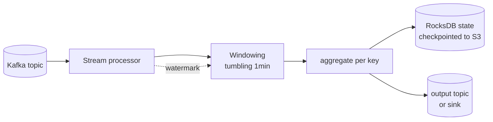
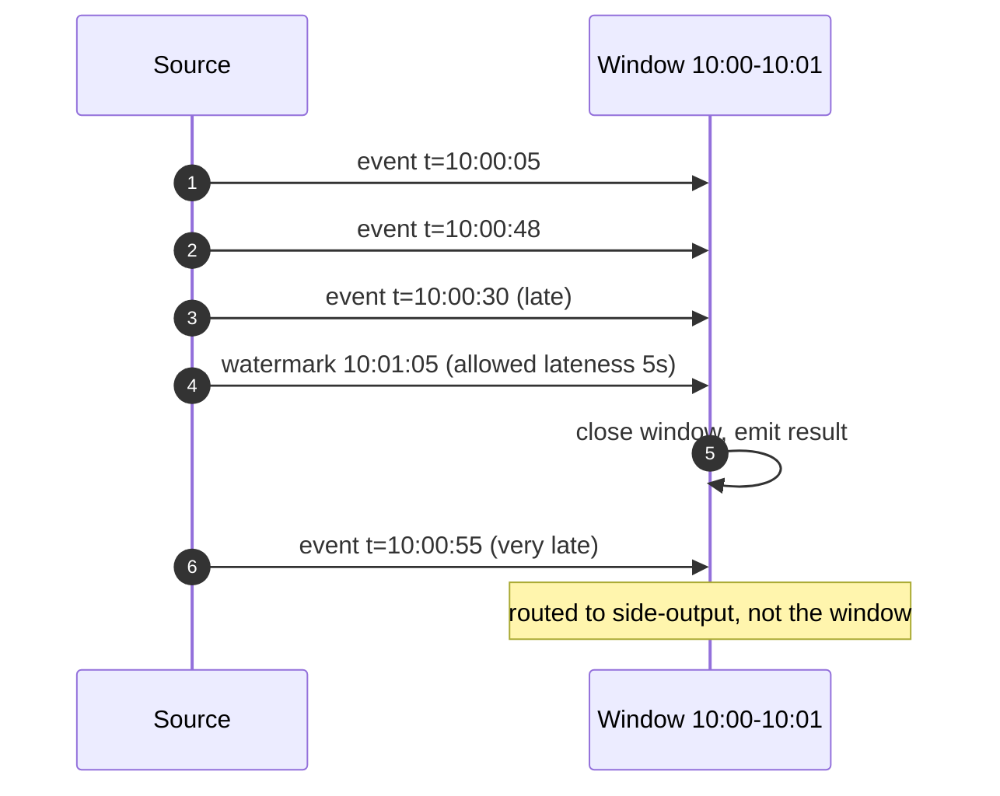
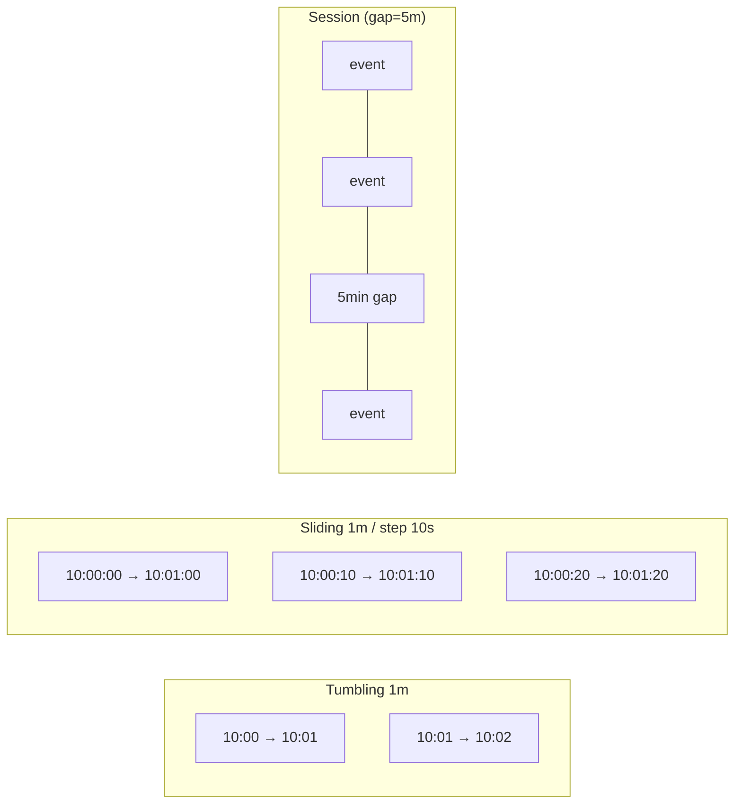
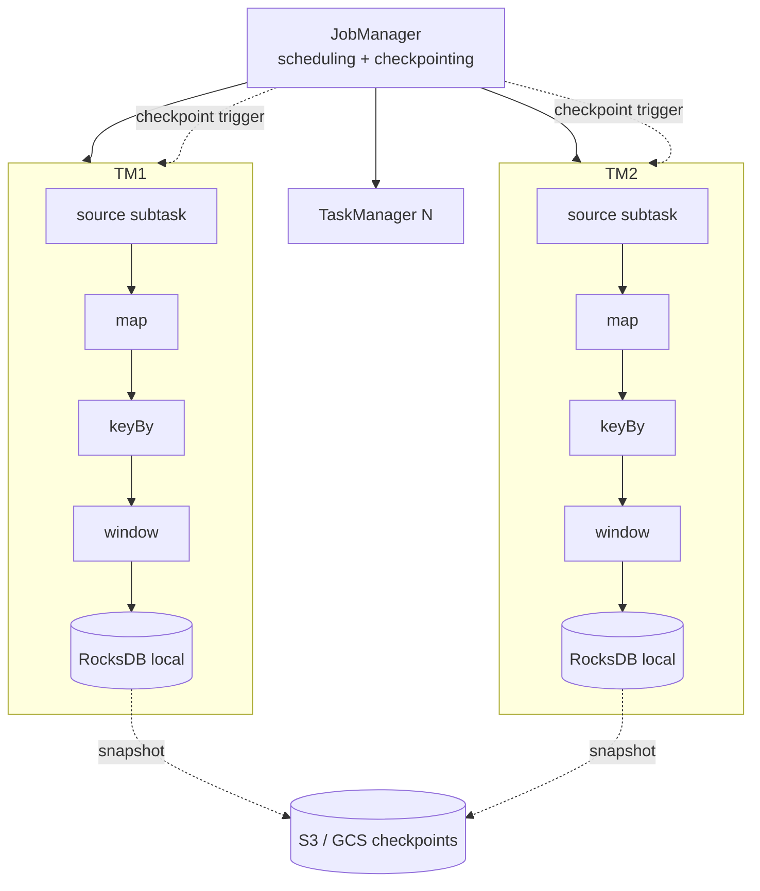
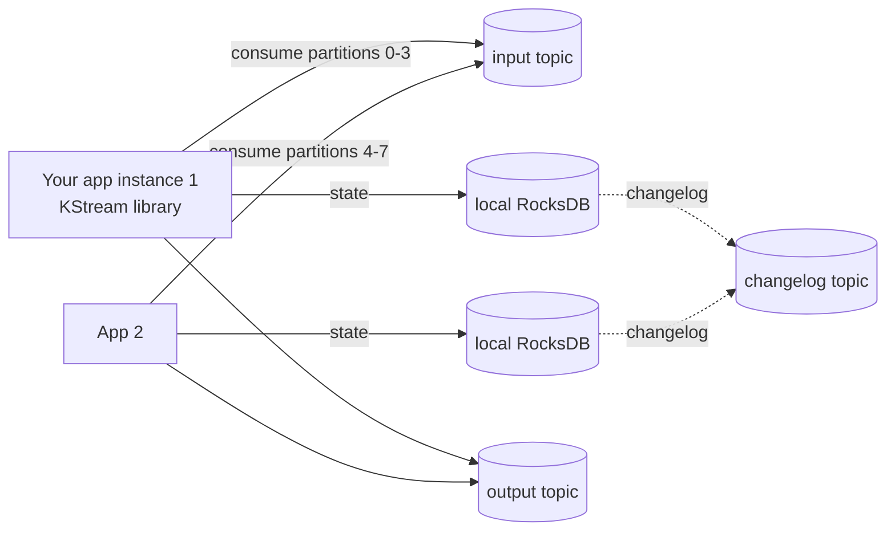

## Definition (interview-ready)

**Stream processing** is computation over an unbounded sequence of events with low latency, typically driven by Kafka or another log. **Apache Flink** is a distributed engine with sophisticated state management, event-time semantics, watermarks, and exactly-once guarantees. **Kafka Streams** is a library (not a cluster) that runs inside your app, scaling via Kafka consumer-group rebalancing and using Kafka topics as state-store backups. **Windowing** chops the infinite stream into bounded buckets (tumbling, sliding, session); **watermarks** are the engine's mechanism for deciding "no more late events of this kind will arrive" so it can emit results.

## Why it matters

Batch (Spark daily job) gives correct answers at high latency. Stream processing gives "good enough now" results in seconds, which most modern products need: fraud detection, real-time pricing, live dashboards, recommendation features, ad attribution, alerting. The hard parts — out-of-order events, late data, exactly-once, large state, restart-from-savepoint — are the topics interviews dig into.

## Core concepts

### Event time vs processing time

- **Event time** = when the event happened (timestamp in the payload).
- **Processing time** = when the engine sees it (wall clock).
- Out-of-order arrival is normal: an event from `t=10:00:05` may arrive at `t=10:00:12`.
- Correct results require **event-time** windowing. Processing-time is faster but wrong on retries, replays, or burst recovery.

### Watermarks

A watermark `W(t)` is a promise from the source: "no events with event time < t will arrive after this point." When watermark passes the window end, the engine closes and emits the window.

- Tight watermarks → low latency, more "late" data rejected.
- Loose watermarks → higher latency, more correctness.
- Standard approach: `watermark = max_event_time_seen - allowed_lateness`.

### Windows

- **Tumbling**: fixed, non-overlapping (every minute). Most common.
- **Sliding**: fixed-size, overlapping (every 10s, size 1min). Higher emission rate.
- **Session**: keyed gap-based ("close when idle 5 min"). User-session analytics.
- **Global / count-based**: not time, but event count (every N events).

### State

A stream job's state is keyed state (per-key counters, dictionaries) and operator state (broadcast configs, source offsets). Sources of correctness pain:

- State must be **fault-tolerant** → checkpointed to durable store (S3, GCS).
- On restart, restore from latest checkpoint → resume processing exactly where you left off.
- For Flink: **RocksDB-backed state**, periodic snapshots, **chained barriers** propagate through the DAG to ensure all operators checkpoint at the same logical instant.

### Exactly-once

Misunderstood. Three flavours:

| Flavour | What it guarantees |
|---|---|
| **At-most-once** | may drop, never duplicate |
| **At-least-once** | may duplicate, never drop |
| **Exactly-once** (effectively-once) | side-effects happen exactly once, even on retries |

Real exactly-once requires:
- **Source replay** (Kafka has this).
- **Idempotent or transactional sink** (Kafka transactions; Iceberg/Delta commits; idempotent upserts in DB).
- **Operator state checkpointed atomically** with the input offsets.

Flink calls this **end-to-end exactly-once** when source + sink support it. Most "exactly-once" claims you hear are at-least-once + idempotent consumer downstream.

### Backpressure

If a downstream operator slows down, the engine must signal upstream operators to slow down too — otherwise queues unbounded-grow. Flink propagates backpressure via TCP buffer fullness. Kafka Streams via consumer pause. Symptoms: rising consumer lag.

## How it works

### Flink architecture

### Kafka Streams architecture

- **No cluster of its own** — it's a library you embed in your app/JVM.
- Scales by adding instances → Kafka rebalances partitions → state migrates by replaying the changelog topic.
- Simpler operationally if you already run Kafka + JVM apps; less powerful than Flink (no event-time guarantees as strong, simpler windowing, no real Python ecosystem).

### Flink vs Kafka Streams vs Spark Structured Streaming

| | Flink | Kafka Streams | Spark Structured Streaming |
|---|---|---|---|
| Model | true streaming (per-event) | true streaming (per-event) | micro-batch (small batches) |
| Cluster | yes (JobManager/TM) | no (library) | yes |
| State | RocksDB + checkpoints | RocksDB + changelog topic | versioned KV |
| Latency | tens of ms | tens of ms | seconds (~100ms in continuous mode) |
| Throughput | very high | high | very high |
| Watermarks | first-class | limited | yes |
| Languages | Java, Scala, Python (PyFlink) | Java, Scala | Scala, Python, SQL |
| Best for | low-latency complex pipelines | "stream processing inside my service" | unified batch+stream on existing Spark infra |

## Real-world examples

- **Uber:** Flink for surge pricing, ETA estimation, fraud — sub-second feature pipelines.
- **Netflix:** Flink for content recommendations, anomaly detection, payment risk.
- **Alibaba:** Flink at massive scale (powers Singles Day real-time dashboards).
- **Pinterest:** Flink for ML feature freshness.
- **Stripe:** Kafka Streams for fraud signals embedded in services.
- **Robinhood, Coinbase:** Flink for real-time market data and risk.
- **Cloudflare:** Materialize / ksqlDB-style streams for live analytics.

## Common pitfalls

- **Using processing time when you mean event time.** Replays, recoveries, backfills will silently corrupt aggregates.
- **No allowed-lateness.** Real event streams always have stragglers; without lateness, every late event is lost.
- **Unbounded state.** A keyBy on an ever-growing key space (e.g., raw UUIDs) accumulates state forever. Add TTL or scope by window.
- **No state size monitoring.** RocksDB grows; checkpoints get expensive; eventually slow snapshots block processing.
- **Treating "exactly-once" as automatic.** It's a chain — break any link and you're at-least-once. Verify sink supports transactions or is idempotent.
- **Skew on a hot key.** All events for "celebrity_user_id" land on one operator instance. Mitigate by adding a salt: `keyBy = (key, hash(event) % N)` then `union → aggregate`.
- **Restart from scratch instead of from savepoint.** Restoring from a savepoint preserves state; restart from offset 0 reprocesses everything (correct only if everything is idempotent).
- **Kafka Streams with too few partitions.** Parallelism is capped at # of input partitions. Repartition early if you need more.
- **Side-effects in operators.** Calling an external API from a `map()` adds latency and breaks exactly-once. Use **async I/O** with checkpointed deduplication.

## Interview questions

### Easy

1. **What's the difference between stream and batch processing?**  
   Batch: process bounded data, results minutes to hours later. Stream: process unbounded data, results in milliseconds to seconds. Stream pays for low latency with more complex state and ordering semantics.

2. **What's a watermark?**  
   A guarantee from the engine that "no event with event-time earlier than W will arrive." Used to decide when to close a window and emit.

### Medium

3. **Tumbling vs sliding vs session windows — when do you use each?**  
   Tumbling: simple periodic aggregates ("requests per minute"). Sliding: smoothed metrics with overlapping windows ("5-minute moving average updated every 10s"). Session: per-user activity bursts ("page views per session, defined by 5-min inactivity gap").

4. **Your Flink job is correct in dev but produces wrong aggregates after restart in prod. Why?**  
   Likely processing-time windows + unaligned source replay → events from before the restart land in different windows than originally. Switch to event-time windows with watermarks. Or: the sink isn't transactional, so the same outputs are emitted twice on restart; switch to a sink with exactly-once support, or make it idempotent.

5. **Compare Flink vs Kafka Streams for a stream-processing project. Decision criteria?**  
   Pick **Kafka Streams** if: (a) you already run Kafka and JVM apps, (b) you want stream logic embedded next to your service code, (c) low-to-moderate scale, (d) simpler operational model. Pick **Flink** if: (a) you need very low latency with strong event-time + watermark semantics, (b) state grows large (tens of GB+), (c) you have non-JVM language requirements (PyFlink), (d) sophisticated joins / multi-stream processing, (e) you can afford to operate the cluster.

### Hard

6. **Design real-time fraud detection on credit card swipes — 10K transactions/sec.**  
   Kafka topic `transactions` partitioned by `card_id`. Flink job: `keyBy(card_id)` → per-card sliding window (last 5 minutes) → compute features (count, sum, distinct merchants, geo-diff from last) → feed to a model served as an async I/O call (with cache). If `risk_score > threshold`, emit to `alerts` topic. State sized: ~10M active cards × ~1 KB feature state = ~10 GB across the cluster. Checkpoint to S3 every 30 s. Watermarks at `max_event_time - 30s`. Exactly-once with Kafka source + transactional Kafka sink.

7. **You're seeing growing consumer lag in production Flink. Walk through diagnosis.**  
   Check (a) **backpressure** — Flink UI shows the slow operator; usually a sink or a stateful op. (b) **State size** — RocksDB compactions or large state explosion; check disk usage. (c) **Skew** — heatmap of subtask throughput; identify a hot key. (d) **Checkpoint duration** — slow checkpoints block processing. (e) **GC pressure** in JVM. Fix per cause: scale out, repartition / salt hot key, async I/O for sink, tune checkpoint storage.

8. **Explain end-to-end exactly-once between Kafka → Flink → Postgres.**  
   Source: Kafka consumer commits offsets only as part of Flink checkpoints. Operators: state snapshotted atomically with the offset via barriers. Sink: two-phase commit — Flink writes to Postgres in a transaction prepared at the input checkpoint, then committed when the checkpoint finishes. On failure: restore state from checkpoint, replay source from last committed offset; uncommitted Postgres transactions roll back; redo and commit. Result: every input event affects Postgres exactly once.

## TL;DR cheat sheet

- **Event time, not processing time.** Always.
- **Watermark** = "no more events before t" → triggers window close.
- **Allowed lateness** so late stragglers still update results.
- **Windows**: tumbling (periodic), sliding (smoothed), session (gap-based).
- **State**: keyed + operator; in RocksDB; checkpointed to durable store.
- **Exactly-once** is a chain: source replay + atomic checkpoints + transactional or idempotent sink.
- **Flink** = cluster, complex, low latency, strong semantics. **Kafka Streams** = library in your app, simpler, leans on Kafka for everything.
- **Backpressure** propagates via slow buffers → upstream slows automatically.
- **Skew fix**: salt the key, then aggregate.
- Always monitor: consumer lag, state size, checkpoint duration, GC.

## Go deeper

- "Streaming Systems" by Tyler Akidau et al. — the canonical book (concepts apply to all engines).
- [Flink Docs — Event Time & Watermarks](https://nightlies.apache.org/flink/flink-docs-stable/docs/concepts/time/)
- [Kafka Streams docs](https://kafka.apache.org/documentation/streams/)
- "The Dataflow Model" — Akidau, Bradshaw, et al. (Google, 2015) — original watermark paper
- "Lightweight Asynchronous Snapshots for Distributed Dataflows" — Carbone et al. (Flink checkpointing paper)
